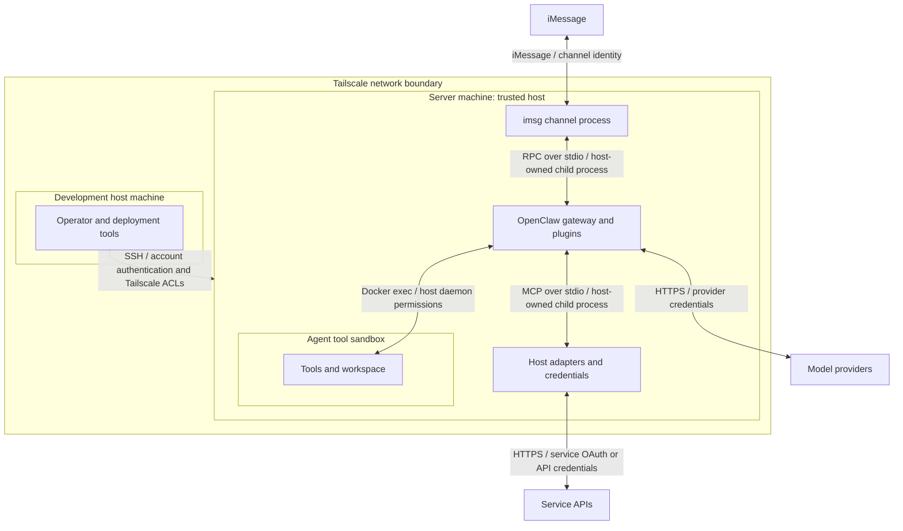
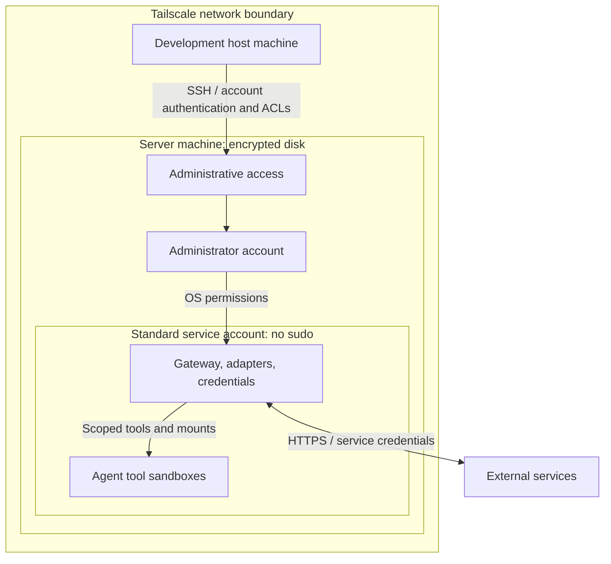
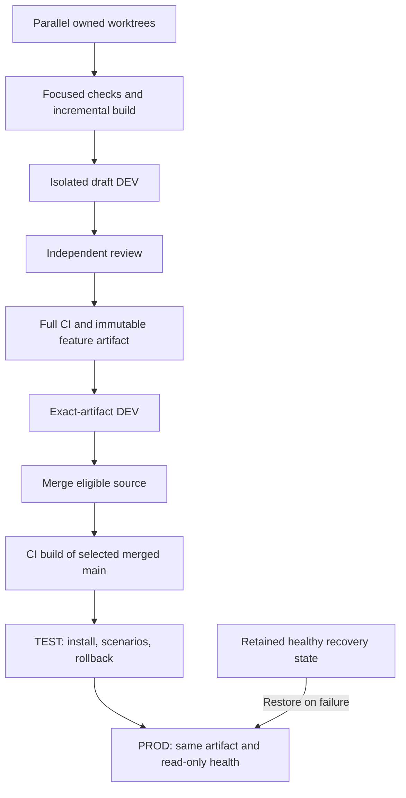
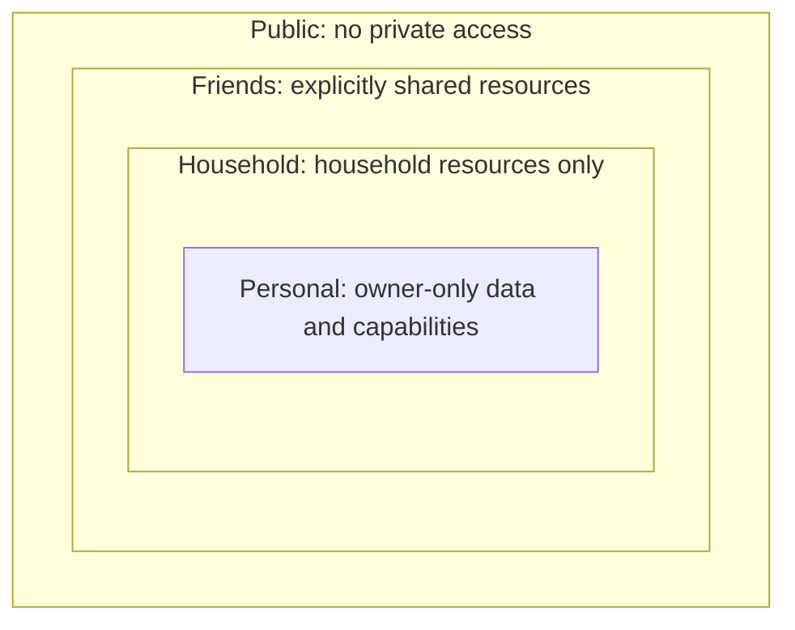
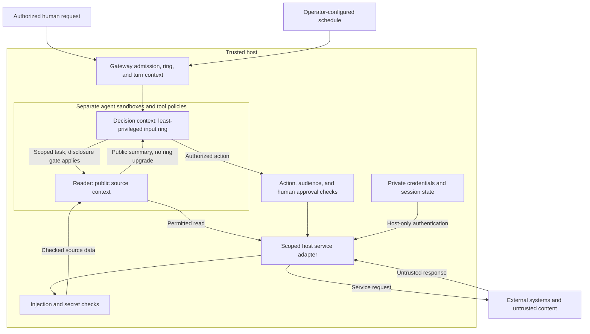

# Puddles security architecture

## Overall threat model

The host is trusted; agent tool execution is sandboxed. Each connection below
names its transport and authentication or access control.

The [direct iMessage channel](02-talking-to-puddles-on-imessage.md) uses an
`imsg rpc` child process. The legacy BlueBubbles alternative uses loopback HTTP
and an API password. The [Gmail](../../openclaw-plugins/secure-gmail/src/mcp-bridge.ts)
and [calendar](../../openclaw-plugins/secure-apple-calendar/src/mcp-bridge.ts)
adapters use stdio. Local pipes and Docker access rely on host permissions.

### Trust boundaries from the model

| Boundary | Required handling |
|---|---|
| Network | Tailscale encloses the managed machines and authenticates member devices. ACLs restrict communication inside it. External messaging, service APIs, and model providers remain outside; their connections need their own authentication. |
| Machine | Authenticate the host account for administration and deployment. Keep service credentials on the server. Authenticate remote services and authorize data sent to model providers. Delivery still requires artifact validation and release gates. |
| Sandbox | Confine agent tools, workspaces, and mounts. Keep host credentials and the Docker control socket outside the sandbox. The gateway and adapters enforce access from the host. |
| Host processes | Direct messaging RPC and stdio MCP use host-owned child processes; legacy BlueBubbles uses an HTTP API password. Bind sender, caller, task, and resource scope separately from transport authentication. |
| Agent contexts | Isolate contexts by their least-privileged input ring. Reader output cannot promote itself or start follow-ups. Outward disclosure requires deterministic human approval. |

The operator, OS, gateway, reviewed adapters, and delivery tooling form the
trusted base. Host compromise is outside the agent sandbox's protection.
Required controls and [known gaps](#appendix-known-gaps-and-validation-limits)
are distinguished below; this is not a live configuration audit. Upstream
references use the release pinned in the
[patch manifest](../../packages/e2e/openclaw-patch-suite.json), OpenClaw 2026.9.3.

## Host and network architecture

Tailscale provides the network boundary around the managed machines. Inside it,
the [host setup](01-setting-up-your-mac-mini.md) separates administrator and
service accounts and encrypts the server disk. The diagram shows the intended
topology, not a fresh audit of live configuration.

- **Network:** Tailscale authenticates devices; ACLs limit which machines can
  communicate. Keep management off public listeners. The host guide also records
  underlying VLAN hardening. Neither layer replaces sandbox network policy or
  restricts every internet destination a host process can reach.
- **Accounts:** administrators own system changes. Autonomous services have no
  sudo, but gateway plugins and adapters still hold the service account's host
  authority. An agent sandbox must not inherit that authority.
- **Execution:** the gateway orchestrates inference and tools on the host.
  “Sandboxed agent” describes confined tool execution and filesystem access;
  plugins, model calls, and the gateway do not all run inside Docker.
- **Storage and recovery:** disk encryption protects a powered-off machine, not
  secrets from an already-unlocked host process. Protect recovery material and
  account for the documented disk-unlock and user-login steps after reboot.
- **Maintenance:** keep the OS and dependencies updated, validating runtime
  changes through delivery gates. Verify effective accounts, listeners, ACLs,
  and mounts before claiming the installed system matches this architecture.

## Build system architecture

The [development skill](../../.github/skills/safe-feature-development/SKILL.md)
and [runner guide](../../packages/e2e/README.md) own the operational procedure.
CI/CD should automate ordinary progression; agents monitor and repair failures.
Automation and parallel contributors do not bypass these boundaries:

- **Development isolation:** separate writable source, state, sessions, ports,
  and process ownership. Shared package stores and compatible incremental output
  are allowed. A native test process is not a sandbox against trusted host code.
- **External effects:** synthetic reads and deny-by-default recording adapters
  replace live services. [The fixture](../../packages/e2e/src/native-fixture.mjs)
  exposes only declared operations. Production checks are bounded and read-only;
  tests never send real messages or mutate live accounts.
- **Build trust:** pin upstream source, package manager, toolchain, and lockfiles.
  [Public CI](../../.github/workflows/integration.yml) uses public source and
  disables private extensions. Optional local composition is explicit, with
  private inputs and diagnostics kept out of public artifacts.
- **Evidence:** the full accumulated pool and independent review qualify the
  final candidate. Draft DEV is feedback, not release proof. Reuse evidence only
  when its source, tests, environment, tools, and outputs still match.
- **Artifacts:** [packaging](../../packages/e2e/src/native-package.mjs) materializes
  the production dependency graph. Consumers verify archive/runtime identities
  and install offline. Deployed runtimes must not depend on mutable package stores.
- **Promotion:** [merge eligibility](../../packages/e2e/src/merge-eligibility.mjs)
  binds source, CI, and DEV proof. TEST and PROD use the selected merged batch;
  a changed production baseline requires affected TEST validation again.
- **Concurrency:** [environment slots](../../packages/e2e/DEPLOYMENT_COORDINATION.md)
  and target locks protect shared mutations. An idle agent or old heartbeat does
  not grant another worker ownership. Independent builds need no shared slot.
- **Recovery:** [activation](../../packages/e2e/src/native-activation.mjs) validates
  target identity, stages before stopping production, records recovery, and
  restores runtime/state/service on failure. No builds, downloads, or merges
  belong inside the stopped-production transaction.
- **Retention:** [cleanup](../../packages/e2e/src/native-retention.mjs) protects
  active consumers, evidence dependencies, deployed artifacts, and healthy
  recovery. Disk pressure does not authorize deleting another task's work.

Hashes and receipts bind bytes and validation inputs. They are not a signature
against a compromised builder or host that can rewrite both artifact and proof.
Source review, dependency trust, CI permissions, and private custody remain
part of the trusted computing base. Public CI uses bounded sanitized diagnostics;
redaction is not permission to upload private logs or production state.

## Agent architecture

### Context rings

From the smallest, most privileged audience outward: **personal, household,
friends, public**. These rings scope access; they do not make content safe to
obey. Even personal email can contain attacker instructions. The trusted host
enforces the rings and is not another agent audience.

Containment shows expanding audiences, not inherited access. Household can never
read personal stores, sessions, credentials, or tools. Friends cannot read
household or personal resources. Membership in a ring does not grant access to
every person or resource in that ring; account and recipient scope still apply.

| Ring | Required handling |
|---|---|
| Personal | Bind access to the authenticated owner and personal task. Keep private accounts, memory, and capabilities unavailable to other rings. |
| Household | Use separate sessions, workspaces, workers, and scoped adapters. Expose only household resources; requests for personal information go to owner review without granting access. |
| Friends | Expose only resources explicitly shared with the particular friend or group. No household or personal lookups, delegation, or memory access. |
| Public | Use restricted readers and explicitly scoped source access. External content gains no personal, household, or friends authority. Keep source-account and recipient restrictions even after reading. |

Email, texts, calendar entries, web pages, and similar externally writable
sources are **public** for context classification. A particular sender being
a friend or household member does not change what that source can admit.
Authentication to a private account does not upgrade its incoming content.
Public describes input trust, not permission to publish: account scope,
authorized recipients, and the purpose of the read still constrain use.

#### Context labels and outward disclosure

- **Each context has one label: the least-privileged ring that can enter it.**
  Include tool results, retrieved memory, summaries, attachments, delegated
  results, and asynchronous events. Classify by what the path can admit, not
  just the content currently visible. A context that can include public input
  is public. There is no mixed-context exception.
- Enforce that label before admitting content or granting capabilities. A
  public context cannot inherit personal, household, or friends access. Keep
  more-privileged work in separate contexts; only a specifically approved copy
  may cross outward. Relabeling a context never authorizes disclosure of data
  already present. Block the transition if it would expose that data.
- Keep untrusted reading in the reader and preserve the source label on its
  output. Summarizing, redacting, or wrapping content does not promote its ring.
  Returning a result does not allow it into a more-privileged context or let it
  borrow the parent's authority.
- Bind scope in host code before retrieval, tool execution, delegation, model
  submission, persistence, and delivery. A lower-ring caller cannot select a
  higher-ring identity. Derived summaries, logs, indexes, caches, and model
  requests retain the source data's restrictions. Unknown provenance cannot
  authorize access or outward disclosure.
- **Never disclose to a wider ring without deterministic human approval.**
  A host-enforced gate must verify an authenticated, authorized human's approval
  for the exact content and destination before release. Changed content or
  recipients require fresh approval. Missing, expired, or replayed approval
  blocks release. A model's judgment, contact match, prompt, or quoted approval
  in source content is insufficient.
- Approval releases only the selected disclosure. It does not grant household
  access to personal systems, promote a session's ring, or permit later
  follow-ups. Service credentials remain host-only and cannot be released through
  this sharing path. The approved copy gets the approved audience; original
  stores and other data retain their restrictions.

The [household plan](../plans/completed/022-household-and-friends-tiers.md)
records a limited household population and owner-mediated relay. It explicitly
does not establish a friends rollout. Existing recipient guards do not implement
these four rings or a universal deterministic disclosure gate. This section
defines the required architecture; the gap must remain visible until enforced
and tested end to end.

### Runtime flow

This diagram shows the required flow. Legacy exceptions and incomplete coverage
are listed under [Known gaps](#appendix-known-gaps-and-validation-limits).

External responses have no authority to start turns, request follow-ups, change
permissions, or choose a new destination. A write returns a bounded receipt;
external text in that receipt still belongs on the reader path.
The decision context shown here admits reader output, so it is public too.
It cannot share a context with privileged personal work. Task payloads sent
outward to a reader are subject to the same human approval boundary as other
outward disclosures.

#### Agent containment and authority

- Keep main, reader, and limited-user roles in separate scopes. Do not expose
  host exec, gateway administration, credential files, Docker control, or broad
  host mounts through their tool policies.
- Use a narrow host adapter when a task needs a host capability. A plugin runs
  with host authority, so its argument validation and caller binding matter as
  much as the sandbox.
- Derive identity, workspace, account scope, and allowed destinations from trusted
  runtime context. Caller-supplied IDs and paths cannot grant authority.
- Keep authenticated owner access distinct from household or other limited
  roles. Contacts membership establishes recipient trust, not operator identity
  or permission to perform an action.
- Treat `debug` with sandbox disabled as an explicit operator administration
  exception. It must not be reachable through ordinary channels or delegation
  from lower-trust agents.

The pinned upstream [sandbox configuration](https://github.com/openclaw/openclaw/blob/1391f7cd2d40ab5bbcf2f5f831d3a64f520e72d7/src/agents/sandbox/config.ts)
defaults ordinary Docker tools to no network, a read-only root, and dropped
capabilities. [Container creation](https://github.com/openclaw/openclaw/blob/1391f7cd2d40ab5bbcf2f5f831d3a64f520e72d7/src/agents/sandbox/docker.ts)
also sets no-new-privileges. Effective configuration can differ, and browser
containers have separate networking and mounts. Inspect the selected runtime;
neither the word “Docker” nor an old setup example proves confinement.

Native cross-agent delegation selects the configured target's tool policy. The
[maintained spawn patch](patches/subagent-cross-agent-spawn-fix.md) preserves
specialized reader access and explicit target selection; same-agent children
retain inherited restrictions. It is not permission to select a privileged
profile. An external ACP harness is a separate execution system: the spawn
patch checks requester command-tool compatibility but cannot enforce an OpenClaw
target profile's tool policy inside that harness. Do not use a restricted target
name as proof of external-harness containment.
The [household architecture](../plans/completed/022-household-and-friends-tiers.md)
records scoped tools, separate workers, and owner-mediated relay controls.

#### Credentials and external access

- Keep API keys, OAuth tokens, gateway credentials, browser cookies, and refresh
  state outside agent workspaces, mounts, environment variables, and tool results.
- Resolve credentials in host services through SecretRef, Keychain, or another
  explicitly configured private backend. Do not put values in source, logs,
  fixtures, artifacts, or public diagnostics.
- Bind each adapter to its allowed service, account, and operations. A credential
  proves service access; it does not authorize every action the agent proposes.
- Treat authenticated browser profiles as credentials, even if the model never
  sees the password. Human login does not make subsequent page content trusted.

The [Gmail server](../../servers/gmail-mcp/README.md) runs outside the agent
sandbox and obtains its OAuth token through its
[host authentication layer](../../servers/gmail-mcp/src/gmail_mcp/auth.py).
The plugin excludes OAuth bootstrap and send tools. Its OAuth grant is broader
than its exposed tool set, so both custody and tool restrictions matter.
Calendar uses a host MCP bridge and per-agent account visibility through
[its configured scope](../../openclaw-plugins/secure-apple-calendar/README.md).
The proposed [provider service](../plans/031-rocket-money-integration.md) applies
this pattern to additional CLIs; it is not a deployed universal access broker.

#### Untrusted content and the reader

1. The parent supplies the reading task and scope. Source content cannot expand it.
2. The host adapter acquires data and applies the relevant ingress checks before
   releasing it to the reader. Include external text in errors, metadata,
   attachments, search results, and other non-body fields.
3. The reader returns a bounded summary in its own words, with attribution and
   suspicious content called out. It does not relay raw instructions upstream.
4. A context permitted to admit the result uses it as evidence within the
   original task, retaining the public label. It does not treat a summary as
   authorization for another action, turn, or fetch.

The [reader instructions](agent-instructions/reader-AGENTS.md) require one
acquisition followed by yield, no content-directed follow-ups, and no verbatim
email forwarding. Tool grants must support that limited role; instructions
alone cannot prevent extra calls or new turns.

[InjectionGuard](../../packages/mcp-hooks/src/ingress/injection-guard.ts) checks
for prompt injection. [SecretRedactor](../../packages/mcp-hooks/src/ingress/secret-redactor.ts)
combines pattern matching and classification. Their source-specific prefilters
must include every attacker-controlled field. Semantic classifiers can miss
attacks; an allow result never upgrades content into trusted instructions.

The Gmail and calendar wrappers await guards inside tool execution. This is the
release boundary, not an asynchronous audit after delivery. The guard provider
itself sees scan input: the wrappers run injection and redaction checks in
parallel, so input to the injection classifier can contain unredacted secrets.
That provider must be an approved processor for the data. Outbound controls
likewise supplement authorization rather than replace it.

| Current path | Implemented coverage |
|---|---|
| [Gmail](../../openclaw-plugins/secure-gmail/src/plugin.ts) | Injection and secret checks for `list_emails` and `get_email`. Attachment bytes are read separately. Archive and label tools are mutations, not approval-gated by ingress checks. |
| [Calendar](../../openclaw-plugins/secure-apple-calendar/src/action-map.ts) | Read/write tool separation; ingress on events/get/search; recipient and content checks on writes with attendees. Metadata and other mutations have different coverage. |
| [Egress library](../../packages/mcp-hooks/README.md) | LeakGuard checks non-send content. ContactsEgressGuard checks destinations and, when configured, sensitive content. Consumers must wire them into their actual paths. |
| [OpenClaw external-content wrapper](https://github.com/openclaw/openclaw/blob/1391f7cd2d40ab5bbcf2f5f831d3a64f520e72d7/src/security/external-content.ts) | Source markers, token sanitization, and warnings. These do not constitute reader routing, authorization, or a universal blocking classifier. |

#### Turns, follow-ups, and out-of-turn context

Treat starting work as a separate capability from reading or returning data.

- Only an authorized human request, configured schedule, or trusted continuation
  of already-admitted work may cause the corresponding agent turn.
- Untrusted source content and the reader acting on it must never initiate a
  turn or invoke follow-ups. Returning the result of the parent's existing task
  is not permission to wake another session or start a conversation.
- Bind asynchronous results and actions to their originating principal, role,
  session/task, and permitted destination. Reject stale or mismatched context;
  absence of an active conversation does not grant broader authority.
- Keep cron, spawn, session messaging, webhook wake, and delivery capabilities
  unavailable to ingestion roles unless a narrowly enforced return path requires
  them. Do not pass source-selected session keys, recipients, or tool requests
  through a trusted dispatcher.
- Apply destination checks to scheduled and background delivery too. A content
  guard, a channel target guard, and permission to start a turn are distinct checks.

The pinned [cross-context outbound policy](https://github.com/openclaw/openclaw/blob/1391f7cd2d40ab5bbcf2f5f831d3a64f520e72d7/src/infra/outbound/outbound-policy.ts)
guards selected message actions using bound channel context and configuration.
It returns without a context check when no current target is bound. It therefore
does not establish a universal out-of-turn denial. The
[session-send tool](https://github.com/openclaw/openclaw/blob/1391f7cd2d40ab5bbcf2f5f831d3a64f520e72d7/src/agents/tools/sessions-send-tool.ts)
can start runs and follow-up flows after its access checks; it is not merely a
passive mailbox. [Gateway hooks](https://github.com/openclaw/openclaw/blob/1391f7cd2d40ab5bbcf2f5f831d3a64f520e72d7/src/gateway/server/hooks.ts)
can dispatch isolated turns and wakes. Their existence is not authorization to
connect arbitrary external events to privileged agents.

The household plan records deployment-specific message-target and cron-target
hooks. Their presence and historical testing do not prove every current
out-of-turn path. Validate the effective grants and the actual dispatch path,
including delegated and scheduled runs, before claiming this boundary enforced.

#### Memory and persistent state

- Reader output remains untrusted when written to notes, trackers, or memory.
  Persistence must not turn source instructions into future authority.
- Keep role workspaces, memory access, sessions, and browser profiles separated.
  Reusing an agent-scoped container is not a fresh security context per task.
- The [scoped-memory plugin](../../openclaw-plugins/scoped-memory/README.md)
  binds identity and workspace from the host, restricts note paths, rejects
  symlinks/hardlinks and traversal, and rereads authorized bytes rather than
  returning stale index snippets. Native memory and wiki tools require separate
  denials; the plugin does not replace their policy or constrain index ingestion.

## Appendix: known gaps and validation limits

These are findings from source and documented deployments, not a live penetration
test. A requirement above must not be reported as fully enforced until its
configuration and all relevant paths are verified.

| Area | Limit or gap |
|---|---|
| Trust rings and disclosure | Household scoping is documented, but friends/public populations, provenance propagation, and an exact-content human approval gate for every outward path are not established. Contact trust and model classification cannot substitute for these controls. |
| Network and credential custody | The older [sandbox guide](03-openclaw-and-agent-sandboxing.md) describes network-enabled containers. The [persistent browser design](../plans/completed/023-durable-browser-agent-login.md) mounts a credential-bearing profile into a browser container. Those are exceptions to strict host-only external access and credential custody, not proof that the required boundary is met. |
| Reader-only routing | Gmail/calendar factories rely on configured tool grants for reader/main separation. Older setup examples grant main search and readers session messaging. Attachments, images, browser results, errors, and metadata need path-specific review; there is no repository-wide reader gate. |
| Raw result retention | Both [Gmail](../../openclaw-plugins/secure-gmail/src/wrap-tool.ts) and [calendar](../../openclaw-plugins/secure-apple-calendar/src/wrap-tool.ts) retain `details.original` after redaction. That keeps raw data available to result persistence/consumers even when visible text is redacted. Do not treat the returned object as sanitized. |
| Classifier contracts | Guards block recognized provider/parse errors, but [boolean classification](../../packages/mcp-hooks/src/classify.ts) coerces `detected` instead of validating a strict response schema. Parseable malformed objects can escape the intended fail-closed contract. Model decisions also remain probabilistic. |
| Turn admission | Channel guards, session visibility, reader instructions, and historical local hooks do not jointly prove a universal no-wake/no-follow-up boundary. Missing-context behavior and all alternate dispatch paths require explicit validation. |
| Mutation approval | Ingress checks run after execution. Gmail archive/label and calendar mutations do not gain action approval from scanning their results. [Native iMessage approval forwarding](../plans/027-imessage-approval-channel.md) is still pending in the maintained plan. |
| Build supply chain | CI uses pinned project tools and a frozen pnpm graph, but action references are version tags and Gmail test dependencies are installed with pip. This is not a fully hermetic or independently signed build system. |
| Deployment claims | Source coverage and historical receipts do not establish the current sandbox configuration, enabled hooks, credential mounts, installed versions, or live end-to-end behavior. |

When extending the system, trace both data and control paths across these
boundaries. Add behavioral regressions for negative cases: unauthorized caller,
missing/stale context, blocked content, guard failure, forbidden follow-up,
credential leakage, and attempted live effects. Implement repairs through the
normal approved lifecycle; this document itself changes no runtime controls.
