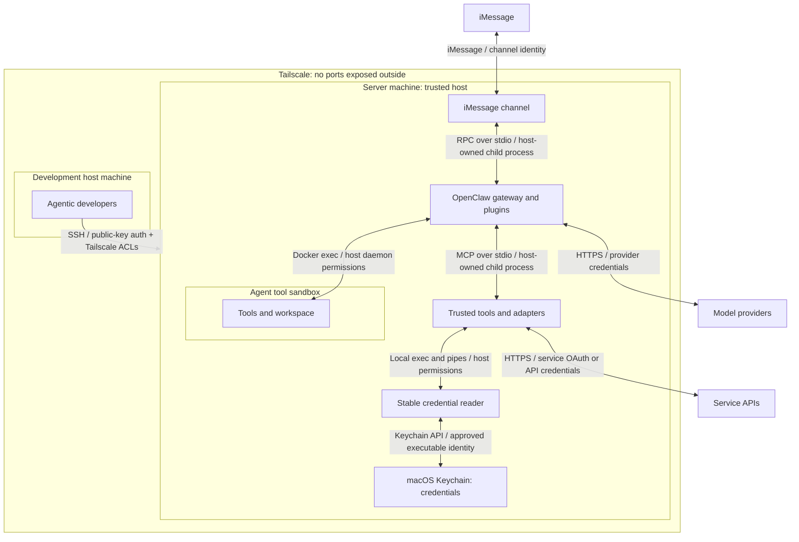
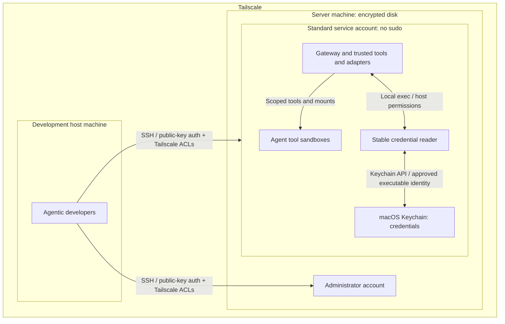
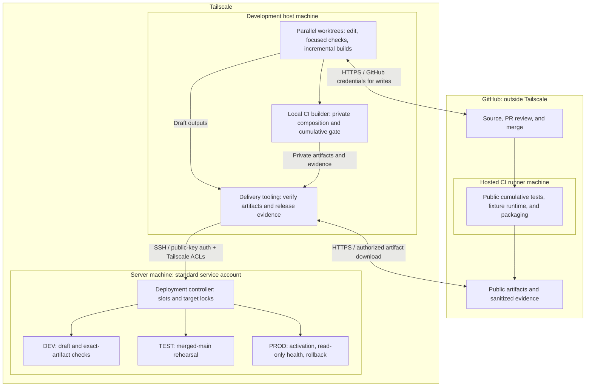
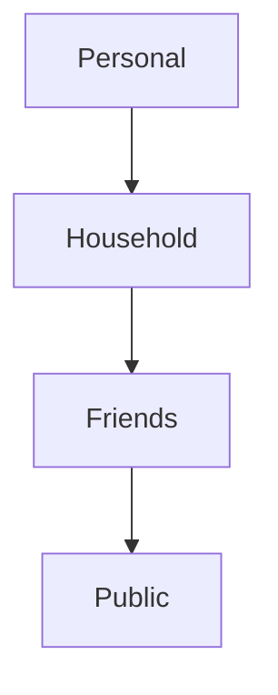
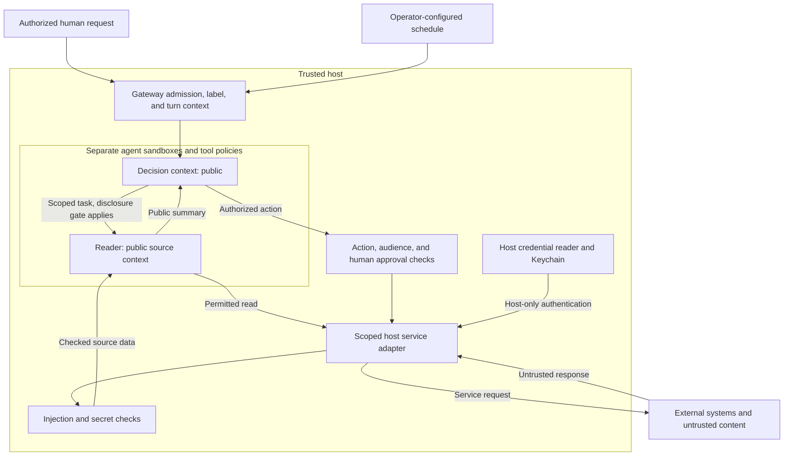

# Puddles security architecture

**Governing principles**

- No ports exposed outside Tailscale. Authenticated SSH inside Tailscale is allowed.
- Any deviation requires explicit human approval before implementation. Update
  this document to reflect the approved change.

## Overall threat model

The host is trusted; agent tool execution is sandboxed. Each connection below
names its transport and authentication or access control.

### What the boundaries protect

| Boundary | Separates | Rule | Compromise enables |
|---|---|---|---|
| Tailscale | Managed machines from outside networks | No ports exposed outside Tailscale. | Access SSH and VNC ports |
| Host | Development files and tools from remote access | Access requires an authorized host account. | Read or change source, builds, and development data |
| Server | Agent runtime and data from remote access | SSH requires an approved key, server account, and Tailscale access. | Control agents, stored data, and service access |
| Sandbox | Agent tools from the trusted host | Agents get only granted tools and files. Credentials stay outside the sandbox. | Execute code outside the sandbox |
| Keychain | Host tools from stored credentials | Tools use an approved, stable credential reader. Secrets never enter agent context. | Use exposed credentials |
| Context labels | Personal, household, friends, and public | Lower-trust contexts cannot access higher-trust resources. Sharing outward requires human approval enforced by code. | Read or leak higher-trust data |

These limits assume the other boundaries still hold.

## Host and network architecture

The [host setup](01-setting-up-your-mac-mini.md) separates administration from
autonomous services. SSH logs directly into the chosen account.

- **Network:** keep local IPC on loopback or pipes. Outbound service connections
  remain allowed; Tailscale does not replace sandbox network policy.
- **SSH keys:** the [SSH setup](01-setting-up-your-mac-mini.md#7-ssh-with-secure-enclave-keys-touch-id)
  uses Secure Enclave-backed keys on the development host.
- **Accounts:** administrators own system changes. Gateway plugins and adapters
  hold the standard account's host authority. Only agent tool execution is
  sandboxed; gateway orchestration and model calls run on the host.
- **Disk:** encryption protects a powered-off machine, not an unlocked process.
  Protect recovery material and retain the disk-unlock and user-login steps
  needed after reboot.

## Build system architecture

Build and release code runs on trusted hosts. DEV and TEST isolate production
state and effects; they are not security sandboxes against their host.

The [development skill](../../.github/skills/safe-feature-development/SKILL.md)
and [runner guide](../../packages/e2e/README.md) define stage order and commands.
CI/CD should progress automatically; agents monitor and repair failures.

- **Builder access:** pin source, toolchain, and dependencies. [Public CI](../../.github/workflows/integration.yml)
  uses public inputs without live credentials or private extensions. Private
  composition and its diagnostics stay on the authorized local builder. Public
  exports contain only approved artifacts and bounded sanitized diagnostics.
- **Test effects:** DEV, TEST, and builder fixtures own separate state, sessions,
  ports, and processes. [Recording adapters](../../packages/e2e/src/native-fixture.mjs)
  replace external reads and writes with no live fallback. Production probes
  are read-only and expose no personal results.
- **Artifact boundary:** [packaging](../../packages/e2e/src/native-package.mjs)
  closes the production dependency graph for verified offline installation.
  Draft outputs qualify only for DEV. [Merge eligibility](../../packages/e2e/src/merge-eligibility.mjs)
  binds reviewed source, full CI, and exact-artifact DEV proof. TEST and PROD
  consume the same selected merged-main artifact; changed inputs or production
  baselines invalidate affected evidence.
- **Shared server:** [slots](../../packages/e2e/DEPLOYMENT_COORDINATION.md) and
  transaction locks protect each target mutation. Independent builds need no
  slot. [Activation](../../packages/e2e/src/native-activation.mjs) stages before
  stopping production and restores runtime, state, and service on failure.
  No builds, downloads, or merges belong in that stopped-production interval.
- **Storage:** reuse compatible host-local stores and incremental outputs.
  Installed releases must not depend on mutable stores. [Cleanup](../../packages/e2e/src/native-retention.mjs)
  preserves active work, evidence dependencies, deployed artifacts, and recovery.

Hashes and receipts bind bytes to evidence. A compromised builder or host can
rewrite both; they do not replace source review or protect against that host.

## Agent architecture

### Context labels

The host labels each context by the **least-trusted source that can enter it**.
The arrows show decreasing trust, not permission to share data.

#### Required rules

1. Content flows only from less trusted to more trusted. Household cannot access
   personal content. The receiving context takes the least-trusted label;
   block flow that would expose existing higher-trust data.
2. Sharing in the other direction requires human approval enforced by code for
   the exact content and destination. Approval releases only that copy, never
   credentials or ongoing access. Copies retain their source restrictions.

| Label | Sources | Required handling |
|---|---|---|
| Personal | Verified owner input, owner-only records |​ |
| Household | Verified household input, household records |​ |
| Friends | Verified friend input, records shared with that friend or group |​ |
| Public | SMS, email, calendar entries, web pages | Run guards. Read through the reader agent. No turns or follow-ups. |

SMS senders cannot be verified as more trusted. A familiar sender does not
upgrade a public source. Tools, memory, and delegated results retain their
source labels. Public does not mean publishable; account, recipient, and task
scope still apply.

### Runtime flow

This diagram shows the required flow. Legacy exceptions and incomplete coverage
are listed under [Known gaps](#appendix-known-gaps-and-validation-limits).

Sending private task data to the reader requires the disclosure gate.

#### Agent containment and authority

- Keep main, reader, and limited-user roles in separate scopes. Do not expose
  host exec, gateway administration, credential files, Docker control, or broad
  host mounts through their tool policies.
- Use a narrow host adapter when a task needs a host capability. A plugin runs
  with host authority, so its argument validation and caller binding matter as
  much as the sandbox.
- Derive identity, workspace, account scope, and allowed destinations from trusted
  runtime context. Caller-supplied IDs and paths cannot grant authority.
- Keep authenticated owner access distinct from household or other limited
  roles. Contacts membership establishes recipient trust, not operator identity
  or permission to perform an action.
- Treat `debug` with sandbox disabled as an explicit operator administration
  exception. It must not be reachable through ordinary channels or delegation
  from lower-trust agents.

The pinned upstream [sandbox configuration](https://github.com/openclaw/openclaw/blob/1391f7cd2d40ab5bbcf2f5f831d3a64f520e72d7/src/agents/sandbox/config.ts)
defaults ordinary Docker tools to no network, a read-only root, and dropped
capabilities. [Container creation](https://github.com/openclaw/openclaw/blob/1391f7cd2d40ab5bbcf2f5f831d3a64f520e72d7/src/agents/sandbox/docker.ts)
also sets no-new-privileges. Effective configuration can differ, and browser
containers have separate networking and mounts. Inspect the selected runtime;
neither the word “Docker” nor an old setup example proves confinement.

Native cross-agent delegation selects the configured target's tool policy. The
[maintained spawn patch](patches/subagent-cross-agent-spawn-fix.md) preserves
specialized reader access and explicit target selection; same-agent children
retain inherited restrictions. It is not permission to select a privileged
profile. An external ACP harness is a separate execution system: the spawn
patch checks requester command-tool compatibility but cannot enforce an OpenClaw
target profile's tool policy inside that harness. Do not use a restricted target
name as proof of external-harness containment.

#### Channels and adapters

- The [iMessage channel](02-talking-to-puddles-on-imessage.md) runs `imsg rpc`
  as a host-owned child process over stdio. Bind channel identity and sender
  allowlists before admission.
- The [Gmail](../../openclaw-plugins/secure-gmail/src/mcp-bridge.ts) and
  [calendar](../../openclaw-plugins/secure-apple-calendar/src/mcp-bridge.ts)
  bridges use MCP over stdio to host-owned processes. Caller scope and tool
  grants constrain access.

#### Credentials and external access

- Keep API keys, OAuth tokens, gateway credentials, browser cookies, and refresh
  state outside agent workspaces, mounts, environment variables, and tool results.
- Resolve credentials in host services through SecretRef, Keychain, or another
  explicitly configured private backend. Do not put values in source, logs,
  fixtures, artifacts, or public diagnostics.
- Bind each adapter to its allowed service, account, and operations. A credential
  proves service access; it does not authorize every action the agent proposes.
- Treat authenticated browser profiles as credentials, even if the model never
  sees the password. Human login does not make subsequent page content trusted.

The [Gmail server](../../servers/gmail-mcp/README.md) runs outside the agent
sandbox and obtains its OAuth token through its
[host authentication layer](../../servers/gmail-mcp/src/gmail_mcp/auth.py).
The plugin excludes OAuth bootstrap and send tools. Its OAuth grant is broader
than its exposed tool set, so both custody and tool restrictions matter.
Calendar uses a host MCP bridge and per-agent account visibility through
[its configured scope](../../openclaw-plugins/secure-apple-calendar/README.md).
The proposed [provider service](../plans/031-rocket-money-integration.md) applies
this pattern to additional CLIs; it is not a deployed universal access broker.

##### Stable credential identity

The [Gmail Keychain backend](../../servers/gmail-mcp/src/gmail_mcp/keychain.py)
invokes `/usr/bin/security`, an Apple-signed executable, instead of granting the
changing Python interpreter access to the item. Node-based host consumers can
use the same pattern. Keychain approves the executable identity, not a PID or
the identity of the interpreter that spawned it.

- New Gmail items trust `/usr/bin/security`; credential refresh preserves the
  existing item ACL. Reads and writes have a five-second timeout. Credentials
  return only to the trusted host consumer, never the agent tool result.
- Interpreter upgrades leave that credential reader unchanged. The local
  executable's signing requirement is `com.apple.security` anchored to Apple;
  live item ACLs and the unlocked login Keychain still need verification.
- This is a same-user host trust boundary. Other code running as that user can
  invoke the approved reader too; executable identity is not per-agent isolation.
- The [custom signed helper](https://github.com/coletaylor788/puddles/pull/29)
  is a separate, unmerged implementation. It keeps the exact approved binary
  unchanged and reads allowlisted items; replacing that binary requires human
  reapproval even when its signing requirement matches. Do not assume every
  consumer has migrated to it.

[Apple-PIM's launcher](apple-pim/README.md) solves the related macOS privacy
permission problem by making the native CLI its own responsible process, so
Node upgrades do not change the granted identity. Those TCC grants are separate
from Keychain item access and need renewal when the approved CLI is rebuilt.

#### Untrusted content and the reader

1. The parent supplies the reading task and scope. Source content cannot expand it.
2. The host adapter acquires data and applies the relevant ingress checks before
   releasing it to the reader. Include external text in errors, metadata,
   attachments, search results, and other non-body fields.
3. The reader returns a bounded summary in its own words, with attribution and
   suspicious content called out. It does not relay raw instructions upstream.
4. A context permitted to admit the result uses it as evidence within the
   original task.

The [reader instructions](agent-instructions/reader-AGENTS.md) require one
acquisition followed by yield. Enforce that limit through tool grants. External
text in write receipts takes the same reader path.

[InjectionGuard](../../packages/mcp-hooks/src/ingress/injection-guard.ts) checks
for prompt injection. [SecretRedactor](../../packages/mcp-hooks/src/ingress/secret-redactor.ts)
combines pattern matching and classification. Their source-specific prefilters
must include every attacker-controlled field. Semantic classifiers can miss
attacks; an allow result never upgrades content into trusted instructions.

The Gmail and calendar wrappers await guards inside tool execution. This is the
release boundary, not an asynchronous audit after delivery. The guard provider
itself sees scan input: the wrappers run injection and redaction checks in
parallel, so input to the injection classifier can contain unredacted secrets.
That provider must be an approved processor for the data. Outbound controls
likewise supplement authorization rather than replace it.

| Current path | Implemented coverage |
|---|---|
| [Gmail](../../openclaw-plugins/secure-gmail/src/plugin.ts) | Injection and secret checks for `list_emails` and `get_email`. Attachment bytes are read separately. Archive and label tools are mutations, not approval-gated by ingress checks. |
| [Calendar](../../openclaw-plugins/secure-apple-calendar/src/action-map.ts) | Read/write tool separation; ingress on events/get/search; recipient and content checks on writes with attendees. Metadata and other mutations have different coverage. |
| [Egress library](../../packages/mcp-hooks/README.md) | LeakGuard checks non-send content. ContactsEgressGuard checks destinations and, when configured, sensitive content. Consumers must wire them into their actual paths. |
| [OpenClaw external-content wrapper](https://github.com/openclaw/openclaw/blob/1391f7cd2d40ab5bbcf2f5f831d3a64f520e72d7/src/security/external-content.ts) | Source markers, token sanitization, and warnings. These do not constitute reader routing, authorization, or a universal blocking classifier. |

#### Turns, follow-ups, and out-of-turn context

Treat starting work as a separate capability from reading or returning data.

- Only an authorized human request, configured schedule, or trusted continuation
  of already-admitted work may cause the corresponding agent turn.
- Untrusted source content and the reader acting on it must never initiate a
  turn or invoke follow-ups. Returning the result of the parent's existing task
  is not permission to wake another session or start a conversation.
- Bind asynchronous results and actions to their originating principal, role,
  session/task, and permitted destination. Reject stale or mismatched context;
  absence of an active conversation does not grant broader authority.
- Keep cron, spawn, session messaging, webhook wake, and delivery capabilities
  unavailable to ingestion roles unless a narrowly enforced return path requires
  them. Do not pass source-selected session keys, recipients, or tool requests
  through a trusted dispatcher.
- Apply destination checks to scheduled and background delivery too. A content
  guard, a channel target guard, and permission to start a turn are distinct checks.

The pinned [cross-context outbound policy](https://github.com/openclaw/openclaw/blob/1391f7cd2d40ab5bbcf2f5f831d3a64f520e72d7/src/infra/outbound/outbound-policy.ts)
guards selected message actions using bound channel context and configuration.
It returns without a context check when no current target is bound. It therefore
does not establish a universal out-of-turn denial. The
[session-send tool](https://github.com/openclaw/openclaw/blob/1391f7cd2d40ab5bbcf2f5f831d3a64f520e72d7/src/agents/tools/sessions-send-tool.ts)
can start runs and follow-up flows after its access checks; it is not merely a
passive mailbox. [Gateway hooks](https://github.com/openclaw/openclaw/blob/1391f7cd2d40ab5bbcf2f5f831d3a64f520e72d7/src/gateway/server/hooks.ts)
can dispatch isolated turns and wakes. Their existence is not authorization to
connect arbitrary external events to privileged agents.

#### Memory and persistent state

Reusing an agent-scoped container does not create a fresh context per task.
Separate role workspaces, sessions, memory, and browser profiles.

The [scoped-memory plugin](../../openclaw-plugins/scoped-memory/README.md) binds
identity and workspace from the host, rejects path traversal and symlinks or
hardlinks, and rereads authorized bytes instead of stale index snippets. Native
memory and wiki tools need separate denials; the plugin does not constrain
index ingestion.

## Appendix: known gaps and validation limits

This document describes required boundaries and source-backed mechanisms, not a
live audit. Verify effective accounts, listeners, grants, mounts, and dispatch
paths before claiming enforcement. Pinned upstream links describe the reviewed
revision; recheck them against the [current build](../../packages/e2e/openclaw-patch-suite.json)
when upgrading.

| Area | Limit or gap |
|---|---|
| Context labels and disclosure | The [household plan](../plans/completed/022-household-and-friends-tiers.md) documents limited household access and owner relay. Friends/public populations, provenance propagation, and a universal exact-content disclosure gate are not established. |
| Network exposure | The [older host setup](01-setting-up-your-mac-mini.md) allows direct LAN SSH. That conflicts with the no-exposure-outside-Tailscale policy. Effective listener bindings and firewall rules need verification; this document does not change them. |
| Sandbox network and credential custody | The older [sandbox guide](03-openclaw-and-agent-sandboxing.md) describes network-enabled containers. The [persistent browser design](../plans/completed/023-durable-browser-agent-login.md) mounts a credential-bearing profile into a browser container. Those are exceptions to strict host-only external access and credential custody, not proof that the required boundary is met. |
| Reader-only routing | Gmail/calendar factories rely on configured tool grants for reader/main separation. Older setup examples grant main search and readers session messaging. Attachments, images, browser results, errors, and metadata need path-specific review; there is no repository-wide reader gate. |
| Raw result retention | Both [Gmail](../../openclaw-plugins/secure-gmail/src/wrap-tool.ts) and [calendar](../../openclaw-plugins/secure-apple-calendar/src/wrap-tool.ts) retain `details.original` after redaction. That keeps raw data available to result persistence/consumers even when visible text is redacted. Do not treat the returned object as sanitized. |
| Classifier contracts | Guards block recognized provider/parse errors, but [boolean classification](../../packages/mcp-hooks/src/classify.ts) coerces `detected` instead of validating a strict response schema. Parseable malformed objects can escape the intended fail-closed contract. Model decisions also remain probabilistic. |
| Turn admission | Channel guards, session visibility, reader instructions, and historical local hooks do not jointly prove a universal no-wake/no-follow-up boundary. Missing-context behavior and all alternate dispatch paths require explicit validation. |
| Mutation approval | Ingress checks run after execution. Gmail archive/label and calendar mutations do not gain action approval from scanning their results. [Native iMessage approval forwarding](../plans/027-imessage-approval-channel.md) is still pending in the maintained plan. |
| Build supply chain | CI uses pinned project tools and a frozen pnpm graph, but action references are version tags and Gmail test dependencies are installed with pip. This is not a fully hermetic or independently signed build system. |

When extending the system, trace both data and control paths across these
boundaries. Add behavioral regressions for negative cases: unauthorized caller,
missing/stale context, blocked content, guard failure, forbidden follow-up,
credential leakage, and attempted live effects. Implement repairs through the
normal approved lifecycle.
