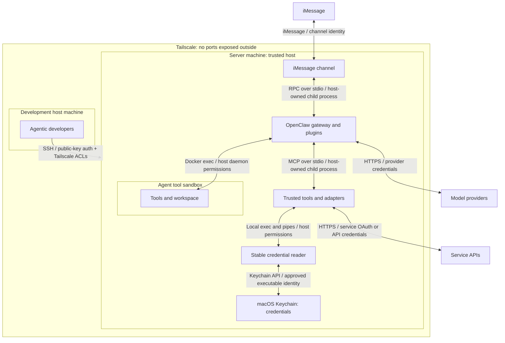
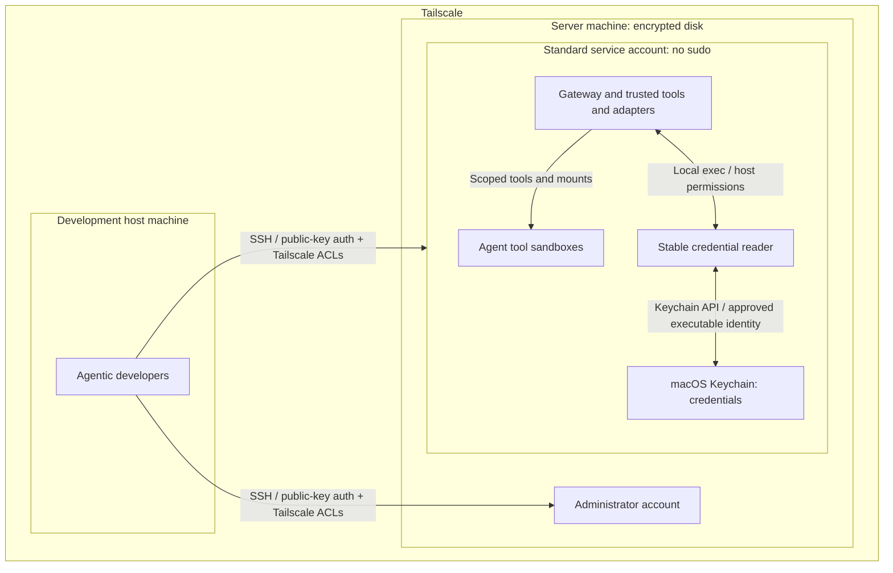
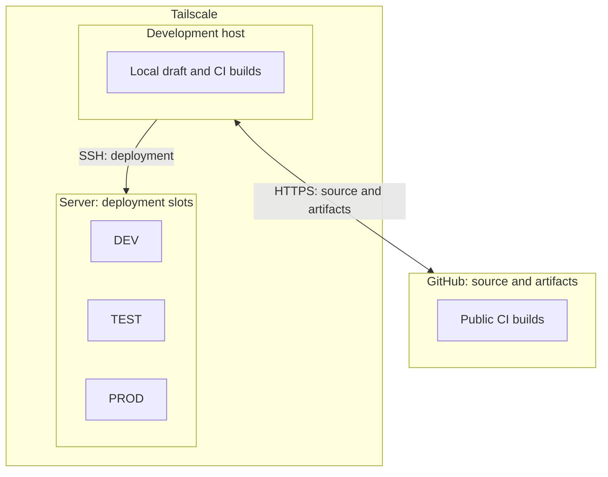
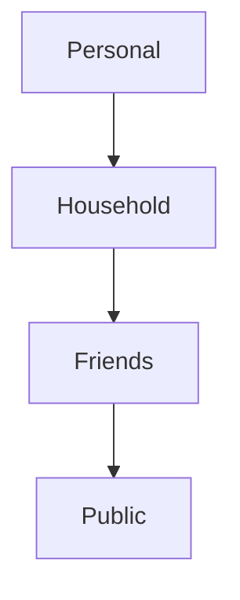
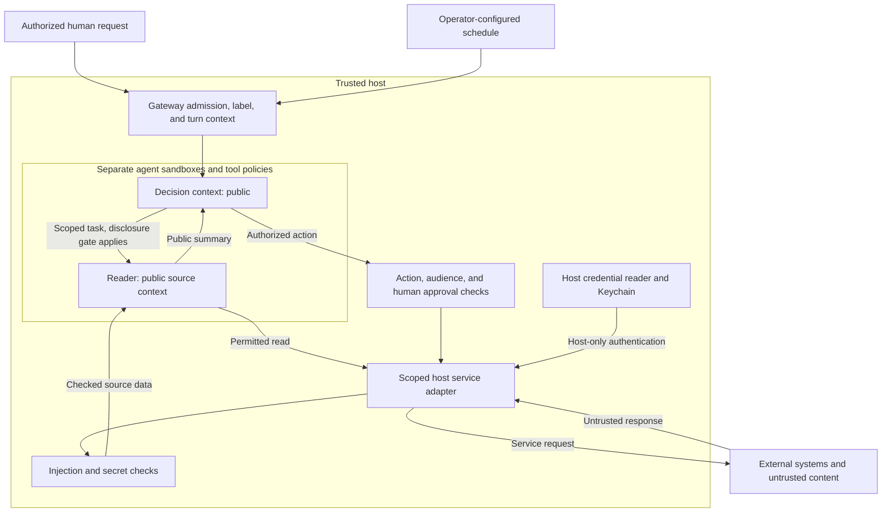

# Puddles security architecture

**Governing principles**

- No ports exposed outside Tailscale. Authenticated SSH inside Tailscale is allowed.
- No personal iCloud accounts or data on the server. System Integrity Protection
  (SIP) is disabled; use only the dedicated Puddles iCloud account.
- Any deviation requires explicit human approval before implementation. Update
  this document to reflect the approved change.

## Overall threat model

The host is trusted; agent tool execution is sandboxed. Each connection below
names its transport and authentication or access control.

### What the boundaries protect

| Boundary | Separates | Rule | Compromise enables |
|---|---|---|---|
| Tailscale | Managed machines from outside networks | No ports exposed outside Tailscale. | Access SSH and VNC ports |
| Host | Development files and tools from remote access | Access requires an authorized host account. | Personal iCloud, server via SSH, source/build tampering |
| Server | Agent runtime and data from remote access | SSH requires an approved key, server account, and Tailscale access. | Puddles iCloud, connected account secrets, all OpenClaw data and usage |
| Sandbox | Agent tools from the trusted host | Agents get only granted tools and files. Credentials stay outside the sandbox. | Agent’s granted tools and accessible session history, memory, and workspaces |
| Server Keychain | Host tools from stored credentials | Tools use an approved, stable credential reader. Secrets never enter agent context. | Connected account secrets |

These limits assume the other boundaries still hold.

## Host and network architecture

The [host setup](01-setting-up-your-mac-mini.md) separates administration from
autonomous services. SSH logs directly into the chosen account.

- **Network:** keep local IPC on loopback or pipes. Outbound service connections
  remain allowed; Tailscale does not replace sandbox network policy.
- **SSH keys:** approved public keys authenticate access. Touch ID is not required.
- **Accounts:** administrators own system changes. Gateway plugins and adapters
  hold the standard account's host authority. Only agent tool execution is
  sandboxed; gateway orchestration and model calls run on the host.
- **Disk:** encryption protects a powered-off machine, not an unlocked process.
  Protect recovery material and retain the disk-unlock and user-login steps
  needed after reboot.

## Build system architecture

Build and release code runs on trusted hosts. DEV and TEST isolate production
state and effects; they are not security sandboxes against their host.

- **Build trust:** source, dependencies, and build scripts run with the builder's
  permissions. Use reviewed, pinned inputs.
- **Credentials:** CI gets no production credentials. Keep account data and
  secrets out of build logs and artifacts.
- **Test isolation:** build tests, DEV, and TEST use separate state and processes.
  External calls use recording adapters. Tests cannot change PROD or live accounts.
- **Production artifacts:** deploy reviewed artifacts that passed release checks.
  TEST and PROD use the same verified bytes, independent of mutable build stores.

Artifact hashes detect changed bytes; they do not protect against a compromised
builder.

## Agent architecture

### Context labels

The host labels each context by the **least-trusted source that can enter it**.
The arrows show decreasing trust, not permission to share data.

#### Required rules

1. Content always adopts the least-trusted label.
2. Content MUST only flow from less trusted to more trusted. Household cannot access
   personal content.
3. Sharing toward a less-trusted label MUST have code-enforced human approval
   for the exact content and destination. Release only that copy, never credentials
   or ongoing access. Copies retain their source restrictions.

| Label | Sources | Required handling |
|---|---|---|
| Personal | iMessage from Cole, authenticated accounts whose access has not been explicitly broadened | Context rules apply. |
| Household | iMessage from allowlisted household contacts, shared household reminders | Context rules apply. |
| Friends | iMessage from allowlisted friends | Context rules apply. |
| Public | Other iMessage senders, SMS, email, calendar entries, web/search/browser results | InjectionGuard, SecretRedactor, LeakGuard, ContactsEgressGuard as applicable. Reader/browser agent only. No turns or follow-ups. |

Account access defaults to Personal; incoming Public content retains its label.
Household reminder lists must limit contributors to Cole and household members.

Guards run inside tools at the relevant boundary:

- **[InjectionGuard](../../packages/mcp-hooks/src/ingress/injection-guard.ts):**
  check external content for prompt injection before returning it.
- **[SecretRedactor](../../packages/mcp-hooks/src/ingress/secret-redactor.ts):**
  redact secrets from tool results before returning them.
- **[LeakGuard](../../packages/mcp-hooks/src/egress/leak-guard.ts):** before
  non-send calls such as web searches, check outgoing data for secrets,
  sensitive information, and PII.
- **[ContactsEgressGuard](../../packages/mcp-hooks/src/egress/contacts-egress-guard.ts):**
  before sends or invitations, check recipients and configured content rules.

Outbound guards apply at every label. They do not replace context rules,
turn permissions, or human approval.

The host verifies the iMessage sender and checks the relevant allowlist before
assigning a label.

### Resource access

Source labels describe content trust. This table defines who may access each
resource. A Public label on calendar content does not make the calendar public.

| Resource | Accessible by |
|---|---|
| Calendars: Personal, Work, US Holidays | Personal |
| Reminder list: Shared Shopping List | Personal, Household |
| Other reminder lists | Personal |
| Personal workspace and memory | Personal |
| Household workspace and memory | Personal, Household |
| Friends workspace and memory | Personal, the owning friend or group |

Access applies to the requesting tier; delegated readers inherit its resource
limits. Access does not grant every write operation or change content labels.
Unlisted resources default to Personal.

Calendar and reminder names reflect configured scopes. Workspace and memory
access above is required policy, not verified enforcement. Friends is not
deployed; see [known gaps](#appendix-known-gaps-and-validation-limits).

### Runtime flow

Required flow; see [known gaps](#appendix-known-gaps-and-validation-limits) for missing controls.

Sending higher-trust task data to the reader requires the disclosure gate.

#### Agent containment and authority

- Separate main, reader, and limited-user scopes. Deny host exec, gateway admin,
  credential files, Docker control, and broad host mounts.
- Expose host capabilities through narrow adapters. Host plugins must validate
  arguments and bind the caller's identity.
- Derive identity, workspace, account, and destinations from trusted runtime
  context. Caller-supplied IDs and paths grant no authority.
- Authenticate the owner separately from limited users. A contact match grants
  neither operator identity nor action approval.
- Unsandboxed `debug` is for explicit operator administration only. Block access
  from ordinary channels and lower-trust delegation.

Implementation details:

- **Docker:** pinned [defaults](https://github.com/openclaw/openclaw/blob/1391f7cd2d40ab5bbcf2f5f831d3a64f520e72d7/src/agents/sandbox/config.ts)
  disable network, use a read-only root, and drop capabilities.
  [Container creation](https://github.com/openclaw/openclaw/blob/1391f7cd2d40ab5bbcf2f5f831d3a64f520e72d7/src/agents/sandbox/docker.ts)
  sets no-new-privileges. Verify effective settings; browser containers have
  separate networks and mounts.
- **Native delegation:** the [spawn patch](patches/subagent-cross-agent-spawn-fix.md)
  selects the target's tool policy, preserving reader access. Same-agent children
  inherit restrictions. Target selection cannot grant a privileged profile.
- **External ACP harnesses:** these run agents outside OpenClaw's execution
  system. The patch checks requester command-tool compatibility but cannot
  enforce the target's tool policy inside the harness.

#### Channels and adapters

- **[iMessage](02-talking-to-puddles-on-imessage.md):** `imsg rpc` runs as a
  host-owned child over stdio. Check channel identity and sender allowlists
  before admission.
- **[Gmail](../../openclaw-plugins/secure-gmail/src/mcp-bridge.ts) and
  [calendar](../../openclaw-plugins/secure-apple-calendar/src/mcp-bridge.ts):**
  host-owned MCP processes communicate over stdio. Enforce caller scope and
  tool grants.

#### Credentials and external access

- Keep keys, OAuth tokens, gateway credentials, browser cookies, and refresh
  state outside agent workspaces, mounts, environments, and tool results.
- Host services resolve credentials through SecretRef, Keychain, or a configured
  credential backend. Never include values in source, logs, fixtures, artifacts,
  or public diagnostics.
- Scope adapters to specific services, accounts, and operations. Credentials
  authenticate service access; they do not approve agent actions.
- Treat logged-in browser profiles as credentials. Login does not make page
  content trusted.

Current integrations:

- **[Gmail](../../servers/gmail-mcp/README.md):** the host server obtains OAuth
  through its [authentication layer](../../servers/gmail-mcp/src/gmail_mcp/auth.py).
  The plugin excludes bootstrap and send tools; the OAuth grant is broader.
- **[Calendar](../../openclaw-plugins/secure-apple-calendar/README.md):** the host
  MCP bridge limits account visibility per agent.
- **[Provider service](../plans/031-rocket-money-integration.md):** proposed CLI
  integration, not a deployed universal broker.

##### Stable credential identity

Keychain approves the reader executable, not its PID or parent interpreter.

- **[Gmail](../../servers/gmail-mcp/src/gmail_mcp/keychain.py):** Python invokes
  Apple-signed `/usr/bin/security`. Node consumers can do the same. New items
  trust that executable; refresh preserves existing ACLs. Reads and writes time
  out after five seconds. Secrets return only to the host consumer.
- **Stable identity:** interpreter upgrades leave the reader unchanged. Its
  signing requirement is `com.apple.security`, anchored to Apple. Verify live
  item ACLs and the unlocked login Keychain.
- **Limit:** any code under the same OS user can invoke the reader. Executable
  identity does not isolate agents from each other.
- **[Custom helper](https://github.com/coletaylor788/puddles/pull/29):** unmerged.
  Reads allowlisted items through an exact approved binary. Replacing the binary
  needs human reapproval, even with the same signing requirement. Migration is
  not universal.
- **[Apple-PIM](apple-pim/README.md):** its native launcher owns macOS privacy
  (TCC) grants independently of Node. Rebuilding the CLI requires renewed grants.
  TCC and Keychain permissions are separate.

#### Untrusted content and the reader

1. The parent sets the task and scope. Source content cannot expand them.
2. The host adapter checks all external fields before release: body, errors,
   metadata, attachments, search results, and write receipts.
3. The reader returns a bounded, attributed summary in its own words. Flag
   suspicious content; never relay raw instructions.
4. The receiving context uses the result only as evidence for the original task.

The [reader](agent-instructions/reader-AGENTS.md) gets one acquisition, then
returns. Enforce this through tool grants.

- **Secret redaction:** combines patterns and model classification.
- **Coverage:** prefilters must include every attacker-controlled field.
  Classifiers can miss attacks; passing a guard never grants authority.
- **Execution:** Gmail/calendar wrappers await guards before releasing results.
  Injection and redaction run in parallel, so the injection provider may receive
  unredacted secrets. It must be approved to process that data.
- **Outbound checks:** supplement action authorization; they do not replace it.

| Path | Implemented coverage |
|---|---|
| [Gmail](../../openclaw-plugins/secure-gmail/src/plugin.ts) | Injection and secret checks on `list_emails` and `get_email`. Attachments are read separately. Ingress guards do not approve archive/label mutations. |
| [Calendar](../../openclaw-plugins/secure-apple-calendar/src/action-map.ts) | Separate read/write tools. Ingress checks on events/get/search. Recipient/content checks on writes with attendees. Metadata and other mutations have different coverage. |
| [Egress library](../../packages/mcp-hooks/README.md) | LeakGuard checks non-send content. ContactsEgressGuard checks recipients and optional sensitive content. Each consumer must wire these checks into its paths. |
| [External-content wrapper](https://github.com/openclaw/openclaw/blob/1391f7cd2d40ab5bbcf2f5f831d3a64f520e72d7/src/security/external-content.ts) | Source markers, token sanitization, and warnings only. No reader routing, authorization, or universal blocking classifier. |

#### Turns, follow-ups, and out-of-turn context

- Start turns only for authorized human requests, configured schedules, or
  trusted continuations of admitted work.
- Untrusted content and readers MUST NOT start turns or follow-ups. Returning
  a result cannot wake another session or start a conversation.
- Bind async results and actions to the original principal, role, session/task,
  and destination. Reject stale or mismatched context. Missing context grants
  no broader authority.
- Deny ingestion roles cron, spawn, session messaging, webhook wake, and delivery
  tools except a narrowly enforced result-return path. Dispatchers must reject
  source-selected sessions, recipients, and tool requests.
- Check destinations for scheduled and background delivery. Content checks,
  destination checks, and turn permission are separate controls.

Current dispatch paths:

- **[Outbound policy](https://github.com/openclaw/openclaw/blob/1391f7cd2d40ab5bbcf2f5f831d3a64f520e72d7/src/infra/outbound/outbound-policy.ts):**
  checks selected message actions against channel context and configuration.
  Skips the context check when no target is bound; not a universal out-of-turn gate.
- **[Session send](https://github.com/openclaw/openclaw/blob/1391f7cd2d40ab5bbcf2f5f831d3a64f520e72d7/src/agents/tools/sessions-send-tool.ts):**
  can start runs and follow-ups after access checks.
- **[Gateway hooks](https://github.com/openclaw/openclaw/blob/1391f7cd2d40ab5bbcf2f5f831d3a64f520e72d7/src/gateway/server/hooks.ts):**
  can start isolated turns and wakes. This does not authorize arbitrary external
  events to reach privileged agents.

#### Memory and persistent state

- Separate role workspaces, sessions, memory, and browser profiles. A reused
  container is not a fresh context per task.
- **[Scoped memory](../../openclaw-plugins/scoped-memory/README.md):** binds host
  identity and workspace, rejects traversal and symlinks/hardlinks, and rereads
  authorized bytes instead of stale index snippets.
- **Limits:** native memory and wiki tools need separate denials. Scoped memory
  does not control index ingestion.

## Appendix: known gaps and validation limits

This combines source review with selected live configuration checks, not a full
security audit. Verify effective accounts, listeners,
permissions, mounts, and dispatch paths before claiming enforcement. Recheck
pinned upstream references against the [current build](../../packages/e2e/openclaw-patch-suite.json)
when upgrading.

| Area | Limit or gap |
|---|---|
| Context labels | The [household plan](../plans/completed/022-household-and-friends-tiers.md) covers limited household access and owner relay. Friends/public populations, provenance propagation, and universal exact-content approval are not established. |
| Resource access | Household reminder scoping accepts caller-supplied `configDir` overrides. Scoped memory is not enabled; native memory access remains unverified. Validate these boundaries and Personal access to lower-tier workspaces before claiming enforcement. |
| Network | [Older setup](01-setting-up-your-mac-mini.md) allows LAN SSH, violating the Tailscale-only rule. Verify listeners and firewall rules; this document changes neither. |
| Sandbox and credentials | The [sandbox guide](03-openclaw-and-agent-sandboxing.md) allows container networking. The [browser design](../plans/completed/023-durable-browser-agent-login.md) mounts a credential-bearing profile. Both deviate from host-only external access and credential custody. |
| Reader routing | Gmail/calendar depend on configured grants. Older examples give main search and readers session messaging. No universal reader gate exists; review attachments, images, browser results, errors, and metadata separately. |
| Raw results | [Gmail](../../openclaw-plugins/secure-gmail/src/wrap-tool.ts) and [calendar](../../openclaw-plugins/secure-apple-calendar/src/wrap-tool.ts) retain unredacted `details.original`. Persistence and consumers can still access raw data. |
| Classifiers | Guards block recognized provider/parse errors. [Classification](../../packages/mcp-hooks/src/classify.ts) coerces `detected` without strict schema validation, so parseable malformed responses can pass. Model decisions remain probabilistic. |
| Turn admission | Guards, session visibility, reader instructions, and historical hooks do not prove universal turn/follow-up denial. Validate missing-context behavior and alternate dispatch paths. |
| Mutations | Ingress runs after execution; scanning cannot approve Gmail archive/label or calendar mutations. [iMessage approval forwarding](../plans/027-imessage-approval-channel.md) remains pending. |
| Build supply chain | Project tools and pnpm dependencies are pinned, but Actions use version tags and Gmail tests install through pip. Builds are not fully hermetic or independently signed. |

For changes, trace data and control across boundaries. Test unauthorized callers,
missing/stale context, blocked content, guard failures, forbidden follow-ups,
credential leaks, and live effects. Use the approved development lifecycle.
