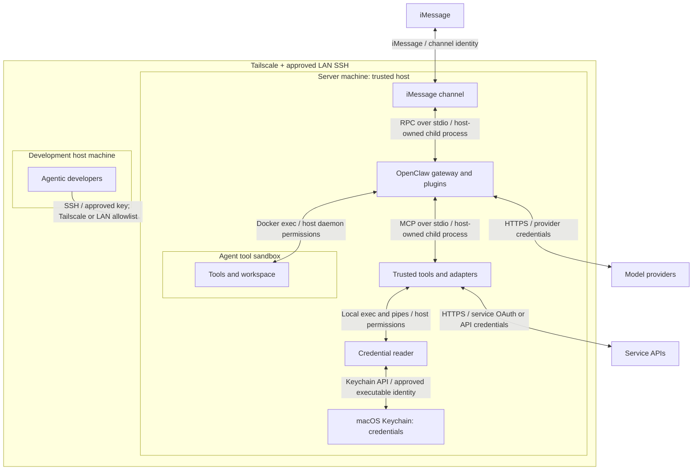
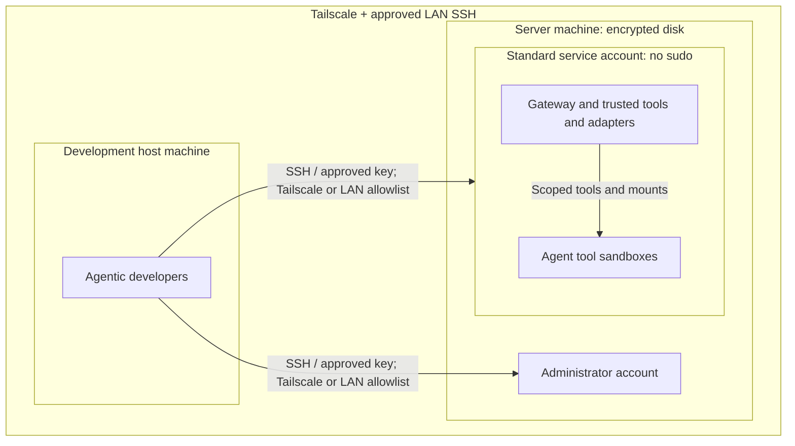
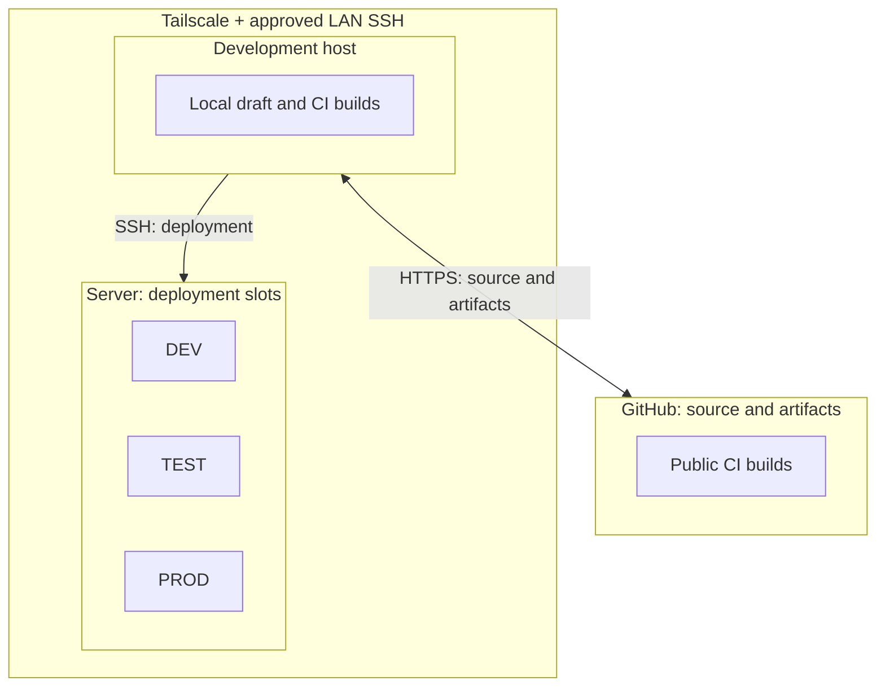
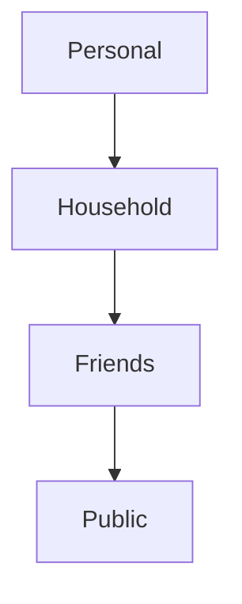
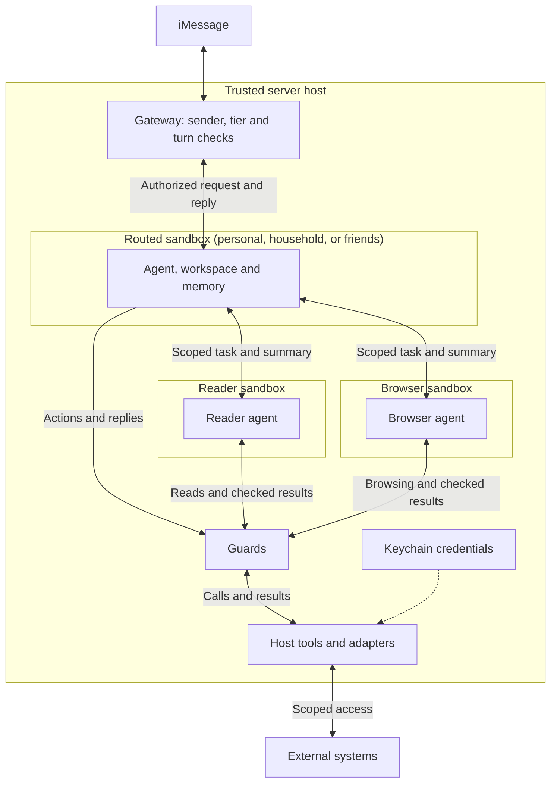

# Puddles security architecture

This document defines security boundaries, principles, and required controls.
Setup guides and configuration hold deployment details; this is not a live audit.

**Governing principles**

- Only authenticated people on the trusted allowlist can initiate or schedule a turn.
- No ports exposed outside Tailscale except key-authenticated SSH from approved
  development hosts on the LAN. No internet port forwarding.
- No personal iCloud accounts or data on the server. System Integrity Protection
  (SIP) is disabled; use only the dedicated Puddles iCloud account.
- Any deviation requires explicit human approval before implementation. Update
  this document to reflect the approved change.

## Overall threat model

The host is trusted; agent tool execution is sandboxed. Each connection below
names its transport and authentication or access control.

### What the boundaries protect

| Boundary | Separates | Rule | Compromise enables |
|---|---|---|---|
| Tailscale | Managed machines from outside networks | Remote access uses Tailscale; approved LAN hosts may use key-based SSH. | Access SSH and VNC ports |
| Host | Development files and tools from remote access | Access requires an authorized host account. | Personal iCloud, server via SSH, source/build tampering |
| Server | Agent runtime and data from remote access | SSH requires an approved key and server account, over Tailscale or from an approved LAN host. | Puddles iCloud, connected account secrets, all OpenClaw data and usage |
| Sandbox | Agent tools from the trusted host | Agents get only granted tools and files. Credentials stay outside the sandbox. | Agent’s granted tools and accessible session history, memory, and workspaces |
| Server Keychain | Host tools from stored credentials | Tools use an approved credential reader. Secrets never enter agent context. | Connected account secrets |

These limits assume the other boundaries still hold. The sandbox row describes
a compromised agent inside an intact sandbox, not a sandbox escape.

## Host and network architecture

The [host setup](01-setting-up-your-mac-mini.md) separates administration from
autonomous services. SSH logs directly into the chosen account. Approved
development hosts may connect over LAN or Tailscale. Direct key-based SSH
supports unattended work without interactive reauthentication; Touch ID is
optional. Keep host-key verification enabled.

- **Network:** limit the LAN exception to SSH from approved development hosts.
  Other services stay behind Tailscale. Keep local IPC on loopback or pipes.
  Outbound service connections remain allowed; Tailscale does not replace sandbox network policy.
- **Accounts:** administrators own system changes. Gateway plugins and adapters
  hold the standard account's host authority. Only agent tool execution is
  sandboxed; gateway orchestration and model calls run on the host.
- **Disk:** encryption protects a powered-off machine, not an unlocked process.
  Protect recovery material.

## Build system architecture

Build and release code runs on trusted hosts. DEV and TEST isolate production
state and effects; they are not security sandboxes against their host.

- **Build trust:** source, dependencies, and build scripts run with the builder's
  permissions. Use reviewed, pinned inputs.
- **Credentials:** CI gets no production credentials. Keep account data and
  secrets out of build logs and artifacts.
- **Test isolation:** build tests, DEV, and TEST use separate state and processes.
  External calls use recording adapters. Tests cannot change PROD or live accounts.
- **Production artifacts:** deploy reviewed artifacts that passed release checks.
  TEST and PROD use the same verified bytes, independent of mutable build stores.

Artifact hashes detect changed bytes; they do not protect against a compromised
builder.

## Agent architecture

### Context labels

The host labels each context by the **least-trusted source that can enter it**.
The arrows show decreasing trust, not permission to share data.

#### Required rules

1. Content always adopts the least-trusted label.
2. The host must limit agents to their assigned scope and less-trusted scopes.
   Requests for more-restricted context must pass a deterministic, host-enforced
   human approval gate.

| Label | Sources | Required handling |
|---|---|---|
| Personal | iMessage from Cole, authenticated accounts whose access has not been explicitly broadened | Context rules apply. |
| Household | iMessage from allowlisted household contacts, shared household reminders | Context rules apply. |
| Friends | iMessage from allowlisted friends | Context rules apply. |
| Public | Other iMessage senders, SMS, RCS, email, calendar entries, web/search/browser results | Guards embedded into tools as applicable. Reader/browser agent only. No turns or follow-ups. |

Household reminder lists must limit contributors to Cole and household members.

Guards run inside tools at the relevant boundary:

- **[InjectionGuard](../../packages/mcp-hooks/src/ingress/injection-guard.ts):**
  check external content for prompt injection before returning it.
- **[SecretRedactor](../../packages/mcp-hooks/src/ingress/secret-redactor.ts):**
  redact secrets from tool results before returning them.
- **[LeakGuard](../../packages/mcp-hooks/src/egress/leak-guard.ts):** before
  non-send calls such as web searches, check outgoing data for secrets,
  sensitive information, and PII.
- **[ContactsEgressGuard](../../packages/mcp-hooks/src/egress/contacts-egress-guard.ts):**
  any content destined to a recipient must be addressed to a known contact.

Outbound guards apply at every label. Passing a guard does not change content
labels or replace action authorization, turn permissions, or human approval.

### Resource access

Source labels describe content trust. This table defines who may access each
resource. A Public label on calendar content does not make the calendar public.

| Resource | Accessible by |
|---|---|
| Calendars: Personal, Work, US Holidays | Personal |
| Reminder list: Shared Shopping List | Personal, Household |
| Other reminder lists | Personal |
| Personal workspace and memory | Personal |
| Household workspace and memory | Personal, Household |
| Friends workspace and memory | Personal, Household, Friends |

Access applies to the requesting tier; delegated readers inherit its resource
limits. Access does not grant every write operation or change content labels.
Accounts and unlisted resources default to Personal.

### Runtime flow

Required architecture. Each tier has separate routed, reader, and browser
sandboxes. The diagram shows one tier; external-service tools and credentials
stay outside the sandboxes.

#### Agent containment and authority

- Separate main, reader, and limited-user scopes. Deny host exec, gateway admin,
  credential files, Docker control, and broad host mounts.
- Expose host capabilities through narrow adapters. Host plugins must validate
  arguments and bind the caller's identity.
- Derive identity, workspace, account, and destinations from trusted runtime
  context. Caller-supplied IDs and paths grant no authority.
- Bind results and actions to the original caller, task, session, and destination.
  Reject missing, stale, or mismatched context.
- Authenticate the owner separately from limited users. A contact match grants
  neither operator identity nor action approval.
- Unsandboxed administration is operator-only. Block access from ordinary
  channels and lower-trust delegation.

#### Credentials and external access

- Keep keys, OAuth tokens, gateway credentials, browser cookies, and refresh
  state outside sandboxes, agent workspaces, mounts, environments, and tool results.
- Host services obtain credentials from approved credential stores. Never include
  values in source, logs, fixtures, artifacts, or public diagnostics.
- Scope adapters to specific services, accounts, and operations. Credentials
  authenticate service access; they do not approve agent actions.
- Treat logged-in browser profiles as credentials. Login does not make page
  content trusted.

##### Keychain and macOS privacy access

| Application | Access | Identity used for permission |
|---|---|---|
| [Gmail MCP server](../../servers/gmail-mcp/src/gmail_mcp/keychain.py) | Keychain: Gmail OAuth token | Apple-signed `/usr/bin/security` (`com.apple.security`) |
| Model client used by guards | Keychain: model provider token | Apple-signed `/usr/bin/security` (`com.apple.security`) |
| Web search plugin | Keychain: search provider token | Hosting Node executable, through `keytar` |
| Provider credential setup script | Keychain: model provider token | Node executable running the script, through `keytar` |
| Apple-PIM calendar tool | TCC: Calendar data | `calendar-cli.real`, binary path and signature |
| Apple-PIM reminder tool | TCC: Reminders data | `reminder-cli.real`, binary path and signature |
| Apple-PIM contacts tool and ContactsEgressGuard | TCC: Contacts data | `contacts-cli.real`, binary path and signature |

Prefer stable application identities to avoid permission conflicts during
software updates. Revalidate Keychain and TCC grants when identities change;
[Apple-PIM setup](apple-pim/README.md) covers its launcher and grants.

Code under the same OS user can invoke an approved credential reader; it is not
an isolation boundary between agents.

#### Untrusted content and the reader

1. The parent sets the task and scope. Source content cannot expand them.
2. The host adapter checks all external fields before release: body, errors,
   metadata, attachments, search results, and write receipts.
3. The reader returns a bounded, attributed summary in its own words. Flag
   suspicious content; never relay raw instructions.
4. The receiving context uses the result only as evidence for the original task.

Reader and browser agents cannot start turns or follow-ups. Enforce their task
scope through host tool permissions, not instructions alone.

Guards must finish before content reaches an agent. Their processing services
must be authorized to handle the data they inspect.

#### Memory and persistent state

- Separate tier workspaces, sessions, memory, and browser profiles.
- Enforce resource access on every read, search, and automatic recall path.
  Indexes, caches, and filesystem links must not bypass it.
- Stored content retains its source restrictions. Reusing a sandbox does not
  create a fresh context.
