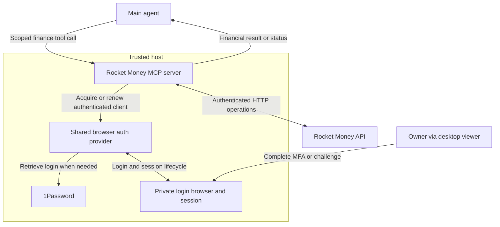

# Plan 031: Rocket Money MCP and shared browser authentication

**Status:** Design proposal; implementation pending
**Issue:** [#135](https://github.com/coletaylor788/puddles/issues/135)
**Last updated:** 2026-10-07

## Human section

### Design

#### Objective

Expose Rocket Money operations through MCP while keeping login, credentials and session state on the trusted host. Separate reusable browser authentication from the Rocket Money-specific HTTP client.

#### Architecture

#### Components

| Component | Responsibility |
|---|---|
| Main agent | Interpret requests, apply private finance rules and authorize changes. |
| Rocket Money MCP server | Expose finance tools, validate operations, make Rocket Money HTTP requests and verify results. |
| Shared browser auth provider | Own password-manager access, browser profiles, login, session reuse and renewal. Supply an authenticated HTTP client to trusted host callers. |
| Desktop viewer | Let the owner complete interactive login steps in the provider's private browser. |

The auth provider is reusable by other host integrations. Site-specific login configuration belongs behind that provider's interface. The Rocket Money server remains a small custom integration with its own API operations and financial safeguards. It does not need a generic provider framework.

#### Authentication contract

The MCP server asks the auth provider for an authenticated client for a configured account. The provider reuses the existing session across calls and conversation turns. When needed, it performs a bounded login or renewal attempt using host-only 1Password access. If interaction is required, it returns `needs_user_login`; the owner opens the desktop viewer and completes the challenge.

Passwords, cookies and tokens remain inside the trusted host. Only the host-side HTTP client receives authentication context. The model and test sandbox receive neither credentials nor browser, profile or debugger access. Authentication is an internal dependency, not a model-facing tool.

#### Rocket Money operations

| Interface | Scope |
|---|---|
| Read | Supported financial queries, transaction details, categories, pagination and session status. |
| Write | An individual transaction's existing category or editable date only. |
| Result | Financial data with coverage, or a bounded operation/login status. |

The server owns Rocket Money request construction and approved API destinations. Reads preserve supported native query semantics. Writes check transaction identity and expected current values, disable category propagation, and read back the result. Stable request IDs and a small outcome journal prevent blind retries after an uncertain write.

Private categorization and date rules remain in main's runtime skill and memory. The server enforces the allowed operations; it does not become a financial planner or browser agent.

#### Deployment

Run both components on the trusted host. Prefer the shared auth provider as a reusable library within the host process unless an existing supported host service already supplies it. A shared interface does not require another daemon or network hop. The runtime exposes the MCP server's scoped tools to main.

### Status

This is a design proposal. The shared authentication integration and MCP interface still need implementation and validation. Runtime behavior is unchanged. Dedicated testing remains in the [deferred appendix](031-rocket-money-deferred.md).

## Agent section

### State

- Canonical repository design; supersedes the earlier combined gateway and browser-worker proposals.
- The retained host client on `codex/cli-gateway-design-flow` is reuse material, not proof that either component exists in the required form.
- Main's skill and owner-specific finance rules remain private runtime content, managed outside the repository.

### Scope and acceptance criteria

- Main-only financial exploration and the two permitted transaction edits.
- Shared auth owns login and persistent sessions; Rocket Money MCP owns API operations.
- Credential/session material is inaccessible to normal model tools and test sandboxes. Authorized host administration/debug remains trusted.
- Preserve existing private rules, including clarification for ambiguous or unauthorized changes and title-based date corrections. Do not publish account-specific rules.
- Report incomplete coverage and uncertain outcomes explicitly. Do not replay an uncertain mutation after repairing login.
- Other financial writes, scheduling and a general integration framework are outside scope.

### Architecture and decisions

- Use a standard HTTP client and MCP library. Keep Rocket Money-specific logic limited to API contracts, validation and result verification.
- Prefer the runtime's supported MCP binding and local stdio. Confirm compatibility before choosing an adapter.
- Reuse a supported browser authentication implementation where practical. Select that implementation during design validation; this proposal does not claim an existing provider already satisfies the contract.
- Authenticated clients are host-only and bound to configured accounts and approved destinations. The model cannot select arbitrary credentials, URLs or authentication headers.
- The auth provider owns browser-to-HTTP session synchronization. Login automation and refresh behavior must be validated for Rocket Money; do not assume an OAuth refresh flow exists.
- Provider responses and diagnostics must exclude authentication material. Financial source text remains untrusted input.

### Implementation

1. Select the shared browser auth implementation and define its host-only client/session contract.
2. Adapt reusable Rocket Money request logic behind the MCP tools.
3. Connect the owner viewer to the auth provider and update main's private skill to use the MCP tools.

### Validation

Review documentation and component ownership now. Tests, live capability checks and release validation are in the [deferred appendix](031-rocket-money-deferred.md). No runtime validation is claimed by this revision.

### Rollout and rollback

After implementation validation, enable reads first and then the two permitted writes. Disable the tools if authentication isolation or result verification fails. Do not fall back to sharing the authenticated browser with an agent.

### Review log

- 2026-10-06: Selected trusted-host execution with model-visible tools only.
- 2026-10-07: Recorded the proposal in repository docs; separated shared browser authentication from the Rocket Money-specific MCP client.

### Checklist

- [x] Define the shared auth and Rocket Money responsibilities.
- [x] Preserve credential isolation, private rules and verified writes.
- [x] Keep testing in the deferred appendix.
- [ ] Select the auth implementation and validate the integration.
- [ ] Implement and activate under a subsequent approved implementation task.
