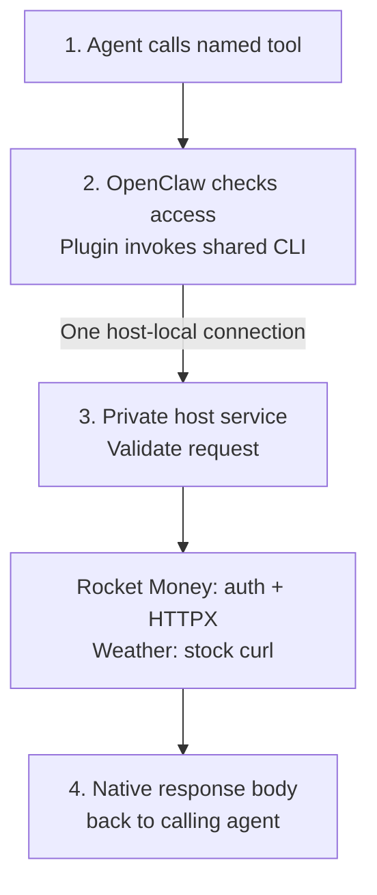
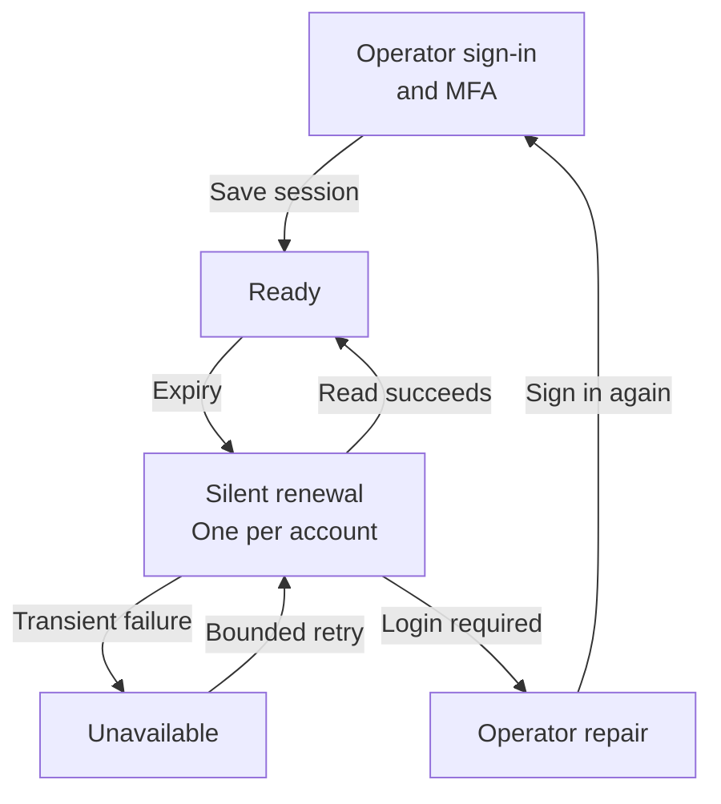

# Plan 031: CLI gateway for Rocket Money and weather

**Status:** Design recorded; implementation deferred
**Issue:** None
**Last updated:** 2026-09-26

## Human section

### Design

Give Puddles Rocket Money and weather access through **CLI-backed OpenClaw tools**, following Apple PIM's shared installation model. Install the clients once on the Mini. Per-agent tool permissions control access; sandbox images stay unchanged. Credentials and endpoint policy live in one protected host service. All new code and skills stay in Puddles, with no upstream forks.

#### 1. Tools and native requests

| Proposed tool | V1 capability |
|---|---|
| `rocket_money_read` | Native GraphQL reads: transaction details, filters, batches, pagination, and broader financial exploration within the free account's access. Also safe auth/operation status. |
| `rocket_money_write` | Native GraphQL changes to an existing transaction's category or date by explicit ID. Category propagation must be false. |
| `weather_curl` | Stock curl requests to `https://wttr.in/` and the installed skill's `https://wttr.is/` fallback, using native curl arguments. |

Rocket Money keeps GraphQL documents, variables, field names, aliases, and response envelopes. The tool boundary separates permissions without inventing a financial schema. Batch and pagination helpers report partial coverage. Other financial writes, including remote flags, notes, amounts, splits, and rules, remain excluded. Existing metadata is readable; local review flags are deferred.

Changing a Venmo reimbursement's date is intended to align it with the right budget month. The effect on budget calculations still needs verification.

Weather keeps curl's URLs, query parameters, headers, methods, request bodies, and response formats. The skill teaches use of `weather_curl` with those arguments. Since curl runs on the host, its runner restricts host file/config access and connection overrides. Workspace file input/output goes through an explicit workspace transfer, never an arbitrary host path. The appendix defines that boundary. Weather needs no API key or separate forecast schema.

#### 2. Shared installation and per-agent permissions

Apple PIM registers named tools whose handlers spawn installed CLIs. Use that pattern: one Puddles plugin registers the three tools, and trusted deployment installs their executable dependencies once. Agents do not need CLI packages, special images, or gateway sockets in their containers.

OpenClaw's tool policy decides which tools each agent can call. A tool factory captures the runtime's trusted agent identity; protected configuration supplies its account and grants. The wrapper checks the grant again on execution. Agent arguments and writable skills cannot select an identity, account, binary, or permission profile.

For example, a weather agent can receive only `weather_curl`, a finance reader only `rocket_money_read`, and an authorized finance agent both Rocket Money tools. Those are configuration examples, not changes to current agent assignments. Skills explain usage; they do not grant access.

The existing OpenClaw tool channel carries calls out of sandboxed agents. The plugin invokes the shared CLI through a fixed executable and argument array. One private Unix socket connects it to the host service under its separate credential-owning identity. There is no additional Linux relay, SSH bridge, SOCKS proxy, or sandbox socket mount. Agents must not have general host execution or direct access to that private socket, which would bypass the named tools.

#### 3. Host request policy and execution

| Route | What executes |
|---|---|
| Weather | A fixed stock curl binary after destination and argument validation. Allow the two weather HTTPS origins only, with verified TLS and bounded transfers. |
| Rocket Money | HTTPX sends accepted native GraphQL after validation and private authentication. Allow reviewed reads and exactly the two approved mutations. |

The host service uses Starlette/Uvicorn for local requests. The plugin supplies caller identity and tool scope over the protected local connection. The service independently checks protected grants and the complete request; request labels alone never authorize a mutation. The connection is trusted only from the OpenClaw host identity, not from sandbox callers.

For Rocket Money, validate effective GraphQL fields, variables, aliases, fragments, and arguments; even read-looking queries can create state. Weather validates every destination and curl option, including options that could change a target or read local files. Validation failure never falls through to forwarding or arbitrary command execution.

#### Rocket Money authentication

| Credential type | Host-side custody and renewal |
|---|---|
| API keys for future managed adapters | macOS Keychain through Python keyring's explicit macOS backend. No plaintext fallback. |
| Standard OAuth | Keychain for tokens; Authlib performs supported refresh and persists rotations. |
| Rocket Money browser session | Playwright-managed Chromium under a dedicated macOS service identity. Its private profile lives outside Git and agent mounts. |

The whole Chromium profile stays in private host files, not Keychain. Browser cookies and API cookie rotations share one coordinated account session. The model never receives credentials, browser storage, or debugger access.

Initial setup uses a visible browser in the service account's GUI session. Normal maintenance should be headless, with no scheduled manual login. Silent recovery was observed in the existing browser; managed Chromium renewal and cookie lifetime remain unverified. FileVault unlock and service-account login after reboot are separate prerequisites. Revocation or mandatory MFA can still require operator repair.

#### 4. Return the native response

The response goes back through the CLI and tool to the same calling agent. The gateway does not dispatch agents, summarize results, or convert financial responses into special main-agent receipts.

**Weather:** return curl's native response body and separate exit status. Binary output becomes a tool artifact. Do not add response headers or a weather schema; explicit public-header requests can retain curl's native behavior. Apply transfer limits without semantic content inspection.

**Rocket Money:** return the native GraphQL response. Keep upstream auth and cookie headers private, process cookie rotation inside the session manager, and bound response size. Do not add a general semantic filter or injection scanner here. Native provider errors remain provider errors; gateway failures use separate transport errors. Request validation excludes credential-exporting fields before they can be queried.

For the two financial updates, the adapter additionally records intent under a stable request ID and reads back the changed fields. If execution times out, the result may be unknown. Check status before repeating the operation; do not blindly replay it. Verification status is separate from the native GraphQL result. Batches report each outcome independently.

Active code, configuration, keys, and browser state remain outside agent-writable paths. Routine logs exclude bodies, query strings, cookies, auth headers, and debug dumps. External-content handling belongs to Puddles' existing agent workflow, not this transport service.

#### Adding another integration

Add a named tool, CLI/skill, and provider registration. The provider supplies either a constrained native CLI runner or a managed HTTP adapter, along with its request policy and optional auth driver. The shared service owns credential custody, local transport, and operational limits. Assign its tool to agents through the same permission mechanism.

Registration and adapters are trusted operator-installed configuration/code. Agent requests cannot install them or change their permissions. Prove extension with a test provider added without modifying the shared transport.

### Status

The design is recorded for later implementation; no new runtime is installed and no financial writes have been performed. The Mini's installed Apple PIM source confirms factory-registered tools spawning shared CLIs. Its weather skill confirms wttr.in and wttr.is.

Remaining checks are the new plugin's permission enforcement, safe native curl execution, unattended Rocket Money auth, free-account coverage, and budget behavior after date changes. The sections below are the implementation reference, not more request-flow stages.

## Agent section

### State

The current revision uses Apple PIM-style CLI-backed tools and per-agent tool grants. It removes per-agent image distribution, sandbox sockets/SSH relays, special main-agent receipts, generic response inspection, and the proposed weather API wrapper. Implementation remains deferred. The original Envoy review is retained as historical evidence.

### Scope and acceptance criteria

- Deliver `rmoney` and its skill with native GraphQL, broad reviewed reads, and exactly category/date updates.
- Reuse the installed weather skill with stock curl and its native URLs/formats. No weather wrapper schema or new provider selection.
- Install shared host clients once; register named tools with per-agent grants and protected account bindings. No per-agent images or direct sandbox gateway access.
- Keep Rocket Money credentials host-only. Weather uses no injected auth or TLS interception.
- Deny unregistered destinations, host file/config escapes, and bypasses of tool or GraphQL policy. Preserve native responses and explicit partial/uncertain outcomes.
- Add a test provider through protected registration without forks or shared-transport changes.

### Architecture and decisions

The [technical appendix](031-cli-gateway/technical-appendix.md) holds exact contracts:

- [Tool dispatch and local transport](031-cli-gateway/technical-appendix.md#tool-dispatch-and-local-transport) and [installation/access](031-cli-gateway/technical-appendix.md#agent-installation-and-access): shared clients, trusted caller context, and per-agent grants.
- [Weather curl contract](031-cli-gateway/technical-appendix.md#weather-curl-contract): installed-skill evidence, native curl arguments, file boundaries, and transfer limits.
- [Managed executor and limits](031-cli-gateway/technical-appendix.md#managed-executor-and-limits) and [authentication](031-cli-gateway/technical-appendix.md#authentication-contract).
- [Rocket Money API contracts](031-cli-gateway/technical-appendix.md#rocket-money-api-contracts) and [local API/CLI contract](031-cli-gateway/technical-appendix.md#local-api-and-cli-contract).
- [Extension contract](031-cli-gateway/technical-appendix.md#provider-extension-contract) and [package layout](031-cli-gateway/technical-appendix.md#package-layout).

### Implementation

| Phase | Deliverable | Gate |
|---|---|---|
| 1. Tool integration | Shared plugin/CLIs, private local socket, fake adapters | Per-agent allow/deny, missing identity denied, no direct sandbox bypass, no image changes. |
| 2. Weather and executor | Native curl runner plus managed API lifecycle | Allowed curl requests and workspace artifacts; file/target escapes denied; GraphQL rejection before execution; body-only results. |
| 3. Authentication | Keychain and private managed Chromium | Setup, cookie rotation, idle/expiry renewal, concurrency, restart and reboot prerequisites. |
| 4. Rocket Money | Reviewed reads and the two constrained updates | Free-account coverage and separately authorized reversible budget/category verification. |
| 5. Distribution | Protected host install, skills, extension starter | Permission changes and revocation, recovery docs, extension without dispatch changes. |

### Validation

Recorded research established Rocket Money's source contracts and browser silent recovery, not standalone/headless renewal or successful mutations. See [evidence](031-cli-gateway/technical-appendix.md#research-evidence), [read catalog](031-cli-gateway/read-catalog.json), and [recorded probes](031-cli-gateway/research-evidence.json). Apple PIM source and weather evidence are in the appendix.

Implementation must cover the [runtime cases](031-cli-gateway/technical-appendix.md#runtime-validation-cases). Use synthetic credentials and recording adapters for automated writes. This design revision needs direct contract/link review and applicable documentation checks, not runtime deployment or prose regression tests.

### Rollout and rollback

No runtime rollout is part of this task. Future implementation follows the [development workflow](../../.github/skills/safe-feature-development/SKILL.md) and [deployment coordination](../../packages/e2e/DEPLOYMENT_COORDINATION.md). Prove tool permissions and request policy before adding live credentials. Revoke an agent's grant in protected configuration and reject subsequent dispatches, including from existing sessions. Already-dispatched writes may still finish. Financial recovery uses recorded intent and read-back, not automatic replay or rollback.

### Review log

The [Envoy review](031-cli-gateway/envoy-security-review.md), [decision record](031-cli-gateway/security-resolution.md), and [alternatives](031-cli-gateway/technical-appendix.md#alternatives-and-source-references) retain the prior investigation. The current design follows the requester's Apple PIM tool model: shared installation, per-agent grants, native GraphQL/curl, and body-only returns. Credential custody and the two financial write limits remain.

### Checklist

- [x] Record shared CLI-backed tools, per-agent permissions, native responses, and narrow financial updates.
- [x] Inspect the Mini's Apple PIM tool registration/runner and installed weather URLs.
- [x] Preserve exact Rocket Money contracts and historical research.
- [ ] Prove tool allow/deny, trusted identity, private transport, and revocation without sandbox bypass.
- [ ] Verify native weather requests, safe file handling, and bounded artifacts.
- [ ] Verify host credential custody, silent renewal, rotation, and restart/reboot behavior.
- [ ] Deliver Rocket Money reads, category/date writes, and the budget-date workflow.
- [ ] Prove denial, auth isolation, native returns, replay handling, and uncertain-write recovery.
- [ ] Deliver protected installation, extension starter, and operator recovery instructions.
