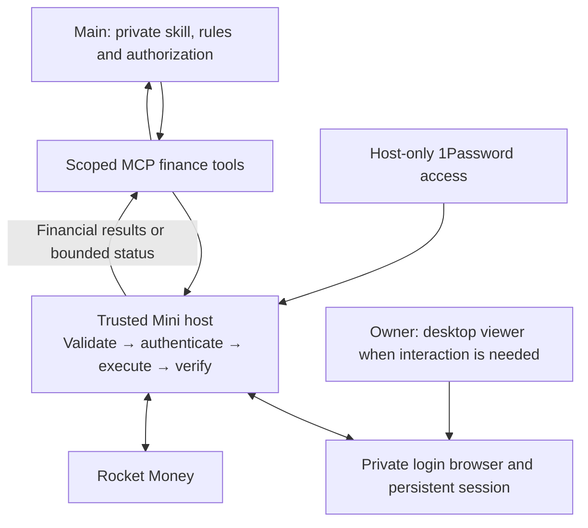

# Plan 031: Rocket Money trusted-host MCP tools

**Status:** Revised proposal; implementation and activation pending
**Issue:** [#135](https://github.com/coletaylor788/puddles/issues/135)
**Last updated:** 2026-10-07

## Human section

### Design

Put Rocket Money login and operations behind one MCP server on the trusted Mini host. Main requests financial operations through its exposed tools. The server validates each request, establishes or reuses the account session, executes the operation, checks the result, and returns financial data or a bounded status. Login and tool execution both stay on the host.

#### Main and the trusted host

The host owns password-manager access, the private login browser, cookies, tokens and API requests. None of these are transferred to the browser agent or test sandbox. The model receives the finance tools and their results, without browser control, credential lookup or access to the server's files. Main keeps financial interpretation, owner-confirmed rules and task authorization in its private Puddles skill and memory.

#### Login and recovery

Use a supported host-only 1Password service-account integration to retrieve the Rocket Money login when needed. Reuse the existing session first; attempt login only when necessary. If MFA, a challenge or another interactive step prevents completion, return “needs user login.” The Mini desktop shortcut will open this private host browser for that intervention. Unattended login is a capability to validate, not a promise to bypass challenges.

#### Scope

Only transaction category and date changes are allowed. The server checks current values before a write, verifies the result afterward and records uncertain outcomes so a retry cannot silently repeat a change. Detailed financial rules stay in private runtime memory.

This replaces the browser-worker workflow and both recent password-manager proposals. There is no session transfer into an agent browser, desktop approval clicker or Claude integration. The old host implementation supplies reusable provider code; the MCP interface is new work. Weather, a general integration framework and dedicated testing remain in the [deferred future scope appendix](031-rocket-money-deferred.md).

### Status

This is the selected design direction, not an implemented MCP service. Runtime changes are outside this documentation update. Earlier browser workflows and login experiments do not establish the isolation described here.

## Agent section

### State

- This plan supersedes the earlier service/CLI and browser/approval proposals. It is the canonical repository design for trusted-host MCP execution.
- Preserve existing finance goals and private rules. Main owns its runtime skill outside the repository; Puddles Skill Workshop manages it.
- The historical `codex/cli-gateway-design-flow` branch contains a host Python package and OpenClaw named-tool plugin. It is reuse material, not an existing MCP server or proof of current runtime readiness. Do not merge or deploy its old PR automatically.
- This revision records the design in the repository. Implementation, deployment and real financial changes are separate work.

### Scope and acceptance criteria

Expose financial exploration and transaction triage to main only. Return pagination, time range, filters and coverage so partial results cannot be presented as account-wide totals. Preserve supported native financial queries within a reviewed read catalog; do not promise every provider field or subscription capability.

Only two writes are permitted: an individual transaction's existing category and editable transaction date. Main reads current private rules before each triage. Apply owner-confirmed merchant, amount and currency rules exactly, including inclusive thresholds. Refunds, unclear merchants, unsupported currencies, missing categories and conflicting or missing rules follow the owner's private review policy; where that policy does not authorize a change, ask rather than guess. A one-off decision becomes reusable only when the owner says so.

Change a date only when the title explicitly identifies a different calendar month and an unambiguous year; use the first day of that month. Do not infer dates from recurrence, reimbursement timing or budget convenience. Amounts, notes, splits, categorization-rule creation, payments, transfers, subscriptions and account edits remain excluded.

Credentials and session material must be inaccessible to normal model tools and test sandboxes. Trusted host administration and the explicitly authorized debug agent remain inside the trusted boundary. Financial results are intentionally model-visible; provider text remains untrusted data.

### Architecture and decisions

The MCP server owns the provider boundary. The runtime exposes only its registered finance tools to main.

#### Host process and tool boundary

Prefer MCP over local stdio, launched by the trusted runtime under a dedicated host identity. Do not launch the server inside the agent sandbox or pass its environment to model-executed commands. Use the runtime's supported MCP client binding; verify availability during implementation. If a binding is needed, keep it a thin transport adapter to the same server rather than a second execution path. No network listener, SSH tunnel, proxy service or general broker is required by this proposal.

Retain the logical tools `rocket_money_read` and `rocket_money_write`. Read includes account/session status, supported-operation help and financial queries. Write accepts only the two reviewed mutation shapes. There is no model-callable password retrieval, raw browser/CDP, shell, arbitrary URL, arbitrary header or unrestricted HTTP tool. Account selection and caller permissions come from trusted runtime configuration, not a caller-supplied role or filesystem path.

Reuse the historical provider library where compatible, with an MCP adapter in front. Keep endpoint selection fixed. Validate GraphQL operations recursively, including aliases, fragments and variables, against the reviewed catalog; exclude authentication fields and read-looking fields that cause writes. Return approved financial data and bounded provider errors, never raw authentication responses, headers, browser state or secret-bearing diagnostics. Redaction alone is not the isolation mechanism.

#### Login and session lifetime

Keep the persistent profile, session state, password-manager token and journals in host-private storage with no agent/test mounts or reachable debugger endpoints. Give the host service read access only to the dedicated login item/vault needed for this integration. Use the supported 1Password service-account resolver or SDK, without desktop UI automation. Main sees secret references neither as tool outputs nor as instructions to resolve them.

The server serializes authentication and conflicting account operations. Reuse one host-owned account session across calls and conversation turns. On expiry, attempt the provider's supported renewal where available, otherwise perform one bounded login using the host-only credential source. Provider login destinations are configured and checked by host code. Do not assume Rocket Money offers a usable OAuth refresh flow.

If login fails or requires interaction, stop with a sanitized reason. The owner can open the host browser through the desktop shortcut and complete the step; the server then checks readiness. The viewer is an operator surface, unavailable to normal model tools. No cookies or authenticated profile are copied into the browser worker. Do not retry a financial mutation merely because login was repaired.

#### Financial write integrity

Require transaction identity, expected current values, intended new value and a stable request ID. Main checks title/merchant, amount/currency, category and date against the applicable rule. The server reads the identified transaction immediately before writing and rejects stale or mismatched values. Category updates must disable propagation to similar transactions.

Read the transaction again after execution. Persist the request outcome in a small host journal so a timeout yields an unknown outcome that can be reconciled, rather than a blind replay. Report verified, unchanged, conflict, blocked or unknown per transaction. Batches are not atomic. Expected-value checks reduce races but do not claim provider-side atomic compare-and-set. Verification of a requested write is part of operation execution, not the deferred testing program.

### Implementation

1. Inspect the retained host client against the current runtime and provider contracts; reuse its authentication, validation and write-reconciliation code where sound.
2. Add the MCP interface and trusted runtime tool binding. Configure private host storage and least-scope password-manager access without exposing either to normal agents or tests.
3. Point the desktop launcher at the server-owned login browser. Preserve a clear human recovery path for MFA and challenges.
4. Update the private main skill through its supported Workshop workflow to call finance tools directly. Preserve current rules; remove browser delegation and browser-session instructions for Rocket Money. Session continuity becomes the server's responsibility.

### Validation

Only document consistency is checked in this revision. There is no MCP implementation or new live-account proof. Dedicated tests, boundary checks and release validation are retained in the [deferred future scope appendix](031-rocket-money-deferred.md); they are not part of this proposal-editing task. They must be addressed before an implemented system is activated with real credentials.

### Rollout and rollback

Do not change production during design revision. Future activation should enable main-only reads first, establish private login and the credential boundary, then separately enable the two authorized writes after their validation. Preserve the prior runtime configuration for rollback. If the new boundary fails, disable the tools and use manual account access; do not silently fall back to an agent-controlled authenticated browser.

### Review log

- 2026-10-06: Restored trusted-host execution at the requester's direction. MCP replaces the model-facing transport; host login and session ownership replace browser delegation, session transfer and automated approval.
- Historical synthetic browser transfer and native password-manager research do not validate this MCP design and are not implementation dependencies.
- 2026-10-07: Moved the canonical proposal and deferred appendix into repository docs. Kept private account policy, credentials and runtime inventory outside the publication.

### Checklist

- [x] Restore host-owned login and operation execution.
- [x] Specify that passwords, cookies and tokens stay outside normal model/test access.
- [x] Preserve main-owned rules, narrow writes, session continuity and uncertain-write reconciliation.
- [x] Supersede competing login designs and keep dedicated testing in the deferred appendix.
- [ ] Implement and validate the MCP server, runtime binding and private main skill update under a subsequent implementation task.
