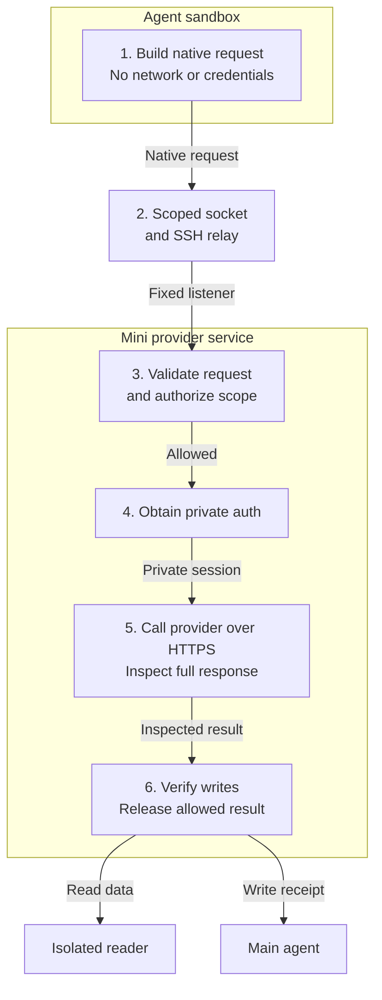
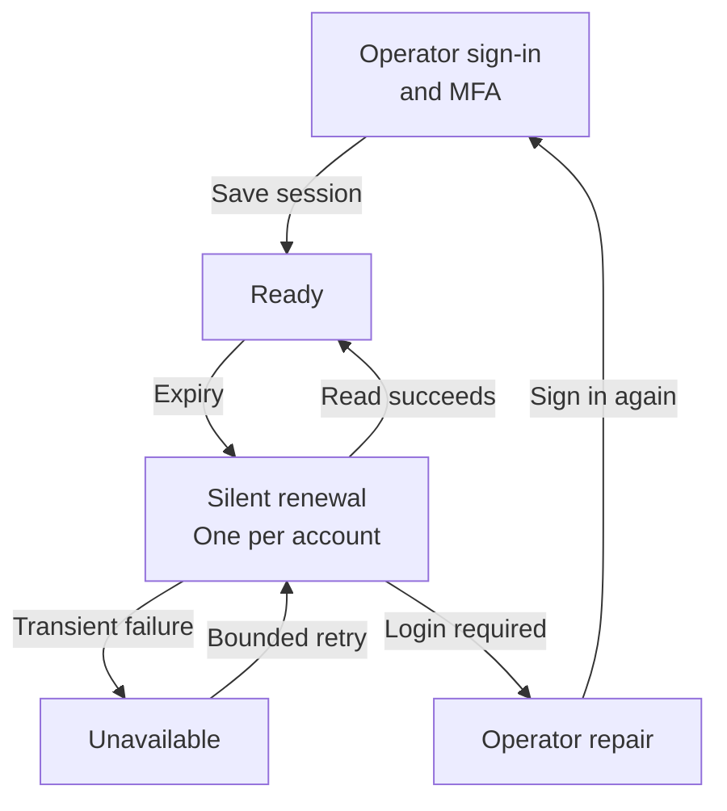

# Plan 031: CLI gateway for Rocket Money and weather

**Status:** Design recorded; implementation deferred
**Issue:** None
**Last updated:** 2026-09-26

## Human section

### Design

Give Puddles useful financial and weather access while keeping credentials and network execution outside its agent sandboxes. Build two CLIs and skills in the Puddles repo, backed by a native provider service on the Mini. Preserve each provider's native API and add new integrations through provider modules, without forks.

#### 1. CLI builds a native request

| Capability | V1 behavior |
|---|---|
| Rocket Money reads | Transaction details, search/filtering, batches, pagination, and broader financial exploration within the free account's access. |
| Rocket Money updates | Change an existing transaction's category or date by explicit ID. Category propagation is disabled. |
| Weather | Resolve locations; read current conditions and hourly/daily forecasts with units, time zones, and freshness. |
| Further providers | Add a provider module, credential setup when needed, CLI/skill, and contract tests. |

Rocket Money requests keep native GraphQL documents, variables, field names, aliases, and response envelopes. Reads are flexible queries over reviewed fields, rather than a fixed menu of questions. Batch and pagination helpers report partial coverage. They do not introduce a new finance schema or imply atomic updates.

Changing a Venmo reimbursement's date is intended to align it with the right budget month. The effect on budget calculations still needs verification. Other financial writes, including remote flags, notes, amounts, splits, and rules, are excluded; existing metadata remains readable. Local review flags are deferred.

Weather is a full deliverable. The provider remains to be selected against coverage, terms, quotas, and authentication needs. Ambiguous locations and missing or stale data must be explicit. Historical weather and severe-weather alerts are outside the baseline.

#### 2. Scoped socket and SSH relay

The CLI sends HTTP over a Linux Unix socket mounted into its sandbox. A restricted Linux SSH relay connects it to a fixed macOS socket. The Mini initiates and supervises the SSH connection using a dedicated unattended key and pinned relay identity. This requires no private TLS certificates and no new inbound SSH listener on the Mini.

Use a separate relay/socket volume and host listener for each trust scope, initially owner-reader and owner-writer as needed. The listener determines authority; caller headers and command names do not. The sandbox has no direct Internet fallback, relay SSH access, or host credentials. A stopped bridge returns unavailable.

The relay is trusted transport: it can see business data and exercise its scope if compromised. Linux socket permissions, cross-scope isolation, and reconnect behavior still need proof on the Mini. A macOS socket is never bind-mounted directly into Linux.

#### 3. Validate and authorize

The provider service checks the complete request before executing it: caller scope, account, route, GraphQL fields and effective arguments, and resource limits. It permits exactly two Rocket Money mutation fields: transaction category and date. Category propagation must be explicitly false. Even query operations need review because some read-looking arguments can create state.

Use Starlette/Uvicorn for the local service and HTTPX for upstream requests. The application owns every stage through response release. This replaces Envoy's external-processing design, where a successful early processor close could skip further inspection. A missing validation result, exception, or cancellation never falls through to automatic forwarding.

The service applies the same checks when a process calls the socket directly. The CLI and skill provide an interface; they do not enforce the security boundary. There is no general URL fetch, shell, auth export, or administration route available to agents.

#### 4. Obtain private authentication

| Authentication type | Host-side storage and renewal |
|---|---|
| API key | macOS Keychain through Python keyring's explicit macOS backend; no plaintext fallback. |
| Standard OAuth | Keychain for tokens; Authlib handles supported refresh and persists rotations. |
| Rocket Money browser session | Playwright-managed Chromium under a dedicated macOS service identity; private persistent profile outside Git and agent mounts. |
| Keyless weather API | Same validated pipeline, with no upstream credential. |

The whole Chromium profile stays in private host files, not Keychain. The service coordinates browser cookies and HTTP cookie rotations as one account session. The model sees only safe auth status, never credentials, browser storage, or a debugger.

Initial setup uses a visible browser in the service account's GUI session. Normal maintenance should run headlessly with no scheduled manual login. Silent recovery was observed in the existing browser; managed Chromium renewal, cookie lifetime, and restart behavior remain unverified. FileVault unlock and service-account login after reboot are separate prerequisites. Provider revocation or mandatory MFA can still require operator repair.

#### 5. Execute HTTPS and inspect response

Only the shared executor sends provider requests, using fixed registered HTTPS destinations and normal certificate verification. It disables automatic redirects and ambient proxy settings, enforces request/decoded-response limits, and buffers the complete response for inspection before releasing any bytes.

Credentials and cookie rotations remain private. Operational logs contain only generated IDs, approved operation classes, status, duration, and safe error codes. Raw bodies, query strings, auth headers, and debug dumps are excluded. Active backend code, policy, and credentials live outside agent-writable paths. Independent host egress controls remain an implementation decision to prove.

#### 6. Verify writes and release allowed result

| Caller | Permitted result |
|---|---|
| Isolated reader | Inspected native financial or weather data, still treated as external content. |
| Main agent with write authority | Bounded receipt containing request ID, operation kind, outcome, and any explicitly permitted source IDs. |

Read access does not grant writes. A writer's private preflight and read-back calls do not expose a general read endpoint. Merchant names, notes, weather text, and raw provider errors stay out of main's receipts.

Before a write, assign a stable request ID, check expected state, and record intent in a private journal. After execution, read back the changed fields. A timeout, disconnect, failed inspection, or crash after dispatch may leave an unknown outcome. Reconcile it by request ID; never blindly repeat or roll back the mutation. Reusing an ID with changed content is rejected. Batches retain per-item outcomes and are not atomic.

#### Adding another provider

The shared service owns transport, execution order, credential custody, and result release. Each installed provider supplies native request validation, an auth driver, request construction, response inspection, and any write verification. Small fixed APIs can use protected definitions; complex browser and GraphQL behavior belongs in code.

Provider modules are trusted deployed code. Requests cannot install modules or select code paths. Prove extension with a test provider added without modifying the executor. All production CLIs, skills, service code, and deployment definitions stay in Puddles.

### Status

The design is recorded for later implementation. No gateway runtime is installed and no financial writes have been performed. The first milestone is a scoped socket bridge and executor tested with synthetic credentials. Weather can proceed while Rocket Money's unattended auth is being proven.

Open checks are Mini transport/permissions, headless renewal and reboot prerequisites, free-account coverage, the budget effect of date changes, weather provider selection, and host egress enforcement. These are implementation gates, not verified capabilities.

## Agent section

### State

This revision changes presentation and consolidates the existing design. Implementation remains deferred. The technical appendix preserves exact API contracts and source evidence. Plan 032 was removed from current main; this plan now carries its relevant CLI and reader-boundary constraints directly.

### Scope and acceptance criteria

- Deliver both working CLIs and skills with native provider semantics, bounded exploration, and explicit partial results.
- Permit only the two specified Rocket Money writes; verify the requested budget-date workflow and existing-category behavior against the free account.
- Prove host-only credentials, scoped caller/result separation, and unattended auth under the documented service-account prerequisites.
- Deliver weather location/current/hourly/daily queries and explicit units, freshness, ambiguity, and failure handling. No paid provider without agreement.
- Add a test provider using only its module and registration. No forks, generic forwarding, management UI, or system-wide interception.

### Architecture and decisions

The [technical appendix](031-cli-gateway/technical-appendix.md) supplies implementation detail in flow order:

- [Socket transport and caller scope](031-cli-gateway/technical-appendix.md#socket-transport-and-caller-scope): SSH settings, Linux mounts, listener identity, startup and recovery.
- [Executor contract and limits](031-cli-gateway/technical-appendix.md#executor-contract-and-limits): ordered stages, logging, deadlines, size and batch limits.
- [Authentication contract](031-cli-gateway/technical-appendix.md#authentication-contract): Keychain backend, profile custody, cookie rotation, silent-login route, and concurrency.
- [Rocket Money API contracts](031-cli-gateway/technical-appendix.md#rocket-money-api-contracts) and [local API/CLI contract](031-cli-gateway/technical-appendix.md#local-api-and-cli-contract): native GraphQL examples, exact write inputs, routes, request IDs, and errors.
- [Provider extension contract](031-cli-gateway/technical-appendix.md#provider-extension-contract) and [package layout](031-cli-gateway/technical-appendix.md#package-layout): module responsibilities and proposed source locations.

### Implementation

| Phase | Deliverable | Gate |
|---|---|---|
| 1. Transport | Scoped host listeners, restricted SSH relay, credential-free client | Mini socket permissions, caller separation, reconnects, no fallback. |
| 2. Executor | Shared lifecycle and fake provider | Denied requests never execute; failed inspection never releases data; limits and failure outcomes hold. |
| 3. Authentication | Keychain and private managed Chromium | Setup, cookie rotation, idle/expiry renewal, concurrency, restart, and reboot prerequisites. |
| 4. Integrations | Full weather and Rocket Money scope | Live reads, free-account coverage, and separately authorized reversible financial verification. |
| 5. Distribution | Both CLIs/skills, protected install, extension starter | Credential-free sandbox packages, operating/recovery docs, and extension without executor changes. |

### Validation

Existing research established the production GraphQL endpoint and source operations, inspected transaction/category/date UI controls, and observed browser silent recovery. It did not verify standalone/headless renewal or successful mutations. See [research evidence](031-cli-gateway/technical-appendix.md#research-evidence), [read catalog](031-cli-gateway/read-catalog.json), and [recorded probes](031-cli-gateway/research-evidence.json).

Implementation must cover the [runtime validation cases](031-cli-gateway/technical-appendix.md#runtime-validation-cases), including malformed GraphQL, propagation, auth failure, response leakage, replay conflicts, uncertain writes, and cross-scope access. Use synthetic credentials and recording adapters for automated writes. This document revision requires only direct consistency/link review and applicable existing documentation checks.

### Rollout and rollback

No runtime rollout is part of this task. Future implementation follows the repository's current [development workflow](../../.github/skills/safe-feature-development/SKILL.md) and [deployment coordination](../../packages/e2e/DEPLOYMENT_COORDINATION.md). Prove transport and executor behavior before adding live credentials. Revoke access through grants, mounts, and connection closure. Financial recovery uses read-back and recorded intent, not automatic replay or rollback.

### Review log

The [Envoy review](031-cli-gateway/envoy-security-review.md), [architecture decision](031-cli-gateway/security-resolution.md), and [alternatives](031-cli-gateway/technical-appendix.md#alternatives-and-source-references) retain the rationale for provider-owned execution. They are design evidence, not certification of an implemented service. The current revision reorganizes the design around flow and stage responsibilities; auth and update scope are unchanged.

### Checklist

- [x] Record the chosen provider-service architecture, both integrations, and narrow write scope.
- [x] Present the flow, auth lifecycle, result audiences, and remaining unknowns together.
- [x] Preserve exact contracts and security research in the appendix.
- [ ] Prove scoped transport and the fake executor before live credentials.
- [ ] Verify service-account custody, silent renewal, rotation, and restart/reboot behavior.
- [ ] Deliver and verify Rocket Money reads, category/date writes, and the budget-date workflow.
- [ ] Select and verify the weather provider; deliver both CLIs and skills.
- [ ] Prove denial, leakage, replay, and recovery behavior, including raw socket callers.
- [ ] Deliver protected installation, extension starter, and operator recovery instructions.
