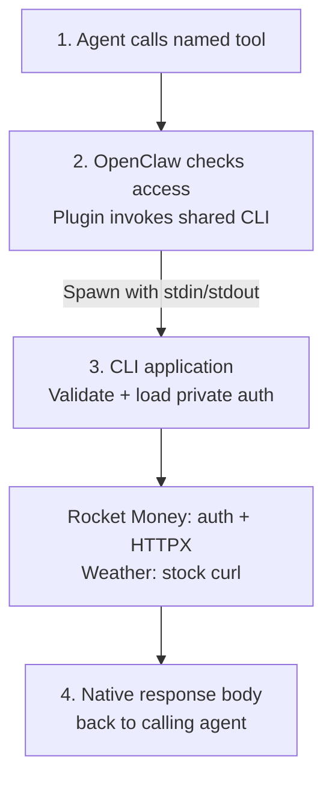
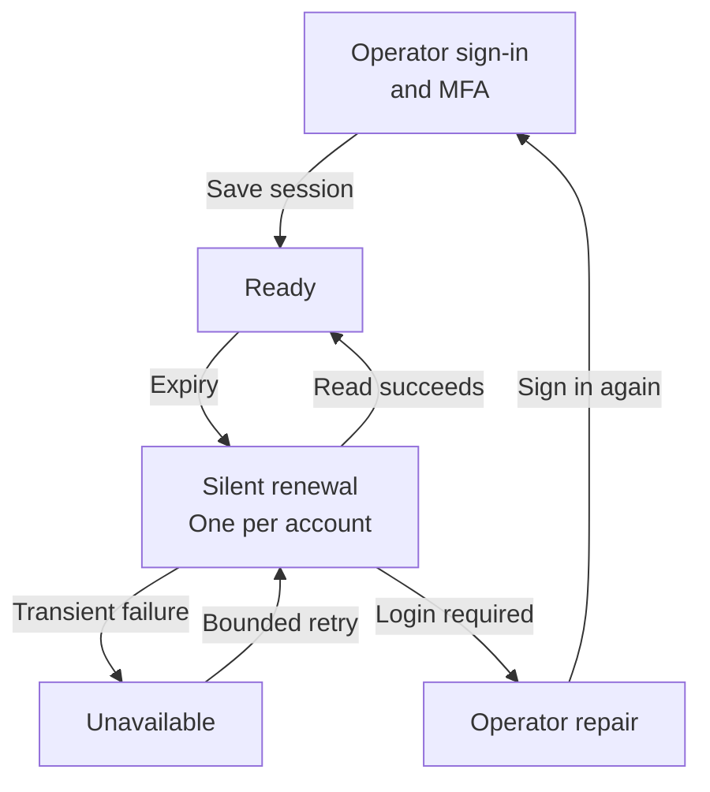

# Plan 031: CLI gateway for Rocket Money and weather

**Status:** Implementation approved; PR preparation in progress; merge blocked by requester
**Issue:** [#135](https://github.com/coletaylor788/puddles/issues/135)
**Last updated:** 2026-09-26

## Human section

### Design

Give Puddles Rocket Money and weather access through **CLI-backed OpenClaw tools**, following Apple PIM's shared installation model. Install the clients once on the Mini. Per-agent tool permissions control access; sandbox images stay unchanged. The host CLI application owns credentials, endpoint policy, and HTTP execution. All new code and skills stay in Puddles, with no upstream forks.

#### 1. Tools and native requests

| Proposed tool | V1 capability |
|---|---|
| `rocket_money_read` | Native GraphQL reads: transaction details, filters, batches, pagination, and broader financial exploration within the free account's access. Also safe auth/operation status. |
| `rocket_money_write` | Native GraphQL changes to an existing transaction's category or date by explicit ID. Category propagation must be false. |
| `weather_curl` | Stock curl requests to `https://wttr.in/` and the installed skill's `https://wttr.is/` fallback, using native curl arguments. |

Rocket Money keeps GraphQL documents, variables, field names, aliases, and response envelopes. The tool boundary separates permissions without inventing a financial schema. Batch and pagination helpers report partial coverage. Other financial writes, including remote flags, notes, amounts, splits, and rules, remain excluded. Existing metadata is readable; local review flags are deferred.

Changing a Venmo reimbursement's date is intended to align it with the right budget month. The effect on budget calculations still needs verification.

Weather keeps curl's URLs, query parameters, headers, methods, request bodies, and response formats. The skill teaches use of `weather_curl` with those arguments. Since curl runs on the host, its runner restricts host file/config access and connection overrides. Workspace file input/output goes through an explicit workspace transfer, never an arbitrary host path. The appendix defines that boundary. Weather needs no API key or separate forecast schema.

#### 2. Shared installation and per-agent permissions

Apple PIM registers named tools whose handlers spawn installed CLIs. Use that pattern: one Puddles plugin registers the three tools, and trusted deployment installs their executable dependencies once. Agents do not need CLI packages, special images, or gateway sockets in their containers.

OpenClaw's tool policy decides which tools each agent can call. A tool factory captures the runtime's trusted agent identity; protected configuration supplies its account and grants. The wrapper checks the grant again on execution. Agent arguments and writable skills cannot select an identity, account, binary, or permission profile.

Configure the new tools exactly as follows. These are planned assignments; this design change does not alter the running agents.

| Agent | Tools | Skills |
|---|---|---|
| `main` | `rocket_money_read`, `rocket_money_write`, `weather_curl` | Rocket Money and weather |
| `household` | `weather_curl` | Weather |
| Every other agent | None of these tools | No new integration skills |

Skills explain usage; they do not grant access. Main receives raw financial responses directly. Household receives neither finance tools nor main's finance rules.

The existing OpenClaw tool channel carries calls out of sandboxed agents. The plugin directly launches the shared CLI through a fixed executable and argument array, passes the request on stdin, and collects stdout and exit status. That CLI is the application that validates and executes the request. No separate service, socket, HTTP listener, or relay is needed. Tool invocation is the only supported agent access path. Agent command execution stays in network-disabled sandboxes, with no host credentials, Docker socket, or host-execution escape. Copying or recreating a CLI inside the sandbox therefore grants no access. General host execution would break this guarantee and must be denied for these agents.

#### 3. Host request policy and execution

| Route | What executes |
|---|---|
| Weather | A fixed stock curl binary after destination and argument validation. Allow the two weather HTTPS origins only, with verified TLS and bounded transfers. |
| Rocket Money | HTTPX sends accepted native GraphQL after validation and private authentication. Allow reviewed reads and exactly the two approved mutations. |

The plugin supplies trusted caller identity and tool scope when launching the CLI. The CLI checks protected grants and the complete request before using credentials or making a network call. It runs under the trusted OpenClaw host account; that account and its installed plugins remain trusted. Credentials stay in its Keychain and private host files outside agent mounts. This removes the separate credential-service identity as well as the server plumbing.

For Rocket Money, validate effective GraphQL fields, variables, aliases, fragments, and arguments; even read-looking queries can create state. Weather validates every destination and curl option, including options that could change a target or read local files. Validation failure never falls through to forwarding or arbitrary command execution.

#### Rocket Money authentication

| Credential type | Host-side custody and renewal |
|---|---|
| API keys for future managed adapters | macOS Keychain through Python keyring's explicit macOS backend. No plaintext fallback. |
| Standard OAuth | Keychain for tokens; Authlib performs supported refresh and persists rotations. |
| Rocket Money browser session | Playwright-managed Chromium under the trusted host account. Its private profile lives outside Git and agent mounts. |

The Chromium profile stays in private host files; Keychain holds API keys and OAuth tokens. Each CLI invocation can exit after its request because auth state persists separately. A per-account lock coordinates renewal, cookie updates, and writes across CLI processes. The model never receives credentials, browser storage, or debugger access.

Initial setup uses a visible browser in the host account's GUI session. Normal maintenance should be headless, with no scheduled manual login. Silent recovery was observed in the existing browser; managed Chromium renewal and cookie lifetime remain unverified. FileVault unlock and host-account login after reboot are separate prerequisites. Revocation or mandatory MFA can still require operator repair.

#### 4. Return the native response

The response goes back through the CLI and tool to the same calling agent. The CLI does not dispatch agents, summarize results, or convert financial responses into special main-agent receipts.

**Weather:** return curl's native response body and separate exit status. Binary output becomes a tool artifact. Do not add response headers or a weather schema; explicit public-header requests can retain curl's native behavior. Apply transfer limits without semantic content inspection.

**Rocket Money:** return the native GraphQL response. Keep upstream auth and cookie headers private, process cookie rotation inside the session manager, and bound response size. Do not add a general semantic filter or injection scanner here. Native provider errors remain provider errors; local failures use separate CLI diagnostics and exit status. Request validation excludes credential-exporting fields before they can be queried.

For the two financial updates, the adapter additionally records intent under a stable request ID and reads back the changed fields. If execution times out, the result may be unknown. Check status before repeating the operation; do not blindly replay it. Verification status is separate from the native GraphQL result. Batches report each outcome independently.

Active code, configuration, keys, and browser state remain outside agent-writable paths. Routine logs exclude bodies, query strings, cookies, auth headers, and debug dumps. External-content handling belongs to Puddles' existing agent workflow.

#### Rocket Money guidance and triage

Follow Apple PIM's guidance pattern: descriptive tool schemas, a bundled skill with examples, and tool-accessible help/schema discovery. The Rocket Money skill belongs to `main`. It explains native GraphQL queries, filters, pagination/batches, the two updates, CLI syntax, and how tools invoke that CLI. Agents always use the authorized tools; CLI examples do not grant shell access to the host.

The skill must read **`memory/finance/rocket-money-rules.md` in main's workspace** at the start of each triage. Cole can edit that file over time. It holds categorization rules and confirmed clarifications, separate from code and tool permissions. Installation seeds missing rules once and never overwrites later edits.

Triage reviews transactions, their merchant identities, and existing categories; applies only an explicit matching rule; verifies each update; and reports changes, unresolved items, and incomplete query coverage. **Never infer a recategorization.** Missing, conflicting, or ambiguous rules mean leave the item unchanged, ask Cole, and record the confirmed decision with its intended scope so later triage can handle it autonomously.

**Date changes:** only change a date when the transaction title clearly states that the transaction is for a different calendar month than its current transaction date. Move it to the **first day of the stated month**. Do not infer this from merchant, amount, recurring patterns, or budget convenience. Ambiguous month/year means ask Cole. If it already falls in the stated month, leave its date unchanged.

Seed categorization rules:

| Merchant | Purchase amount (USD) | Action |
|---|---|---|
| Costco or Walmart | Up to and including $200 | Use the existing Groceries category. |
| Costco or Walmart | Over $200 | Leave the category unchanged pending Cole's manual verification. |

Use the verified purchase amount and currency, not an assumed API sign convention. Unclear merchant matches, refunds, or non-USD amounts need clarification. Detailed skill sections, examples, and rules-file maintenance are in the [appendix](031-cli-gateway/technical-appendix.md#rocket-money-skill-and-triage-rules).

#### Adding another integration

Add a named tool, CLI/skill, and provider registration. The provider supplies either a constrained native CLI runner or a managed HTTP adapter, along with its request policy and optional auth driver. A shared library supplies credential handling, process-safe state, and execution limits to each CLI. Assign its tool to agents through the same permission mechanism.

Registration and adapters are trusted operator-installed configuration/code. Agent requests cannot install them or change their permissions. Prove extension with a test provider added without modifying the shared execution framework.

### Status

The plugin, host CLIs, auth helpers, request policies, configuration generator, and skills are implemented on the feature branch. Local tests use synthetic credentials and include actual plugin-to-CLI execution. Independent security review found installation boundary issues; fixes and regression tests are included.

The PR remains blocked from merge by Cole's instruction. After the OpenClaw upgrade, rebase and verify installed tool isolation, managed-browser silent renewal, and the free-account transaction/budget behavior. Nothing is installed on the Mini and no real financial writes have been performed.

Remaining checks are the new plugin's permission enforcement, safe native curl execution, unattended Rocket Money auth, free-account coverage, and budget behavior after date changes. The sections below are the implementation reference, not more request-flow stages.

## Agent section

### State

The current revision uses Apple PIM-style CLI-backed tools and per-agent tool grants. It removes a separate service/socket, per-agent image distribution, sandbox SSH relays, special main-agent receipts, generic response inspection, and the proposed weather API wrapper. Main receives all three tools; household receives weather only. The Rocket Money skill and editable main-memory triage rules are specified below. Implementation is underway against this branch's OpenClaw baseline. Do not merge, enable auto-merge, or deploy to production. Rebase and revalidate after the concurrent upgrade, then obtain Cole's approval before merging. The original Envoy review remains historical evidence.

### Scope and acceptance criteria

- Deliver `rmoney` and the main-only skill with native GraphQL, broad reviewed reads, and exactly category/date updates. Include tool-accessible help and reviewed native-operation references.
- Grant all three tools to `main`, weather only to `household`, and none to other agents.
- Deliver the explicit title-month date rule and rules-driven triage flow. Seed Costco/Walmart thresholds in main memory without overwriting user edits; ask Cole about unresolved items and preserve confirmed decisions.
- Reuse the installed weather skill with stock curl and its native URLs/formats. No weather wrapper schema or new provider selection.
- Install shared host clients once; register named tools with per-agent grants and protected account bindings. No per-agent images or direct sandbox gateway access.
- Keep Rocket Money credentials host-only. Weather uses no injected auth or TLS interception.
- Deny unregistered destinations, host file/config escapes, and bypasses of tool or GraphQL policy. Preserve native responses and explicit partial/uncertain outcomes.
- Add a test provider through protected registration without forks or shared-execution changes.

### Architecture and decisions

The [technical appendix](031-cli-gateway/technical-appendix.md) holds exact contracts:

- [Tool dispatch and process lifecycle](031-cli-gateway/technical-appendix.md#tool-dispatch-and-process-lifecycle) and [installation/access](031-cli-gateway/technical-appendix.md#agent-installation-and-access): shared clients, trusted caller context, and per-agent grants.
- [Weather curl contract](031-cli-gateway/technical-appendix.md#weather-curl-contract): installed-skill evidence, native curl arguments, file boundaries, and transfer limits.
- [Managed executor and limits](031-cli-gateway/technical-appendix.md#managed-executor-and-limits) and [authentication](031-cli-gateway/technical-appendix.md#authentication-contract).
- [Rocket Money API contracts](031-cli-gateway/technical-appendix.md#rocket-money-api-contracts) and [CLI contract](031-cli-gateway/technical-appendix.md#cli-contract).
- [Skill and triage rules](031-cli-gateway/technical-appendix.md#rocket-money-skill-and-triage-rules): usage discovery, editable memory, date conditions, and seed rules.
- [Extension contract](031-cli-gateway/technical-appendix.md#provider-extension-contract) and [package layout](031-cli-gateway/technical-appendix.md#package-layout).

### Implementation

Source and usage: [host package](../../packages/cli-gateway/README.md), [plugin](../../openclaw-plugins/cli-gateway/README.md), [setup](../../scripts/mac-mini/cli-gateway/README.md), [Rocket Money skill](../../clis/rocket-money/skills/rocket-money/SKILL.md). Shared entry points use one stdin contract rather than the appendix's earlier proposed subcommands. Native GraphQL remains unchanged. Source-backed `node(id: $id)` reads verify writes; no atomic provider compare-and-set is proven. Journal directories stop accepting new IDs at 10,000 entries and do not automatically expire duplicate protection.

| Phase | Deliverable | Gate |
|---|---|---|
| 1. Tool integration | Shared plugin/CLIs, stdin/stdout invocation, fake adapters | Per-agent allow/deny, missing identity denied, no direct sandbox bypass, no image changes. |
| 2. Weather and executor | Native curl runner plus managed API lifecycle | Allowed curl requests and workspace artifacts; file/target escapes denied; GraphQL rejection before execution; body-only results. |
| 3. Authentication | Keychain and private managed Chromium | Setup, cookie rotation, idle/expiry renewal, cross-process locks, restart and reboot prerequisites. |
| 4. Rocket Money | Reviewed reads and the two constrained updates | Free-account coverage and separately authorized reversible budget/category verification. |
| 5. Distribution | Protected host install, skills, extension starter | Main/household grants, skill/help discovery, persistent user rules, triage scenarios, recovery docs, extension without dispatch changes. |

### Validation

Recorded research established Rocket Money's source contracts and browser silent recovery, not standalone/headless renewal or successful mutations. See [evidence](031-cli-gateway/technical-appendix.md#research-evidence), [read catalog](031-cli-gateway/read-catalog.json), and [recorded probes](031-cli-gateway/research-evidence.json). Apple PIM source and weather evidence are in the appendix.

Local validation: 86 Python tests pass (policy, curl escapes, account locks, write replay/uncertainty, browser driver, OAuth rotation, config boundaries, race-safe skills, and a real extension CLI process). Nine plugin tests pass, including real Python subprocess execution. A credential-free live request through the weather CLI to wttr.in returns the native London forecast with curl exit 0. Python lint and the full workspace build/typecheck pass. The broader suite initially hit sandbox restrictions. Its host rerun passes 680 tests with two fixture timeouts; both affected files pass separately (36 tests). This is not a clean single-run cumulative gate. Authlib emits one upstream deprecation warning for its supported httpx compatibility path.

The cumulative command is `node packages/e2e/bin/openclaw-test-env.mjs ci`; CI installs and runs the Python package as part of that pool. The local cumulative attempt stops because its pinned OpenClaw commit is absent from the local upstream checkout (git exit 128). GitHub cumulative CI is running for PR #131. CI and post-upgrade installed-runtime checks remain outstanding. The [runtime cases](031-cli-gateway/technical-appendix.md#runtime-validation-cases) remain acceptance criteria; mocked auth does not establish unattended host renewal or free-account writes.

### Rollout and rollback

The current authorization stops at a ready PR. No merge or production rollout is permitted without fresh approval after the upgrade and rebase. Implementation follows the [development workflow](../../.github/skills/safe-feature-development/SKILL.md) and [deployment coordination](../../packages/e2e/DEPLOYMENT_COORDINATION.md). Prove tool permissions and request policy before adding live credentials. Revoke an agent's grant in protected configuration and reject subsequent dispatches, including from existing sessions. Already-dispatched writes may still finish. Financial recovery uses recorded intent and read-back, not automatic replay or rollback.

### Review log

Independent implementation review identified exposed host mounts/code, unsafe in-place skill copying, and an extension test that bypassed CLI parsing. Remediation protects active code/auth paths, anchors staged skill installation to no-follow directory descriptors, and loads trusted installed entry points through the actual CLI parser. Synthetic regressions cover each finding. Final retained review independently reran all 86 Python tests and found no remaining concrete material defects. See [implementation review](031-cli-gateway/implementation-review.md). Host acceptance remains deferred until the upgrade.

The [Envoy review](031-cli-gateway/envoy-security-review.md), [decision record](031-cli-gateway/security-resolution.md), and [alternatives](031-cli-gateway/technical-appendix.md#alternatives-and-source-references) retain the prior investigation. The current design follows the requester's Apple PIM tool model: shared installation, per-agent grants, native GraphQL/curl, and body-only returns. Credential custody and the two financial write limits remain.

### Checklist

- [x] Record shared CLI-backed tools, per-agent permissions, native responses, and narrow financial updates.
- [x] Inspect the Mini's Apple PIM tool registration/runner and installed weather URLs.
- [x] Preserve exact Rocket Money contracts and historical research.
- [x] Test tool allow/deny, trusted identity, direct subprocess execution, and revocation.
- [ ] Verify installed OpenClaw sandbox isolation after the upgrade.
- [x] Verify native weather requests, file/target policy, bounded output, and one live public request.
- [ ] Verify host credential custody, silent renewal, rotation, and restart/reboot behavior.
- [x] Implement native reads and constrained category/date writes with synthetic before/after verification.
- [ ] Verify real free-account reads/writes and the budget-date workflow.
- [x] Test denial, session isolation, native returns, persistent replay protection, and uncertain-write status.
- [x] Deliver main/household config, skill/help discovery, editable triage rules, and confirmation guidance.
- [ ] Exercise the installed skill triage scenarios after the upgrade.
- [x] Deliver guarded config/skill preparation, a tested extension entry point, and operator recovery instructions.
- [ ] Complete cumulative CI and release/host acceptance before requesting merge approval.
