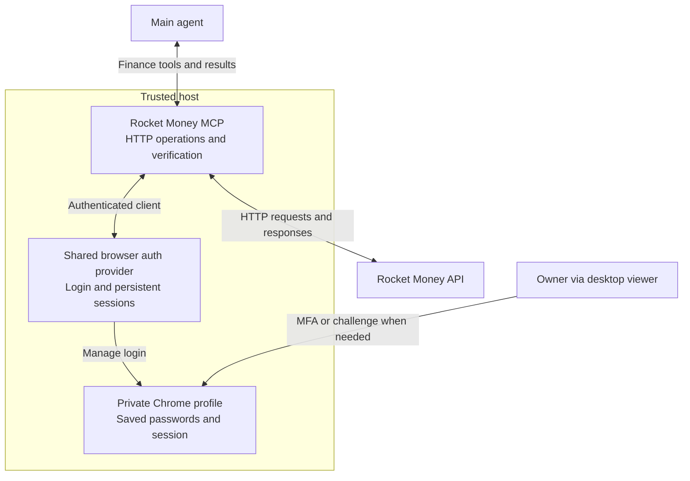

# Plan 031: Rocket Money MCP and shared browser authentication

**Status:** Implemented; independent review and release validation in progress
**Issue:** [#135](https://github.com/coletaylor788/puddles/issues/135)
**Last updated:** 2026-10-07

## Human section

### Design

#### Goal

Give main scoped Rocket Money tools. Keep login and sessions in a shared browser auth provider on the trusted host. Keep the Rocket Money MCP server focused on HTTP operations.

#### System overview

#### Component ownership

| Component | Owns |
|---|---|
| Main | Request interpretation, private finance rules and authorization. |
| Rocket Money MCP | Tool contracts, Rocket Money HTTP requests, operation limits and result verification. |
| Shared browser auth | Saved-login access, site login configuration, private profiles, session reuse and renewal. |
| Desktop viewer | Owner-assisted login in the auth provider's browser. |

The shared provider can serve other host integrations. Rocket Money remains a small custom MCP server using standard HTTP and MCP libraries.

#### Request flow

1. **Request:** Main calls a scoped tool; MCP validates its inputs and allowed operation.
2. **Authenticate:** MCP obtains a host-only authenticated client from the shared provider.
3. **Execute:** MCP performs any transaction preflight and calls the Rocket Money API.
4. **Return:** MCP verifies the result and returns financial data or a bounded status.

#### Login and session reuse

| Session state | Provider behavior |
|---|---|
| Ready | Reuse the session across calls and conversation turns. |
| Expired | Attempt bounded renewal or login using the host browser's saved login. |
| Needs interaction | Return `needs_user_login`; the owner completes MFA or a challenge through the desktop viewer. |

The provider owns browser-to-HTTP session synchronization. Start with Chrome's password manager in the private host profile; an external password manager is optional. Unattended autofill and login remain validation items. Authentication is an internal host dependency, not a model-facing tool.

#### Access boundary

| Stays on the trusted host | Available to the model |
|---|---|
| Passwords, cookies, tokens, browser profiles and authenticated HTTP client | Scoped finance tools, financial results, coverage and operation status |

Normal model tools and test sandboxes cannot access the private browser, its debugger or session files. Main's financial rules stay in private runtime skill and memory.

#### MCP tool contract

All parameters are required unless marked `?`. IDs and dates are strings; dates use `YYYY-MM-DD`. Each write uses a stable UUID `requestId`.

| Tool | Parameters | Returns |
|---|---|---|
| `rocket_money_status` | None | Last observed login state and recovery guidance. Does not initiate login. |
| `rocket_money_read` | `query`, `variables?` (JSON object), `operationName?` | Native financial data, page information and any query errors. Read-only; one page/request at a time. |
| `rocket_money_set_category` | `requestId`, `transactionId`, `expectedCategoryId`, `categoryId` | Write outcome and observed category. |
| `rocket_money_set_date` | `requestId`, `transactionId`, `expectedDate`, `date` | Write outcome and observed date. |
| `rocket_money_operation_status` | `requestId` | Outcome of an earlier write, checked through its record and a read-back if needed. Never repeats the write. |

**Write outcomes:** `verified`, `unchanged`, `conflict`, `blocked` or `unknown`. Expected values must match before an edit. Reusing a request ID never repeats the mutation; different arguments under that ID are rejected.

**Operation status** answers “Did that edit take effect?” after a timeout or lost response. It can also report `in_progress` or `not_found`; neither permits a blind retry. Login status is separate: it answers whether the account session is ready.

Calls use a host-configured account. Credentials, URLs and headers are never parameters. Invalid or unsupported requests return a bounded error. Read queries must match the reviewed catalog; `operationName` is required for a document with multiple operations.

#### Financial safeguards

MCP controls API destinations and accepts only reviewed read queries. Writes check identity and expected current values, then read back the result. Category changes never propagate to other transactions. Stable request IDs and a small outcome journal support recovery without blindly repeating a write.

#### Deployment and scope

Both components run on the trusted host. Prefer a shared auth library in the host process, or an existing supported host service. Reuse does not require a new daemon.

Other financial writes, scheduled automation and a general integration framework remain outside this design. The [future-scope appendix](031-rocket-money-deferred.md) retains follow-on work. Approval to ship activates the required synthetic regressions and release checks.

### Status

The host auth package, five MCP tools and main-only adapter are implemented in [PR #233](https://github.com/coletaylor788/puddles/pull/233). Focused synthetic checks and the packaged MCP startup check pass. The owner approved publication and independent review; review and required repository CI are running. Cumulative CI and environment promotion follow source integration. Production is unchanged.

## Agent section

### State

- Canonical repository design; supersedes the earlier combined gateway and browser-worker proposals.
- The retained host client on `codex/cli-gateway-design-flow` is reuse material, not proof that either component exists in the required form.
- Main's skill and owner-specific finance rules remain private runtime content, managed outside the repository.

### Scope and acceptance criteria

- Main-only financial exploration and the two permitted transaction edits.
- Shared auth owns login and persistent sessions; Rocket Money MCP owns API operations.
- Credential/session material is inaccessible to normal model tools and test sandboxes. Authorized host administration/debug remains trusted.
- Preserve existing private rules, including clarification for ambiguous or unauthorized changes and title-based date corrections. Do not publish account-specific rules.
- Report incomplete coverage and uncertain outcomes explicitly. Do not replay an uncertain mutation after repairing login.
- Other financial writes, scheduling and a general integration framework are outside scope.

### Architecture and decisions

- Use a standard HTTP client and MCP library. Keep Rocket Money-specific logic limited to API contracts, validation and result verification.
- Prefer the runtime's supported MCP binding and local stdio. Confirm compatibility before choosing an adapter.
- Reuse a supported browser authentication implementation where practical. Select that implementation during design validation; this proposal does not claim an existing provider already satisfies the contract.
- The [tool table above](#mcp-tool-contract) defines the model-facing contract. Query catalog contents and live provider field compatibility still require validation.
- Authenticated clients are host-only and bound to configured accounts and approved destinations. The model cannot select arbitrary credentials, URLs or authentication headers.
- The auth provider owns browser-to-HTTP session synchronization. Login automation and refresh behavior must be validated for Rocket Money; do not assume an OAuth refresh flow exists.
- Provider responses and diagnostics must exclude authentication material. Financial source text remains untrusted input.

### Implementation

1. Select the shared browser auth implementation and define its host-only client/session contract.
2. Adapt reusable Rocket Money request logic behind the MCP tools.
3. Connect the owner viewer to the auth provider and update main's private skill to use the MCP tools.

### Validation

Implementation approval activates the applicable checks recorded in the [validation appendix](031-rocket-money-deferred.md). Focused tests use synthetic transactions and credentials. Installed authentication, sandbox isolation and release evidence remain required before activation.

### Rollout and rollback

After implementation validation, enable reads first and then the two permitted writes. Disable the tools if authentication isolation or result verification fails. Do not fall back to sharing the authenticated browser with an agent.

### Review log

- 2026-10-06: Selected trusted-host execution with model-visible tools only.
- 2026-10-07: Recorded the proposal in repository docs; separated shared browser authentication from the Rocket Money-specific MCP client. Organized the review surface around the diagram, component ownership, request flow and boundaries. Consolidated concise MCP contracts into the main design; made an external password manager optional.

### Checklist

- [x] Define the shared auth and Rocket Money responsibilities.
- [x] Preserve credential isolation, private rules and verified writes.
- [x] Keep testing in the deferred appendix.
- [ ] Select the auth implementation and validate the integration.
- [ ] Complete the approved implementation, validation and activation; provide owner login instructions.
