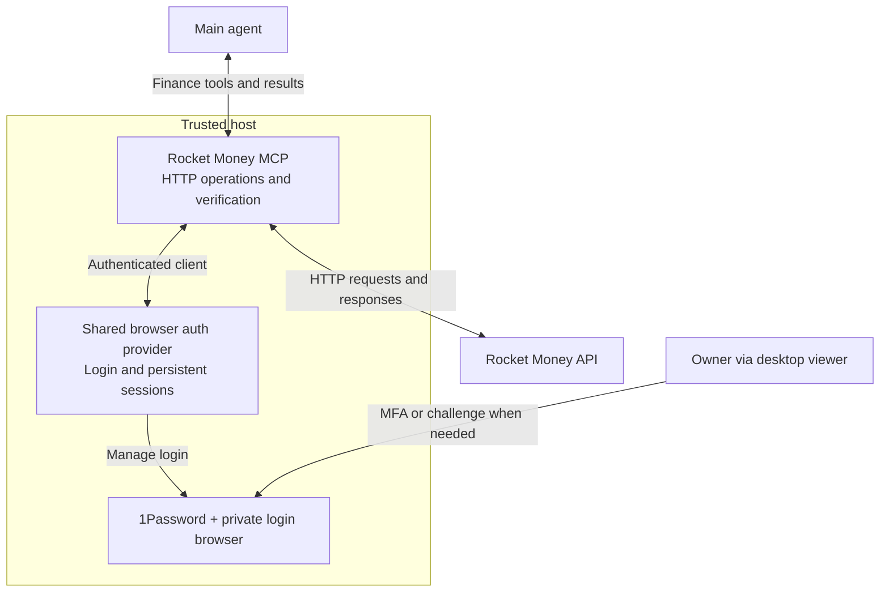

# Plan 031: Rocket Money MCP and shared browser authentication

**Status:** Design proposal; implementation pending
**Issue:** [#135](https://github.com/coletaylor788/puddles/issues/135)
**Last updated:** 2026-10-07

## Human section

### Design

#### Goal

Give main scoped Rocket Money tools. Keep login and sessions in a shared browser auth provider on the trusted host. Keep the Rocket Money MCP server focused on HTTP operations.

#### System overview

#### Component ownership

| Component | Owns |
|---|---|
| Main | Request interpretation, private finance rules and authorization. |
| Rocket Money MCP | Tool contracts, Rocket Money HTTP requests, operation limits and result verification. |
| Shared browser auth | Password-manager access, site login configuration, private profiles, session reuse and renewal. |
| Desktop viewer | Owner-assisted login in the auth provider's browser. |

The shared provider can serve other host integrations. Rocket Money remains a small custom MCP server using standard HTTP and MCP libraries.

#### Request flow

1. **Request:** Main calls a scoped finance tool.
2. **Authenticate:** MCP obtains a host-only authenticated client from the shared provider.
3. **Execute:** MCP validates the operation and calls the Rocket Money API.
4. **Return:** MCP verifies the result and returns financial data or a bounded status.

#### Login and session reuse

| Session state | Provider behavior |
|---|---|
| Ready | Reuse the session across calls and conversation turns. |
| Expired | Attempt bounded renewal or login using host-only 1Password access. |
| Needs interaction | Return `needs_user_login`; the owner completes MFA or a challenge through the desktop viewer. |

The provider owns browser-to-HTTP session synchronization. Authentication is an internal host dependency, not a model-facing tool.

#### Access boundary

| Stays on the trusted host | Available to the model |
|---|---|
| Passwords, cookies, tokens, browser profiles and authenticated HTTP client | Scoped finance tools, financial results, coverage and operation status |

Normal model tools and test sandboxes cannot access the private browser, its debugger or session files. Main's financial rules stay in private runtime skill and memory.

#### Financial operations

| Operation | Scope |
|---|---|
| Read | Supported financial queries, transactions, categories, pagination and session status. |
| Write | An individual transaction's existing category or editable date. |
| Verify | Check identity and current values before writing; read back afterward. |
| Recover | Record uncertain outcomes and reconcile them before retrying. |

MCP controls API destinations and preserves supported native query semantics. Category changes do not propagate to other transactions. Stable request IDs and a small outcome journal support safe recovery.

#### Deployment and scope

Both components run on the trusted host. Prefer a shared auth library in the host process, or an existing supported host service. Reuse does not require a new daemon.

Other financial writes, scheduled automation and a general integration framework remain outside this design. Dedicated tests stay in the [deferred appendix](031-rocket-money-deferred.md).

### Status

Proposal only. The auth implementation, Rocket Money integration and runtime binding still need validation and implementation. Runtime behavior is unchanged.

## Agent section

### State

- Canonical repository design; supersedes the earlier combined gateway and browser-worker proposals.
- The retained host client on `codex/cli-gateway-design-flow` is reuse material, not proof that either component exists in the required form.
- Main's skill and owner-specific finance rules remain private runtime content, managed outside the repository.

### Scope and acceptance criteria

- Main-only financial exploration and the two permitted transaction edits.
- Shared auth owns login and persistent sessions; Rocket Money MCP owns API operations.
- Credential/session material is inaccessible to normal model tools and test sandboxes. Authorized host administration/debug remains trusted.
- Preserve existing private rules, including clarification for ambiguous or unauthorized changes and title-based date corrections. Do not publish account-specific rules.
- Report incomplete coverage and uncertain outcomes explicitly. Do not replay an uncertain mutation after repairing login.
- Other financial writes, scheduling and a general integration framework are outside scope.

### Architecture and decisions

- Use a standard HTTP client and MCP library. Keep Rocket Money-specific logic limited to API contracts, validation and result verification.
- Prefer the runtime's supported MCP binding and local stdio. Confirm compatibility before choosing an adapter.
- Reuse a supported browser authentication implementation where practical. Select that implementation during design validation; this proposal does not claim an existing provider already satisfies the contract.
- Authenticated clients are host-only and bound to configured accounts and approved destinations. The model cannot select arbitrary credentials, URLs or authentication headers.
- The auth provider owns browser-to-HTTP session synchronization. Login automation and refresh behavior must be validated for Rocket Money; do not assume an OAuth refresh flow exists.
- Provider responses and diagnostics must exclude authentication material. Financial source text remains untrusted input.

### Implementation

1. Select the shared browser auth implementation and define its host-only client/session contract.
2. Adapt reusable Rocket Money request logic behind the MCP tools.
3. Connect the owner viewer to the auth provider and update main's private skill to use the MCP tools.

### Validation

Review documentation and component ownership now. Tests, live capability checks and release validation are in the [deferred appendix](031-rocket-money-deferred.md). No runtime validation is claimed by this revision.

### Rollout and rollback

After implementation validation, enable reads first and then the two permitted writes. Disable the tools if authentication isolation or result verification fails. Do not fall back to sharing the authenticated browser with an agent.

### Review log

- 2026-10-06: Selected trusted-host execution with model-visible tools only.
- 2026-10-07: Recorded the proposal in repository docs; separated shared browser authentication from the Rocket Money-specific MCP client. Organized the review surface around the diagram, component ownership, request flow and boundaries.

### Checklist

- [x] Define the shared auth and Rocket Money responsibilities.
- [x] Preserve credential isolation, private rules and verified writes.
- [x] Keep testing in the deferred appendix.
- [ ] Select the auth implementation and validate the integration.
- [ ] Implement and activate under a subsequent approved implementation task.
