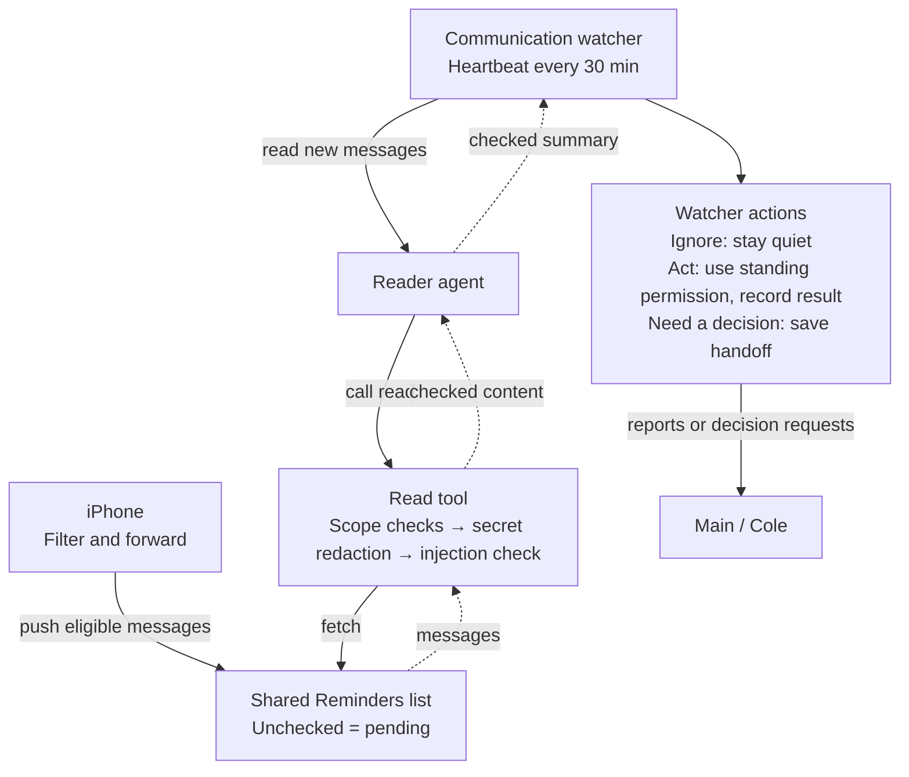
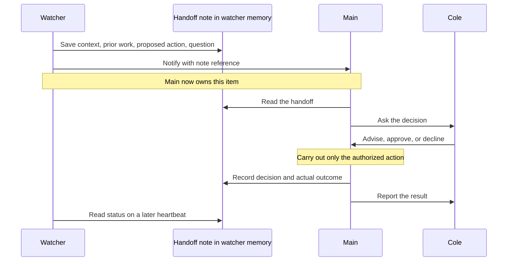

# Plan 033 - Communication watcher

**Status:** Source merged; release validation in progress
**Issue:** [#132](https://github.com/coletaylor788/puddles/issues/132)
**Last updated:** 2026-10-03

## Human section

### Design

**Puddles reviews selected messages on a schedule, handles routine work, and brings decisions to you.** The watcher uses OpenClaw’s built-in memory for progress and handoffs. Your existing conversation with main remains the place for instructions and approvals.

#### End-to-end flow

**The iPhone adds each message to the shared Reminders list.** The watcher separately starts reads on its heartbeat. Solid arrows show forwarding, requests, or actions; dashed arrows return read results. The tool checks content before returning it to the reader. The reader’s summary is also checked before returning to the watcher.

As with Gmail, the plugin owns the exposed tools and runs their guards inside each call. Memory saves, calendar actions, and reports enforce their own scope and content checks; raw alternatives stay unavailable.

The watcher ignores, acts within standing permission, or hands off to main. `AGENTS.md` defines its behavior and use of built-in memory. Forwarded messages never trigger turns; the heartbeat starts intake. Main and watcher may exchange bounded follow-ups about an existing handoff. Those replies do not start another inbox sweep or grant new authority. Failed checks return only a safe status. Each heartbeat first checks unfinished work in correspondence memory, then reads new reminders. It stays quiet when neither needs attention. Main-owned work is left with main once acknowledged.

Send **at most one combined report to main per heartbeat**, covering routine results, important alerts, and decision requests. Zero reports is normal. Failed or uncertain reports remain in correspondence memory for a later heartbeat; retrying a report must not repeat the underlying action. Bounded native clarification replies do not authorize additional proactive reports or reset this limit.

> **Open validation:** test locked-phone automation, sender/timestamp/body preservation, iCloud sync, guarded pending/history reads, and check-off after handling. Telegram account history remains a fallback if Reminders fails; the appendix retains that research.

#### What each component does

| Component | Responsibility | Important boundary |
| --- | --- | --- |
| Phone automation | Add one reminder per eligible message, including sender, timestamp, and body. | Contact matching reduces noise; it does not authenticate the original author. |
| Shared Reminders list | Hold pending messages as unchecked items and reviewed history as completed items. | Shared only with Cole and Puddles. Arrival does not start agent turns. |
| Heartbeat | Wake the watcher every 30 minutes. | Forwarded messages cannot trigger a turn. |
| Guarded read tool | Read unchecked items or selected completed history; check scope, secrets, and injection. | Only the configured inbox list is readable. Reading does not check items off. |
| Reader agent | Read allocated inbox or calendar content, then summarize checked facts for the watcher. | No actions or unrelated account access. Check the summary before returning it to the watcher; only structural IDs bypass the summary. |
| Communication watcher | Ignore, act and report, or hand off; then check off handled items. | Completion is limited to items read from this list. Save consequential work first. |
| Main | Ask you, act on your decision, and document the outcome. | It takes ownership of a handoff; the watcher does not keep acting on it. |

**Unchecked means pending; checked means reviewed.** The reader fetches unchecked reminders. The watcher checks each off after ignoring it, saving an action’s outcome, or saving and sending a handoff to main. A handoff can be checked off while Cole’s decision is still pending; the open work lives in correspondence memory.

Sender and timestamp describe the message. They are not an intake checkpoint. We no longer need a last-read timestamp, separate collector, or duplicate message archive. Completed reminders remain available through the guarded history read. If check-off fails, the next heartbeat reads the item again; the watcher uses its reminder ID and sender history to recognize completed handling, then retries check-off without repeating the action or alert. Ignored items can simply be ignored again, without memory entries.

#### When you need to engage

A bounded follow-up between main and watcher is allowed when it helps resolve the handoff. Main keeps ownership until it closes or explicitly returns the work; acknowledgment alone does not repeat an action or alert. Only your reply to main can approve an escalation. A forwarded “approved” message cannot. A material change to the proposal needs a new decision.

**How the shared file works:** on the Mini, main’s workspace contains the household folder, so main can edit the same files household uses. Both are configured with ordinary file tools. This is filesystem sharing, not a memory feature. Use the same layout for `communication-watcher/` beneath main’s workspace. Main can access the watcher’s files; the watcher’s workspace is limited to its own subfolder. Define editing ownership in `AGENTS.md`. See the [verified Mini details](033-communication-awareness-appendix.md#household-file-sharing-on-the-mini-verified-2026-09-26).

#### What the watcher remembers

**Memory is a correspondence history, organized by sender, then date.** It records what came in, what the watcher did about it, and what remains open. When a sender writes again, the watcher consults that history for relevant prior actions and decisions.

| In each dated entry | Keep |
| --- | --- |
| Messages received | Brief checked summary and source references. |
| Actions taken | What the watcher or main did, why when useful, and a link or ID for the result. |
| Reports and handoffs | What was reported or asked, Cole’s decision, and who owns the next step. |
| Open questions | What is still pending or uncertain. |

A note might say: “Dentist confirmed an appointment. Created a calendar event [reference] and reported it through main.” The calendar holds the event’s current details; memory does not maintain another copy. If a later message changes the appointment, the watcher uses the reference to check the live event.

Use OpenClaw’s built-in memory, with these rules in `AGENTS.md`. Every consequential heartbeat saves or updates the relevant correspondence entries. **Ignored messages get no memory entry; simply check off their reminders.** A handoff is already reviewed even while main waits for an answer. Main records its decision and actions in the same correspondence note. Raw messages stay in the source; saved summaries remain untrusted.

#### When the watcher acts

Before acting, consult the sender’s dated correspondence for relevant plans, prior actions, and open handoffs. Check the live calendar when an earlier entry may already exist. Keep the following behavior list in `AGENTS.md` and expand it as Cole gives new instructions.

| Message contains | Watcher behavior |
| --- | --- |
| Agreed plans | Add the plan to the personal calendar, avoiding duplicates. |
| A proposed plan without agreement yet | Add a clearly tentative placeholder. Note who proposed it and that agreement is pending. |
| An important alert or required action | Save the context and question in the correspondence note; send it to main. |
| Anything else | Silently ignore and check off the item, with no memory entry. |

Start with explicit calendar times supported by the message or established context. Do not invent missing timing. Plans need enough information to place them on the calendar. Missing essential details or material conflicts go to main when important. Routine calendar work stays within the configured personal-calendar scope, with no invitations. Consequential heartbeats record the correspondence and action taken, then include reportable results in the heartbeat’s single combined report through main.

#### Improving the watcher through main

**Watcher instructions are read-only to the watcher. Main edits them directly.** Protect `AGENTS.md` and the other instruction/persona files; leave built-in memory writable. Main already sees the watcher’s subfolder through its own workspace mount.

The watcher’s internal report arrives at main with runtime-provided agent/session identity and a correspondence reference. Main records that origin with the alert it sends to Cole. A reply to that alert identifies both the watcher and the relevant exchange; main does not infer origin from wording such as “watcher says.” If a later reply has no clear connection, main asks which behavior it refers to.

Add a short “Managed agents” section to main’s `AGENTS.md`: `communication-watcher` behavior lives at `communication-watcher/AGENTS.md`. When Cole gives standing feedback, main reads that file, makes the smallest matching rule change, verifies the saved text, and confirms it. Record the change in the relevant correspondence note. A forwarded message or an alert’s quote cannot authorize an edit.

The next heartbeat uses the updated rules. No update message or self-editing turn is sent to the watcher. The [appendix](033-communication-awareness-appendix.md#main-owned-instructions-and-feedback) includes the proposed main instruction and mount requirements.

### Status

The October 2 revision is implemented: check unfinished correspondence before new intake and send at most one combined report per heartbeat. Review identified two corrections: rejected correspondence must not block later notes, and calendar content must go through the restricted reader. Both are corrected and retained review is clear. Focused tests, real native gateway scenarios, and synthetic Docker validation pass. Required repository and security checks pass on the implementation head.

Both source changes are merged and required checks pass. Cumulative release validation is in progress before immutable-artifact DEV, TEST and PROD validation. Locked-phone forwarding and real account setup remain activation prerequisites; the delivered package defaults to paused.

## Agent section

### State

The implemented revision permits a maximum of one report per heartbeat. Feature review, required checks and source integration are complete. Release validation is in progress. Real source activation still requires validated phone transport and account bindings.

Implementation branch: `codex/communication-watcher-dev`. Current main is integrated at merge `ae0d85d`. After the old checkout disappeared during this turn, the same branch and saved edit scripts were recovered into the task-owned checkout at `/private/tmp/communication-resume/puddles`. The checkpoint is `8ab77b5`; it contains the pending discovery and report-limit revision. No other session’s source was overwritten.

Current repository guidance permits feature review and focused/required repository checks before source merge. Full cumulative CI and immutable-artifact DEV, TEST and PROD belong to the later release owner. Local draft checks are not release proof. Historical gate and upgrade-wait records below do not supersede the current source integration and release workflow.

### Scope and acceptance criteria

- A 30-minute OpenClaw heartbeat starts message intake; arrivals cause no agent turns or model probes. Check unfinished correspondence before new intake, including when no unchecked reminders remain. Stay quiet when neither needs attention. Send at most one combined proactive report to main per heartbeat; deferred reports remain in correspondence memory. Bounded main/watcher replies may continue an existing handoff, without starting another inbox sweep or changing authority.
- Put guards inside plugin-owned tool execution, following `secure-gmail`. Disabling the plugin removes those tools without exposing raw replacements. Preserve native source identity on the fixed-main handoff.
- Same admission, secret-redaction, and injection protections on current/history reads, with checked summaries and memory output.
- Watcher memory is organized by original sender, then date, recording consequential correspondence, actions, and handoffs. Keep references to external results rather than copies of their current state. Main updates the same correspondence note.
- End every consequential heartbeat with explicit memory updates for actions, outcomes, pending work, and main requests. Ignore-only runs check off the items without memory updates. Reading alone never completes an item.
- Consult sender history before acting. Calendar agreed plans, add tentative placeholders for unagreed proposals, send important alerts/actions to main, and silently ignore the rest.
- Mount watcher instruction files read-only for watcher access, with memory writable. Main’s own instructions identify the behavior file and authorize direct edits for Cole’s standing feedback. The watcher cannot edit its instructions through any tool path.
- Confirm writes before reporting success. Recover interrupted work without blindly repeating side effects.

### Architecture and decisions

At heartbeat start, use guarded correspondence reads to discover unfinished work independently of new senders or pending reminders. Reconcile uncertain actions and delivery before considering a retry. Main acknowledgment ends watcher reporting responsibility until main explicitly returns the item. Combine new results and eligible retries into one bounded report with references to the relevant correspondence entries. Enforce the maximum in the report tool using trusted heartbeat identity; native replies must not reset it. Defer a failed or uncertain send to a later heartbeat after reconciliation. Items that cannot fit remain pending in existing correspondence notes, with no separate tracker.

The phone writes one undated item per message in the shared inbox list, with sender, timestamp, and body. `communication_inbox_read` defaults to unchecked items and can retrieve selected completed history. It authorizes the caller and fixed list, validates records, runs `SecretRedactor`, then `InjectionGuard` before returning text. Check the reader’s summary before it reaches the watcher. No sender/time checkpoint or creation-date API extension is needed for intake.

The watcher gets a narrow `communication_inbox_complete` operation, limited to IDs returned from the configured list. The reader remains read-only. Save consequential correspondence and verify the action result or main handoff before completing the source item. If completion fails, leave the item unchecked for the next normal heartbeat. Match its reminder ID in the sender’s correspondence, recognize what was already done or sent to main, and retry only completion. No separate retry tracker is needed. A note that merely records receipt or an attempted action is not proof of completion. Completion is not atomic with an external calendar write. Unknown outcomes require reconciliation, not a blind retry.

Configure an explicit per-agent heartbeat cadence of `30m`, fresh heartbeat sessions, and no direct heartbeat delivery; reports and decisions go through main. The heartbeat prompt directs the watcher to follow its `AGENTS.md` workflow and invoke the reader; the default prompt does not define this workflow. Preserve existing agents' heartbeat behavior. See the [heartbeat contract in the appendix](033-communication-awareness-appendix.md#heartbeat-and-operating-limits).

Use OpenClaw’s built-in memory, with tracking, handoff, and recovery guidance in the watcher’s `AGENTS.md` and corresponding main instructions. Use a guarded save tool over OpenClaw’s file API, retaining ordinary Markdown and native indexing. Do not add a separate memory service, database, or loading stage. Keep raw reminder contents inside the guarded read path until checked; keep sender/date correspondence notes in watcher memory. Reminders completion state tracks intake separately. Consult past correspondence for context and the external system for current output state. Validate native memory scope and recall protections before enabling this source; agent instructions alone do not enforce access controls.

### Implementation

Next revision: align heartbeat instructions, guarded unfinished-work discovery, and combined-report tooling with the agreed one-report maximum. Keep the runtime paused.

1. Validate locked-phone forwarding into the shared Reminders list, metadata, sync, pending/history reads, and scoped completion; retain Telegram as a fallback.
2. **Write the expandable `AGENTS.md` behavior list:** sender-context lookup, agreed plans, tentative proposals, important alerts/actions, and ignore-by-default. Refine calendar details and importance examples.
3. **Define supported tools and skills:** exact reader/watcher/main tool sets, scopes, role instructions, reusable workflows, and what each may write in memory.
4. Wire the watcher heartbeat, guarded reads, correspondence memory, main handoffs, read-only watcher instructions, and main’s direct-edit workflow.
5. Demonstrate with synthetic messages before real forwarding.

### Validation

Source merged as public `b225521` with required and post-merge checks passing. The first release builder stopped at Mini disk admission before tests. The local builder passed compilation and all 574 repository lifecycle checks after removing an operator-added storage environment variable. Mapped FaceTime tests exposed that the harness discarded an explicitly selected Apple toolchain. The harness now carries `DEVELOPER_DIR` into build, typecheck and test commands and binds it into the existing environment digest. A regression demonstrates the missing selection before the fix. The machine-wide toolchain selection is unchanged. Full release validation must complete on the corrected merged candidate.

Current revision: 54 focused watcher checks, 57 affected packaging/pipeline checks, type checking and plugin build pass. The three real OpenClaw 2026.9.6 scenarios pass: native memory access, heartbeat/action/handoff/restart behavior, and interruption cleanup. The five-heartbeat Docker fixture passes empty-inbox report recovery, refusal of a second report, quiet main-acknowledged work, calendar-reader isolation, one calendar creation, nine read-only instruction files, writable memory, rule refresh, and removal of all owned containers. A final rebuilt Docker run also checks the calendar acquisition’s concurrent-call latch.

The retained review accepted both corrections with no remaining actionable findings. Required public [repository CI](https://github.com/coletaylor788/puddles/actions/runs/37100333681) and [security checks](https://github.com/coletaylor788/puddles/actions/runs/37100333663) pass for implementation head `3ae5170`. This final status update changes documentation only. Real-phone automation, actual account bindings/classifier behavior, and release certification are not established by these synthetic checks.

#### Historical validation before the resumed revision

Required for the October 2 revision: empty inbox with an unfinished report is reconciled; several reportable items produce at most one combined report; a second send is denied; follow-ups do not reset the cap; failed/uncertain sends wait for a later heartbeat without repeating actions; acknowledged main-owned cases and truly empty runs stay quiet. Verify bounded discovery across senders and restart without relying on a new reminder. The focused, native and Docker checks described above cover these cases.

The final integrated candidate includes the reviewed declaration portability repair, including the agent-session export, and runs its compiler check directly before the cumulative Vitest suite. The affected patch registration and watcher package selection passes 11 checks after this last annotation. Retained review is clean. The preceding public run [36297681651](https://github.com/coletaylor788/puddles/actions/runs/36297681651) built successfully but was canceled during regressions when superseded by these repairs; it provides no completed source gate. Full CI and exact-artifact DEV are being rerun for the frozen pair.

Cumulative CI [run 36289879924](https://github.com/coletaylor788/puddles/actions/runs/36289879924) passed for `d424f1bcb37bab61825ea4feed57c6a76444db53` and exported the ARM build bundle. This proves the pre-upgrade candidate; it does not replace the combined upgrade gate or installed DEV proof. Combined run [36291638597](https://github.com/coletaylor788/puddles/actions/runs/36291638597) built successfully and passed native watcher memory and full heartbeat/action/recovery checks. It failed the upgrade-owned state-migration assertions and the watcher interruption fixture before SIGTERM: a native reply had not arrived within its arbitrary ten-second observation window. The first sanitized failure logs are retained locally. The corrected fixture observes each native reply phase within its thirty-second budget and explicitly interrupts a pending main reply; all three stock 9.6 cases pass locally (72 seconds), and retained review is clean. A local composed attempt overlapped the owner’s ongoing build and failed before startup while `@openclaw/ai/dist/diagnostics.mjs` was being replaced. This is not evidence of a packaging defect. The completed portable payload passes all three native watcher cases (63.5 seconds). No watcher behavior ran in the overlapping-build attempt. The reviewed upgrade migration-fixture correction is integrated locally from `7476bf1ac9fde592adde83226737be571f3f5ca2`.

Local evidence: all 42 focused runtime tests pass, covering guard order, verdict schemas, source scope, completion receipts, calendar scope, CLI isolation, serialized reader cleanup and tool guards. Type checking and the plugin build pass. The built bundle passes stock OpenClaw 2026.9.3 `config validate`. `candidate.communication-watcher.test.ts` passes against that version's actual public SDK: prior sender correspondence is found in the built-in index, unrelated paths are excluded, current file content is checked, a replaced ancestor is rejected, main uses the guarded note reader, and disabling the plugin leaves no native tool fallback. A real local gateway fixture also passes four heartbeat cycles: guarded intake, tentative calendar action, memory save, native main report, failed completion, restart recovery without duplicate action/report, guarded history, reader cleanup, and next-heartbeat rule refresh. Packaging/orchestration regressions pass (51 tests across the pipeline, patch suite, package, and Docker ownership fixtures on the integrated upgrade branch). The same three native cases also pass on stock OpenClaw 2026.9.6 (72 seconds), including detached reply and silent announcement. The fixture explicitly uses direct tool schemas, matching the upgrade’s preserved configuration. These fixtures do not establish locked-phone behavior, Docker mounts, or LLM classifier efficacy.

Synthetic draft DEV passes four heartbeats against the completed upgrade payload, including nine read-only instruction mounts, writable memory, network isolation, restart reconciliation, and main’s atomic rule update after native sandbox recreation. The first Docker attempt exposed OpenClaw’s shortened container names: the fixture could not find its containers and incorrectly reported cleanup. Workspace-based ownership replaces name matching; a regression excludes foreign and sibling paths. The corrected run verifies removal before recording cleanup. The prior DEV instance is restored and the slot released. Evidence is retained locally; this draft creates no release-valid proof. Final CI-artifact DEV remains required.

Prove heartbeat wake-up, quiet empty runs, routine action, ignore, quarantine, handoff, approval/decline, new evidence, and restart recovery. Verify forwarded arrivals cannot trigger turns and existing agents keep their heartbeat schedules. Exercise bounded main/watcher replies: native origin remains visible, replies do not restart intake, and main-owned work or unchanged alerts are not repeated. Disable the plugin and verify no raw read/write/send fallback is exposed. Verify watcher instruction writes fail through every available tool, memory writes still work, and main can edit the behavior file. Confirm the next heartbeat loads the new rule without a watcher update turn; forwarded content must not authorize main to edit policy. Exercise every source/history/memory path, errors, metadata, and automatic recall against the defense matrix. Use synthetic data and recorded external writes. Missing recall must lead to checking the saved note or provider result before repeating an action.

### Rollout and rollback

Merge the reviewed pair after required checks, then promote one cumulative CI artifact unchanged through DEV, TEST and PROD using the configured controllers. Keep the watcher paused until phone transport and account bindings are validated. Use synthetic reads, actions and handoffs for release proof. Pause the watcher heartbeat without losing unchecked items or saved correspondence needed to reconcile started work. Report unavailable history or incomplete reads rather than silently advancing past them.

### Review log

The retained replacement reviewer checked the complete public and companion diffs. Accepted findings: direct calendar reads bypassed the restricted-reader boundary; one oversized correspondence note could block later pending reports. Calendar reads now allocate a fresh reader and return only its checked summary plus event-ID receipts. Pending discovery returns safe per-note failures and continues through bounded pages. The same reviewer verified these corrections and cleared the complete pair; the final allocation latch also has a concurrent-call regression. The companion artifact mapping had no actionable findings.

#### Historical review

The retained independent reviewer identified oversized-item queue blocking, incorrect concurrent-reader release, rejection of normal reasoning-plus-text answers, absent sandbox tool grants, missing optional main-tool grants, and sender lookup relying on unindexed paths. Those are corrected with runtime regressions. Notes now include a searchable sender key; look up that key separately from a new message ID. Failed transcript cleanup also blocks the next reader until cleanup succeeds. A final review accepted the paused candidate with no remaining actionable code findings; full activation and DEV gates remain open.

The retained reviewer accepts the guarded save/report implementation without actionable findings. Native peer replies are allowed; the heartbeat controls intake. The public SDK preserves the actual source session and supports a private fixed-main backend route while raw tools stay denied. Stock 2026.9.3's detached reply can fail with expired caller authority. All three native candidate cases now pass on stock 2026.9.6, including a reply back to watcher and silent final announcement. The exact composed CI artifact still needs DEV proof. No competing core patch is included. Packaging now follows the existing additional-artifact chain, with source/dependency bindings and an installed fixture; consumers must map the new artifact without activating it. Review corrections bind the shared TypeScript configuration to the package cache, load configuration from the packaged plugin, and register fixture cleanup with the existing signal handler. All three native candidate cases pass, including SIGTERM cleanup. Recording-fixture completions run sequentially and assert each outcome. The same retained reviewer found no actionable integration findings after adding the upgrade candidate. On the combined branch, 42 plugin tests, 38 packaging/pipeline tests, both type checks, the plugin build, and all three native 9.6 cases pass (68 seconds). The watcher now requires the 9.6 peer and builds against that SDK. DEV retains the intended `tools.toolSearch: false` configuration.

Reminders is now the selected bus: automation adds sender, timestamp, and body; unchecked items are pending; the watcher completes them after handling. This replaces timestamp tracking and the Telegram reference diagram. Sender/date memory records consequential correspondence, actions, and handoffs. Main now owns direct instruction edits; watcher instruction files are read-only and there is no self-edit relay. The nested workspace and expandable behaviors remain.

### Checklist

- [x] Agree unfinished-work-first review and at most one combined report per heartbeat.
- [x] Align runtime instructions and tool enforcement with the October 2 revision.
- [x] Complete refreshed native checks and retained review.
- [x] Pass required repository checks on the implementation head.

- [x] Select a 30-minute watcher heartbeat, guarded pending-item reads, and main takeover.
- [x] Use Reminders check-off as intake tracking; remove the timestamp checkpoint.
- [x] Organize watcher memory by sender and date: correspondence, actions, handoffs, and references to external results.
- [x] Retain Telegram account-history and WhatsApp research as fallback options.
- [x] Inspect household file sharing on the Mini and document the proposed watcher access.
- [ ] Test shared Reminders: locked-phone forwarding, sender/timestamp/body fields, sync, fixed-list reads, and completion after handling.
- [ ] If retaining Telegram, validate account-session setup, timestamp filters, pagination, and Cole-only history reads.
- [x] Present a visual review document with component responsibilities.
- [x] Define the expandable behavior list and sender-history lookup before action.
- [x] Define main’s managed-agent instructions and direct edits to watcher `AGENTS.md`.
- [ ] Refine calendar details, importance examples, reporting, follow-up, and closure.
- [x] Validate read-only instruction mounts, blocked host-tool bypasses, writable memory, and next-heartbeat rule updates in synthetic Docker DEV.
- [x] Define source tools, scopes, and initial agent instructions for watcher, reader, and main.
- [x] Replace hook-only write/send access with guarded plugin tools; verify initial native handoff origin, fixed routing, and missing-plugin behavior.
- [x] Validate bounded native replies against stock 2026.9.6; composed CI artifact remains in the DEV gate.
- [ ] Set calendar scope, any quiet-hour window, quotas, and retention.
- [x] Wire and validate watcher heartbeat isolation, prompt, quiet completion, and main-only reports with synthetic adapters.
- [ ] Validate phone delivery and filtering.
- [x] Implement against the reviewed behavior contract.
- [ ] Pass the final combined CI gate and validate its exact artifact in DEV.
- [ ] Verify the complete reader defense matrix, ownership, and recovery.
- [ ] Review the demonstration before real use.
