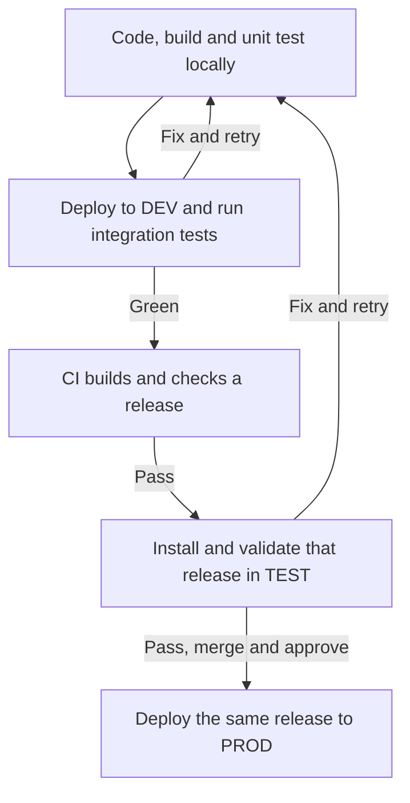

# Plan 039 - OpenClaw development and delivery

**Status:** Implementation in progress
**Issue:** [#118](https://github.com/coletaylor788/puddles/issues/118)
**Last updated:** 2026-09-17
**Owner:** Delivery coordinator

## Human section

### Design

Keep the original development loop intact: make a change, build and run unit
tests on the development host, deploy the artifact over SSH to development,
and get the relevant integration tests green there before entering CI. CI then
produces a release, installs that release in test, and promotes the same
artifacts to production only after they pass.
Development, test, and production are three separate instances. Development
accepts frequent local drafts. Test is reserved for a frozen release. Production
does not change during either kind of testing. Development and test can run on
demand rather than consuming memory continuously.

The short version:

The preferred release builders are standard GitHub-hosted ARM machines with
7 GB of RAM. Public CI validates the reusable code without private inputs.
The private builder composes the selected public and private changes and builds
the complete runtime once. Its private patches change the runtime, so it cannot
simply reuse an unmodified public binary. Each builder keeps its source tests
with the source and exports an immutable bundle with matching evidence. The
target host imports that bundle without a source checkout or build tools.
Actual resource measurements must establish whether the hosted builders fit.
A development Mac can provide the builder fallback and transfer artifacts to
the target over the existing SSH path.

The development loop runs focused unit tests and the relevant deployed
integration tests, not the entire release gate after every edit. It uses the
same packaging and installation mechanisms as the release path so local
success does not hide missing dependencies. CI is the independent, reproducible
check of a change that already works, not the first place its pieces meet.
The release test uses the real deployment
mechanism and proves both a healthy installation and recovery from a deliberate
failure in isolated test state. A normal production deployment does not force
a failure. It keeps the new release when health checks pass and restores the
previous release when required checks fail. Source integration precedes
production activation, and production still requires separate authorization.

Ordinary scripts and CI advance the workflow. Agents diagnose defects, implement
repairs, and coordinate decisions, rather than watch logs or retry unchanged
failures. Retention preserves useful bundles and their complete proof records
while reclaiming owned scratch space. Local diagnostic logs remain unbounded.
The host's existing production state and protected recovery are not a source
of automatic free space. Hosted private jobs must respect the no-paid-hosting
decision, using verified included capacity or the local builder fallback.

### Status

The public delivery and retention machinery has a reviewed, fully green
checkpoint under the previous runner profile. An actual private artifact-only
run imports and installs a retained bundle and passes its installed scenarios.
Its physical deployment test stops before shutdown because a fixture job does
not satisfy the reviewed migration precondition. It has not proved the intended
post-snapshot failure and recovery path.

Standard hosted ARM validation, the separate fast development instance, the
private builder/consumer split, and the remaining workspace cleanup are in
progress or pending. Neither delivery change is merged. Production remains
unchanged. The checklist below is the completion contract, not a claim that
working components already make the entire process ready.

## Agent section

### State

- This is the coordinator-owned end-to-end scope and completion checklist for
  issue #118. Do not replace it with the latest failure, commit, or worker
  handoff. Keep both sections current when scope or status changes.
- Plan 038, `docs/plans/038-artifact-delivery.md`, holds the public implementation
  details on PR #117. It is not present on this document's initial base branch.
  The deployment owner keeps host-specific configuration and the private
  implementation plan in the private repository.
- Plan 036 explains the existing native pipeline. Plan 037 holds the current
  OpenClaw upgrade requirements. Their applicable migration, integration, and
  rollback obligations remain in force.
- The original request included the fast local development instance from the
  start. It is not a future enhancement or another name for the release test.
- The requester clarified that deployed integration tests, not only smoke or
  manual inspection, must be green in DEV before the normal CI submission.
  A high pass-through rate from CI to production is an outcome to measure,
  not a reason to suppress an independent release check.
- Public evidence checkpoint:
  `348eed7f3fdc6f82996f78917934a8587dc2aaf3`, tree
  `035528a0e2b29f31815ffe45aad6bd2a3dc17e5c`. Retained review, 59 focused proof
  tests, exact local cumulative validation with nine scenarios, hosted
  cumulative run `34961080293`, and CodeQL pass. This is not evidence for the
  newly requested hosted ARM profile.
- The selected OpenClaw source is
  `1391f7cd2d40ab5bbcf2f5f831d3a64f520e72d7` (`v2026.9.3`). The selected
  candidate Node version is `26.1.0`; upstream pnpm is `12.3.4`. Do not silently
  change the release or toolchain while changing the delivery topology.
- The private owner reports a retained-bundle import, offline install, and all
  11 installed scenarios passing. Physical preflight reports
  `Migration job is missing or its reviewed revision changed`.
  `expectedCAS=false` and failure before shutdown are not rollback evidence.
- The missing source-gate retention defect is repaired in the public checkpoint.
  The older retained regression record alone cannot recreate its missing source
  attestation because the attestation also binds inventory and extension gate
  identity. Refresh the required source gate without rebuilding unchanged
  runtime inputs.
- Approved historical cleanup is complete. It does not authorize new deletion
  of global caches, unknown fixtures, application sessions, or recovery state.
- The public owner owns shared code and public CI. The private owner owns
  composition, concrete targets, the development command, and private CI.
  The coordinator owns this checklist and exact cross-repository integration.
  Keep the existing engineering owners and retained reviewers.

### Scope and acceptance criteria

- Deliver a usable local edit/build/unit-test/SSH-deploy/integration-test loop
  for a distinct DEV target. It must accept development drafts without
  pretending they are certified releases or requiring the full accumulated
  gate after every edit. Relevant local unit and deployed integration checks
  must pass before the normal CI submission.
- Keep DEV, TEST, and PROD positively disjoint in writable state, runtime
  installation, configuration, workspace, sessions, indexes, ports, processes,
  and service identity. Do not rely only on different labels.
- Validate public and private release builds on real standard 7 GB macOS ARM
  runners, or record the measured blocker and operate the authorized builder
  fallback. Do not claim that the requested hosted profile works if only the
  fallback works.
- Preserve the entire accumulated regression pool. Lower resource use with
  supported concurrency and workspace reuse, not missing tests or fabricated
  proof records.
- Separate release building from target installation. The normal target
  consumer must need neither an OpenClaw checkout nor compiler/dependency
  installation. Build bundles must be useful for diagnosis before certification.
- Bind the composed source, toolchain, platform, runtime archives, additional
  runtimes, prepared assets, migration, browser, destination mappings, test
  inventory, and required target evidence through the maintained receipt types.
- Keep public CI independent and credential-free. Keep private source, bundles,
  configuration, raw diagnostics, and local migration inputs out of public
  artifacts. Hosted builds must not depend on the target host's live home.
- Use explicit recording adapters for automated external writes and synthetic
  content for assertions. Required unavailable read-only host checks fail
  explicitly. No live-message fallback is allowed.
- Prove installation and the real deployment transaction on TEST, including
  startup, post-snapshot configuration failure, automatic recovery, and
  preservation of the intended effective job set.
- Keep the newest two successful bundles with required proof closure and one
  failed reproduction, plus all active, paused, pinned, deployed, recovery, and
  debug dependencies. Keep ordinary local diagnostic logs without expiry or
  byte caps, separate from full homes, databases, recordings, and workspaces.
- Reclaim only explicitly owned disposable state. Cover source checkouts and
  scratch space as well as the artifact pool. Preserve required evidence before
  deleting its producer state, and measure actual free space rather than assume
  directory footprint equals physical reclaim.
- Scripts drive and resume normal stages to a durable terminal result. A
  failure stops with actionable diagnostics. Agents repair defects rather than
  advance each stage, poll unchanged jobs, or rerun unchanged failures.
- Integrate the reviewed compatible source and verify the default-branch result.
  Process completion must not stop at green local tests or open pull requests.
  Actual production activation remains a distinct authorized operation.

### Architecture and decisions

The following diagram is the target workflow, not a claim that every path is
already operational. Failures return to the relevant focused loop. Unchanged
artifacts and genuine evidence remain reusable.

- DEV is mutable and explicitly non-production-eligible. TEST evaluates frozen
  artifacts. DEV activity must not overwrite an in-flight TEST installation or
  its evidence. Neither is the production service with a different port.
- Reuse the existing build, import, rehearsal, activation, and SSH entrypoints.
  Add only the minimum support needed for the fast development command.
  Do not create a second deployment engine or use manual copying into an old
  install as the evidence that packaging works.
- Use focused checks while editing and a defined local integration selection
  before submitting a candidate to CI. Cover the affected installation,
  configuration, migration, restart and interaction boundaries. Reuse unchanged
  components rather than duplicate the entire CI suite on every edit.
- Keep CI's fresh checkout, pinned tools, full accumulated regressions and
  independent artifact verification. A high CI-to-production pass-through rate
  is desirable, not a guarantee or permission to bypass a failure. Hosted-only
  behavior, such as the actual 7 GB runner profile, may require a bounded hosted
  experiment; distinguish that experiment from release certification.
- The hosted target profile is macOS ARM with 7 GB advertised RAM. The previous
  Intel choice followed a hardcoded 8 GiB total-memory preflight, not a recorded
  out-of-memory measurement. Measure the full process tree, memory pressure,
  disk high-water marks, and stage durations before settling the new profile.
- Do not confuse a Node heap limit with total process-tree memory. Record
  supported worker/concurrency choices and bind relevant environment inputs
  into proof reuse.
- The private builder still applies its root patches before building. Moving
  public CI to ARM does not make its unmodified root archive interchangeable
  with the composed private release.
- Prefer an outbound artifact download by the existing private target runner.
  Do not expose a new inbound service or distribute target SSH credentials to
  public CI. The local builder fallback uses the reviewed SSH path and an
  explicit nonproduction target.
- Hosted private builds use only verified included allowance with enforceable
  no-overage controls unless the requester changes the cost decision. Do not
  move private inputs into public CI to avoid billing.
- Public obsolete PR checks may cancel. Deployment transactions must not share
  that cancellation policy. Serialize target mutation using maintained locks.
- Rehearsal must first satisfy normal migration preconditions. Inject only the
  intended configuration mismatch for the failure case. Rejection before
  shutdown does not prove stopped-state recovery.
- Production rollback is conditional on an actual deployment or required
  post-deployment health failure. Deliberate failure remains a TEST regression,
  not a step that undoes every healthy production deployment.
- Keep capacity policy stage-specific and evidence-based. A historical
  free-space measurement is not a new minimum. A lower-memory builder trial
  does not authorize reducing unrelated disk or production safety checks.
- Global package caches, unknown legacy fixtures, and sealed production
  recovery directories remain outside automatic collection. Dedicated external
  storage is a possible later capacity choice, not an approved purchase or a
  prerequisite added to this plan.

### Implementation

Stable checklist IDs below identify completion obligations. Component plans
hold code-level detail and link back to these IDs rather than create a competing
end-to-end checklist.

| Workstream | Owner | Dependencies | Next required outcome |
| --- | --- | --- | --- |
| PLAN | Coordinator | Requester decisions | Versioned full scope, diagram, owners and checklist |
| DEV | Private, shared helpers by public | Existing build/rehearsal APIs | Local unit and deployed integration checks green through the documented fast command |
| ARM | Public and private | Resource measurements and cost boundary | Complete hosted ARM runs or explicit measured fallback |
| FLOW | Public and private | ARM profile, receipt interfaces | Automated builder-to-artifact-consumer handoff |
| TEST | Private | Valid synthetic seed and imported bundle | Healthy deployment and intended stopped-state rollback |
| STORE | Public and private | Ownership and reference records | Automatic complete evidence retention and scratch cleanup |
| LAND | Coordinator and both owners | Required final proofs and review | Exact compatible source merged and verified |
| PROD | Deployment owner | LAND and separate authorization | Exact-artifact activation with read-only health and recovery |

Public implementation surfaces include
`packages/e2e/bin/openclaw-test-env.mjs`,
`packages/e2e/bin/openclaw-release-bundle.mjs`,
`packages/e2e/bin/openclaw-release.mjs`,
`packages/e2e/bin/openclaw-rehearse.mjs`,
`packages/e2e/bin/openclaw-artifact-retention.mjs`, and
`.github/workflows/integration.yml`. Private target definitions, artifact
transport, CI composition, and wrapper details stay in the private plan.

Record the actual verified developer command, its relevant unit/integration
test selection, and operating instructions in component documentation when DEV
is proven. A diagram or unexecuted command example does not close that item.
Keep shell automation responsible for command execution and durable state; do
not add model calls to CI.

### Validation

- During repair, run the smallest regression that exercises the failing
  boundary. A package-level build is not a substitute for a failing root
  declaration build. A preflight rejection is not a rollback test.
- Use `node packages/e2e/bin/openclaw-test-env.mjs ci` for the final accumulated
  lifecycle on the exact candidate and selected profile. Do not remove prior
  package, patch, or runtime targets to make a smaller runner pass.
- Demonstrate the public profile on an actual 7 GB hosted ARM runner. Capture
  peak process-tree memory, pressure, free-disk minimum, durations, architecture,
  toolchain, selected concurrency and terminal outcome.
- Run the private combined build on its selected builder with no dependency on
  live target state. Retain its genuine source-gate attestation and regression
  proof with the bundle.
- Build a local draft and run unit tests on the development host. Deploy the
  packaged draft to DEV over SSH and pass the relevant integration and smoke
  checks before the normal CI submission. Demonstrate that this draft's identity
  still cannot authorize production. Verify DEV, TEST and PROD disjointness and
  recording-only automated side effects.
- Import the release in a separate target layout without builder source or
  development dependencies. Verify complete runtime, prepared-file, migration,
  browser, interpreter and destination bindings.
- Repair and test the synthetic fixture's job/revision mismatch without
  weakening migration guards. Then prove both healthy deployment and a
  configuration failure after snapshot followed by actual automatic recovery.
- Delete disposable producer state in an owned regression fixture, re-import
  its retained bundle, recover the genuine source evidence, and certify against
  matching unchanged target evidence. Check two retained builds and collection
  of superseded gates and an evicted third build.
- Exercise cleanup through actual producer and terminal hooks, including
  failures and interrupted cleanup. Keep active/pinned references, diagnostics,
  protected recovery and unknown paths intact.
- Demonstrate a repeated unchanged run reusing expensive successful stages.
  Record stage invalidation reasons for source, tests, tooling, environment,
  artifact or target changes. Documentation-only changes must not invent a
  reason to rebuild unchanged runtime bytes.
- Record local edit-to-integration-feedback time and failures first discovered
  in CI versus DEV. Use that evidence to improve the inner loop without
  inventing an unapproved pass-rate target or weakening release checks.
- Require actionable command-level failure evidence without exposing private
  payloads. Verify normal stage transitions need no agent intervention and an
  unchanged failure does not create an automatic retry loop.
- Preserve the same independent reviewers through meaningful changes.
  Refresh affected proofs and final gates, then verify exact remote heads,
  required checks and default-branch integration.

### Rollout and rollback

Keep the currently healthy production runtime and its protected recovery.
Existing process and dev/test work does not authorize a production upgrade.
Do not retire recovery tooling, pinned interpreters or referenced assets while
they remain needed by that recovery.

Finish focused repairs with retained evidence, validate the selected ARM builder
profile, prove the separate DEV loop and release TEST path, then integrate the
reviewed compatible source. A fallback must be documented as a fallback, not
reported as successful hosted ARM support.

After separate production authorization, consume the exact promoted artifacts
through the maintained wrapper. Prepare recovery before destructive work. Do
not build, fetch dependencies or merge source while the service is stopped.
Check health without sending messages. On failure, restore the recorded old
state/runtime/service and verify health, preserving both the original error
and any recovery error.

### Review log

The public owner reports retained complete-diff clearance and exact local and
hosted gates at the checkpoint recorded in State. The private owner reports
retained review clearance for artifact-only diagnosis. Those reviews do not
cover unimplemented DEV support or the new hosted ARM profile.

This master document records agreed scope and available evidence. It does not
grant new production, billing, deletion or external-message permissions. Owners
must update the appropriate evidence and checklist together after meaningful
changes. Do not launch a fresh reviewer merely to repeat bookkeeping.

### Checklist

A checked item establishes only the named milestone. It does not mean the
entire feature is merged or deployed. Open items keep their owner and dependency
visible. Close them with a concrete command, receipt, test result or integration
record in the relevant component plan, not a status assertion alone.

**Scope and durable tracking**

- [x] PLAN-01 (coordinator): Persist the original local DEV -> CI -> TEST -> PROD
  intent, full diagram, decisions, owners and this checklist.
- [ ] PLAN-02 (coordinator, in progress): Publish this plan, make issue #118
  point to it, and link the component plans without duplicate master checklists.
- [ ] PLAN-03 (coordinator): Reconcile every remaining item with component
  evidence before declaring the process upgrade complete.

**Fast development instance**

- [ ] DEV-01 (private, in progress): Provision and verify a distinct DEV target,
  separate from release TEST and PROD in every writable/process identity.
- [ ] DEV-02 (private): Provide a maintained incremental-build/unit-test command
  on the development Mac and an artifact-based SSH deploy to DEV.
- [ ] DEV-03 (private/public): Support local drafts explicitly without full
  certification and prove they cannot authorize production activation.
- [ ] DEV-04 (private): Pass the relevant deployed integration and smoke checks,
  with recorded interactions and no live external writes or scheduled-message
  fallback, before submitting the normal candidate to CI.
- [ ] DEV-05 (private): Document start, stop, deploy, inspect and reset commands;
  prove on-demand resource use and that DEV does not disturb a running TEST.
- [ ] DEV-06 (both): Exercise the actual packaging/installation boundary locally,
  define the pre-CI unit/integration selection, and record feedback time and
  where defects are caught. Do not make every local edit run the full CI suite.

**Hosted ARM and local fallback**

- [ ] ARM-01 (public, in progress): Measure the real root build and cumulative
  pipeline on a standard 7 GB hosted ARM machine, including child processes.
- [ ] ARM-02 (public): Set documented resource/concurrency policy from evidence,
  with regressions for profile validation and exact-input reuse.
- [ ] ARM-03 (public; ARM-01/02): Pass the full hosted ARM public gate and publish
  correctly labeled ARM artifacts before replacing Intel as the default.
- [ ] ARM-04 (private): Verify included hosted capacity and no-overage controls,
  or record why the authorized local builder fallback is required.
- [ ] ARM-05 (private; ARM-02/04): Build the exact composed release and run all
  required source gates on the selected builder without live target inputs.
- [ ] ARM-06 (private/public): Demonstrate the development-Mac builder fallback,
  its own capacity preflight, and sealed-artifact transfer without target builds.

**Artifact flow and unattended operation**

- [x] FLOW-01 (public): Implement separate build, source-gate, bundle transport,
  target proof, certification and promotion contracts on the feature branch.
- [x] FLOW-02 (private): Demonstrate retained-bundle import, offline installation
  and all installed scenarios without another OpenClaw source build.
- [ ] FLOW-03 (private; ARM-05): Split builder and target-consumer jobs. The
  target downloads and verifies a private bundle without source dependencies.
- [ ] FLOW-04 (private/public): Prove complete runtime/asset/target bindings and
  preservation of immutable proof inputs during transport.
- [ ] FLOW-05 (both): Demonstrate one command/job advancing normal stages, durable
  status and actionable failures without model-driven stage advancement.
- [ ] FLOW-06 (both): Demonstrate no-op reuse and affected-only repair; preserve
  the latest useful bundle when a later source or target gate fails.
- [ ] FLOW-07 (private): Verify explicit trusted release triggers, least
  permissions, no public/fork PR execution on the target, and safe concurrency.

**Physical release proof**

- [ ] TEST-01 (private, in progress): Correct the synthetic migration job and
  revision mismatch, with a focused regression and unchanged safety guards.
- [ ] TEST-02 (private; TEST-01): Prove a healthy complete deployment through the
  real wrapper on the isolated TEST target.
- [ ] TEST-03 (private; TEST-01): Reach the intended post-snapshot configuration
  mismatch and prove automatic restoration and old-instance health.
- [ ] TEST-04 (private/public): Bind fresh required source-gate evidence and the
  exact installed/physical results to the final bundle and target inputs.
- [ ] TEST-05 (private): Demonstrate target-only diagnosis/retry without rebuilding
  unchanged artifacts and with safe reset/cleanup of owned TEST resources.

**Retention and capacity**

- [x] STORE-01 (public): Implement the owned pool, reference closure, dry-run/apply
  cleanup and lifecycle hooks, keeping two successes and one failed reproduction.
- [x] STORE-02 (public): Prove retention of genuine source-gate/regression
  sidecars per retained build, including superseded and evicted-build collection.
- [ ] STORE-03 (private/public): Prove complete failure reproduction and
  re-import/certification after disposable state is removed in the final flow.
- [ ] STORE-04 (private): Automatically reclaim owned Actions checkouts and
  scratch state after preserving evidence, not only objects inside the pool.
- [ ] STORE-05 (private/public): Bound CI-owned dependency cache growth and
  preflight the upcoming stage before costly setup. Do not prune global caches.
- [ ] STORE-06 (both): Measure steady-state and peak capacity after the builder
  moves off the target; account for retained bundles, dev/test state and recovery.
- [ ] STORE-07 (both): Demonstrate active/pinned/protected references, interrupted
  cleanup, unbounded separate local diagnostics and no unknown-path deletion.

**Landing and operating handoff**

- [ ] LAND-01 (both): Complete retained full-diff review, committed regressions,
  exact accumulated gates and required hosted checks for the final new profile.
- [ ] LAND-02 (coordinator; DEV/ARM/FLOW/TEST/STORE): Verify exact compatible
  public/private heads and merge the eligible changes, including legacy-writer
  retirement. Do not stop at open pull requests.
- [ ] LAND-03 (coordinator): Verify default-branch contents and post-landing
  workflow behavior. Any runtime-input change requires affected proofs to refresh.
- [ ] LAND-04 (both/coordinator): Publish the working developer commands, release
  command, evidence locations, retry/cleanup procedure and clear remaining limits.
- [ ] LAND-05 (coordinator): Reconcile this checklist and issue status, then
  return the landed process for the requester's final validation.

**Separately gated production operation**

- [ ] PROD-01 (deployment owner, blocked on separate authorization): Confirm
  production target, promoted exact artifacts and protected recovery prerequisites.
- [ ] PROD-02 (deployment owner; PROD-01): Activate without rebuilding and verify
  read-only health. Keep a healthy release; roll back only on a real failure.
- [ ] PROD-03 (deployment owner): Record the resulting release/recovery identity.
  Do not prune the previous protected recovery without its separate retention
  decision. Process completion must explicitly report production as still held
  when this authorization has not been given.
