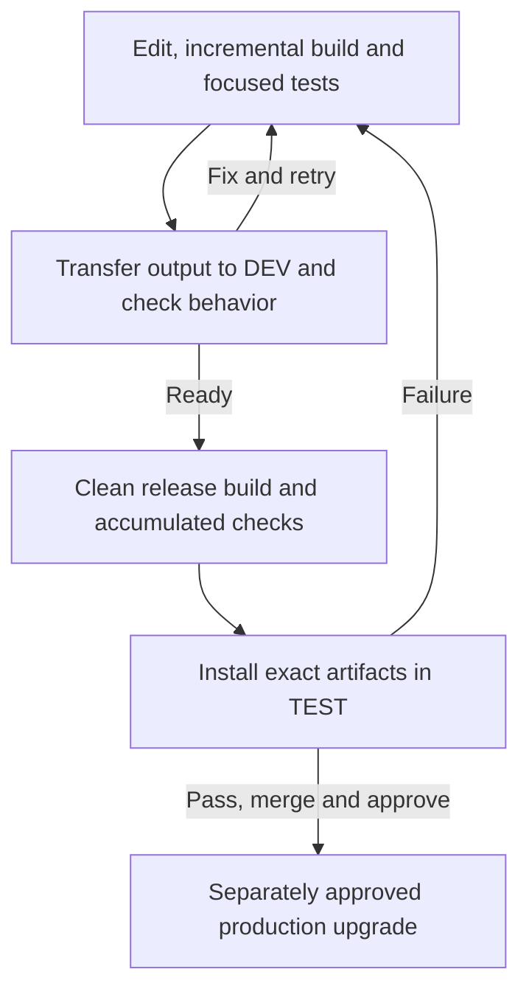
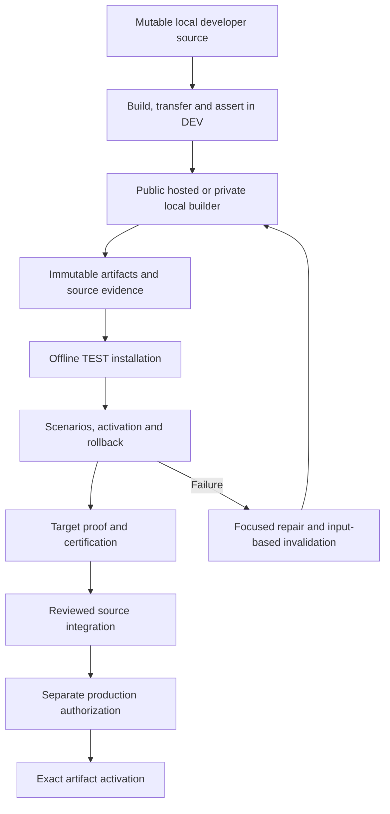

# Plan 039 - OpenClaw development and delivery

**Status:** Implementations merged and green; final artifact replay pending
**Issue:** [#118](https://github.com/coletaylor788/puddles/issues/118)
**Last updated:** 2026-09-26
**Owner:** Delivery coordinator

## Human section

### Design

Build and test locally, transfer built output to a separate DEV instance, and
check the changed behavior there. Ordinary edits do not need release receipts,
frozen source or the complete release suite. Dependency changes use a separate
refresh step. Warm edits should give feedback within five minutes.

Scripts own normal release stages, saved results and retries. Agents fix
concrete failures rather than supervise each command. The builder produces
immutable artifacts; TEST installs them without rebuilding. Reuse successful
work only when its real inputs still match. A changed test, target or workflow
must not silently inherit evidence for different inputs.

DEV, TEST and PROD have separate writable state, ports, processes and runtime
paths. Tests use recorded external effects and synthetic content. Production
health checks are read-only. A successful test promotion is not permission to
upgrade production. Public hosted CI is independent; the private composition
uses the authorized local builder when hosted cost cannot be established.

The backup captures current production without recursively including historical
backups. Prove it through isolated restore and publish its reference before
disposing of the old copy. An integrity mismatch must remain visible, not be
fixed by rewriting a recorded hash. Actual maintained build consumers share a
pinned package manager and per-machine content store. Older manual and live
runtime dependencies stay protected until separately migrated.

### Status

Both implementation PRs are merged and their post-merge checks pass. The public
job retained its ARM bundle and resource records. The final release candidate
passed installation, all scenarios, deliberate failure and rollback, healthy
activation, coexistence, certification and cleanup. DEV warm core and plugin
feedback passed in about three minutes eight seconds and three minutes
thirty-nine seconds, with cold setup recorded separately. One remaining
retention check must replay artifact import and certification after disposable
test state is removed.

The new backup is proved and published. The requester explicitly authorized
disposal of the integrity-drifted old copy; that exact cleanup is complete.
Maintained DEV, release and TEST consumers use the shared pinned package store,
and the final two-machine audit is complete. Optional host build-evidence
retention work remains separate from delivery. Production upgrade and new paid
execution remain separately gated.

## Agent section

### State

- Public #117 merged as `042b73281b63bfc64df1f66d8779603a31380ca2`.
  Private `coletaylor788/puddles-private#39` merged as
  `75aa7a761b7644cd038d31544a11dc5b93b3d6a4`. The coordinator directly
  verified both main SHAs. Private post-merge run `36261272335` and public
  CodeQL run `36266233422` passed. Public Integration `36266234464` passed,
  including cumulative checks, ARM bundle export/retention, resource retention
  and post-job cleanup.
- Final physical runtime proof belongs to public
  `251eff260df41bdc50e70337ece9da17dcefd116`, private
  `74e1389ecf8f1747b3f45f84c109c2655fb91cf6`, and upstream
  `1391f7cd2d40ab5bbcf2f5f831d3a64f520e72d7`. Its build ID is
  `bb5c4422fbb62c7716aa3041353e8547e9ab8908a8089f7c6904ad16231eb1c6`.
  Later workflow-only changes need their own workflow checks, not relabelled
  runtime receipts. The release owner owns exact input equivalence.
- The release owner reports the complete MINI consumer passed artifact import,
  six additional installs, installed runtime, all 11 scenarios, deliberate CAS
  failure and rollback, healthy activation, target proof, certification,
  production-eligible promotion, final rollback and TEST cleanup.
- Integrated coexistence was captured at `2026-09-21T14:06:06.152Z`.
  The DEV owner verified the snapshot digest
  `22e269f9ef4d2a5aeefe161bdef7f09cd53933e5b8ffe66c0e019e8125a91c6b`.
  It proves actual concurrent listeners, PIDs, HTTP 200 and path separation.
  TEST service identity uses `recording-launchctl`, not host launchd
  registration. It does not claim a DEV redeploy during an active TEST workload.
- Final DEV packet proves plugin edit-to-feedback `218.753` seconds
  (`211.10` command seconds), 1,290 tests in 59 files, changed installed
  `mailto:` normalization, three configured plugins and zero external calls.
  Retained core edit-to-feedback is `188.03` seconds (`170.95` command).
  The coordinator directly read the final packet. Owned benchmark changes and
  deployed baseline were restored; no production changes occurred.
- Cold extension cache priming took `121.16` seconds. A stale dependency
  identity correctly refused activation; baseline bootstrap then took
  `176.60` seconds. Neither is counted as warm success. A longer deadline,
  no-op build or erased TypeScript edit is not a substitute for changed output.
- The audit owner verified actual maintained HOST DEV/release metadata and
  frozen MINI consumer proof for pnpm `12.3.4` and the maintained store's `v11`
  format. Primary/manual repositories and production native-module mappings
  still use protected legacy installations. No old store is proven disposable.
- Backup capture, isolated materialization and publication completed with
  `previousRecovery:null` and a new reference with `previousTransaction:null`.
  Exact private identities remain in the maintenance packet. The owner
  reverified the replacement before and after September 26 old-copy disposal.
- The original retirement command correctly refused drifted legacy state and
  package hashes. Public verified the digest algorithm was unchanged since
  before capture. After the requester explicitly accepted disposal, the audit
  owner used a separately scoped, locked one-off procedure. Original receipt,
  pointer, journal and integrity diagnosis were preserved. Only the exact old
  recovery and obsolete pointer were removed; no digests were rewritten.
- Disposal reclaimed `18,897,031,168` bytes, not the larger allocated directory
  size. Final audit snapshots show roughly 25.06 GiB free on HOST and 75.59 GiB
  on MINI. HOST has substantial retained agent/build evidence. Permission gaps
  and APFS sharing prevent treating directory sums as unique physical usage.
  No new broad cleanup is authorized.
- User approval permits free/included Actions under existing billing controls.
  Do not enable overages, add payment methods or buy runners. A quota rejection
  is a reported blocker, not permission to change billing. Production upgrade
  is outside this delivery closeout.
- Retention reconciliation distinguishes managed automation from historical
  host accumulation. Hosted Actions scratch is ephemeral, and artifacts are
  retained before job teardown. Persistent HOST runs do not inherit that
  cleanup. Shared persistent dependency stores remain protected; a pinned
  manager and capacity preflight are not a numerical cache-size bound.
- Failure reproduction, fresh import, certification and TEST cleanup passed.
  STORE-03 still needs a replay after disposable TEST state removal. The
  release coordinator assigned a bounded artifact-only replay to the retained
  public owner after the private owner's session became unavailable. It must
  not rebuild source, mutate production, delete existing proof or invent
  producer receipts. A missing prerequisite is reported before a costly repeat.

### Scope and acceptance criteria

- Deliver normal mutable local development with incremental compilation,
  relevant tests, SSH transfer and installed DEV assertions. Keep warm core
  and plugin edits below 300 seconds; record cold preparation separately.
- Keep DEV, TEST and PROD disjoint in writable state and process identity.
  No automated real messages or external writes without recording adapters.
- Preserve the cumulative public/package/patch/scenario pool. Required
  real-candidate checks fail explicitly when inputs are absent.
- Build once, install exact complete artifacts offline, and prove healthy
  activation plus the intended post-snapshot mismatch and rollback.
- Support exact-input reuse without copying or rewriting producer receipts.
  Scripts advance normal stages and preserve actionable terminal failures.
- Complete current-state backup replacement, actual maintained pnpm consumer
  verification and the final audit. Do not delete legitimate manual/runtime
  stores just to claim a single directory remains.
- Land reviewed compatible source and verify post-merge behavior. Report
  remaining retention limitations honestly; no unapproved production upgrade.

### Architecture and decisions

- Use maintained compiler commands for DEV, not release-proof machinery.
  A lock/dependency change requires refresh rather than stale runtime transfer.
- The selected upstream remains `1391f7c`; build tooling is Node `26.1.0`,
  Corepack `0.36.0`, pnpm `12.3.4`. Private patches modify the root runtime,
  so an unmodified public archive is not the composed private build.
- Public hosted ARM is measured. Private deterministic build uses the
  authorized local fallback; private Linux contract CI is not evidence of a
  private hosted ARM build. TEST is a real native process with isolated
  writable state, not a security sandbox.
- Phase-owned command inputs and stable environment identities prevent a
  gate-only edit from unnecessarily invalidating the root build. Artifact
  permission preservation must work under restrictive umasks.
- Target paths must refer to the destination, not builder placeholders.
  Validate baseline and mutation with the installed plugin context. A
  schema-invalid mutation is not proof of the intended CAS failure.
- Retain two useful successful bundles, a failed reproduction and all pinned,
  active and recovery dependencies. Host historical evidence cleanup requires
  explicit ownership/reference classification; zero open handles is insufficient.

### Implementation

Existing owners remain responsible; no new handoff chain is needed.

| Area | Owner | Delivery surface |
| --- | --- | --- |
| Public pipeline and hosted CI | Public implementation owner | `packages/e2e/`, `.github/workflows/integration.yml`, Plan 038 |
| Private composition and targets | Private implementation owner | Private Plan 037 and release/development scripts |
| Release, TEST and integration | Release coordinator | Exact source/artifact/target evidence and PR landing |
| DEV acceptance | Retained DEV owner | Final core/plugin packets and command handoff |
| Consumer closure and audit | Retained audit owner | Actual metadata, disposal evidence and private audit |
| Overall record | Parent coordinator | This plan and #118 |

Public entrypoint is `packages/e2e/bin/openclaw-test-env.mjs`; documented
contracts and commands are in `packages/e2e/README.md`. Private daily entrypoint
is `scripts/openclaw-development-loop.sh`. Its `deploy core` and `deploy plugin`
commands need prepared composed source and the pinned environment, not a release
receipt. `status`, `start`, `stop`, `reset` and `bootstrap` handle lifecycle and
dependency refresh. Keep machine-specific environment values in private local
configuration and evidence, not this public plan.

### Validation

- Required accumulated command:
  `node packages/e2e/bin/openclaw-test-env.mjs ci`.
  Use focused regressions while repairing; run applicable final accumulated
  checks on the coherent candidate. Preserve old regression targets.
- Public hosted proof includes runs `35316103588` and `35482638315`;
  exact pre-merge Integration `36264365344` passed on `6a66dab`.
  Private pre-merge contract run `36261202704` passed on `4996f269`.
- Runtime/TEST proof remains bound to `251eff2`/`74e1389`. Release
  promotion eligibility is not a production activation. Final TEST cleanup
  removes its listener and target while preserving compact proof.
- Final DEV plugin proof demonstrates emitted behavior before and after the
  edit, real transfer and installed assertion. Core and plugin baselines are
  restored afterward. Timing phases are qualified, not summed into false
  precision.
- Backup proof uses the maintained restore consumer in separate non-delivering
  destinations. September 26 disposal preserved fresh replacement identity,
  production health and all package stores.
- Final consumer audit distinguishes actual commands and installed metadata
  from isolated install tests. Legacy primary/runtime exceptions remain
  explicit. Final filesystem audit records denied paths, sparse allocations,
  shared storage and bounded-scan limits.

### Rollout and rollback

The implementation PRs are merged and post-merge checks pass on verified
default-branch identities. Artifact replay after disposable TEST state removal
is the remaining acceptance gate. Do not rebuild unchanged runtime code merely
to attach a new commit name.

DEV and TEST are accepted for feature development. Start DEV on demand through
the maintained command. TEST is temporary and cleaned after release rehearsal.
Production remains on the existing release; activation requires separate
authorization and the configured exact-artifact deployment wrapper.

Backup replacement and explicitly approved old-copy disposal are finished.
No repeat capture, service cycle or additional deletion is authorized. Optional
host retention cleanup is a follow-up, not part of making feature development
usable. A future large local build must still pass its capacity preflight.

### Review log

Public and private owners retained independent reviewers through the concrete
runtime, packaging, target and workflow repairs. The final runtime candidate
passed the accumulated and physical TEST lifecycle. Workflow-only fixes have
their own remote checks and do not fabricate a new runtime proof identity.

The coordinator directly verified merged PR/main identities and available
post-merge checks, and read the final DEV packet. Physical release and backup
results are attributed to the owning executors and their preserved records.
Remaining retention obligations below are not silently marked passed.

### Checklist

Stable IDs are preserved. Checked means the named obligation is established,
not that a production upgrade occurred. Explicit retention follow-ups do not
block the accepted daily DEV/release flow.

- [x] PLAN-01: Persist scope, diagrams, owners and acceptance criteria.
- [x] PLAN-02: Publish this plan and link #118 and component plans.
- [ ] PLAN-03: Finish final evidence reconciliation and closeout.
- [x] DEV-01: Separate DEV from TEST/PROD writable and process identities.
- [x] DEV-02: Maintain incremental local build/test and SSH DEV deployment.
- [x] DEV-03: Accept uncommitted edits and refuse production targets.
- [x] DEV-04: Assert changed installed behavior with recording-only effects.
- [x] DEV-05: Document lifecycle; verify concurrent service/path isolation.
  Coexistence does not claim a DEV redeploy during an active TEST workload.
- [x] DEV-06: Warm core 188.03s and plugin 218.753s; cold work separate.
- [x] ARM-01: Measure public standard hosted ARM capacity.
- [x] ARM-02: Regress resource and concurrency profile.
- [x] ARM-03: Pass hosted public build and accumulated checks.
- [x] ARM-04: Record authorized private local fallback and cost boundary.
- [x] ARM-05: Build exact private composition and pass source gates.
- [x] ARM-06: Transfer sealed local-builder output without target builds.
- [x] FLOW-01: Separate build, source, target, certification and promotion.
- [x] FLOW-02: Import retained bundle and install offline.
- [x] FLOW-03: Split producer and target consumer execution.
- [x] FLOW-04: Bind runtime, extra artifacts, assets and target evidence.
- [x] FLOW-05: Execute scripted normal stages to durable terminal results.
- [x] FLOW-06: Prove actual stage reuse and affected-input invalidation.
- [x] FLOW-07: Verify trusted triggers and safe concurrency. Public PR/main and
  private contract PR/main triggers ran; physical release is manual/callable,
  serialized and never auto-cancelled. No public/fork PR runs on the target.
- [x] TEST-01: Correct migration fixtures without weakening validation.
- [x] TEST-02: Pass healthy real-wrapper activation on TEST.
- [x] TEST-03: Prove intended post-snapshot CAS failure and rollback.
- [x] TEST-04: Bind source and physical target proofs to promotion.
- [x] TEST-05: Diagnose target-only failures and clean owned TEST state.
- [x] STORE-01: Implement owned artifact pool and protected retention.
- [x] STORE-02: Retain source-gate/regression sidecars through collection.
- [ ] STORE-03: Prove complete failure reproduction and reimport/certification
  after disposable state is removed in the final flow.
- [x] STORE-04: Hosted Actions retained the bundle and resource evidence and
  completed ephemeral checkout/scratch teardown. Persistent HOST runs are
  excluded and no cleanup of them is claimed.
- [x] STORE-05: Hosted caches are runner-local and end with ephemeral jobs;
  maintained flows pin manager/store selection and preflight costly stages.
  Persistent shared stores have no claimed size cap and must not be pruned.
- [x] STORE-06: Hosted peak records and final HOST/MINI steady-state measurements
  cover retained bundles, DEV/TEST state and recovery. APFS and permission
  limits prevent a unique reclaim total; no unmeasured local peak is claimed.
- [x] STORE-07: Regressions and retained evidence cover protected references,
  interrupted activation/cleanup, separate local diagnostics and unknown-path
  refusal. Classifying seven older HOST runs remains a separate optional task,
  not an assertion that historical host accumulation has been collected.
- [x] PNPM-01: Pin maintained public/private/upstream build workflows.
- [x] PNPM-02: Verify actual maintained consumers use per-machine shared stores.
- [x] PNPM-03: Pass frozen/offline installs and applicable final build gates.
- [x] PNPM-04: Classify consumers and protected exceptions before retirement.
  No store is currently proven disposable; no store deletion is claimed.
- [x] BACKUP-01: Provide maintained backup-only recovery.
- [x] BACKUP-02: Capture complete current runtime and required state/assets.
- [x] BACKUP-03: Prove isolated restore through maintained consumer.
- [x] BACKUP-04: Publish replacement before exact old-copy cleanup.
- [x] BACKUP-05: Complete approved capture/unchanged-restart and health checks.
- [x] BACKUP-06: Complete separately authorized drifted-copy disposal with evidence.
- [x] LAND-01: Retained review, regressions and exact pre-merge checks pass.
- [x] LAND-02: Merge public #117 and private #39.
- [x] LAND-03: Verify both default-branch identities and passing post-merge checks.
- [x] LAND-04: Supply supported daily commands and documented operating limits.
- [ ] LAND-05: Publish final reconciled result and close the tracking issue.
- [ ] PROD-01: Separate future production authorization required.
- [ ] PROD-02: Future exact-artifact activation and read-only health checks.
- [ ] PROD-03: Future production result/recovery record; no upgrade claimed here.
