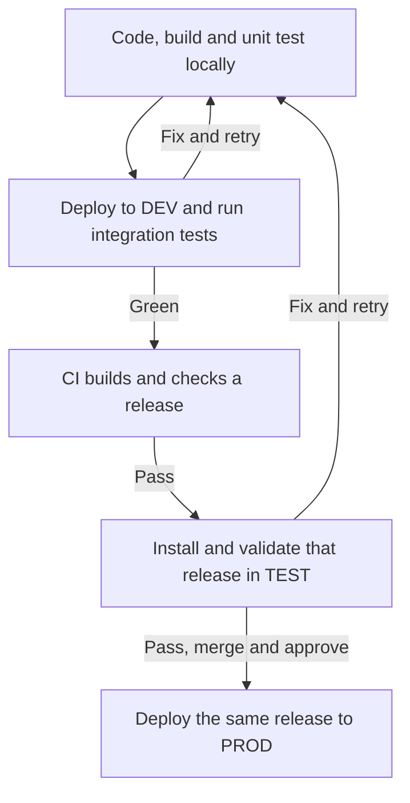
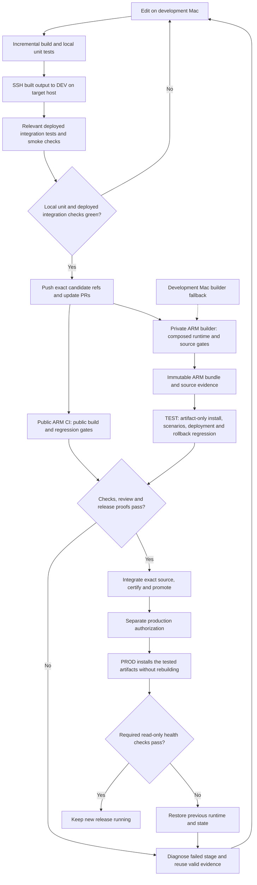

# Plan 039 - OpenClaw development and delivery

**Status:** Parallel DEV, release validation and maintenance; production gated
**Issue:** [#118](https://github.com/coletaylor788/puddles/issues/118)
**Last updated:** 2026-09-20
**Owner:** Delivery coordinator

## Human section

### Design

Work in the two normal local repositories. Build incrementally and run unit
tests on the development Mac, transfer the built output over SSH to DEV on the
mini, and run integration tests there. The mini is a remote development server,
not another release pipeline. Repeat until the tests pass and the change is
ready, then push it to CI. Ordinary warm edits should give feedback in minutes.

The short version:

After the push, CI does the clean build, complete checks and release packaging.
Public CI runs independently; the private builder combines the selected public
and private changes. The resulting release is installed without rebuilding in
a separate TEST instance. After checks, review and source integration, the same
release can go to PROD with the required authorization. Standard hosted ARM
builders are preferred; the development Mac is the fallback when hosted
capacity or the no-paid-hosting limit prevents that.

DEV, TEST and PROD keep separate state and services. DEV needs ordinary compiler
caches, a small deploy command and integration tests, not release receipts,
certification or a recovery snapshot for every edit. CI tests the complete
deployment and rollback mechanism in TEST. PROD keeps a healthy release and
rolls back only on a real failure. Scripts run these steps without an agent
watching them. Owned temporary files are cleaned up while useful release
evidence, unbounded local diagnostic logs and protected recovery remain safe.
Before a production upgrade, the backup tooling must create a complete recovery
of current production without copying historical backups into it. The normal
recovery path must prove that replacement usable before the old copy is retired.
The new backup can use its own format. Creating it does not require converting
the old backup or supporting the old format in the new retirement command.
After restore proof and publication, the exact obsolete backup and its matching
reference can be removed through separately guarded maintenance.
Active builds will use one pinned package-manager version and one shared
package store per machine, avoiding duplicate store formats without rewriting
historical build evidence or coupling installed services to a mutable cache.
These maintenance tasks run alongside independent DEV and release validation,
not ahead of every other task. Separate owners handle independent work, while
the coordinator prevents conflicting target changes and overlapping heavy jobs
on the same machine.

### Status

The requester has resumed non-production deployment work in parallel with
maintenance. Existing owners are working on the backup correction, private
integration, DEV core-edit proof, composed release/TEST validation and remaining
package-store consumers. Backup scope is simplified to a fresh backup of current
healthy production, restore proof, then exact old-backup cleanup. Old-format
compatibility is not a prerequisite. Tooling and the current mini target are
prepared, and capacity checks pass. The status-query correction and private
binding are review-clear. The requester approved one backup-only service window,
conditional on final accumulated validation for this exact source. That gate
is still pending, so capture has not started.
The core DEV edit-to-feedback loop passes
in just over three minutes, with installed identity and lifecycle checks
recorded. Current-input plugin and TEST coexistence evidence, plus private
release/TEST proof, remain open.

Isolated installs on both machines now prove the common package-manager version
and store. Actual DEV/release tooling, older primary checkouts and store
retirement still need resolution; test copies alone are not a completed rollout.
The obsolete host test run is removed;
the mini's real recovery remains protected until its replacement is proven.
A full storage re-audit will follow the two maintenance milestones. Normal
eligible source integration can proceed under required checks. Production
activation, live restore and new paid execution remain separately gated. The
single backup-only stop/start is approved subject to its recorded conditions.

## Agent section

### State

- The requester at 14:24 resumes non-production delivery work in parallel.
  This supersedes the earlier blanket release pause, not production or spending
  restrictions. Reuse existing sessions: parent coordinates overall scope;
  public owner `b6` implements public changes and current-format backup safety;
  private owner `4a` owns private code, backup readiness and toolchain rollout;
  `972` executes composed release/TEST validation and eligible integration;
  `9eb` proves current DEV-03 through DEV-06, especially the actual core-edit
  end-to-end loop; `de2` verifies remaining consumers, store retirement and the
  final audit. No duplicate pipeline ownership or new workers are needed.
  `972` coordinates one heavy build/full-pool job per machine with existing
  resource controls, while coding and focused checks proceed independently.
  DEV, TEST and backup owners coordinate target changes through existing locks.
  Advance unchanged preflight and proof while dependencies stabilize; run costly
  final builds only on coherent actual inputs. Use maintained run/artifact
  locations and retention, not new full source/install trees in session files.
  Resume normal push/integration when compatible proof, review and required
  checks permit, but do not trigger unapproved paid jobs or bypass checks.
  Local builder fallback is authorized. Report a concrete remote-check cost
  blocker if one remains; no assumed free quota. Production remains gated.
- The pnpm acceptance matrix confirms twelve isolated online/offline validation
  contexts across both machines: Node `26.1.0`, Corepack `0.36.0`, pnpm
  `12.3.4`, stable per-host `v11` stores and stable package/lock hashes.
  Mini public/private/upstream reused/downloaded counts are `487/0`,
  `476/0`, `1440/0`. This proves the installation contract, not completion of
  actual DEV/release/runner entrypoint migration. Existing native tooling,
  retained proofs and direct primary-checkout commands still reference older
  versions/stores. No process cwd in a checkout does not make it inactive.
  The DEV and release lanes must prove their operational entrypoints; the audit
  owner verifies remaining consumers. Production's existing native module
  mappings and rollback assets must not be relinked in place. Treat installed
  runtime compatibility separately from current build migration. Retire no
  store until its exact reference closure permits it.
- The requester's completion scope is operational pnpm consolidation across
  active OpenClaw/Puddles builds on host and mini, safe replacement/retirement
  of the exact old mini recovery, then a full read-only confirmation audit of
  both machines. Existing owners handle implementation and rollout; the audit
  owner performs the final audit only after both milestones. Normal supported
  dependency warming, frozen/offline installs and build-tool configuration
  alignment are authorized. Verify actual executables, versions, stores and
  installed-module metadata across DEV/plugin/release paths. Preserve pinned
  historical proof and report unresolved legacy consumers, without bypassing
  pins or editing primary checkouts. Use reviewed compatible source integration
  when required; do not bypass required proof to align a primary checkout.
  After corrected backup code passes review/proof, necessary exact tooling and
  owner-only target materialization on the mini plus read-only capacity/identity
  planning are in scope. One backup-only production stop/start is now approved,
  conditional on final automated gates and fresh execution checks. No old
  recovery retirement before verified new recovery and durable
  authority transition; no unrelated cleanup or paid execution.
- The requester clarified that only a fresh complete backup of current healthy
  production is required, in the new supported format. This supersedes the
  legacy-format bridge as a prerequisite. Capture current runtime/state and
  required assets, verify and materialize through the maintained restore
  consumer in isolation, then durably publish the new backup. No old receipt
  inheritance, format conversion or generic activation-format retirement API
  is required. Keep capture consistency and hard-kill/restart safety.
  After successful replacement proof, separately guarded maintenance may remove
  only the exact authorized old directory and its matching obsolete reference.
  Revalidate identity, locks, journals and remaining references; unexpected
  references stop cleanup. Keep the old bytes until the new recovery is proven.
  Readiness/tooling/target planning can proceed once the current-format path
  is reviewed and verified; do not wait for optional legacy support. Production
  stop/start has conditional requester approval. Private `6baebe0` makes the
  legacy receipt optional after reverting its final-binding requirement.
- Public fresh-backup separation is retained-review clear at
  `a4cb1e2770257d07db08cb9f5c9518fe0a826334`, tree
  `602e1c50dd3f6785674ac187f6e13e81efb46207`: focused 26/26,
  related 87/87 and e2e typecheck pass. New-format capture/publication does not
  read, require or inherit legacy receipt/pointer state. Exact old cleanup is
  separate and guarded after the new backup is authoritative. Private and
  release owners have the tuple. This is not a new accumulated-gate receipt or
  physical capture result; no service or cleanup action follows from it alone.
- Mini readiness now has an owner-only current target and reviewed tooling,
  valid runtime/service/browser identities, passing included database checks,
  accounted-for writers and sufficient measured capacity. Exact private
  measurements are in the disk report. The `current` probe created an empty
  reference directory before correctly reporting no replacement. This is fixed
  and retained-review clear at `4151ec9992f890edd62f7254d2fa5b99548c169f`,
  tree `1cd96841311f7f6fd1e676d7eb6349c7125aa37e`: combined 89/89
  and e2e typecheck pass. Queries no longer create reference storage;
  publication initializes it under lock, and unpublished retirement gives the
  intended domain refusal. Private/release owners have the exact tuple.
  The mini's empty directory was left untouched. Reuse unchanged readiness
  evidence and keep final accumulated/physical proof distinct from these checks.
  No capture, reference switch or service action occurred. The planned capture
  timeout does not guarantee a healthy restart deadline if recovery itself fails.
- Corrected mini readiness is terminal at private
  `82bd5e24043e96293d6f89527e04faebc1dcbcf5`, tree
  `5d69857a412b2c7a9157bc69de529637578df902`, bound to public
  `4151ec9992f890edd62f7254d2fa5b99548c169f`; retained private
  review is clean. Exact tooling archive, target file and normalized target
  digests plus the capture command are retained privately. Capacity is ready,
  current production is healthy, no backup lock exists and only the gateway
  opens included state writable.   The requester approved one bounded stop/capture/restart
  window, conditional on required final gates and refreshed execution
  checks. The private owner confirms no exact accumulated receipt yet seals
  public `4151ec` and private `82bd5e2`; the older `b144f1d` receipt
  cannot be relabelled. Identical manifests/locks and patch-suite inputs support
  bounded dependency/input reuse, while changed backup and activation-verifier
  code still needs the accumulated gate. The release owner has resumed that
  work with fresh source contexts and the unchanged input archive.
  Planned outage/capture budget is 420 seconds; capture failure triggers
  unchanged-service restart, but an unexpected restart incident may last longer.
- The coordinator verified the latest local accumulated public receipt:
  `b144f1d7c306c8247d251cbf32eeae5841ca1da8`, tree
  `3a33ab59db0f84ae2e88eaf9a2a8e9f3772bd70e`, status passed,
  accumulated true, nine scenarios and seven proof keys, using
  `node packages/e2e/bin/openclaw-test-env.mjs ci`. Current
  `616cc61c922f6d13d9a2dd6ff7d0e66451cc813b` differs only by two
  bookkeeping lines in Plan 038. Preserve the receipt's original identity;
  do not rerun or relabel it for prose. This supersedes the older local gate
  record, not hosted, private, or physical backup evidence.
- Correction at 2026-09-20T13:33 PDT: the reported pnpm defect is withdrawn.
  pnpm 12.3.4 legitimately uses two YAML documents; public reproduction passes.
  The rejected three-document lock resulted from an agent manually duplicating
  the valid `packageManagerDependencies` prefix. The original failure was an
  invalid symlink sibling layout: cwd realpath resolution lost the `mcp-hooks`
  workspace. Private migration code was reported complete at `e7ed02d`;
  subsequent isolated frozen/offline installs pass. Operational acceptance
  remains qualified by the consumer matrix above.
  Cancel policy workarounds justified only by the withdrawn report. Keep only
  independently required no-mutation checks; do not strip valid lock structure
  or expand tooling. Migration and legacy-consumer resolution remain open.
  Existing stores stay protected; non-production execution now follows the
  resumed parallel scope above.
- This is the coordinator-owned end-to-end scope and completion checklist for
  issue #118. Do not replace it with the latest failure, commit, or worker
  handoff. Keep both sections current when scope or status changes.
- The requester declined the single paid hosted-attempt proposal. Its spending
  restriction remains, while the later direction resumes non-production release
  work alongside maintenance. Preserve successful evidence
  and healthy DEV/PROD. The existing audit owner has completed the requested
  whole-mini audit and subsequent read-only re-audits of both machines.
  Cover disks/APFS containers and volumes, OS/Data, applications and libraries,
  accessible user-home categories, developer caches/checkouts/builds, app data,
  containers/VMs if present, logs, backups, snapshots and purgeable space.
  Deduplicate shared volumes, firmlinks, symlinks and shared file storage;
  distinguish physical/logical capacity and explain unaccounted differences.
  Report inaccessible categories rather than claim complete measurement.
  Explain cleanup/retention, relocation/build placement and added-capacity
  options with impact, risks and approval needs. The audit itself authorizes
  no personal-content reads, privilege changes, deletion or relocation.
  Private paths and detailed inventory remain in local evidence.
- The audit and bounded supplement are complete as of 2026-09-20. The
  session-local report `disk-space-audit.md` contains host and mini capacity,
  whole-machine categories, protected references, permission gaps and options.
  The original APFS and `df` readings agreed on free space just below the guard;
  verified cleanup measurements below supersede that capacity baseline.
  Temporary Docker installer staging was removed and verified. The latest
  ownership checks identified one superseded host test run. Its approved
  worktree-aware removal is complete, with compact diagnostics byte-verified,
  other registrations and final evidence unchanged, and physical gain measured
  across the immediate cleanup interval. A separate large pre-deletion free-space
  change is not attributed to cleanup. Exact measurements remain private. The final proof and
  its source, failed reproduction, shared store and DEV reproduction stay.
  No inspected public run tree has active processes; repeated source/install
  copies retain isolated evidence, not currently overlapping jobs. New large
  runs must use maintained native locations/retention, not session files.
  Exact paths and the cleanup procedure remain private. Allocated sizes are not guaranteed unique
  reclaim because APFS can share extents. Audit recommendations alone do not
  authorize cleanup or a new run; subsequent narrow approvals are recorded below.
- The requester now authorizes two mini cleanup targets: unused Copilot state
  and the exact temporary Homebrew Docker installer staging tree identified by
  the audit. The private deployment owner must refresh canonical paths, ownership,
  process/lock and live-reference checks, then measure actual APFS reclaim.
  Preserve active/referenced state, production authentication/configuration,
  credentials, recovery and release evidence. Do not recursively remove the
  Copilot root, session-state root or session containers. No global cache prune,
  installed-application removal, new privilege or service action is authorized.
- The requester separately asks for a new smaller recovery backup to replace
  the oversized one. The private deployment owner owns this narrow maintenance,
  not a release. The requester now explicitly directs fixing the backup script
  so complete recovery replacement can happen before production upgrade.
  Independent DEV and release/TEST validation now continue in parallel.
  Public owns the smallest backup-only extension to existing native recovery;
  private owns current-PROD target assembly, wrapper, fixtures, capacity and
  retained review. Share the stabilized interface directly between these owners.
  Code work is authorized independently of future service-stop permission.
  Coordinate capacity and locks with the cleanup owner. Capture the current
  healthy production runtime and its required state, databases, service,
  browser and interpreter assets in a separate destination outside source state.
  Keep the old sealed recovery intact until supported consistency and isolated,
  non-delivering recovery checks prove the replacement usable. Then use the
  supported reference/journal transition and retire only the exact unreferenced
  old recovery. No hash rewriting, live restore or production upgrade is authorized.
  Report any required production stop/start or new privilege for a specific
  requester decision before acting. Reuse the assigned owners; no parallel
  backup framework, unapproved paid job or production activation is authorized.
- The audit worker followed a separate user-requested development-Mac audit;
  that did not cancel mini cleanup. The private deployment owner took over
  mini cleanup independently of backup readiness and now reports a terminal
  partial result: one inactive nested dependency directory and 13 closed old
  logs were removed. Session containers, active/referenced data, authentication
  and configuration remain protected. Actual physical reclaim and current
  capacity are recorded in the private audit report.
- The requester also authorizes deletion of proven-unneeded generated contents
  inside development-Mac session folders, without disrupting progress. The
  audit owner owns that host-only cleanup and checks references with active
  engineering owners. Preserve session containers/history/databases, active
  and paused source, unfinished work and required proof closures. Report actual
  physical reclaim, not summed directory sizes. Approved initial batches have
  reclaimed space without deleting session containers or required evidence.
- The requester now directs a single pnpm version and store for active work.
  Public owns the shared toolchain/store contract, private migrates its
  consumers, and the audit owner owns reference checks and eventual exact
  obsolete-store retirement. The candidate common pin is `12.3.4`, already
  required by selected OpenClaw `1391f7c`; maintained contexts have now passed
  normal/offline proof on that pin. Earlier Puddles installs used `10.31.0`
  and store format `v10`; an older OpenClaw checkout uses `11.2.2` and `v11`.
  Primary metadata exceptions remain under consumer review. Format labels
  alone are not CLI versions or deletion evidence.
- Use one resolved content-addressed store per host or CI runner, not a shared
  network store across machines. Align active manifests, Corepack/setup,
  assertions, prewarm, DEV/release commands and offline checks. Verify normal
  frozen installs and actual module/store metadata before removing anything.
  Never rename one store format into another, disable strict version checks,
  change the pinned upstream release to force compatibility, or edit primary
  checkouts. Classify older active consumers explicitly; frozen historical
  proof/toolchain identities stay intact. The small package-manager binary
  store is distinct from the large package-content store.
- Coordinate installs with active builds/tests and preserve required offline
  inputs. The audit owner may retire only exact superseded store contents after
  validated migration and a reference handoff from the engineering owners.
  Do not expose an installed artifact to a mutable shared-store dependency.
  No production service change or paid run follows from toolchain migration.
  Non-production resumption comes from the separate 14:24 direction above.
- Private backup composition `3bfa7fa` passes cross-contract checks against
  public `e330423`: real-module plan, unreferenced capture with exclusions,
  verification, fresh isolated same-consumer materialization and restored
  runtime execution, CAS reference publication, a second replacement, and
  current-reference refusal versus exact superseded retirement. This is
  isolated evidence only. Public retained review and the full gate remain
  pending; no mini capture, service action or recovery retirement has occurred.
- The requester performed the approved credentialed Docker staging deletion.
  Bounded verification at 2026-09-20T20:25:21Z confirms the exact target absent,
  installed Docker/VM and old recovery present, and both PROD/DEV health
  endpoints live. Available capacity increased substantially; exact before/after
  figures are in the private report and the interval includes ambient drift.
  No agent handled credentials or performed a service action. No repeat
  deletion, broader prune, backup retirement or upgrade is authorized.
- Existing native recovery creation is activation-coupled. There is no maintained
  backup-only command or standalone verifier/reference-transition/retirement
  operation for its full recovery format. The destination-recursion fix does not
  exclude a legacy `deploy-snapshots` child. The repair must safely exclude the
  known historical backup trees and record that scope without dropping required
  state. Keep destination roots disjoint. Reuse existing snapshot/recovery
  helpers and records; introduce only distinctions necessary to capture current
  production without a candidate activation or fabricated receipt.
  The narrow implementation needs committed regressions, the applicable shared
  accumulated pool, isolated non-delivering restore evidence and retained
  full-diff review before live use.
- Upstream OpenClaw `v2026.7.1` provides maintained state/config backup creation
  and verification with SQLite live snapshots. That archive does not contain
  installed runtime, plist, external Node or browser assets, and has no full
  recovery consumer. It cannot replace the current native recovery alone.
  Do not create an extra archive merely to claim progress. The requester chose
  a scoped full-recovery script repair instead of waiting for normal activation.
  Keep the old recovery protected while that repair is implemented and proven.
- Consistent capture requires the production gateway's state writers to stop.
  The proposed single stop/start has a planned seven-minute outage budget,
  normally expected under a minute: bounded shutdown, at most five minutes
  for the state clone, immediate unchanged-service restart and health checks.
  Abort capture and restart on failure; keep the old recovery/reference.
  This bounds attempted capture, not every possible restart failure. Request
  explicit permission before service action; no live restore or upgrade.
- Durable storage acceptance requires measured physical reclaim, verified
  usable recovery, understood installer-staging recurrence, and retained-data
  controls with comfortable workload headroom. Passing the minimum disk guard
  alone is not sufficient. Do not add automatic deletion policies from this
  goal without settling their exact scope.
- The pre-cleanup read-only mini probe at approximately 12:25 PDT on 2026-09-20
  confirmed both PROD and DEV health endpoints live and TEST absent, and
  showed free space below the existing guard. Copilot cleanup alone made little
  difference; the later verified Docker deletion provides substantial headroom.
  Durable capacity still depends on backup and recurring-growth controls.
  Exact measurements remain private and distinct from the development-Mac audit.
- Plan 038, `docs/plans/038-artifact-delivery.md`, holds the public implementation
  details on PR #117. It is not present on this document's initial base branch.
  The deployment owner keeps host-specific configuration and the private
  implementation plan in the private repository.
- Plan 036 explains the existing native pipeline. Plan 037 holds the current
  OpenClaw upgrade requirements. Their applicable migration, integration, and
  rollback obligations remain in force.
- The original request included the fast local development instance from the
  start. It is not a future enhancement or another name for the release test.
- The requester clarified that deployed integration tests, not only smoke or
  manual inspection, must be green in DEV before the normal CI submission.
  A high pass-through rate from CI to production is an outcome to measure,
  not a reason to suppress an independent release check.
- The requester clarified that DEV is a remote development server for the two
  ordinary local workspaces. Release bundle creation, `build.json`, source
  attestation, certification and per-edit Git identity are not prerequisites
  for normal DEV deployment. Keep that machinery on the release path.
- Public evidence checkpoint:
  `f547621e6b6e3c24260c8530a7b9d2371ddc7c1f`, tree
  `954b2e3e9b566ac7e350f140085dc0430a7a0022`. Hosted cumulative run
  `35316103588` passes prepare, dependencies, the pinned root build, full
  regressions, packaging, offline installation, runtime and nine scenarios
  in about 27 minutes. CodeQL passes and the retained reviewer clears the
  complete diff. This is actual hosted ARM evidence, not a lowered guard alone.
- That run uses `macos-15`, 7,516,192,768 bytes of RAM and three CPUs.
  The owner reports resource-v2 measurements over 107 commands:
  3,467,526,144 bytes peak recursive/process-group-union RSS, at least 49 percent
  free memory, zero swap, and at least 36,548,571,136 bytes free disk.
  The run publishes `public-native-resources-35316103588-1` and a correctly
  labeled `openclaw-public-arm64-build-*` bundle.
- The draft build timeout repair is reviewed and focused-green at
  `5945dc74b339dc6db16f2a87ae9bf94009b79f97`, tree
  `2996dd2847b49bfbe8cce88ae39d0ab03d1751ec`; its cumulative and CodeQL hosted
  checks also pass.
  `E2E_DEV_BUILD_TIMEOUT_MS` accepts an integer from 1,800,000 through 7,200,000
  only for `build`. A retained failed run can use the same `E2E_RUN_DIR` and
  `node packages/e2e/bin/openclaw-test-env.mjs resume build` with the larger
  bound. The actual producing bound remains in proof/provenance, and increasing
  a later draft's requested allowance does not rebuild an unchanged success.
- The retained local DEV run passes the actual root build in 2,031,493 ms
  (33 minutes 51 seconds) under a 3,600,000 ms draft allowance. The timeout
  repair is therefore exercised, not merely configured. This is a full
  `pnpm build`, not a measured warm incremental edit. Preparation/dependency
  reuse and no-op cache hits do not establish incremental compilation.
  `ci`, `source-gate` and other commands reject the override and keep their
  release policy. Unset it before those commands. Keep stage duration distinct
  from overall run duration and preserve managed process-tree termination.
- The private owner has reviewed and pushed the package-before-gate repair,
  separating construction/sealing from certification tests. Its focused
  regression passes without a previous gate invocation. The earlier run failed
  before `build.json` and bundle publication, so the current API cannot adopt
  its raw build-stage outputs under the changed private identity.
- Preserve that failed run and its genuine evidence. Do not rewrite its
  configuration, copy raw stage proofs, or relabel old output as a new attested
  release. The private owner reports corrected comparisons show the package-only
  repair leaves both candidate and root-build inputs unchanged. Its earlier
  comparison omitted public patches after a probe import failed.
- The public owner reports a runtime-changing plugin edit on the persistent
  candidate workspace: recognize `mailto:` in
  `extensions/imessage/src/normalize.ts` and recursively normalize its remainder.
  The assertion is
  `expect(normalizeIMessageMessagingTarget("mailto:User@Example.com")).toBe("user@example.com")`.
  Extension typechecking takes 16.04 seconds, focused `normalize.test.ts`
  passes 8/8 in 22.71 seconds, and `qaRuntime` takes 36.41 seconds.
  The local total for that earlier run is 75.16 seconds. The private owner
  subsequently deployed and asserted this runtime edit remotely; that complete
  loop is recorded below and uses its own measured local segment.
  Small core edit: `pnpm tsgo:core` 39.92 seconds, focused test 24.54 seconds,
  and `qaRuntime` 36.19 seconds, totaling 100.65 seconds locally.
  These are local segments, not end-to-end DEV results.
- The earlier 207.71-second plugin example added only an optional field in
  `monitor/types.ts`. TypeScript erases it, so it does not prove changed emitted
  runtime bytes. It measured typechecking, all 1,289 extension tests and runtime
  building. The corrected example uses focused tests; these totals are not an
  apples-to-apples speed comparison.
- The maintained `qaRuntime` profile builds runtime output, plugin assets,
  external plugin local output, postbuild files and stamps without release
  declarations. Sync `dist/` for installed DEV, not source-checkout-only
  `dist-runtime`. The plugin loop measured 174 seconds; the DEV owner now
  reports a genuine uncommitted `normalizeE164` core edit and two test edits
  completing edit-to-feedback in 188.03 seconds, with command wall time
  170.95 seconds (wrapper 170: local 113,
  staging 8, transfer 31, restart/installed integration 18). The installed
  fixed-input assertion passed with three plugins and zero external calls.
  Cold bootstrap measured 197.07 seconds separately after reset-join repair
  `10018b2`; do not count it as warm-loop evidence. The final packet includes
  exact output/PROD identities, source/patch manifests and the uncommitted diff.
  The fixed installed input changes `+00442079460000` to `+442079460000`.
  Unchanged-source execution takes 124.86 seconds, not a skipped-build claim;
  stop/start take 0.83/19.12 seconds and lifecycle/status/reset checks pass.
  Actual TEST coexistence and a current-input plugin run remain. The private
  manifest includes four selected patches, not three.
  Dependency, manifest,
  lockfile or toolchain changes require bootstrap/dependency refresh rather
  than this unchanged-dependency fast path.
- The cold DEV inventory bottleneck was tar creation performed by
  `npm pack --dry-run` after file selection, not a need for a larger timeout.
  Public repair `c188fccdf5796e469be86e8b55b011adbe784675`, tree
  `bc7b511efbcbf10ddb55ca35c2494a59072c8c77`, uses npm's exact bundled
  packlist/Arborist selector for DEV. Actual candidate selection takes
  13.9 to 16.6 seconds for 10,063 files. Synthetic npm parity and byte-identical
  bundled-dependency runtime evidence pass; retained full-diff review is clear.
  The release path is unchanged. Private used the repair to complete actual
  cold bootstrap and the runtime-changing plugin loop.
- The private DEV implementation has retained review clearance at `9830b25`.
  Its contract suite reports 68 passing tests and two intentional skips.
  An independent 80 MiB, two-batch transport check with symlink and digest
  verification passes and its test roots are cleaned. That is not bootstrap
  proof by itself.
- The coordinator reports terminal private DEV success at pushed `e50b9bb`:
  cold bootstrap completes and DEV runs with three configured plugins loaded.
  The actual iMessage runtime edit is deployed and asserted in 174 seconds
  end to end. Rounded phase times are 131 seconds local work, nine preparation,
  11 transfer, and 22 activation plus integration; rounding accounts for the
  difference from the reported total. Recording-only execution reports zero
  external calls. PROD remains healthy and TEST is absent.
- That candidate reports 72 contract passes and two intentional skips; the
  retained reviewer is rechecking it. This proves the representative plugin
  loop, not the core-edit end-to-end case or every DEV acceptance item.
  Keep the earlier local-only core timing separate.
- The selected OpenClaw source is
  `1391f7cd2d40ab5bbcf2f5f831d3a64f520e72d7` (`v2026.9.3`). The selected
  candidate Node version is `26.1.0`; upstream pnpm is `12.3.4`. Do not silently
  change the release or toolchain while changing the delivery topology.
- Earlier private diagnosis passes retained-bundle import, offline install and
  all 11 installed scenarios, but fails migration preflight before shutdown.
  The corrected migration fixture now has a different manifest digest.
  Artifact-only run `35476744042` on private `9830b25` and public `e6c9a25`
  rejects that mismatch before import or shutdown. Neither retained successful
  build binds the corrected manifest; neither failure proves rollback.
- Stop artifact-only retries against those immutable receipts. The private
  owner is adding a migration-first diagnostic regression. The public owner
  confirms ordinary `ci` in the same maintained `E2E_RUN_DIR`, with
  `E2E_STATE_MIGRATION_MANIFEST` pointing to the corrected file, is the supported
  recovery path. Migration is excluded from `buildStageInputs`: matching actual
  build inputs reuse the successful root stage while migration-bound
  regressions, runtime proofs and receipts regenerate. A committed regression
  verifies the root build count remains one after a manifest-byte change.
- The only plausible surviving reuse candidate is a superseded DEV builder
  bound to old configuration and source heads. The current private release
  workflow has no maintained route from that producer to current TEST.
  Coordinator decision: use a fresh normal release build under existing
  resource and no-paid-hosting gates, rather than add a legacy-run adapter
  solely to avoid this build. Preserve the old run and evidence. This does not
  make ordinary DEV edits run release builds.
- The fresh authorized local release run on public `c188fcc`, private `e50b9bb`
  and upstream `1391f7c` passes prepare, dependencies, root build and mapped
  regressions. It then encounters missing offline keytar/copilot inputs normally
  supplied by hosted setup. The patched store is populated, but a targeted
  private store install encounters repeated optional download resets and
  copilot availability is not yet verified. Preserve the completed build and
  evidence; do not repeat a full build for prerequisite diagnosis.
- Retained review found a DEV rollback shutdown race, corrected at `b543049`
  with 73 contract passes and two intentional skips. The earlier `e50b9bb`
  plugin timing remains historical evidence, not final-head certification.
  Refresh affected review/runtime proofs and verify actual-input reuse for the
  current maintained release run. Do not relabel old receipts or discard
  unrelated successful build evidence.
- The private owner's bounded packet confirms the maintained run is bound to
  immutable `e50b9bb` configuration. Private phase inputs hash all tracked
  private inputs, so supported reuse does not survive the current `95f2451`
  head after the reviewed `b543049` correction. Keep the successful old stages
  as evidence, not current-head certification. No receipt transplant or
  configuration rebinding is supported.
- The development Mac has about 343 MiB above the unchanged 25 GiB guard.
  Fresh-run additional disk demand is estimated at 6 to 7 GiB, with exact peak
  unproven. The sole audited unreferenced archive could reclaim at most about
  424 MiB, possibly less physically, and is insufficient. Do not delete it or
  broaden cleanup. Canonical path, reference checks and billing details remain
  in the private decision packet.
- The proposed single hosted attempt had a fixed 120-minute builder timeout
  and no automatic retry. Its estimate did not establish a verified account
  spending cap or remaining included allowance. The requester declined it;
  do not dispatch it or change account limits. The later non-production
  resumption authorizes local fallback, with shared-store/offline prerequisites
  checked before costly work; it does not approve new paid hosted execution.
- Retained bundle import cannot adopt builder stages or issue a receipt for
  corrected migration bytes; it restores the old immutable identity and has
  no migration body to recover. Never rewrite sealed hashes, copy stages into
  another run, repurpose old configuration or infer missing manifest contents.
- The missing source-gate retention defect is repaired in the public checkpoint.
  The older retained regression record alone cannot recreate its missing source
  attestation because the attestation also binds inventory and extension gate
  identity. Refresh the required source gate without rebuilding unchanged
  runtime inputs.
- Approved historical cleanup is complete. It does not authorize new deletion
  of global caches, unknown fixtures, application sessions, or recovery state.
- The public owner owns shared code and public CI. The private owner owns
  composition, concrete targets, the development command, and private CI.
  The coordinator owns this checklist and exact cross-repository integration.
  Keep the existing engineering owners and retained reviewers.

### Scope and acceptance criteria

- Deliver a usable local edit/build/unit-test/SSH-deploy/integration-test loop
  for a distinct DEV target. It must accept development drafts without
  release receipts, frozen run identity, certification or the full accumulated
  gate after every edit. Relevant local unit and deployed integration checks
  must pass before normal CI submission.
- Prove that real ordinary warm edits, not just unchanged reruns, give feedback
  within minutes. Use a working budget of at most five minutes from a
  representative small edit through compilation, focused unit tests, output
  transfer, DEV restart and relevant integration checks. Record cold bootstrap
  and broad dependency/SDK changes separately; they cannot justify a full root
  build on every ordinary edit. This performance budget is an acceptance
  measurement, not a new process-killing timeout.
- Keep DEV, TEST, and PROD positively disjoint in writable state, runtime
  installation, configuration, workspace, sessions, indexes, ports, processes,
  and service identity. Do not rely only on different labels.
- Validate public and private release builds on real standard 7 GB macOS ARM
  runners, or record the measured blocker and operate the authorized builder
  fallback. Do not claim that the requested hosted profile works if only the
  fallback works.
- Preserve the entire accumulated regression pool. Lower resource use with
  supported concurrency and workspace reuse, not missing tests or fabricated
  proof records.
- Separate release building from target installation. The normal target
  consumer must need neither an OpenClaw checkout nor compiler/dependency
  installation. Build bundles must be useful for diagnosis before certification.
- Bind the composed source, toolchain, platform, runtime archives, additional
  runtimes, prepared assets, migration, browser, destination mappings, test
  inventory, and required target evidence through the maintained receipt types.
- Keep public CI independent and credential-free. Keep private source, bundles,
  configuration, raw diagnostics, and local migration inputs out of public
  artifacts. Hosted builds must not depend on the target host's live home.
- Use explicit recording adapters for automated external writes and synthetic
  content for assertions. Required unavailable read-only host checks fail
  explicitly. No live-message fallback is allowed.
- Prove installation and the real deployment transaction on TEST, including
  startup, post-snapshot configuration failure, automatic recovery, and
  preservation of the intended effective job set.
- Keep the newest two successful bundles with required proof closure and one
  failed reproduction, plus all active, paused, pinned, deployed, recovery, and
  debug dependencies. Keep ordinary local diagnostic logs without expiry or
  byte caps, separate from full homes, databases, recordings, and workspaces.
- Reclaim only explicitly owned disposable state. Cover source checkouts and
  scratch space as well as the artifact pool. Preserve required evidence before
  deleting its producer state, and measure actual free space rather than assume
  directory footprint equals physical reclaim.
- Scripts drive and resume normal stages to a durable terminal result. A
  failure stops with actionable diagnostics. Agents repair defects rather than
  advance each stage, poll unchanged jobs, or rerun unchanged failures.
- Integrate the reviewed compatible source and verify the default-branch result.
  Process completion must not stop at green local tests or open pull requests.
  Actual production activation remains a distinct authorized operation.

### Architecture and decisions

The following diagram is the target workflow, not a claim that every path is
already operational. Failures return to the relevant focused loop. Unchanged
artifacts and genuine evidence remain reusable.

- DEV is mutable and explicitly non-production-eligible. TEST evaluates frozen
  artifacts. DEV activity must not overwrite an in-flight TEST installation or
  its evidence. Neither is the production service with a different port.
- Normal DEV uses existing local compiler/component commands and a thin SSH
  deploy-and-test command. Reuse low-level path, transfer and service helpers
  where useful, but do not force release import, rehearsal, certification or
  activation receipt prerequisites onto this command.
- Sync only required built output and runtime dependencies into positively owned
  DEV paths. Handle removed files and dependency changes without stale code,
  refuse production targets, and restart only the DEV service. Do not snapshot
  full state or re-create the workspace for every edit.
- Use focused checks while editing and a defined local integration selection
  before submitting a candidate to CI. Cover the affected installation,
  configuration, migration, restart and interaction boundaries. Reuse unchanged
  components rather than duplicate the entire CI suite on every edit.
- Prefer maintained upstream incremental/watch/component build commands and
  persistent caches. Identify the real source and dependent-output closure for
  a change. Keep required type checking and stale-output detection, but do not
  regenerate every release asset and SDK declaration for a leaf change that
  does not require it. Do not add a general build framework.
- Separate ordinary mutable DEV compilation from frozen release runs. Let the
  maintained compiler and package manager handle incremental invalidation;
  do not design a new proof-based cache system for local iteration. Verify
  changed behavior in integration tests. Clean CI builds and final
  source/target attestations remain independent.
- Do not claim a DEV sync proves final package completeness. CI performs the
  clean packaging/offline-install check. When packaging, dependency or migration
  behavior changes, include the corresponding focused local checks before CI;
  do not impose full release packaging on every ordinary source edit.
- Keep CI's fresh checkout, pinned tools, full accumulated regressions and
  independent artifact verification. A high CI-to-production pass-through rate
  is desirable, not a guarantee or permission to bypass a failure. Hosted-only
  behavior, such as the actual 7 GB runner profile, may require a bounded hosted
  experiment; distinguish that experiment from release certification.
- The hosted target profile is macOS ARM with 7 GB advertised RAM. The previous
  Intel choice followed a hardcoded 8 GiB total-memory preflight, not a recorded
  out-of-memory measurement. The measured `hosted-arm` profile requires macOS
  arm64 and at least 6 GiB reported RAM, uses the pinned compiler's host-aware
  memory budget instead of forcing an 8 GiB Node heap, and runs mapped
  OpenClaw tests with one worker. Its complete hosted run establishes public
  support. Continue measuring the private composition rather than assume it
  has the same resource footprint.
- Do not confuse a Node heap limit with total process-tree memory. Record
  supported worker/concurrency choices and bind relevant environment inputs
  into proof reuse.
- The private builder still applies its root patches before building. Moving
  public CI to ARM does not make its unmodified root archive interchangeable
  with the composed private release.
- Prefer an outbound artifact download by the existing private target runner.
  Do not expose a new inbound service or distribute target SSH credentials to
  public CI. The local builder fallback uses the reviewed SSH path and an
  explicit nonproduction target.
- Hosted private builds use only verified included allowance with enforceable
  no-overage controls unless the requester changes the cost decision. Do not
  move private inputs into public CI to avoid billing.
- Public obsolete PR checks may cancel. Deployment transactions must not share
  that cancellation policy. Serialize target mutation using maintained locks.
- Rehearsal must first satisfy normal migration preconditions. Inject only the
  intended configuration mismatch for the failure case. Rejection before
  shutdown does not prove stopped-state recovery.
- Production rollback is conditional on an actual deployment or required
  post-deployment health failure. Deliberate failure remains a TEST regression,
  not a step that undoes every healthy production deployment.
- Keep capacity policy stage-specific and evidence-based. A historical
  free-space measurement is not a new minimum. A lower-memory builder trial
  does not authorize reducing unrelated disk or production safety checks.
- Keep build deadlines bounded and specific to the execution profile. The
  successful hosted deadline is not evidence that the same deadline fits a
  shared development host. Validate any local override, preserve termination
  and failure diagnostics, and prove the actual local build and integration
  loop rather than only accepting a configuration value.
- Global package caches, unknown legacy fixtures, and sealed production
  recovery directories remain outside automatic collection. Dedicated external
  storage is a possible later capacity choice, not an approved purchase or a
  prerequisite added to this plan.

### Implementation

Stable checklist IDs below identify completion obligations. Component plans
hold code-level detail and link back to these IDs rather than create a competing
end-to-end checklist.

| Workstream | Owner | Dependencies | Next required outcome |
| --- | --- | --- | --- |
| PLAN | Coordinator | Requester decisions | Versioned full scope, diagram, owners and checklist |
| DEV | Public supported build commands and private SSH/test command | Existing compiler outputs and isolated DEV service | Measured warm plugin/core edits and remote integration within the working budget |
| ARM | Public and private | Public profile proven; private composition and cost boundary remain | Complete private builder proof or explicit measured fallback |
| FLOW | Public and private | ARM profile, receipt interfaces | Automated builder-to-artifact-consumer handoff |
| TEST | Private | Valid synthetic seed and imported bundle | Healthy deployment and intended stopped-state rollback |
| STORE | Public and private | Ownership and reference records | Automatic complete evidence retention and scratch cleanup |
| BACKUP | Public recovery primitives; private target/wrapper | User-requested script repair; capacity and live-stop approval before capture | Complete verified smaller recovery and safe retirement of exact old backup |
| PNPM | Public pin/store contract; private consumers; audit owner retirement | Compatible exact pin and coordinated installs | One active pin/store per host with verified offline installs and no lost progress |
| LAND | Coordinator and both owners | Required final proofs and review | Exact compatible source merged and verified |
| PROD | Deployment owner | LAND and separate authorization | Exact-artifact activation with read-only health and recovery |

Public implementation surfaces include
`packages/e2e/bin/openclaw-test-env.mjs`,
`packages/e2e/bin/openclaw-release-bundle.mjs`,
`packages/e2e/bin/openclaw-release.mjs`,
`packages/e2e/bin/openclaw-rehearse.mjs`,
`packages/e2e/bin/openclaw-artifact-retention.mjs`, and
`.github/workflows/integration.yml`. Private target definitions, artifact
transport, CI composition, and wrapper details stay in the private plan.

Record the actual verified developer command, its relevant unit/integration
test selection, and operating instructions in component documentation when DEV
is proven. A diagram or unexecuted command example does not close that item.
Keep shell automation responsible for command execution and durable state; do
not add model calls to CI.

### Validation

- During repair, run the smallest regression that exercises the failing
  boundary. A package-level build is not a substitute for a failing root
  declaration build. A preflight rejection is not a rollback test.
- Use `node packages/e2e/bin/openclaw-test-env.mjs ci` for the final accumulated
  lifecycle on the exact candidate and selected profile. Do not remove prior
  package, patch, or runtime targets to make a smaller runner pass.
- Demonstrate the public profile on an actual 7 GB hosted ARM runner. Capture
  peak process-tree memory, pressure, free-disk minimum, durations, architecture,
  toolchain, selected concurrency and terminal outcome.
- Run the private combined build on its selected builder with no dependency on
  live target state. Retain its genuine source-gate attestation and regression
  proof with the bundle.
- Build a local draft and run unit tests on the development host. Deploy the
  built output and required runtime files to DEV over SSH and pass the relevant
  integration and smoke checks before normal CI submission. Demonstrate that
  the DEV command refuses production targets and cannot issue release approval.
  Verify DEV, TEST and PROD disjointness and recording-only automated effects.
- Import the release in a separate target layout without builder source or
  development dependencies. Verify complete runtime, prepared-file, migration,
  browser, interpreter and destination bindings.
- Repair and test the synthetic fixture's job/revision mismatch without
  weakening migration guards. Then prove both healthy deployment and a
  configuration failure after snapshot followed by actual automatic recovery.
- Delete disposable producer state in an owned regression fixture, re-import
  its retained bundle, recover the genuine source evidence, and certify against
  matching unchanged target evidence. Check two retained builds and collection
  of superseded gates and an evicted third build.
- Exercise cleanup through actual producer and terminal hooks, including
  failures and interrupted cleanup. Keep active/pinned references, diagnostics,
  protected recovery and unknown paths intact.
- Demonstrate a repeated unchanged run reusing expensive successful stages.
  Record stage invalidation reasons for source, tests, tooling, environment,
  artifact or target changes. Documentation-only changes must not invent a
  reason to rebuild unchanged runtime bytes.
- Record local edit-to-integration-feedback time and failures first discovered
  in CI versus DEV. Use that evidence to improve the inner loop without
  inventing an unapproved pass-rate target or weakening release checks.
- Benchmark cold bootstrap, a warm unchanged run, a real small plugin edit,
  and a real small core edit separately. Record compilation, focused tests,
  output staging, transfer, restart and integration durations. The ordinary
  warm edit cases must meet the working five-minute end-to-end budget before
  DEV performance is accepted. A no-op hit or a longer build timeout cannot
  substitute for these cases.
- Prove changed code actually reaches the running DEV instance and the relevant
  integration assertions. Include dependency/type changes that must invalidate
  cached outputs and a packaging-only change that must not recompile an
  unchanged root. Do not optimize by silently testing an old binary.
- Require actionable command-level failure evidence without exposing private
  payloads. Verify normal stage transitions need no agent intervention and an
  unchanged failure does not create an automatic retry loop.
- Preserve the same independent reviewers through meaningful changes.
  Refresh affected proofs and final gates, then verify exact remote heads,
  required checks and default-branch integration.
- For BACKUP, regress destination recursion and explicit legacy-child exclusion,
  retained state completeness, links/permissions and current runtime identities.
  Prove the same recovery consumer can restore the newly produced recovery into
  isolated non-delivering destinations, including SQLite/config compatibility.
  Exercise snapshot failure, interruption, bounded restart attempts, reference
  CAS failure and protected-reference retirement. Keep the old recovery valid
  on every failed replacement. No production health guarantee may be inferred
  from an operation timeout.
- Measure backup-specific peak allocation and actual physical reclaim. Keep
  shared or protected data out of reclaim estimates. A cold-build disk floor
  does not replace a backup/verification capacity calculation; do not weaken
  the unchanged release guard.
- For PNPM, verify the effective executable version and resolved store from
  each active public/private/managed-upstream working directory, plus installed
  module metadata. Prove fresh frozen installs, explicit offline resolution,
  configured overrides and CI setup against the chosen pin. Keep existing
  installation/proof inputs available until successful migration. A successful
  global version command alone does not prove project-level unification.

### Rollout and rollback

Keep the currently healthy production runtime and its protected recovery.
Existing process and dev/test work does not authorize a production upgrade.
Do not retire recovery tooling, pinned interpreters or referenced assets while
they remain needed by that recovery.

Non-production delivery work is resumed alongside backup and package-manager
maintenance. Execute independent DEV, source/build, artifact/TEST and integration
work in parallel where inputs and resources permit. Serialize changes to shared
targets and heavy jobs per machine through existing controls. Audit findings
alone still authorize no new cleanup, paid run or production action.

Retain the old mini recovery until its complete replacement is verified and
references are safely transitioned. The separate maintenance request covers
that scoped replacement. One backup-only stop/start is approved after required
final gates and refreshed target/health/writer/lock checks. Production upgrade
and live restore remain outside the resumed scope.

Finish focused repairs with retained evidence, validate the selected ARM builder
profile, prove the separate DEV loop and release TEST path, then integrate the
reviewed compatible source. A fallback must be documented as a fallback, not
reported as successful hosted ARM support.

After separate production authorization, consume the exact promoted artifacts
through the maintained wrapper. Prepare recovery before destructive work. Do
not build, fetch dependencies or merge source while the service is stopped.
Check health without sending messages. On failure, restore the recorded old
state/runtime/service and verify health, preserving both the original error
and any recovery error.

### Review log

The public owner reports retained complete-diff clearance for the measured
hosted ARM profile, with its complete hosted gate green at the checkpoint in
State. The same reviewer clears the draft-only build-timeout repair, its
focused and hosted gates pass, and the resumed local root build succeeds.
The private owner reports focused regression and retained review clearance for
the package-phase correction and earlier artifact-only diagnosis. The public
owner reports measured local build/test segments for real plugin and core edits
using the maintained component commands. Private now reports cold bootstrap
and the runtime-changing plugin's complete remote loop at `e50b9bb`.
Retained review then found a rollback shutdown race, corrected at `b543049`;
affected current-head review and runtime evidence still need confirmation.
The actual core edit-to-feedback loop now passes at 188.03 seconds (command
170.95), with identity and unchanged-source/lifecycle evidence captured.
Current-input plugin and actual TEST coexistence evidence remain outstanding.
These results do not establish final private release eligibility.

This master document records agreed scope and available evidence. It does not
grant new production, billing, deletion or external-message permissions. Owners
must update the appropriate evidence and checklist together after meaningful
changes. Do not launch a fresh reviewer merely to repeat bookkeeping.

### Checklist

A checked item establishes only the named milestone. It does not mean the
entire feature is merged or deployed. Open items keep their owner and dependency
visible. Close them with a concrete command, receipt, test result or integration
record in the relevant component plan, not a status assertion alone.

**Scope and durable tracking**

- [x] PLAN-01 (coordinator): Persist the original local DEV -> CI -> TEST -> PROD
  intent, full diagram, decisions, owners and this checklist.
- [ ] PLAN-02 (coordinator, in progress): Publish this plan, make issue #118
  point to it, and link the component plans without duplicate master checklists.
- [ ] PLAN-03 (coordinator): Reconcile every remaining item with component
  evidence before declaring the process upgrade complete.

**Fast development instance**

- [ ] DEV-01 (private, in progress): Provision and verify a distinct DEV target,
  separate from release TEST and PROD in every writable/process identity.
  Cold bootstrap and a running DEV are reported at `e50b9bb`; retain the
  complete identity evidence before closing this item.
- [x] DEV-02 (private/public): Provide a maintained
  incremental-build/unit-test command in the normal local workspaces and a
  thin owned-output SSH deploy to DEV. Prove ordinary compiler reuse, correct
  runtime dependency transfer and service restart without release prerequisites.
  The representative plugin loop at `e50b9bb` completes in 174 seconds.
- [x] DEV-03 (private/public): Accept uncommitted local development normally.
  Prove the DEV command refuses production targets and cannot issue production
  approval; do not require a new draft receipt or attestation protocol.
- [ ] DEV-04 (private): Pass the relevant deployed integration and smoke checks,
  with recorded interactions and no live external writes or scheduled-message
  fallback, before submitting the normal candidate to CI.
  The representative plugin assertion passes with three plugins loaded and
  zero external calls; do not infer complete integration coverage from it.
- [ ] DEV-05 (private): Document start, stop, deploy, inspect and reset commands;
  prove on-demand resource use and that DEV does not disturb a running TEST.
- [ ] DEV-06 (both): Define the pre-CI unit/integration selection and benchmark
  actual warm small plugin and core edits against the five-minute end-to-end
  feedback budget. Record every phase, cold/no-op cases separately, and which
  changed outputs ran. Run focused packaging checks when that behavior changes,
  not full release packaging or the full CI suite after every local edit.
  Historical plugin proof meets the budget at 174 seconds. Current core
  edit-to-feedback is 188.03 seconds (command 170.95), with exact-output identity
  and unchanged-source execution recorded. The plugin example has not been
  rerun on current inputs; do not relabel historical proof or close this item yet.

**Hosted ARM and local fallback**

- [x] ARM-01 (public): Measure the real root build and cumulative pipeline on a
  standard 7 GB hosted ARM machine, including child processes. Run
  `35316103588` supplies the resource evidence recorded in State.
- [x] ARM-02 (public): Implement the documented resource/concurrency profile
  with profile, nested-test propagation and resource-accounting regressions.
  The measured full run and retained review clear this public profile.
- [x] ARM-03 (public; ARM-01/02): Pass the full hosted ARM public gate and publish
  correctly labeled ARM artifacts on the feature branch. The default-branch
  switch remains part of LAND-02/03, not an already completed merge.
- [ ] ARM-04 (private): Verify included hosted capacity and no-overage controls,
  or record why the authorized local builder fallback is required.
- [ ] ARM-05 (private; ARM-02/04): Build the exact composed release and run all
  required source gates on the selected builder without live target inputs.
- [ ] ARM-06 (private/public): Demonstrate the development-Mac builder fallback,
  its own capacity preflight, and sealed-artifact transfer without target builds.

**Artifact flow and unattended operation**

- [x] FLOW-01 (public): Implement separate build, source-gate, bundle transport,
  target proof, certification and promotion contracts on the feature branch.
- [x] FLOW-02 (private): Demonstrate retained-bundle import, offline installation
  and all installed scenarios without another OpenClaw source build.
- [ ] FLOW-03 (private; ARM-05): Split builder and target-consumer jobs. The
  target downloads and verifies a private bundle without source dependencies.
- [ ] FLOW-04 (private/public): Prove complete runtime/asset/target bindings and
  preservation of immutable proof inputs during transport.
- [ ] FLOW-05 (both): Demonstrate one command/job advancing normal stages, durable
  status and actionable failures without model-driven stage advancement.
- [ ] FLOW-06 (both): Demonstrate no-op reuse and affected-only repair; preserve
  the latest useful bundle when a later source or target gate fails.
- [ ] FLOW-07 (private): Verify explicit trusted release triggers, least
  permissions, no public/fork PR execution on the target, and safe concurrency.

**Physical release proof**

- [ ] TEST-01 (private, in progress): Correct the synthetic migration job and
  revision mismatch, with a focused regression and unchanged safety guards.
- [ ] TEST-02 (private; TEST-01): Prove a healthy complete deployment through the
  real wrapper on the isolated TEST target.
- [ ] TEST-03 (private; TEST-01): Reach the intended post-snapshot configuration
  mismatch and prove automatic restoration and old-instance health.
- [ ] TEST-04 (private/public): Bind fresh required source-gate evidence and the
  exact installed/physical results to the final bundle and target inputs.
- [ ] TEST-05 (private): Demonstrate target-only diagnosis/retry without rebuilding
  unchanged artifacts and with safe reset/cleanup of owned TEST resources.

**Retention and capacity**

- [x] STORE-01 (public): Implement the owned pool, reference closure, dry-run/apply
  cleanup and lifecycle hooks, keeping two successes and one failed reproduction.
- [x] STORE-02 (public): Prove retention of genuine source-gate/regression
  sidecars per retained build, including superseded and evicted-build collection.
- [ ] STORE-03 (private/public): Prove complete failure reproduction and
  re-import/certification after disposable state is removed in the final flow.
- [ ] STORE-04 (private): Automatically reclaim owned Actions checkouts and
  scratch state after preserving evidence, not only objects inside the pool.
- [ ] STORE-05 (private/public): Bound CI-owned dependency cache growth and
  preflight the upcoming stage before costly setup. Do not prune global caches.
- [ ] STORE-06 (both): Measure steady-state and peak capacity after the builder
  moves off the target; account for retained bundles, dev/test state and recovery.
- [ ] STORE-07 (both): Demonstrate active/pinned/protected references, interrupted
  cleanup, unbounded separate local diagnostics and no unknown-path deletion.

**Unified package manager and store**

- [ ] PNPM-01 (public/private, in progress): Select and validate one compatible
  exact pin for active Puddles/private/managed OpenClaw workflows, with required
  manifest, toolchain, lockfile and documentation changes. Preserve the upstream
  release selection and disclose unresolved older consumers.
- [ ] PNPM-02 (public/private; PNPM-01): Route active DEV, CI and offline prewarm
  through one resolved package-content store per machine or runner. Regress
  effective store/version selection without manual format conversion or guard
  bypass. Preserve installed artifact independence from the shared store.
- [ ] PNPM-03 (public/private; PNPM-01/02): Prove fresh frozen and offline
  installs, applicable accumulated gates and retained review on the exact
  candidate. Coordinate changes so current builds and backup work are not
  disrupted; keep frozen historical records unchanged.
- [ ] PNPM-04 (audit owner/coordinator; PNPM-03): Verify active/paused consumers
  and offline requirements have migrated, then retire only exact superseded
  store contents and measure physical reclaim. Do not confuse manager binaries,
  package content, installed hardlinks or apparent directory sizes.

**Backup repair alongside non-production delivery**

- [ ] BACKUP-01 (public, in progress): Add a maintained backup-only path using
  existing native snapshot/recovery primitives, without candidate activation,
  fabricated receipts or a parallel backup implementation.
- [ ] BACKUP-02 (public/private; BACKUP-01): Capture the complete current runtime
  and required state, service, interpreter and browser assets with disjoint
  roots and explicit legacy-backup exclusions. Regress consistency, permissions,
  interruption and failure-to-unchanged-restart behavior.
- [ ] BACKUP-03 (public/private; BACKUP-02): Prove new recovery through the same
  maintained restore consumer in isolated non-delivering destinations. Complete
  committed regressions, applicable accumulated gates and retained full-diff
  review. A valid state archive alone does not close this item.
- [ ] BACKUP-04 (public/private; BACKUP-03): Prove durable new-backup publication,
  then separately guarded cleanup of the exact authorized old directory and
  matching obsolete reference. Preserve old recovery until replacement proof;
  stop cleanup on unexpected references or locks. No old-format conversion or
  generic legacy-retirement interface is required.
- [ ] BACKUP-05 (private/coordinator; BACKUP-03/04): Establish current target and
  measured capacity readiness, then obtain one exact live maintenance approval
  for any required stop/start. Capture and verify the replacement, restart the
  unchanged service and confirm read-only health. No upgrade or live restore.
- [ ] BACKUP-06 (private/coordinator; BACKUP-05): Retire only the superseded
  authorized recovery after successful verification and reference transition.
  Report exact retained coverage, sizes, physical reclaim, current health and
  residual limits. Non-production work proceeds in parallel; production upgrade
  remains a separate requester decision.

**Landing and operating handoff**

- [ ] LAND-01 (both): Complete retained full-diff review, committed regressions,
  exact accumulated gates and required hosted checks for the final new profile.
- [ ] LAND-02 (coordinator; DEV/ARM/FLOW/TEST/STORE): Verify exact compatible
  public/private heads and merge the eligible changes, including legacy-writer
  retirement. Do not stop at open pull requests.
- [ ] LAND-03 (coordinator): Verify default-branch contents and post-landing
  workflow behavior. Any runtime-input change requires affected proofs to refresh.
- [ ] LAND-04 (both/coordinator): Publish the working developer commands, release
  command, evidence locations, retry/cleanup procedure and clear remaining limits.
- [ ] LAND-05 (coordinator): Reconcile this checklist and issue status, then
  return the landed process for the requester's final validation.

**Separately gated production operation**

- [ ] PROD-01 (deployment owner, blocked on separate authorization): Confirm
  production target, promoted exact artifacts and protected recovery prerequisites.
- [ ] PROD-02 (deployment owner; PROD-01): Activate without rebuilding and verify
  read-only health. Keep a healthy release; roll back only on a real failure.
- [ ] PROD-03 (deployment owner): Record the resulting release/recovery identity.
  Do not prune the previous protected recovery without its separate retention
  decision. Process completion must explicitly report production as still held
  when this authorization has not been given.
