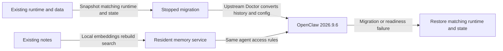

# Upgrade maintained OpenClaw support to 2026.9.6

**Status:** Approved for implementation
**Issue:** [#114](https://github.com/coletaylor788/puddles/issues/114)
**Last updated:** 2026-09-26

## Human section

### Design

Bring the existing agents and integrations onto stable OpenClaw 2026.9.6. Keep the behavior we rely on and remove local fixes where upstream now supplies it.

#### Host and integrations

Port the maintained patches and plugins to the newer host. Preserve messaging, tool access, concurrency and agent ownership. Keep each regression when an upstream fix replaces a local patch. Delivery uses the process on main; this plan adds only upgrade requirements.

#### Local memory

The newer host replaces the retired search backend with local embeddings over the existing notes. Notes stay local and each agent keeps its access. Search ranking may change. With the model and index ready, searches should finish in under a second. Measure model startup, index building and automatic recall separately. The upgrade does not increase the upstream search timeout.

#### Conversation history and recovery

Upstream Doctor owns conversion to the new conversation storage. Our deployment integration invokes it and verifies history, ownership, schedules and archive references. The old application cannot read the new format. Recovery therefore restores the matching application and complete stopped-state snapshot together.

### Status

The design is approved and compatibility implementation is underway. Focused tests cover the ported patches and preserved defaults. Combined validation, independent review and delivery through main’s process remain pending.

## Agent section

### State

- Target verified 2026-09-26: `v2026.9.6`, source commit `eb377ac59e6c9fd6c7705028034812becf00271b`; GitHub stable and npm latest agree.
- Existing source pin: `1391f7cd2d40ab5bbcf2f5f831d3a64f520e72d7` (`v2026.9.3`). Reuse landed compatibility code; [completed Plan 037](completed/037-openclaw-stable-upgrade.md) remains historical evidence.
- Implementation branch: `codex/openclaw-2026-9-6`, based on main `2437225ebcde955a5c73ea1bc8dd04947ef7fb93`. The current main process and design structure apply.
- Restart means a new candidate and run under main's process, not continuation of the paused release or reconstruction of its receipts. Preserve existing recovery assets and unrelated owners' state. Ports and isolated focused tests are underway. No deployment slot has been claimed and production is unchanged.

### Scope and acceptance criteria

- Compatible host, SDK consumers, configured plugins, browser and native dependencies on the exact target. Update all affected version, package-manager, manifest, lockfile and workflow pins consistently.
- Every maintained behavior in the patch table remains covered, including when upstream replaces a local patch. Moved test paths/projects must retain their assertions in the cumulative pool.
- Local embeddings produce real vectors before readiness, remain resident and stop with their owning gateway, including forced loss and on-demand startup. Preserve restricted memory, disabled agents and session-indexing opt-in.
- Use upstream migration to upgrade legacy state to schema 23, including prerequisite migrations, without losing retained histories, reset boundaries, ownership, scheduled jobs, journal-only committed data or archive references.
- Preserve effective tool exposure, messaging policy and concurrency. Keep explicit settings and inheritance intact.
- Installed plugin discovery, Doctor repair, tool factories and deferred imports work from the portable artifacts without ancestor checkouts or registry fallback.
- Failed migration, failed readiness and interruption restore the complete old state with its matching runtime, interpreter and browser.

### Architecture and decisions

The current [safe-feature-development skill](../../.github/skills/safe-feature-development/SKILL.md) owns the entire development and release process. The [runner guide](../../packages/e2e/README.md), [deployment coordination](../../packages/e2e/DEPLOYMENT_COORDINATION.md) and [patch guide](../openclaw-setup/patches/README.md) supply its commands and contracts. Read their current main versions when restarting. This plan adds no alternate builder, gate, handoff, slot, review, merge or deployment procedure. Previous upgrade runbooks and Plan 039's historical execution details are not restart instructions.

Upgrade-specific decisions follow.

- **Toolchain:** keep Node `26.1.0` and Corepack `0.36.0`; adopt the tag's integrity-bound pnpm `12.4.0` instead of `12.3.4`. The [tagged manifest](https://github.com/openclaw/openclaw/blob/v2026.9.6/package.json) still accepts Node `>=24.16.0 <25 || >=26.1.0`. Revalidate native modules against the selected interpreter.
- **Database:** OpenClaw ships the schema 23 converter and prerequisite migrations in its maintained Doctor repair path. The [schema contract](https://github.com/openclaw/openclaw/blob/v2026.9.6/docs/reference/database-schemas/agent-schema-history.md) describes transcript compression that preserves the original JSON and binary vector storage. The existing deployment flow already calls `doctor --fix` after stopping writers and taking its snapshot. Reconcile only changed integration APIs and current core/plugin normalization; no custom history converter is proposed. Exact selected writes must compare against the normalized configuration. Do not replace upstream migration with ad hoc SQL or whole-config writes.
- **Memory timing:** requester approved removing a timeout increase as an upgrade requirement. Target under one second for warm local search with the model resident and index ready, including query embedding, lookup and permitted result retrieval. This is a target to validate, not an existing benchmark. Leave upstream's `30_000` failure cutoff in `extensions/memory-core/src/memory/search-deadline.ts` unchanged; it is not the latency target and needs no new override. Measure startup, index building, queueing, warm search and automatic recall separately. Retain the existing ninety-second startup allowance and explicit thirty-second automatic-recall cap. Automatic recall may include an additional model call; embedding speed alone does not measure that flow.
- **Tool discovery:** preserve authored `tools.toolSearch`; set it to `false` only when absent in migrated configuration, retaining direct schemas. Do not change upstream defaults for fresh installations.
- **Messaging:** 9.5 enables `tools.message.crossContext.allowAcrossProviders` when unset. Preserve authored global/per-agent settings and inheritance; materialize the old denied default only where implicit. Preserve within-provider policy and legacy normalization. These controls govern bound-conversation actions, not arbitrary shell or unbound CLI access.
- **Concurrency:** preserve authored limits; where `agents.defaults.maxConcurrent` is absent, carry forward the predecessor's effective value instead of adopting the new CPU-scaled default. Keep separate subagent and cron limits.
- **Other defaults:** keep automatic cold transcript archiving off where unset and preserve authored settings, optional integrations and model choices. Do not introduce upstream Atomic Updates as another deployment owner.
- **Browser and plugins:** use the target's browser inputs and supported SDK exports. Preserve browser profiles, sandbox mounts and generated iMessage configuration metadata. Doctor/startup must preserve the sealed installed package bytes.
- **Release selection:** [2026.9.6](https://github.com/openclaw/openclaw/releases/tag/v2026.9.6) is pinned for approval. Any later target needs a reviewed delta. Its upstream CI/soak waivers do not replace the repository's required validation. The separately rebuilt macOS desktop app is outside this host upgrade.

Each check below used `git apply --check` independently against pristine tagged source. Failures can include missing predecessor patches; passes establish textual compatibility only. Semantic disposition remains implementation work.

| Maintained patch | Clean-tag check | Proposed disposition after approval |
| --- | --- | --- |
| `managed-local-service-lifecycle` | Fails | Reconcile new service ownership code; retain graceful and forced-death guarantees. |
| `gateway-memory-warmup` | Fails | Port readiness/residency only where upstream lacks equivalent behavior. |
| `file-lock-stale-reclaim-guard` | Fails | Audit fs-safe 0.18.1 against the old 0.8.5 patch; retain contention and killed-owner regressions. |
| `sessions-yield-block-and-gather` | Fails | Reconcile current yield/replay flow; keep requester-bound blocking and gathering. |
| `sessions-yield-durable-handoff` | Fails | Rebase after gather work; acknowledge only durably persisted tool results. |
| `subagent-cross-agent-spawn-fix` | Fails | Recheck current spawn/visibility policies; preserve explicit target and inherited restrictions. |
| `skill-workshop-sandbox-fix` | Fails | Reconcile current workshop permissions without broadening access. |
| `imessage-message-part-coalescing` | Fails | Port monitor hooks and regenerate channel metadata from current source. |
| `sandbox-discovery-failure-fix` | Fails | Retain explicit failure behavior; check current upstream equivalent. |
| `browser-userdata-dir-fix` | Pass | Retain provisionally; prove installed profile and singleton behavior. |
| `builtin-memory-migration` | Pass | Retain provisionally; reprove source isolation and current Doctor migration. |
| `silent-reply-completion-evidence` | Fails | Reconcile incomplete-turn recovery and restart replay; preserve intentional silence. |
| `stopped-state-migration-sdk` | Fails | Reconcile the wrapper around upstream repair APIs and schema/cron partition behavior; keep upstream responsible for conversion. |
| `scoped-container-temp-root` | Fails | Reconcile current mount mapping; keep test-owned staging and production locking. |
| `active-memory-cold-recall` | Fails | Reconcile concurrent recall and changed budgets; preserve explicit recall cap. |
| `active-memory-fixture-cleanup` | Fails | Keep cleanup assertions in the current fixtures; do not omit old coverage. |
| `gateway-protocol-declaration-portability` | Fails | Old fragment files are gone; prefer upstream composer and port portability regression, adding a fix only if reproduced. |

### Implementation

- Reconcile the patch table against current upstream behavior, then port required fixes and cumulative regression registrations. Audit fs-safe 0.18.1 instead of carrying forward the old 0.8.5 dependency patch blindly. Prefer the new protocol composer to recreating deleted fragments.
- Align target, SDK and toolchain pins; adapt configured plugin packaging, generated metadata and browser inputs.
- Adapt the existing integration with upstream stopped repair only where its APIs changed; preserve the selected defaults. Extend existing fixtures to verify upstream conversion, warm search latency and package contracts.
- Execute these changes through the process linked above, starting from current main. General process work belongs in its shared owner, not in this upgrade plan.

### Validation

The shared process supplies review and cumulative/installed/physical gates. This upgrade must contribute or retain the following assertions within those gates, using synthetic data and recording adapters.

- Each patch behavior, including durable completion ownership, intentional silence, message-part coalescing, explicit child targeting and killed-lock-owner recovery.
- Real installed plugin discovery, Doctor/startup, cold imports, portable dependency closure and unchanged package digests.
- Actual local vectors and recall; measure representative warm searches against the under-one-second target and investigate misses rather than extending timeouts. Record startup/indexing and automatic recall separately. Verify residency, shutdown, forced-death cleanup and allowed/denied memory and delegation flows.
- Tool-discovery preservation, cross-provider allowed/denied cases with inheritance, and unchanged effective concurrency.
- Upstream Doctor conversion from the legacy generation through its prerequisite migrations to schema 23, WAL data, histories, ownership, archives, selected config/job drift rejection and interrupted rollback with the predecessor runtime.
- Browser profile reuse and mount isolation; DEV/PROD availability while TEST exercises the changed runtime.

Focused repository checks pass: 55 migration/toolchain/diagnostic tests and 37 native-pipeline tests. The pipeline uses the maintained upstream test entrypoint and verifies every registered test is collected. The unpatched fs-safe 0.18.1 regression reproduces failure with a persistent guard; the current protocol registry passes its retained identity regression. Combined source, installed and delivery proofs remain pending. No prior 2026.9.3 receipt counts as proof for this target.

### Rollout and rollback

Follow the shared process on main without a plan-specific rollout sequence. The upgrade-specific recovery requirement is a current, verified, complete stopped-state snapshot, including journals and transcript archives, paired with the old runtime, interpreter, service, packages and browser. Schema 23 cannot be downgraded by reinstalling an older package or changing schema markers. A later restore can lose post-snapshot work; preserve the failed new state. Existing backups remain protected but do not substitute for the new run's current production baseline.

### Review log

- Source re-vet identified schema/toolchain drift and changed search, discovery, messaging and concurrency defaults. Independent proposal review's messaging-policy omission was resolved.
- Requester directs a fresh restart through main's process. Both plans reference that process and retain only upgrade requirements, decisions and evidence obligations.
- Requester approved sub-second warm search as the validation target, separate cold/recall measurements and no upgrade-specific timeout increase. History conversion is upstream-owned; our requirement is integration and validation. The requester approved the complete design on 2026-09-26.

### Checklist

- [x] Verify target and audit all maintained public patches.
- [x] Define upgrade-specific compatibility, migration and preservation requirements.
- [x] Align with current main and remove duplicated execution procedures.
- [x] Obtain design approval.
- [ ] Deliver target compatibility, migration and regression coverage.
- [ ] Satisfy the shared process's completion gate for this upgrade.
