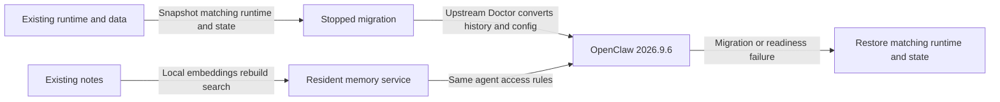
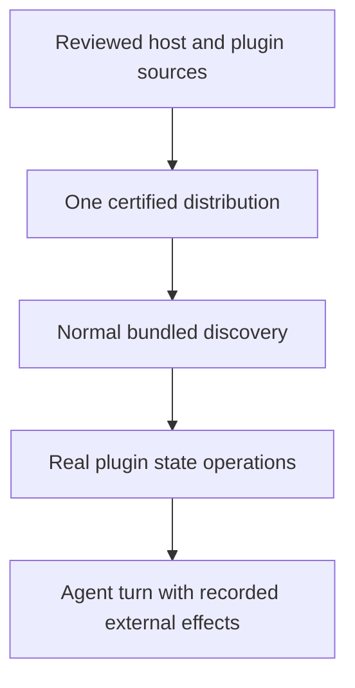

# Upgrade maintained OpenClaw support to 2026.9.6

**Status:** Released and verified; awaiting requester validation
**Issue:** [#114](https://github.com/coletaylor788/puddles/issues/114)
**Last updated:** 2026-09-29

## Human section

### Design

Bring the existing agents and integrations onto stable OpenClaw 2026.9.6. Keep the behavior we rely on and remove local fixes where upstream now supplies it.

#### Host and integrations

Port the maintained patches and plugins to the newer host. Preserve messaging, tool access, concurrency and agent ownership. Upstream now replaces the silent-reply fix, protocol declaration workaround and cold-memory recall fix. Their patches retain only regression tests. The discovery patch also drops its original error-handling fix; a separate registry-selection correction remains. Keep the other fixes only where source comparison or baseline tests show a remaining need. The new iMessage entrypoint also needs a narrow correction to honor the configured policy for unmentioned group messages. It uses upstream’s existing classifier so mentions and direct requests still require answers. Delivery uses the process on main; this plan adds only upgrade requirements.

#### Local memory

The newer host replaces the retired search backend with local embeddings over the existing notes. Notes stay local and each agent keeps its access. Search ranking may change. With the model and index ready, searches should finish in under a second. Measure model startup, index building and automatic recall separately. The upgrade does not increase the upstream search timeout.

#### Conversation history and recovery

Upstream Doctor owns conversion to the new conversation storage. Our deployment integration invokes it and verifies history, ownership, schedules and archive references. The old application cannot read the new format. Recovery therefore restores the matching application and complete stopped-state snapshot together. Browser cleanup must also run through the verified old application and its interpreter, because the restored configuration can contain fields the new application rejects. An interrupted rollback repeats from the same verified snapshots.

#### Migration duration

Doctor imports retained conversation files into the new database. The deployment controller gave it the same one-minute limit as service commands. A production upgrade reached that limit while importing history. The config edit had finished, but the journal still reported the config phase.

Give Doctor a 20-minute limit and record its phase before starting it. The gateway stays stopped during that command; preparation, verification and any rollback add time beyond this limit. The exact release artifact completed a fresh, uninterrupted synthetic migration in 14 minutes 45 seconds. All history content, ownership and database integrity checks passed. Future releases with comparable migration work must measure representative volume before production. Keep service checks and memory search limits unchanged. A timeout still restores the saved runtime, state and external skill directories. Fast regressions cover the timeout contract and rollback; the larger installed measurement is a selected release check, not added work in every CI run.

#### Legacy skill proposal ownership decision

Three applied Skill Workshop records came from the old CLI without owning-agent metadata. Their target skills exactly match the applied drafts, and their rollback records are retained. Multiple agents share the workspace, so the new host cannot infer a unique owner. Doctor refuses migration. Configuration parity does not cover this state, and TEST omitted this legacy shape.

Approved correction:

1. Assign the three records to Main. Add only missing ownership after checking exact metadata and applied-content digests. Preserve skills, drafts, applied status and rollback records.
2. Check ownership before shutting down production. Read both legacy metadata files and records already imported into SQLite. Refuse ambiguous records without changing them.
3. Bind and snapshot the exact external skill directories Doctor can move. Restore them on failure without overwriting unrelated changes.
4. Rehearse with isolated state and mapped workspace copies. Add a committed regression for ambiguous ownership and external directory rollback, then run the corrected release through the shared process.

During the failed attempt, Doctor moved six external skill directories before refusing the ownerless records. Automatic rollback restored the runtime and state, and reviewed recovery restored all six original directories from the retained failed state. Contents and permissions matched; the copies remain available. The new regression must fail when only the state directory is rolled back.

The requester approved assigning these three records to Main on September 28. The repair runs after the stopped snapshot and before Doctor, with exact metadata, draft, rollback and skill-content preconditions. No ownership is inferred from the shared workspace.

The migration binds each agent's workspace and skill destination to the configuration Doctor will use. It checks scheduled jobs for references to skills that will move. It refuses interrupted skill writes, legacy collection backups and destinations outside the saved state until those cases have their own rehearsal. TEST includes completed CLI updates without owners. A separate real Doctor regression uses an external workspace and proves that rollback restores its moved skill.

The candidate ownership check uses the same plugin-aware configuration preview that seals the migration. Core-only normalization can leave legacy plugin settings in place and reject a valid sealed operation. The stable preflight drift checks remain separate.

SQLite inspection must leave the original state untouched. Even a read-only SQLite connection can create journal sidecars. The ownership preflight therefore reads a stable private copy of the database and committed WAL data. It refuses changing inputs or a rollback journal and removes the temporary copy after inspection. This preserves the exact state that rollback must restore.

#### Installed plugin state access

We shipped an incompatible combination: the new OpenClaw host and a maintained agent plugin still installed as a local archive. The host could load the plugin, but refused the persistent state API it needs before answering. A real message reached the channel and failed at that first agent operation.

OpenClaw 2026.9.6 grants this API to bundled plugins and verified official installations. Our patched archive qualified as neither. The test gate checked that the plugin loaded, but never started an actual turn through the installed plugin with its real state API. That was the missing test.

The approved correction ships the same reviewed plugin as part of our certified private runtime bundle. OpenClaw then treats it as a bundled component and permits the state operations it requires. Use that existing mechanism and retain the real source and dependency provenance.

The migration also removes the exact old installation record. Otherwise OpenClaw can keep selecting the external copy instead of the bundled copy. Use the supported registry API under a stopped snapshot, preserve plugin data and unrelated records, and restore the old selection with its package and state on rollback.

#### Full-turn validation

Keep the channel adapter, gateway, installed agent plugin, state API and model SDK real. A loopback HTTP service stands in for the provider API and returns fixed protocol responses. Record external delivery at the last boundary. Unknown requests fail the test; the fixture has no live-provider fallback.

Use this path in DEV and TEST for a greeting, tool execution and a reply, then restart with synthetic pending cleanup and prove the next turn succeeds. Assert the recorded reply as well as plugin state and source selection. Keep a negative case proving that an unrelated local archive remains untrusted. TEST also starts with the old external install record and proves its removal and restoration on rollback.

The requester authorized bounded real-provider calls with synthetic prompts to inspect protocol shapes. Keep credentials and personal data out of recordings. Once per release, run a bounded real-provider greeting in isolated TEST with recorded delivery. This checks authentication and service compatibility that a deterministic fixture cannot establish. A missing, skipped or failed required turn blocks promotion. Both fixtures and the bounded live check use the SDK's supported HTTP streaming transport. This covers the full agent path but does not certify the production-default WebSocket transport.

Make these checks part of the maintained process and scripts for future releases. The requester approved this correction after independent review. It changes the plugin's host capability classification within the existing trusted-host architecture. Agent permissions, sandboxing and data access policies remain unchanged.

#### Legacy plugin selection capture

The replacement passed real turns in DEV and TEST, including a live-provider greeting. Production's final read-only check then found the old external plugin selected again. Its record was stored in the predecessor's schema-1 SQLite table. Capture looked at the new database representation and JSON config, incorrectly reported no selection, and sealed no retirement. Upstream migration preserved the old record correctly. Our fixture covered an external record in the current representation and missed this predecessor shape.

Read the legacy record from a stable private copy of the database and committed WAL data. Never open the source through SQLite. Validate the singleton and records, and reject conflicting database, legacy JSON or config representations for the selected plugin. Doctor owns conflicts among unrelated plugins. Retirement reads and preserves the full canonical registry after Doctor. Bind the record values and package contents as before. Canonicalize object field order when hashing records because Doctor may reorder fields; changed values and array order still fail the check. Keep conversion in upstream Doctor.

Retire the bound selection after Doctor, because Doctor can also import a legacy JSON record. Check a sealed requirement for bundled selection after that retirement and before gateway startup, even when capture found no record. A surprise external selection must fail the activation transaction and restore the predecessor automatically. Keep unrelated records, plugin data and the existing trust rules unchanged.

Add a schema-1 regression covering capture, actual upstream migration, retirement and exact rollback. Also cover malformed/conflicting records, source drift, legacy JSON import and a post-Doctor selection appearing when no retirement was sealed. This repairs the approved packaging and retirement design; it adds no new trust exception.

A database migration fixture is not automatically a runnable gateway fixture. Keep nonempty synthetic task data, but project its known placeholder values to valid terminal values before using it for startup. Exercise the actual registry restore after migration and start the gateway from that migrated state. Production task records and runtime validation remain unchanged.

### Status

The replacement candidate passes CI, DEV and TEST. The checks cover real installed agent turns, local embeddings, upstream history migration, post-migration gateway startup, automatic rollback, and one bounded real-provider greeting with recorded delivery. The fresh volume migration preserves all 5,445 histories and 168,172 events in 14 minutes 45 seconds.

Production is healthy on OpenClaw 2026.9.6 and Node 26.1.0. Read-only verification confirms the migrated state, bundled-plugin selection, approved ownership changes and recovery integrity. Deployment slots are released. Final requester validation remains. The real-provider check covers HTTP/SSE; production-default WebSocket transport remains outside that proof.

## Agent section

### State

- Selected public source: `7e651afe268365d3442bc0f6303a8b30d76aca1c`. Composed CI `36575158660`, attempt 1, passes. Build `bf085314024c5451ca432cf10165dee64721845749d8e782e1a81e4af0bcf56c` is the single artifact promoted through the environments. Later main changes do not replace these selected inputs.
- DEV and TEST pass on that artifact. Both slots are released. TEST's final rollback restored its original configuration and its owned target was removed. Compact proofs are retained separately from completed fixtures.
- Production transaction `activation-1790694220275-59544` is healthy and independently verified. PROD and DEV health return HTTP 200; all eight primary agent databases use schema 23. The bundled plugin is present and the superseded external selection is absent. All three approved ownership repairs preserve the original skill, draft and rollback contents. The maintained recovery identity passes. PROD is released; no production test messages were sent.
- The known synthetic legacy task now has valid terminal values with its payload and linked delivery record preserved. The archive and production task data are unchanged. The committed regression exercises actual SDK migration and task-registry restoration; the managed rehearsal starts the gateway after migration.
- Retained review is clear. Earlier failed candidates and their receipts are historical evidence, not certification for this build. Detailed environment and recovery records remain private.

### Scope and acceptance criteria

- Compatible host, SDK consumers, configured plugins, browser and native dependencies on the exact target. Update all affected version, package-manager, manifest, lockfile and workflow pins consistently.
- Every maintained behavior in the patch table remains covered, including when upstream replaces a local patch. Moved test paths/projects must retain their assertions in the cumulative pool.
- Local embeddings produce real vectors before readiness, remain resident and stop with their owning gateway, including forced loss and on-demand startup. Preserve restricted memory, disabled agents and session-indexing opt-in.
- Use upstream migration to upgrade legacy state to schema 23, including prerequisite migrations, without losing retained histories, reset boundaries, ownership, scheduled jobs, journal-only committed data or archive references.
- Preserve effective tool exposure, messaging policy and concurrency. Keep explicit settings and inheritance intact.
- Installed plugin discovery, Doctor repair, tool factories and deferred imports work from the portable artifacts without ancestor checkouts or registry fallback.
- Failed migration, failed readiness and interruption restore the complete old state with its matching runtime, interpreter and browser.

### Architecture and decisions

- Workshop recovery is part of the activation transaction. Seal agent paths and approved metadata/content hashes in both the target identity and migration manifest. Validate the effective predecessor and candidate config, inspect ownership before shutdown, then repeat inventory after writers stop. Snapshot original state and each referenced external directory before any metadata repair or Doctor migration. Retained original metadata makes ownership repair reversible.
- SQLite inventory never opens the source through SQLite. Copy the database and committed WAL into an owner-only temporary directory, verify original identity, content and sidecar presence around copying, and let SQLite rebuild coordination files only there. Reject source drift and rollback journals. Preserve fail-closed inspection when no Workshop binding is supplied.
- Recovery verifies external snapshots and existing destinations before restoring absent directories with exclusive publication. A changed external directory is a recovery conflict, never permission to overwrite it. Already restored matching directories are safe to reuse after interruption. Bind sources and destinations; reject unsupported collection backups, pending apply recovery and external agent directories before shutdown.
- Fast validation covers ambiguous ownership, hash drift, SQLite-only records, decoded scheduled-job references, external rollback, interruption, configuration path mismatch and the actual upstream Doctor migration. Physical TEST seeds three synthetic completed updates and a completed create. Keep the final cumulative gate and exact artifact progression unchanged.

The current [safe-feature-development skill](../../.github/skills/safe-feature-development/SKILL.md) owns the entire development and release process. The [runner guide](../../packages/e2e/README.md), [deployment coordination](../../packages/e2e/DEPLOYMENT_COORDINATION.md) and [patch guide](../openclaw-setup/patches/README.md) supply its commands and contracts. Read their current main versions when restarting. This plan adds no alternate builder, gate, handoff, slot, review, merge or deployment procedure. Previous upgrade runbooks and Plan 039's historical execution details are not restart instructions.

Upgrade-specific decisions follow.

- **Toolchain:** keep Node `26.1.0` and Corepack `0.36.0`; adopt the tag's integrity-bound pnpm `12.4.0` instead of `12.3.4`. The [tagged manifest](https://github.com/openclaw/openclaw/blob/v2026.9.6/package.json) still accepts Node `>=24.16.0 <25 || >=26.1.0`. Revalidate native modules against the selected interpreter.
- **Database:** OpenClaw ships the schema 23 converter and prerequisite migrations in its maintained Doctor repair path. The [schema contract](https://github.com/openclaw/openclaw/blob/v2026.9.6/docs/reference/database-schemas/agent-schema-history.md) describes transcript compression that preserves the original JSON and binary vector storage. The existing deployment flow already calls `doctor --fix` after stopping writers and taking its snapshot. Reconcile only changed integration APIs and current core/plugin normalization; no custom history converter is proposed. Exact selected writes must compare against the normalized configuration. Do not replace upstream migration with ad hoc SQL or whole-config writes.
- **Memory timing:** requester approved removing a timeout increase as an upgrade requirement. Target under one second for warm local search with the model resident and index ready, including query embedding, lookup and permitted result retrieval. Leave upstream's `30_000` failure cutoff in `extensions/memory-core/src/memory/search-deadline.ts` unchanged; it is not the latency target and needs no new override. Measure startup, index building, queueing, warm search and automatic recall separately. Retain the existing ninety-second startup allowance and explicit thirty-second automatic-recall cap. Automatic recall may include an additional model call; embedding speed alone does not measure that flow.
- **Tool discovery:** preserve authored `tools.toolSearch`; set it to `false` only when absent in migrated configuration, retaining direct schemas. Do not change upstream defaults for fresh installations.
- **Messaging:** 9.5 enables `tools.message.crossContext.allowAcrossProviders` when unset. Preserve authored global/per-agent settings and inheritance; materialize the old denied default only where implicit. Preserve within-provider policy and legacy normalization. These controls govern bound-conversation actions, not arbitrary shell or unbound CLI access.
- **Concurrency:** preserve authored limits; where `agents.defaults.maxConcurrent` is absent, carry forward the predecessor's effective value instead of adopting the new CPU-scaled default. Keep separate subagent and cron limits.
- **Other defaults:** keep automatic cold transcript archiving off where unset and preserve authored settings, optional integrations and model choices. Do not introduce upstream Atomic Updates as another deployment owner.
- **Browser and plugins:** use the target's browser inputs and supported SDK exports. Preserve browser profiles, sandbox mounts and generated iMessage configuration metadata. Doctor/startup must preserve the sealed installed package bytes.
- **Release selection:** [2026.9.6](https://github.com/openclaw/openclaw/releases/tag/v2026.9.6) is pinned for approval. Any later target needs a reviewed delta. Its upstream CI/soak waivers do not replace the repository's required validation. The separately rebuilt macOS desktop app is outside this host upgrade.

The audit below distinguishes upstream fixes from behavior we still add. Regression-only patches carry tests into the cumulative suite; they do not modify the runtime. A passing patch application is not evidence that a fix is needed.

| Maintained patch | Current disposition | Evidence or remaining work |
| --- | --- | --- |
| `managed-local-service-lifecycle` | Narrow retained integration | Use upstream clean-stop, lease recovery and relay cleanup. Keep POSIX relay ownership and gateway-loss integration absent upstream. |
| `gateway-memory-warmup` | Retained behavior | Upstream lacks opt-in gateway warmup, the lifetime service lease, two-vector readiness and embedding-only residency. Remove the old extra search timeout. |
| `file-lock-stale-reclaim-guard` | Retained bug fix | Unpatched fs-safe 0.18.1 fails the persistent-guard regression. Patched dependency passes both lock regressions. Preserve the new upstream root-scoped path. |
| `sessions-yield-block-and-gather` | Retained behavior | Keep requester-bound gathering and blocking. Use current upstream handoff ownership and preserve explicit message waits. |
| `sessions-yield-durable-handoff` | Retained integration | Use upstream asynchronous storage and acknowledge only committed tool results, including failure and restart. |
| `subagent-cross-agent-spawn-fix` | Narrow retained behavior | Upstream supplies explicit-target schema support. Keep default explicit targeting for scheduled callers and conditional inheritance of child restrictions. |
| `skill-workshop-sandbox-fix` | Retained access policy | Upstream deliberately requires a library capability in its shared tool gate. Preserve the approved sandbox workshop behavior through that gate. |
| `imessage-group-inbound-policy` | Required upgrade repair | The native no-output scenario reproduces an extra model request because iMessage hardcodes `user_request`. Reuse upstream classification for both ingress and message context; retain direct, mentioned and command requests. |
| `imessage-message-part-coalescing` | Retained feature | Upstream text debounce does not replace selective text, link and media grouping. Current monitor tests pass 64 cases. |
| `sandbox-discovery-failure-fix` | Original bug fix removed; two lines retained | Upstream already propagates discovery errors. Two selected-registry regressions fail on pristine 9.6 and pass with the remaining change. |
| `browser-userdata-dir-fix` | Retained bug fix | The same profile fixture fails on the pristine entrypoint, which still hardcodes the profile directory, and passes with the patch. |
| `builtin-memory-migration` | Regression only | No runtime converter or retired search-backend override remains. Upstream Doctor owns migration. |
| `silent-reply-completion-evidence` | Runtime fix removed | Upstream supplies completion evidence and intentional-silence handling. Retain 57 passing regressions. |
| `stopped-state-migration-sdk` | Retained SDK integration | Expose current upstream repair and cron APIs to the stopped deployment flow. Keep conversion in Doctor; preserve explicit legacy ownership. |
| `scoped-container-temp-root` | Retained isolation behavior | Three selected-root and invalid-root regressions fail on pristine upstream and pass with the patch. |
| `active-memory-cold-recall` | Runtime fix removed | Pristine 9.6 completes both slow-provider cases and trigger-timeout continuation. Retain tests for cold continuation and the unchanged configured recall limit. |
| `active-memory-fixture-cleanup` | Test fixture only | Join delayed provider cleanup so the retained cold-recall tests release their own resources. |
| `gateway-protocol-declaration-portability` | Runtime workaround removed | Upstream's typed protocol registry replaces the deleted fragments. Retain registry identity/type coverage without replacement runtime annotations. |
| `core-declaration-portability` | Required build repair | Explicit types preserve twelve affected Bash-tool, SQLite, prepared-session, client-tool and plugin-schema exports. Bidirectional checks pass before and after annotation. Retained review is clear; the complete composed CI build passes all declaration groups. |

### Implementation

- Reconcile the patch table against current upstream behavior, then port required fixes and cumulative regression registrations. Audit fs-safe 0.18.1 instead of carrying forward the old 0.8.5 dependency patch blindly. Prefer the new protocol composer to recreating deleted fragments.
- Align target, SDK and toolchain pins; adapt configured plugin packaging, generated metadata and browser inputs.
- Adapt the existing integration with upstream stopped repair only where its APIs changed; preserve the selected defaults. Extend existing fixtures to verify upstream conversion, warm search latency and package contracts.
- Execute these changes through the process linked above, starting from current main. General process work belongs in its shared owner, not in this upgrade plan.

### Validation

The required accumulated command is `node packages/e2e/bin/openclaw-test-env.mjs ci`. CI `36575158660` passes for the selected merged sources. Build takes 231,266 ms and accumulated regressions take 948,220 ms. Packaging, immutable handoff verification and builder finalization pass.

| Proof on the exact candidate | Result |
| --- | --- |
| DEV wrapper | Four checks pass. |
| Installed upgrade behavior | All 35 assertions pass with zero skips. |
| Real local embedding check | Passes with zero skips; official provider inference is exercised. |
| Full agent turns | All 13 scenarios pass in both DEV and TEST through the real installed channel, plugin, state API and SDK. |
| Managed plugin migration | Discovery, cold imports, untrusted-state denial, bundled selection, retirement rollback and gateway startup after migration pass. |
| History volume | Fresh uninterrupted Doctor run: 885,430 ms within the 1,200,000 ms bound. All 5,445 histories, 168,172 events and 608 indexed sessions across eight agents retain exact content, IDs, ownership and index relationships. Foreign keys and database integrity pass; runtime bytes are unchanged. |
| Physical TEST | Deliberate activation failure rolls back. Normal migration and startup reach healthy. Certification and final rollback pass; the synthetic target is removed. |
| Real provider | Exactly one synthetic greeting request passes in TEST with recorded delivery. The receipt names HTTP/SSE; it does not certify WebSocket. |
| Production | Healthy activation and read-only verification pass: OpenClaw 2026.9.6, Node 26.1.0, eight schema-23 agent databases, bundled selection, three approved ownership repairs with exact content preservation, and recovery integrity. PROD and DEV return HTTP 200. No verification messages are sent. |

The synthetic task regression reproduces `Invalid persisted task status: "completed"` before the fix. Actual installed registry restoration passes after the narrow fixture projection. All 35 focused checks pass with zero skips. The retained reviewer independently passes both installed registry cases. No production parser or task data is changed.

Keep required missing or skipped installed checks as failures. Repeated full-turn tests use deterministic provider responses without live fallback. Live production validation is read-only and sends no messages. Earlier attempts remain in Git history and private evidence; they do not qualify this candidate.

### Rollout and rollback

The builder seals the separate TEST and PROD inputs and literal manifests before CI. Each environment selects its bound migration and full configuration checks. Follow the maintained process on main for selection and promotion; later unrelated merges do not invalidate an already selected candidate. Retain the real interpreter proof during handoff. The failed rollback candidate cannot be promoted even though its earlier migration and activation proofs passed. Its replacement starts again at accumulated CI and DEV.

Follow the shared process on main without a plan-specific rollout sequence. The upgrade-specific recovery requirement is a current, verified, complete stopped-state snapshot, including journals and transcript archives, paired with the old runtime, interpreter, service, packages and browser. Schema 23 cannot be downgraded by reinstalling an older package or changing schema markers. A later restore can lose post-snapshot work; preserve the failed new state. Existing backups remain protected but do not substitute for the new run's current production baseline.

### Review log

- The requester approved the design, the memory timing decision, the three legacy ownership assignments, bundled-plugin packaging, provider-boundary fixtures and bounded synthetic real-provider inspection. These approvals cover the current implementation.
- Retained review is clear for the final behavior diff. The same reviewer followed remediation, including stable SQLite inspection, selected-plugin retirement, complete handoff copy verification and the synthetic task correction.
- The final task correction preserves the original schema archive and production validation. Its installed regression fails before the repair and passes afterward; the reviewer independently verifies both cases.
- The plans follow current main's shared lifecycle. This status cleanup changes documentation only and requires no runtime rebuild or repeated release gate.

### Checklist

- [x] Verify target and audit all maintained public patches.
- [x] Define upgrade-specific compatibility, migration and preservation requirements.
- [x] Align with current main and remove duplicated execution procedures.
- [x] Obtain design approval.
- [x] Deliver target compatibility, migration and regression coverage.
- [x] Approve the bundled-plugin correction and provider-boundary testing.
- [x] Implement the correction and pass installed capability and full-turn coverage.
- [x] Pass the shared release gates and verify healthy production after the message-handling repair.
- [ ] Receive the requester's final validation and task-completion decision.
