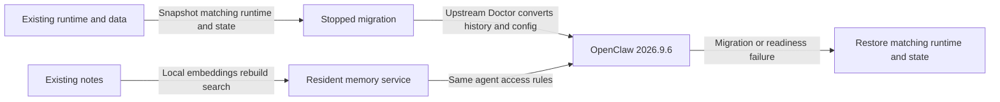

# Upgrade maintained OpenClaw support to 2026.9.6

**Status:** Implementation active; approved release handoff repair in progress
**Issue:** [#114](https://github.com/coletaylor788/puddles/issues/114)
**Last updated:** 2026-09-27

## Human section

### Design

Bring the existing agents and integrations onto stable OpenClaw 2026.9.6. Keep the behavior we rely on and remove local fixes where upstream now supplies it.

#### Host and integrations

Port the maintained patches and plugins to the newer host. Preserve messaging, tool access, concurrency and agent ownership. Upstream now replaces the silent-reply fix, protocol declaration workaround and cold-memory recall fix. Their patches retain only regression tests. The discovery patch also drops its original error-handling fix; a separate registry-selection correction remains. Keep the other fixes only where source comparison or baseline tests show a remaining need. The new iMessage entrypoint also needs a narrow correction to honor the configured policy for unmentioned group messages. It uses upstream’s existing classifier so mentions and direct requests still require answers. Delivery uses the process on main; this plan adds only upgrade requirements.

#### Local memory

The newer host replaces the retired search backend with local embeddings over the existing notes. Notes stay local and each agent keeps its access. Search ranking may change. With the model and index ready, searches should finish in under a second. Measure model startup, index building and automatic recall separately. The upgrade does not increase the upstream search timeout.

#### Conversation history and recovery

Upstream Doctor owns conversion to the new conversation storage. Our deployment integration invokes it and verifies history, ownership, schedules and archive references. The old application cannot read the new format. Recovery therefore restores the matching application and complete stopped-state snapshot together.

### Status

The patch audit and compatibility work pass focused checks, retained review and local DEV. Three public runtime fixes are removed because upstream covers them. All nine native messaging scenarios pass, and warm local searches take about 25–27 milliseconds without a timeout increase. Public and combined accumulated CI pass. Their exact artifact also passes DEV: all nine messaging scenarios, 33 upgrade assertions and real local embeddings. The corrected DEV smoke expectation still needs inclusion in the next final candidate CI.

Production delivery is blocked by a gap in the shared process: the builder seals a synthetic TEST migration whose paths and job preconditions cannot be used in production. The requester approved separate target bindings and reusable process, skill and script updates. The bindings, handoff and DEV configuration recovery are implemented. Focused regressions, retained review and a live DEV rollback check pass. Final cumulative CI and the merged release lifecycle remain. Production is unchanged.

## Agent section

### State

- Release blocker: [target-bound migration proposal](043-target-bound-state-migrations.md) records the approved shared-process repair. Implement and validate its target bindings before the final candidate proceeds through the ordinary release lifecycle.

- Target verified 2026-09-26: `v2026.9.6`, source commit `eb377ac59e6c9fd6c7705028034812becf00271b`; GitHub stable and npm latest agree.
- Existing source pin: `1391f7cd2d40ab5bbcf2f5f831d3a64f520e72d7` (`v2026.9.3`). Reuse landed compatibility code; [completed Plan 037](completed/037-openclaw-stable-upgrade.md) remains historical evidence.
- Implementation branch: `codex/openclaw-2026-9-6`, based on main `2437225ebcde955a5c73ea1bc8dd04947ef7fb93`, with process update `73985a748b5acce182adbc8a7bbd61dbef4190e9` merged. The current main process and design structure apply.
- Restart means a new candidate and run under main's process, not continuation of the paused release or reconstruction of its receipts. Preserve existing recovery assets and unrelated owners' state. The compatibility ports, focused tests and combined local DEV draft pass. DEV is healthy and its slot is released. Direct compiler execution and consistent incremental package selection pass focused checks, retained review and installed DEV validation. The declaration repair covers the prepared session and its client tools; type checks, retained review and the complete composed CI build pass. Unit coordination isolation passes 191 focused tests with a deliberately conflicting inherited record and lease, e2e typechecking and retained review. Final cumulative and release gates remain pending; production is unchanged.

### Scope and acceptance criteria

- Compatible host, SDK consumers, configured plugins, browser and native dependencies on the exact target. Update all affected version, package-manager, manifest, lockfile and workflow pins consistently.
- Every maintained behavior in the patch table remains covered, including when upstream replaces a local patch. Moved test paths/projects must retain their assertions in the cumulative pool.
- Local embeddings produce real vectors before readiness, remain resident and stop with their owning gateway, including forced loss and on-demand startup. Preserve restricted memory, disabled agents and session-indexing opt-in.
- Use upstream migration to upgrade legacy state to schema 23, including prerequisite migrations, without losing retained histories, reset boundaries, ownership, scheduled jobs, journal-only committed data or archive references.
- Preserve effective tool exposure, messaging policy and concurrency. Keep explicit settings and inheritance intact.
- Installed plugin discovery, Doctor repair, tool factories and deferred imports work from the portable artifacts without ancestor checkouts or registry fallback.
- Failed migration, failed readiness and interruption restore the complete old state with its matching runtime, interpreter and browser.

### Architecture and decisions

The current [safe-feature-development skill](../../.github/skills/safe-feature-development/SKILL.md) owns the entire development and release process. The [runner guide](../../packages/e2e/README.md), [deployment coordination](../../packages/e2e/DEPLOYMENT_COORDINATION.md) and [patch guide](../openclaw-setup/patches/README.md) supply its commands and contracts. Read their current main versions when restarting. This plan adds no alternate builder, gate, handoff, slot, review, merge or deployment procedure. Previous upgrade runbooks and Plan 039's historical execution details are not restart instructions.

Upgrade-specific decisions follow.

- **Toolchain:** keep Node `26.1.0` and Corepack `0.36.0`; adopt the tag's integrity-bound pnpm `12.4.0` instead of `12.3.4`. The [tagged manifest](https://github.com/openclaw/openclaw/blob/v2026.9.6/package.json) still accepts Node `>=24.16.0 <25 || >=26.1.0`. Revalidate native modules against the selected interpreter.
- **Database:** OpenClaw ships the schema 23 converter and prerequisite migrations in its maintained Doctor repair path. The [schema contract](https://github.com/openclaw/openclaw/blob/v2026.9.6/docs/reference/database-schemas/agent-schema-history.md) describes transcript compression that preserves the original JSON and binary vector storage. The existing deployment flow already calls `doctor --fix` after stopping writers and taking its snapshot. Reconcile only changed integration APIs and current core/plugin normalization; no custom history converter is proposed. Exact selected writes must compare against the normalized configuration. Do not replace upstream migration with ad hoc SQL or whole-config writes.
- **Memory timing:** requester approved removing a timeout increase as an upgrade requirement. Target under one second for warm local search with the model resident and index ready, including query embedding, lookup and permitted result retrieval. This is a target to validate, not an existing benchmark. Leave upstream's `30_000` failure cutoff in `extensions/memory-core/src/memory/search-deadline.ts` unchanged; it is not the latency target and needs no new override. Measure startup, index building, queueing, warm search and automatic recall separately. Retain the existing ninety-second startup allowance and explicit thirty-second automatic-recall cap. Automatic recall may include an additional model call; embedding speed alone does not measure that flow.
- **Tool discovery:** preserve authored `tools.toolSearch`; set it to `false` only when absent in migrated configuration, retaining direct schemas. Do not change upstream defaults for fresh installations.
- **Messaging:** 9.5 enables `tools.message.crossContext.allowAcrossProviders` when unset. Preserve authored global/per-agent settings and inheritance; materialize the old denied default only where implicit. Preserve within-provider policy and legacy normalization. These controls govern bound-conversation actions, not arbitrary shell or unbound CLI access.
- **Concurrency:** preserve authored limits; where `agents.defaults.maxConcurrent` is absent, carry forward the predecessor's effective value instead of adopting the new CPU-scaled default. Keep separate subagent and cron limits.
- **Other defaults:** keep automatic cold transcript archiving off where unset and preserve authored settings, optional integrations and model choices. Do not introduce upstream Atomic Updates as another deployment owner.
- **Browser and plugins:** use the target's browser inputs and supported SDK exports. Preserve browser profiles, sandbox mounts and generated iMessage configuration metadata. Doctor/startup must preserve the sealed installed package bytes.
- **Release selection:** [2026.9.6](https://github.com/openclaw/openclaw/releases/tag/v2026.9.6) is pinned for approval. Any later target needs a reviewed delta. Its upstream CI/soak waivers do not replace the repository's required validation. The separately rebuilt macOS desktop app is outside this host upgrade.

The audit below distinguishes upstream fixes from behavior we still add. Regression-only patches carry tests into the cumulative suite; they do not modify the runtime. A passing patch application is not evidence that a fix is needed.

| Maintained patch | Current disposition | Evidence or remaining work |
| --- | --- | --- |
| `managed-local-service-lifecycle` | Narrow retained integration | Use upstream clean-stop, lease recovery and relay cleanup. Keep POSIX relay ownership and gateway-loss integration absent upstream. |
| `gateway-memory-warmup` | Retained behavior | Upstream lacks opt-in gateway warmup, the lifetime service lease, two-vector readiness and embedding-only residency. Remove the old extra search timeout. |
| `file-lock-stale-reclaim-guard` | Retained bug fix | Unpatched fs-safe 0.18.1 fails the persistent-guard regression. Patched dependency passes both lock regressions. Preserve the new upstream root-scoped path. |
| `sessions-yield-block-and-gather` | Retained behavior | Keep requester-bound gathering and blocking. Use current upstream handoff ownership and preserve explicit message waits. |
| `sessions-yield-durable-handoff` | Retained integration | Use upstream asynchronous storage and acknowledge only committed tool results, including failure and restart. |
| `subagent-cross-agent-spawn-fix` | Narrow retained behavior | Upstream supplies explicit-target schema support. Keep default explicit targeting for scheduled callers and conditional inheritance of child restrictions. |
| `skill-workshop-sandbox-fix` | Retained access policy | Upstream deliberately requires a library capability in its shared tool gate. Preserve the approved sandbox workshop behavior through that gate. |
| `imessage-group-inbound-policy` | Required upgrade repair | The native no-output scenario reproduces an extra model request because iMessage hardcodes `user_request`. Reuse upstream classification for both ingress and message context; retain direct, mentioned and command requests. |
| `imessage-message-part-coalescing` | Retained feature | Upstream text debounce does not replace selective text, link and media grouping. Current monitor tests pass 64 cases. |
| `sandbox-discovery-failure-fix` | Original bug fix removed; two lines retained | Upstream already propagates discovery errors. Two selected-registry regressions fail on pristine 9.6 and pass with the remaining change. |
| `browser-userdata-dir-fix` | Retained bug fix | The same profile fixture fails on the pristine entrypoint, which still hardcodes the profile directory, and passes with the patch. |
| `builtin-memory-migration` | Regression only | No runtime converter or retired search-backend override remains. Upstream Doctor owns migration. |
| `silent-reply-completion-evidence` | Runtime fix removed | Upstream supplies completion evidence and intentional-silence handling. Retain 57 passing regressions. |
| `stopped-state-migration-sdk` | Retained SDK integration | Expose current upstream repair and cron APIs to the stopped deployment flow. Keep conversion in Doctor; preserve explicit legacy ownership. |
| `scoped-container-temp-root` | Retained isolation behavior | Three selected-root and invalid-root regressions fail on pristine upstream and pass with the patch. |
| `active-memory-cold-recall` | Runtime fix removed | Pristine 9.6 completes both slow-provider cases and trigger-timeout continuation. Retain tests for cold continuation and the unchanged configured recall limit. |
| `active-memory-fixture-cleanup` | Test fixture only | Join delayed provider cleanup so the retained cold-recall tests release their own resources. |
| `gateway-protocol-declaration-portability` | Runtime workaround removed | Upstream's typed protocol registry replaces the deleted fragments. Retain registry identity/type coverage without replacement runtime annotations. |
| `core-declaration-portability` | Required build repair | Explicit types preserve twelve affected Bash-tool, SQLite, prepared-session, client-tool and plugin-schema exports. Bidirectional checks pass before and after annotation. Retained review is clear; the complete composed CI build passes all declaration groups. |

### Implementation

- Reconcile the patch table against current upstream behavior, then port required fixes and cumulative regression registrations. Audit fs-safe 0.18.1 instead of carrying forward the old 0.8.5 dependency patch blindly. Prefer the new protocol composer to recreating deleted fragments.
- Align target, SDK and toolchain pins; adapt configured plugin packaging, generated metadata and browser inputs.
- Adapt the existing integration with upstream stopped repair only where its APIs changed; preserve the selected defaults. Extend existing fixtures to verify upstream conversion, warm search latency and package contracts.
- Execute these changes through the process linked above, starting from current main. General process work belongs in its shared owner, not in this upgrade plan.

### Validation

The exact CI artifact reached DEV, where the wrapper rejected a stale smoke expectation: current iMessage normalization preserves `mailto:`. Maintained rollback restored healthy DEV and removed the failed candidate. The wrapper now expects `mailto:user@example.com`; a committed regression compares its generated expectation with the real selected runtime. The new test fails before the correction and passes after it. Forty local contract tests pass with four conditional checks unselected; retained review is clear. The unchanged CI artifact passes DEV with the corrected tooling: wrapper checks, managed discovery and cold imports, all nine native messaging scenarios, all 33 upgrade assertions and the real local embedding test. Every selected test runs with zero skips. Predecessor history readback and final artifact digests pass. DEV health and fixture cleanup pass; its slot is released. Normal CI for the tooling correction passes, and the next final candidate CI must also cover that revision.

Composed CI run 36308790357 passes the full build and entire regression stage. Packaging then fails because the fixture environment forces npm offline while upstream now packages optional dependencies for all supported platforms. The private package command now permits dependency fetching only during artifact creation. The actual extension runner reproduces an empty-cache failure before the repair and passes after it; prepare, gate, installed and TEST-consumer commands still reject uncached requests. All 13 focused checks pass. A real package rebuild from an empty cache matches all five reviewed artifact hashes. Retained review is clear. Corrected composed CI run 36310537122 passes the full build, entire regression stage, packaging and immutable handoff. Public CI run 36308607527 passes the complete cumulative lifecycle.

The shared process supplies review and cumulative/installed/physical gates. This upgrade must contribute or retain the following assertions within those gates, using synthetic data and recording adapters.

- Each patch behavior, including durable completion ownership, intentional silence, message-part coalescing, explicit child targeting and killed-lock-owner recovery.
- Real installed plugin discovery, Doctor/startup, cold imports, portable dependency closure and unchanged package digests.
- Actual local vectors and recall; measure representative warm searches against the under-one-second target and investigate misses rather than extending timeouts. Record startup/indexing and automatic recall separately. Verify residency, shutdown, forced-death cleanup and allowed/denied memory and delegation flows.
- Tool-discovery preservation, cross-provider allowed/denied cases with inheritance, and unchanged effective concurrency.
- Upstream Doctor conversion from the legacy generation through its prerequisite migrations to schema 23, WAL data, histories, ownership, archives, selected config/job drift rejection and interrupted rollback with the predecessor runtime.
- Browser profile reuse and mount isolation; DEV/PROD availability while TEST exercises the changed runtime.

Focused repository checks cover migration, default preservation, toolchain selection, diagnostics and cumulative test dispatch. The migration fixture checks Doctor's exact normalized output, including implicit primary models, authored model/fallback values and workspace paths. All six candidate migration cases and the e2e typecheck pass locally.

The declaration patch preserves existing exported type shapes, including nullable joins, conditional columns and prepared session tools. All twelve annotations pass bidirectional checks against the unannotated types and retained review. The complete repaired local build passes, with 10,064 runtime JavaScript files unchanged. Composed CI run 36303786437 also passes the full build and all declaration groups. Its subsequent unit failures reproduce when synthetic targets inherit a host record with the same port. The unit Vitest configuration selects its own coordination path and clears inherited leases; explicit fixture records still enforce ownership. Runtime guards and installed-test configuration are unchanged. All 191 tests in the five affected suites pass with a deliberately conflicting inherited record and lease, including explicit-record refusal checks. The e2e typecheck and retained review pass.

Public CI run 36304553773 passes the build, complete accumulated regressions, packaging and installation. The runtime `recorded-tool-write` scenario fails because the new tool-search default catalogs its recording tool instead of exposing the direct schema expected by its scripted model. The fixture now sets `tools.toolSearch: false`, consistent with the direct-tool compatibility mode in the approved design. Keep the real tool call, exact recorded arguments, deny-by-default adapter and delivery assertions. This is fixture configuration, not an upstream default or runtime patch. Seven of nine native scenarios pass locally. The model-error fixture needs the new generic public error text while retaining raw-error exclusion. The no-output group case also fails with the original fixture configuration. The original iMessage entrypoint hardcodes `user_request` and bypasses `messages.groupChat.unmentionedInbound`. A separate patch uses the existing classifier for both ingress binding and message context. Before the change, the route regression fails for unmentioned groups and per-agent opt-in; after it, all nine route cases and four shared classifier cases pass. Retained review is clear. The maintained runtime rebuild, ten public patch-manifest checks and sixty paired lifecycle checks pass. All nine native messaging scenarios pass on the rebuilt runtime in 126.6 seconds. The group no-output case makes one model request and sends nothing; direct silent continuation makes two requests and sends one visible answer. Both tool cases record their exact expected calls, and the generic error case excludes the raw synthetic error. Successful fixture state is cleaned. This ingress regression is independent of the removed terminal-completion fix. Preserve the no-send assertion and test direct, mentioned, control and abort requests plus agent-specific policy precedence.

The declaration regression compiles directly under the cumulative runner's existing deadline. Executable tests cover dispatch, missing projects and compiler failure. Incremental DEV packaging uses the full materializer's npm file selection and copy behavior. Prepared and freshly materialized payloads match. These repairs pass focused checks and retained review.

The latest combined local DEV draft passes four wrapper scenarios, managed discovery and cold imports, all 33 upgrade cases and the official local embedding fixture with zero skips. The actual predecessor restarts and reads restored history after schema 23 rollback. Warm searches take 25–27 milliseconds. Model restart, normal shutdown and forced-loss cleanup pass; DEV is healthy and its slot is released. This is development evidence only. Final accumulated CI, exact CI-artifact DEV validation and merged TEST/production delivery remain pending. No prior 2026.9.3 receipt counts as proof for this target.

### Rollout and rollback

The current builder binds a literal TEST-only migration, while activation requires the same migration digest in production. The required upgrade cannot cross that handoff. Follow the [target-bound migration proposal](043-target-bound-state-migrations.md) through implementation and landing in the shared process; do not add an upgrade-specific bypass. Retain the real interpreter proof during handoff as well.

Follow the shared process on main without a plan-specific rollout sequence. The upgrade-specific recovery requirement is a current, verified, complete stopped-state snapshot, including journals and transcript archives, paired with the old runtime, interpreter, service, packages and browser. Schema 23 cannot be downgraded by reinstalling an older package or changing schema markers. A later restore can lose post-snapshot work; preserve the failed new state. Existing backups remain protected but do not substitute for the new run's current production baseline.

### Review log

- Independent release-input audit and retained review confirm that the synthetic TEST manifest cannot serve production. No supported target relocation or paired-manifest contract exists. The requester approved the release-provenance repair, including separate DEV configuration and durable process updates.

- Source re-vet identified schema/toolchain drift and changed search, discovery, messaging and concurrency defaults. Independent proposal review's messaging-policy omission was resolved.
- Requester directs a fresh restart through main's process. Both plans reference that process and retain only upgrade requirements, decisions and evidence obligations.
- Requester approved sub-second warm search as the validation target, separate cold/recall measurements and no upgrade-specific timeout increase. History conversion is upstream-owned; our requirement is integration and validation. The requester approved the complete design on 2026-09-26.
- Retained review clears the patch audit, worker bundle correction and candidate migration fixture repair. Main's approved local incremental DEV process applies; installed DEV and final cumulative evidence are still required.

### Checklist

- [x] Verify target and audit all maintained public patches.
- [x] Define upgrade-specific compatibility, migration and preservation requirements.
- [x] Align with current main and remove duplicated execution procedures.
- [x] Obtain design approval.
- [ ] Deliver target compatibility, migration and regression coverage.
- [ ] Satisfy the shared process's completion gate for this upgrade.
