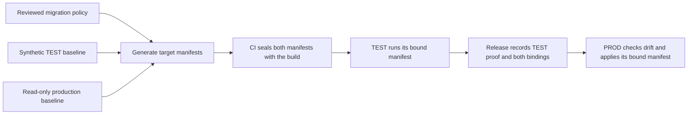

# Bind state migrations to their deployment targets

**Status:** Binding contract implemented; configuration parity approved separately
**Issue:** Tracked as a release blocker in [#114](https://github.com/coletaylor788/puddles/issues/114)
**Last updated:** 2026-09-27

## Human section

### Design

The current release builder prepares configuration changes for a synthetic TEST environment. Those changes contain TEST paths, service settings and scheduled-job preconditions. Production activation requires the identical migration digest, so that release cannot safely upgrade production. The repair gives one release explicit migration bindings for TEST and production.

#### One change policy, two target bindings

Use the same maintained migration generator and reviewed policy for both environments. Each target supplies its own paths, service endpoints and existing configuration or job revisions. The generator produces the literal manifests already understood by the stopped-state migration engine. It must validate the allowed target differences and reject an unrelated production change paired with a passing TEST migration.

The generator accepts a fixed set of target inputs. It constructs the upgrade's changes itself; callers cannot supply arbitrary operations or provider settings. The source gate reruns that generator for both sealed inputs and requires exact output matches. Authored settings remain authored. Where a setting is absent, the same rule preserves each target's predecessor default, so the resulting literals can legitimately differ.

| Binding | Baseline | What runs |
| --- | --- | --- |
| TEST | Synthetic configuration, history and scheduled jobs | Its own sealed manifest, recording adapters, failure and rollback checks |
| Production | Read-only capture of the selected live configuration and job revisions | Its own sealed manifest, after TEST and fresh drift checks |

Keep private target details in protected companion inputs and artifacts. Capture only values needed for the selected changes. Credentials, message contents and conversation history do not belong in this handoff.

#### DEV and configuration ownership

DEV keeps its own configuration and recording adapters. Bundle refresh preserves
its authored settings. A failed refresh restores the prior configuration with
the runtime. DEV does not apply either sealed TEST or production manifest, and
its proof does not claim migration rehearsal.

Stable environment descriptors can be committed to the companion repository.
Captured configuration baselines and job revisions remain per-release inputs.
Public code contains only reusable contracts and synthetic examples.

#### Seal before rehearsal

The CI build records both manifest digests, their target roles and the identity of the common migration policy and generator. The source gate verifies those bindings. TEST proves execution of its exact manifest with the exact runtime and packages. Certification carries that proof and both predeclared bindings into the production release.

Production selects the manifest sealed for its role and target. It checks the selected live configuration and job revisions again before mutation. Changed selected state blocks activation and requires refreshed affected evidence. A new manifest cannot be attached to an already certified release.

#### Preserve the existing migration and recovery flow

OpenClaw Doctor still converts conversation history. The existing migration engine still applies selected configuration changes and checks each expected value or job revision. The deployment wrapper still stops writers, snapshots the matching runtime and complete state, activates, checks health and restores on failure.

Transport the genuine interpreter-check evidence with the release so production can verify the Node transition. This fixes an evidence-path mismatch without creating another attestation.

### Status

The approved implementation seals separate target manifests, validates the common generator and transports the production manifest and genuine interpreter evidence. Shared scripts, instructions and the skill cover future releases. Stable environment settings remain in the companion repository.

Separate target bindings do not prove that the environments share all application
settings. The approved [Plan 045](045-environment-configuration-parity.md) extends
this contract with a shared base and full configuration comparisons. Preserve
the migration bindings and evidence transport established here.

## Agent section

### State

- The binding implementation is landed. Plan 045 adds full environment parity.
  A passing migration generator alone does not establish that parity.
- Public upgrade Plan 041 and companion Plan 037 depend on this shared-process repair for delivery. Keep their designs limited to upgrade requirements.
- Current pair includes public main process revision `73985a748b5acce182adbc8a7bbd61dbef4190e9` and the corresponding companion process update.
- The requester approved implementation, including durable process, skill and script updates for future releases. Non-secret environment configuration may be committed only to the companion repository. Secrets remain outside repositories.

### Scope and acceptance criteria

- Bind the reviewed policy/generator and both literal manifests before CI seals the candidate. Each manifest has an explicit target role and identity.
- Deterministically derive both manifests through the maintained generator. Check that target differences are limited to declared bindings and expected baseline values. A shared arbitrary label or hash alone is insufficient evidence of equivalent intended behavior.
- Execute only the matching manifest in TEST or PROD. Reject a wrong role, wrong target, changed manifest, changed policy, unbound manifest or changed selected baseline.
- Preserve source, artifact, batch, slot, interpreter, browser, package and production-baseline checks. Keep synthetic TEST state and recording adapters.
- Preserve selected-field and scheduled-job compare-and-swap semantics, upstream Doctor ownership, complete stopped-state snapshots and rollback.
- Carry the real interpreter proof through the maintained handoff and verify its binding. Never invent or rewrite successful evidence.
- Public tests remain independently runnable with synthetic inputs. Production details stay in protected companion inputs and artifacts.

### Architecture and decisions

- Both companion release builders now use the same preparation helper. They preserve the synthetic target migration and seal the production migration beside it before the source gate.
- `prepare-private-rehearsal-target.mjs` emits literal TEST paths, provider endpoint and synthetic cron preconditions. `validatePreparedModelBinding` requires the model destination to match that TEST target.
- Public `native-activation.mjs` selects the role and destination binding before applying the matching manifest. `native-state-migration.mjs` applies literal values with exact expected-field and job-revision checks. There is no target relocation mechanism.
- Introduce a versioned release binding for the generated TEST and production manifests and their common policy/generator. Keep the literal manifest engine unchanged. Update the maintained builder, handoff, source gate, target proof, certification and activation together.
- Define and validate target-specific parameters in the maintained generator. The reviewed concrete schema rejects unrelated operations behind a shared policy identity.
- Implemented receipt field: `stateMigrations`, with schema `puddles.target-state-migrations/v1`, generator repository/source digest, fixed policy identity/digest, and exactly two bindings. Each binding contains `role` (`rehearsal` or `production`), `targetSha256`, `inputsSha256` and `manifestSha256`. Bind target identity to role, host, service label/port and install/state/plist/backup/prepared-file destinations. Exclude transport filenames. Retain independent interpreter, browser, artifact and integration checks.
- The fixed companion generator accepts agent roles/workspaces, plugin destinations/load paths, model/server/preset paths, local service port, selected configuration baseline with authored/default distinctions, selected job identity/profile/revision, and predecessor effective concurrency. It must not accept arbitrary operations, provider configuration, service arguments, model-policy changes or callbacks.
- Reuse `previewLegacyConfigRepair`, `captureMemoryMigrationBaseline`, `prepareMemoryIsolationManifest`, `prepareConfiguredPluginBindings` and existing canonical digest/manifest/job-revision helpers. The source gate reruns the same sealed generator over both sealed input records and compares exact outputs. Do not establish equivalence by normalizing paths or matching labels.
- Capture the selected cron revision through the existing SDK on the trusted host. Pass its opaque revision and validated execution profile, without message text. Add a narrow captured-revision input to the generator; retain production compare-and-swap checks.
- Obtain the production input through bounded read-only selection on the trusted host. Validate it before packaging and again before production mutation. Do not export full live state to CI.
- The current generator preserves whole agent and memory-plugin subtrees. Reject secret-bearing exported content rather than silently redacting values that the migration would preserve. This constrains the protected input until the existing generator can safely select smaller fields.
- Existing releases retain their existing single-manifest verification behavior. Do not reinterpret old receipts as paired-target proof. The upgrade requires a newly sealed candidate after the repair.
- Recovery retains the original target-proof check for existing releases. Paired releases select the current target's sealed binding and require the recovery journal to match it. Cleanup metadata does not replace either check with a hash of the current target file.
- `verifyIntegratedCandidate` uses the genuine runtime stage transported in the target proof. The target pipeline measures the executing Node binary, and certification checks the build and measured toolchain identity. Legacy receipts keep their previous evidence lookup.

### Implementation

- `packages/e2e/src/native-migration-bindings.mjs` defines the versioned envelope, destination identity and role selection. Build identity, regression evidence, activation journals and certification retain it.
- Companion capture exports the selected authored configuration and opaque scheduled-job revision. One fixed generator produces both manifests. Source validation regenerates each exact output.
- Both builders use that generator; immutable handoff imports the already sealed production manifest and materializes its target with a new local manifest filename.
- Target runtime evidence measures the actual interpreter and travels with the release. Missing, changed or mismatched evidence is rejected.
- DEV stops before snapshotting state and service configuration. It preserves authored settings, overlays explicit adapters and restores state with the old runtime after failure.
- Shared instructions, lifecycle skill and component guides document the process. Companion configuration records contain no secrets.

### Validation

Focused public release, pipeline, state and interpreter suites pass 135 tests.
The private contract suite passes 100 tests with seven existing unselected
SDK/runtime cases. The actual public/private interface suite passes all selected
checks. Handoff import preserves both bindings and the production manifest.
A live DEV injected behavior failure restores exact config, service, runtime link
and ownership marker; maintained health passes and the slot is released.
These checks do not replace final cumulative CI or merged target rehearsal.
Recovery and release regressions pass 43 tests, including legacy cleanup metadata
and paired journals with matching, missing or wrong-role bindings. Target topology
passes 62 tests with normal host permissions, and the TypeScript check passes.
Composed CI passes the full build, then exposes inherited release bindings in
synthetic pipeline tests. Their setup now clears that setting alongside the
existing migration manifest. All 40 pipeline tests pass with an intentionally
conflicting caller binding. The actual release guard is unchanged.
The full e2e run under that caller binding passes 408 of 411 tests. The remaining
three use the local system's older Python; their complete five-test file passes
with CI's Python 3.11. Final CI still runs the complete accumulated gate.

- Reproduce the current synthetic-manifest/production-target rejection.
- Prove matching policy and distinct target bindings pass with synthetic baselines; prove unrelated operations, altered bindings and wrong-role manifests fail.
- Prove selected configuration and job drift still fail before mutation. Test absent/present values, normalization, explicit settings and inherited defaults.
- Prove manifests and policy cannot be substituted after build, TEST or certification.
- Exercise real installed Doctor, target migration, deliberate failure and complete rollback on synthetic state. Confirm no live account writes or message delivery.
- Transport the actual runtime stage and verify interpreter evidence after import; reject changed or missing evidence.
- Run the entire accumulated pool against the final candidate in CI, exact CI-artifact DEV, then merged-main TEST with the newly sealed bindings.

### Rollout and rollback

Use the shared lifecycle documented in the current [skill](../../.github/skills/safe-feature-development/SKILL.md), [runner guide](../../packages/e2e/README.md) and [coordination guide](../../packages/e2e/DEPLOYMENT_COORDINATION.md). This proposal changes their supported migration inputs, not their ownership or execution order. Keep the current upgrade artifact as development evidence only until the new contract is implemented and validated. Preserve all existing recovery assets.

### Review log

- Independent release-input audit confirms the mismatch in the builder, migration engine, target model binding and activation guard.
- Retained reviewer confirms there is no supported invocation-only solution. Editing receipt digests or applying TEST literals in production would invalidate the existing guarantees.
- Historical Plan 039 evidence ends after synthetic TEST/promotion. The previously deployed release has no state-migration binding, so it does not prove this handoff.
- Approval received because the paired-target contract changes release provenance. No further routine deployment approval is required.
- Add DEV regressions for authored-setting preservation and configuration rollback. Keep DEV separate from release migration selection.
- Retained review identified missing fixture dependencies, copied instead of measured interpreter evidence, and credential headers in selected export. All three are fixed with regressions. Recheck finds no additional material defect. Complete paired release validation remains in the normal lifecycle.
- Actual DEV rollback validation passes. The source gate, imported target, TEST success/rollback and certification still require the final candidate's end-to-end run.
- A recovery compatibility check exposed an incorrect full-target hash comparison after cleanup metadata was added. Restore the legacy proof check and require the sealed journal binding for paired releases. The retained reviewer reports no material findings; the four added regressions and affected suites pass. Replace the superseded CI candidate.
- The retained reviewer became unavailable through repeated tool errors. Its replacement reviews the complete current pair, identifies a credential-export gap in authored environment maps, and clears the repaired boundary with regressions. Typed non-secret settings and unresolved references remain supported. The replacement also clears the synthetic pipeline fixture correction after the composed CI reproduction.

### Checklist

- [x] Confirm the current failure and search for a supported existing path.
- [x] Prepare a concrete shared-process proposal.
- [x] Obtain design approval.
- [x] Implement and review the target binding contract and interpreter evidence handoff.
- [ ] Pass the accumulated and exact-artifact lifecycle gates.
- [ ] Deliver and verify the upgrade through the repaired shared process.
