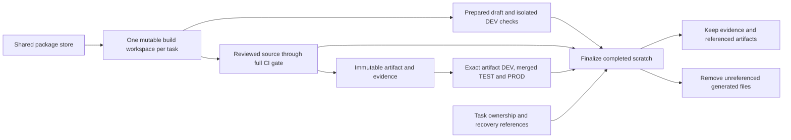

# Bound development storage and retire completed runs

**Status:** Approved by the requester. Implementation and validation in progress.
**Issue:** [145](https://github.com/coletaylor788/puddles/issues/145)
**Last updated:** 2026-09-27

## Human section

### Design

The development loop retains complete source trees, installed dependencies,
packaging workspaces, extracted releases, and draft payloads after their useful
life. Artifact retention manages registered release objects, but it does not
retire the workspaces that produced them. A new run directory therefore adds
storage even when its packages came from a shared cache.

Give each active task one persistent OpenClaw build workspace, with its paired
repository worktrees and one configured host package store. Keep release
evidence separately. Make retiring completed scratch work a scripted lifecycle
step, with explicit protection for active work and recovery.

#### 1. Allocate and reuse the task workspace

The task records its public and optional companion worktrees, persistent
OpenClaw source, build output, scratch root, and package store. Subsequent edits
reuse those paths and the existing input fingerprints. Changed lockfiles,
patches, toolchains, or build inputs invalidate the affected outputs.

Use Git worktrees from a shared upstream repository for clean comparisons.
An additional source checkout must have a named purpose, an owner, and a
retirement condition. Keep it while it supports a live investigation; remove
its generated output when the comparison closes. Commit or otherwise preserve
unique source before retiring the checkout. Do not share mutable build outputs
or a writable node_modules tree between tasks.

One build workspace is the steady-state target. A clean release builder and a
fresh installed runtime still coexist temporarily because the release gate
must prove that the packaged application works independently of the developer
checkout. The merged batch also needs its own CI artifact. These are bounded
release stages with terminal cleanup.

#### 2. Use one package store on each host

Resolve the host store from one maintained configuration and pass it to every
public, companion, upstream, and scratch install. The existing verifier should
check the actual resolved store in all these contexts. Keep pnpm's versioned
subdirectories and separate native outputs by platform and toolchain.

A shared store avoids repeated package acquisition. Each workspace still has
its own dependency layout, generated files, and build output. The release
packager also materializes a portable dependency graph, which must remain
independent of the developer's package store.

Do not build a new dependency cache. Use pnpm's supported storage and import
behavior. Record copy versus shared allocation where it can be measured. A
store migration happens at an owned dependency refresh; existing active
installs continue to use their recorded store until then. Prune an old store
only through a separate, quiescent maintenance step after all consumers move.

#### 3. Bound draft preparation and release scratch

Keep one ready draft payload per task. A second payload may exist while it is
being prepared or consumed. Preparation, transfer, installation, and cleanup
share an ownership record so a newer preparation cannot delete a payload that
DEV is using. When consumption or supersession is acknowledged, retain its
manifest and results and delete the generated payload and transfer lists.

Reuse the same compatible local run for retries. Preserve immutable records of
each attempt and its inputs. A source change invalidates the affected proof;
a retry never inherits a pass from different inputs. Hosted CI attempts may
still start fresh. Their outer controller finalizes the attempt after uploads
and artifact consumers have acknowledged the handoff.

Packaging and validation may need separate mutable directories. Keep those
directories only while the corresponding stage or consumer needs them. Reuse
a prepared stack only when its dependency and output fingerprints prove it is
compatible; do not merge independent validation stages simply to reduce disk
use. Prefer shared Git objects and existing filesystem cloning helpers for
necessary copies, while preserving isolation of writes.

#### 4. Retain evidence and rollback material explicitly

Extend the existing artifact retention machinery. Store each immutable release
bundle once under its content identity, and give each active task or merged
batch its own reference. Do not depend on the single global `current` pointer
to represent every task waiting for DEV or TEST.

| Material | Proposed retention |
| --- | --- |
| Source, patches, unique local edits | Preserve in Git or a verified local snapshot before retiring a checkout. |
| Release evidence | Keep source and toolchain identities, build and archive hashes, full gate results, installed checks, migration/target identities, review disposition, activation and rollback results. Compact evidence survives workspace removal. |
| Immutable bundles | Keep the current two newest successful builds plus every build referenced by an active, queued, paused, deployed, recovery, or explicit debug owner. Reuse the existing dependency closure. |
| Build, package, extracted install, transfer and fixture directories | Delete after their last consumer finishes and retained evidence is verified. Keep the task's single mutable development workspace while the task needs it. |
| Failed runs | Keep the exact command, error, inputs, logs, and a reproducible fixture. Pin a full workspace only while investigation needs it. Default: one unpinned full failed workspace per task for up to seven days after owner-confirmed termination. |
| Raw diagnostic logs | Default: compress and retain for 30 days, with a 1 GiB budget per completed task. Keep compact release evidence and explicitly pinned failure logs outside this rolling limit. |
| Production recovery | Preserve the complete authoritative recovery, prior runtime/interpreter, state, configuration, service definitions, and other recorded assets. Retire an old recovery only with the existing backup/activation tools after replacement recovery verifies. |

A build bundle alone does not restore production state. Production recovery
does not become ordinary scratch because a release succeeded. Likewise,
copied receipts may still refer to paths needed by certification or recovery.
Verify the complete consumer dependency chain before deleting those paths;
preserve immutable receipts and use the existing import/rebinding contracts.

#### 5. Finalize safely without relying on an agent reminder

Extend existing run status and locking with task identity, host, exact owned
paths, process identity, child/consumer references, and terminal cleanup state.
Use named artifact references for queued and paused work. Deployment slots
continue to protect shared DEV, TEST, and PROD; local builders need their own
run ownership because they normally hold no deployment slot.

Finalization runs on success and failure, after owned children have joined and
any required rollback has completed. Its sequence is:

1. Acquire the same run lock used by producers. Confirm terminal ownership,
   consumer completion, and absence of active deployment or recovery references.
2. Preserve and verify the evidence and artifacts required by their consumers.
3. Generate an exact-path deletion plan. Reject unknown ownership, dirty source,
   unexpected symlinks, changed identities, and paths outside the declared root.
4. Revalidate while holding the lock, then use the existing journal pattern to
   remove only declared generated children. Record completion and space change.

Cleanup failure leaves `cleanup-pending` state and is retried by the next
controller entrypoint. A killed process cannot run a finalizer, so startup also
reconciles interrupted attempts. Expired heartbeats and old timestamps trigger
investigation; they never authorize deletion by themselves. Uncertain or
unavailable ownership checks preserve the path.

Agent-managed worktrees use the app's archive facility when retired. Disposable
runner worktrees use their recorded Git owner and the existing worktree cleanup
helper. Never recursively delete a task directory merely because its chat is
idle or its PR merged.

#### 6. Account for disk before allocating more

Report storage separately for reusable workspaces, shared caches, temporary
stages, retained artifacts, evidence, and recovery. Track peak incremental
allocation for each stage and the bytes left after finalization.

Capacity checks must account for all concurrent local builders. Reserve each
stage's measured additional requirement under a host lock, plus the existing
free-space floor. Serialize a large build when the host cannot fit another
reservation. This prevents several jobs from independently passing the same
free-space check and then exhausting the disk together.

Directory totals are accounting estimates. Shared files and filesystem clones
can make them larger than uniquely reclaimable storage. Report actual free
space before and after cleanup separately. Do not promise that deleting a
directory returns its entire reported size.

### Status

Source and local disk inspection support the proposal. The current development
guidance already calls for persistent source and a shared store. Missing
terminal cleanup, unmanaged duplicate workspaces, and artifact copies outside
the registry prevent that guidance from bounding disk use.

The requester approved implementation, merge, and notification of other task
owners. The storage controller, retention changes, terminal CI and DEV hooks,
and daily skills are being implemented in an isolated public/private pair.
Existing task directories have not been cleaned by this work.

## Agent section

### State

Implementation is active in isolated public and companion worktrees.
Machine-specific inventory and ownership observations belong in the local audit,
not public plans or CI artifacts.

### Scope and acceptance criteria

- One persistent mutable OpenClaw build workspace per active task by default.
- One configured host package store, verified in every install context.
- Prepared payloads, clean comparison workspaces, release builders, imports,
  package stacks, and fixture copies have explicit owners and retirement rules.
- The number of completed attempts does not cause unbounded retained scratch.
- Compact evidence remains usable after generated source/install paths vanish.
- Current, queued, paused, deployed, debug, and recovery consumers remain safe.
- Full accumulated CI and exact-artifact deployment proofs retain their current
  requirements. No draft is promoted on the strength of cached evidence alone.
- Legacy paths are inventoried and explicitly adopted before cleanup eligibility.

### Architecture and decisions

Relevant public components:

- `packages/e2e/src/native-pipeline.mjs`: persistent per-run source and stage
  reuse; the terminal `finally` releases the lock without retiring the run tree.
- `packages/e2e/src/native-retention.mjs`: registered objects, references,
  dependency closure, copy-on-registration, and journaled deletion. Its policy
  currently retains all diagnostic logs without a size or age limit.
- `packages/e2e/src/native-package.mjs`: independent materialization of the
  production dependency graph followed by archives and installed copies.
- `packages/e2e/src/native-state.mjs`: run identity, stage records, and locks.
- `packages/e2e/src/worktree-cleanup.mjs`: cleanup for runner-owned worktrees.
- `packages/e2e/src/pnpm-toolchain.mjs`: resolved shared-store validation.
- `packages/e2e/DEPLOYMENT_COORDINATION.md`: shared environment ownership.
- `packages/e2e/README.md`: retention boundaries and backup contracts.

Companion adapters must register their scratch children and invoke the generic
finalization contract. Public code must remain independently runnable without
discovering or requiring a companion repository. Do not edit another task's
worktree to implement this design.

The artifact retention CLI's current `dry-run` calls cleanup recovery and takes
a lock. A new inventory preview must be genuinely read-only and must not replay
deletion journals. A preview does not confer later deletion authority.

### Implementation

Approved implementation order:

1. Add storage inventory, task/run ownership, and a read-only deletion preview.
2. Add evidence sealing and terminal scratch finalization to the existing
   runner and retention code. Integrate companion hooks in an isolated pair.
3. Bound prepared draft payloads and make shared-store selection uniform.
4. Add capacity reservations and stage/cleanup size reporting.
5. Update the daily-loop guide and skill, then adopt eligible legacy paths
   using an exact-path migration inventory.

### Validation

After integration with the merged OpenClaw upgrade, the complete e2e package
passed 434 tests and its TypeScript check passed. The companion contract command
passed 115 tests with eight environment-gated skips. Paired draft and release
checks passed 49 tests with five environment-gated skips. These include repeated
operations using the real shared storage cleaner, compressed log expiry, task
lock contention, joined-child capacity release, and portable bundle reuse.

The retained reviewer rechecked both complete diffs and reported no remaining
significant findings. Final public CI is pending. The companion composed ARM job
requires confirmation of included private hosted minutes. Existing task roots
remain protected until their owners apply the merged migration commands.

Investigation performed read-only directory measurements, run-status and
retention metadata inspection, source inspection, and task/process snapshots.
The implementation now has focused ownership, retention, capacity, and portable-evidence regressions. Full validation results are recorded below.

Implementation regressions cover active producers and child processes,
queued and paused consumers, two tasks sharing one artifact, unknown/stale
ownership, failed retention export, interrupted deletion, symlink/path changes,
dirty source, protected recovery, store mismatch, and concurrent capacity
reservations. Prove a retained bundle and evidence chain can still support
certification after disposable source and install paths are removed.

Run repeated successful and failed fixture attempts and assert that scratch
returns to its declared steady state. Measure real disk deltas separately from
logical directory sizes. Add the regression to the shared pool, use focused
checks during development, and complete the normal accumulated release gate
for the implemented behavior change.

### Rollout and rollback

Start with read-only inventory for legacy storage. Enable automatic finalization
for newly registered runs after fixture validation. Migrate old paths only
after tracing ownership, source preservation, exact artifact consumers, and
recovery references. Protect active task roots during the migration.

Roll back the controller behavior if needed. Deleted rebuildable scratch can
be regenerated from preserved inputs; undeclared source and recovery material
must never enter the deletion set. Keep completed evidence in durable storage
before any deletion begins.

### Review log

Requester approved implementation and landing. The retained independent reviewer
rechecked the complete paired diff after remediation and reported no remaining
significant findings. Final CI and composed execution remain validation gates.

### Checklist

- [x] Inspect existing lifecycle, retention boundaries, and local accumulation.
- [x] Write the proposed ownership, retention, and cleanup behavior.
- [x] Approve the design and proposed retention defaults.
- [x] Implement in isolated public and companion worktrees.
- [x] Validate concurrency, recovery, evidence portability, and bounded growth.
- [ ] Complete retained review and the required release lifecycle.
- [ ] Adopt and retire eligible historical storage with recorded evidence.
