# Incremental development and complete task teardown

**Status:** Implemented, merged and verified.
**Issue:** [145](https://github.com/coletaylor788/puddles/issues/145)
**Last updated:** 2026-10-01

## Human section

### Design

Finished development accumulated source copies, runtime extractions, fixtures,
receipts and logs. Each session now reuses one workspace and mutable build, then
removes every development artifact when the feature completes. Rebuilding later
is acceptable. Production filesystem data and every production dependency are
outside this cleanup scope.

```mermaid
flowchart LR
    Init[Empty development task with protected boundaries] --> Edit[One checkout and mutable build]
    Edit --> Check[Incremental checks and DEV revision]
    Check --> Edit
    Check --> Finish[Feature and consumers finish]
    Finish --> Source[Publish or archive source and retire worktrees]
    Source --> Complete[Remove all task artifacts and receipts]
    Complete --> Retry[Resume interrupted cleanup if necessary]
```

#### Active development

Use one checkout per repository in a single task workspace. Public/private
composition uses one pair. Reuse the same source and compatible build outputs.
Keep one ready DEV payload plus an in-flight replacement. Failed commands keep
the current workspace available for repair rather than starting another tree.
One release owner builds selected source once and transfers the same artifact
through the release stages. A required artifact moves to that consumer before
its feature workspace closes.

#### Completion

Completion removes development worktrees, builds, fixtures, archives, receipts,
evidence and logs. Source is published first, or unpublished edits preserved
through supported Git/app archival. Test recovery fixtures retire through their
producer. Explicit run completion releases disposable pooled artifacts while
all remaining consumer and deployment/recovery references remain protected.

The storage controller only accepts whole-task deletion for an empty root
registered before work starts. It requires a dedicated development parent and
explicit protected boundaries. Completion refuses source trees, recovery
markers, active producers, locks, holds and pending consumers. It journals the
rename and deletion outside the task so interruption can resume. Failure is
cleanup-pending, not complete. Legacy directories require individual review.

#### Production boundary

Development cleanup never removes production deployments, filesystem data,
configuration, state, backups, recovery records or anything they reference.
Production and shared active paths stay outside the task boundary. This work
performs no production activation, restart, filesystem mutation or deletion.

### Status

The completion API and paired draft wrapper are merged. Local fixture tests,
required repository CI, security checks and retained review pass. Production
was excluded and no production deployment or filesystem operation occurred.

Approved local cleanup removes individually reviewed legacy generated children.
Source, active consumers and uncertain recovery fixtures remain protected;
legacy roots cannot opt into whole-task deletion.

## Agent section

### State

The implementation extends the existing native storage and artifact retention
APIs. Machine-specific inventories and cleanup paths remain local. One paired
feature workspace is used. No production rollout is part of this change.

### Scope and acceptance criteria

- One reusable workspace and mutable build per active session.
- Completion removes all task-owned development output and receipts.
- Explicitly completed pool objects have no age/count retention override.
- Remaining references preserve active, deployed and recovery dependencies.
- Source retirement uses Git/app operations; unknown legacy roots are refused.
- Interruption leaves a resumable journal; pending cleanup is visible.
- No production path, state, deployment, backup or recovery mutation.

### Architecture and decisions

`native-task-storage.mjs` supplies initialization and completion through the
existing `openclaw-storage.mjs` CLI. Its scope is recorded in `storage.json`.
It uses the existing lock, identity, artifact-validation and atomic JSON helpers.
It never adopts a populated legacy root and never follows symlinks for deletion.

`native-retention.mjs` records completion for the acknowledged dependency closure.
Reference closure always takes precedence over completion. Unacknowledged legacy
objects keep compatibility retention; they are not silently reclassified.
Operation logs stay local to the active task and disappear on task completion.
The paired draft controller exposes completion after draining ready/obsolete
payloads and releasing its own lock. Worktree removal remains an explicit
supported Git/app step before the final command.

### Implementation

Public changes cover completion, reference-aware retention, behavior tests and
process guidance. Companion changes add draft closeout and paired tests. Legacy
cleanup checks ownership, processes, source preservation and active dependencies
on exact local development children. Production paths are never cleanup targets.

### Validation

All 543 accumulated e2e tests pass across the full suite and a corrected-PATH
rerun of the resource monitor test. Paired draft/retention contracts pass (13
tests), as do package build, e2e typecheck and skill validation. Required
repository and security checks pass before and after merge. Production
sentinels remain intact in teardown and recovery fixtures. No production
deployment is part of this validation.

Public implementation: PR 199, merge `6de980b`. The companion wrapper was
validated against this exact API. Actual free-space deltas are recorded
separately from logical sizes in the local cleanup report.

### Rollout and rollback

Land reviewed source with required checks. New sessions initialize scoped roots;
existing sessions retire exact children through their existing ownership tools.
Revert the tooling change if completion fails; preserve any pending journal and
finish recovery with the verified controller. Cleanup of completed generated
output is intentionally not backed up; it can be rebuilt from preserved source.

### Review log

The retained reviewer found and verified fixes for validation occurring after
filesystem mutations and for interrupted completion recreating the task root.
The final paired diff has no unresolved material findings. A separate review
of the one-off cleanup driver required fresh consumer checks for every pending
removal; that fix was verified before cleanup resumed.

### Checklist

- [x] Measure growth and identify completed development artifacts.
- [x] Obtain approval for one workspace/build and complete teardown.
- [x] Record the absolute production exclusion.
- [x] Validate completion, interruption and protected-path behavior.
- [x] Complete retained review and required checks.
- [x] Land source and verify the approved development cleanup procedure.
- [x] Define final closeout: after these documents land, remove the task worktrees
  and build output and record completion in the local cleanup report.
