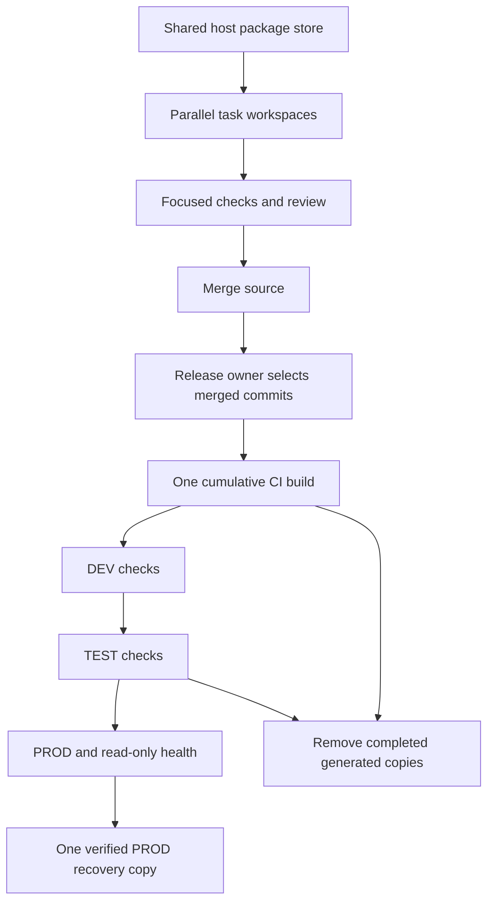

# Parallel development with one release build and bounded storage

**Status:** Approved. Core storage cleanup and simplified guidance are merged; controller alignment is in progress.
**Issue:** [145](https://github.com/coletaylor788/puddles/issues/145)
**Last updated:** 2026-09-27

## Human section

### Design

Completed builds kept source copies, installed dependencies, extracted releases,
and test snapshots. A shared package cache reduced downloads but did not remove
those generated copies. Requiring a full feature release before merge and another
build after merge added work and delayed cleanup.

Keep feature development parallel. Give each task one reusable build workspace
and a shared host package store. Merge reviewed changes after focused checks and
required repository checks. One release owner builds selected merged source once
in CI and promotes the same artifact through DEV, TEST, and PROD.

#### Parallel work and release ownership

Workers edit, build, and test in their own worktrees. Writable build output,
configuration, state, ports, and processes remain separate. Compatible prepared
source and compiler output are reused. All install contexts select the maintained
host package store.

The release owner pins public and optional companion commits before CI. Later
main commits belong to the next candidate and do not invalidate the active one.
Shared environment slots cover deployment, installed checks, cleanup, and
recovery. Editing, building, reviewing, and waiting hold no slot or main lock.

#### One artifact through the environments

CI runs the accumulated regression pool and produces the deployable artifact.
DEV checks it, TEST rehearses it, and PROD receives the same bytes. Environment
configuration, credentials, and writable state stay outside the artifact.
Promotion does not rebuild, fetch dependencies, or repackage it. If a production
baseline changes, repeat affected TEST checks. The current migration tooling seals
some environment inputs with the build; if those inputs change, create a
replacement candidate and start it at DEV. Never rewrite an existing artifact.

Keep source and artifact identity plus compact stage results. Scripts perform
integrity checks. Agents should not assemble repeated workspace hash inventories
or add another evidence framework. Review, committed regressions, production
state isolation, and recording adapters for test writes remain required.

#### Failure and recovery

A failed build, DEV check, or TEST rehearsal leaves healthy PROD running. The
release owner diagnoses the failure and promptly fixes or reverts the responsible
source. A replacement build starts at DEV. Infrastructure retries reuse valid
artifacts and results. Other feature workers keep moving.

A failed production activation restores its previous healthy runtime and state.
Scripts must bound execution and recover interrupted operations without waiting
indefinitely for an agent. Keep one verified PROD recovery copy. Verify its
replacement before retiring the old copy. Necessary overlap during that
replacement is temporary.

#### Storage and cleanup

| Material | Retention |
| --- | --- |
| Active task source and build | One reusable mutable build per task; preserve unique edits. |
| Package cache | One maintained store per host, pruned only without active installs. |
| Release artifacts | Candidate in promotion, current PROD, and the one PROD recovery dependency set. |
| DEV and TEST | Active instance only; completed staging and superseded installs are disposable. |
| TEST rollback snapshots | Temporary for the check; remove after completion. |
| Failed workspace | Retain only while an active investigation needs it. |
| Evidence | Small logs, source/artifact IDs, results, and production recovery records. |

Cleanup runs after producers and consumers stop, on success and failure, and
resumes after interruption. Never remove an active build, unique source, or real
production recovery to meet a disk target. Notify owners before coordinated
legacy cleanup. An unresponsive worker does not prevent authorized cleanup when
fresh process, slot, and consumer checks establish that generated data is unused.
Unknown ownership still requires investigation. Use the app archive operation
for managed worktrees so their source remains recoverable.

### Status

The original storage controller and shared-store fixes are merged. Completed
legacy builders, dependency trees, fixture copies, and migration fixtures have
been cleaned. Guidance is merged and affected workers have been notified. It
adopts the requester-approved parallel flow,
one release build, disposable TEST, and one PROD recovery copy.

The development-loop manager owns remaining executable and companion alignment.
The active release owner owns historical TEST cleanup and current release
promotion. Existing guards and retention defaults are documented as transition
gaps until their code lands; this plan does not claim they already changed.

## Agent section

### State

Public guidance is maintained in the repository instructions, both development
skills, the e2e runner/coordination/storage guides, and the deployment guide.
Machine-specific paths, disk inventories, and private repository identities stay
in local records. Original public storage implementation landed in PR 146.
Source merge and release completion must be reported separately.

### Scope and acceptance criteria

- Parallel feature merges after focused checks, review, and required repo checks.
- One reusable mutable build per task and one configured host package store.
- One cumulative CI build of selected merged source, promoted DEV -> TEST -> PROD.
- Main advancement does not invalidate the pinned release or stop other workers.
- Automatic bounded deployment recovery and terminal cleanup.
- One PROD recovery copy; no retained TEST backup or completed test snapshots.
- Compact evidence remains usable without completed build and install trees.
- Cleanup preserves live consumers, unique source, secrets, and real recovery.

### Architecture and decisions

Reuse existing components rather than add another controller:

- `native-pipeline.mjs`, `native-state.mjs`, and `native-storage.mjs` own
  native run lifecycle and generated scratch.
- `native-retention.mjs` owns registered artifacts and dependency references.
- `pnpm-toolchain.mjs` verifies the configured host store.
- Deployment coordination owns shared environment slots and batch ownership.
- Existing activation and backup tools own real PROD recovery.
- Companion producers own their build, import, migration, and DEV fixture cleanup.

Public CI now separates ordinary repository checks from explicitly dispatched
release builds. Source merging uses GitHub directly with the reviewed head and
required checks; older receipt commands remain compatibility paths.

The current artifact pool still retains two recent successful builds and the
scratch controller keeps the newest sealed failure for seven days. The current
slot runner leaves terminal slots occupied for owner inspection. Those defaults
need executable alignment with the approved policy. Generic scratch cleanup
refuses recovery markers; completed synthetic fixtures need producer cleanup,
not removal of journals to defeat that refusal.

### Implementation

The public guidance owner updates and lands this documentation. The development
loop manager aligns source merge helpers, CI triggers, retention defaults,
terminal cleanup, interrupted recovery, and companion guidance. The release owner
adopts the new flow without relabeling a branch artifact as different merged
source, then promotes one selected candidate and cleans its completed work.

Required checks remain enforced while CI triggers are revised. Do not dispatch
another runtime build to validate documentation. Notify feature owners after the
guidance lands, and have them use merged tooling to finalize completed attempts.
Legacy cleanup proceeds independently of unrelated active release validation.

### Validation

Original storage validation passed 440 e2e tests, TypeScript checks, public CI
36357219224, and composed CI 36357322660. Its artifact passed installed DEV
checks, including 33 upgrade cases. Public PR 146 and the parallel merge helper
follow-up PR 168 are merged. Those historical results do not validate the new
controller work assigned here.

For this guidance change, review consistency, relative links, skill metadata,
and the root AGENTS.md symlink. No runtime builds or deployments are needed.
Executable changes need focused behavior regressions and retained review. Their
selected release candidate runs the cumulative pool once, then installed checks
against the same artifact across environments.

Demonstrate parallel source merges during a release, identical artifacts across
DEV/TEST/PROD, no indefinite stopped PROD after controller interruption, and
removal of terminal generated copies. Measure actual free-space changes
separately from logical directory sizes. Preserve live and queued consumers.

### Rollout and rollback

Land guidance and communicate the policy and known tooling gaps together. Active
owners keep valid evidence and finish or transfer current operations. Source-only
merges do not confer production eligibility. Repair obsolete helper requirements
through their owner without fabricating receipts or bypassing production guards.

Notify owners and inspect exact legacy paths before cleanup. Preserve source,
compact results, active artifacts, and the verified PROD recovery set. Rebuildable
scratch can be regenerated from inputs. If a cleanup hook fails, retain enough
state to retry without deleting unknown or live paths.

### Review log

The requester explicitly approved the simplified design and implementation,
landing, worker notification, and cleanup. This replaces the earlier policy of
separate full premerge and postmerge release builds and retained TEST snapshots.
The retained reviewer cleared the nine-document diff after corrections for
sealed migration input drift and bounded log retention. Relative links, skill
metadata, the AGENTS.md symlink, and diff whitespace were checked directly.
The optional skill validator could not run because PyYAML is unavailable.
The documentation path does not require another runtime validation cycle.

### Checklist

- [x] Investigate why shared caching did not bound generated copies.
- [x] Merge original storage controller and shared-store fixes.
- [x] Clean eligible historical builders, dependencies, and completed fixtures.
- [x] Obtain approval for the simpler parallel development and release flow.
- [x] Rewrite public skills and process guidance together.
- [x] Land guidance and notify affected workers to align and clean up.
- [ ] Complete executable and companion alignment through assigned owners.
- [ ] Confirm terminal cleanup and report actual disk recovery.
