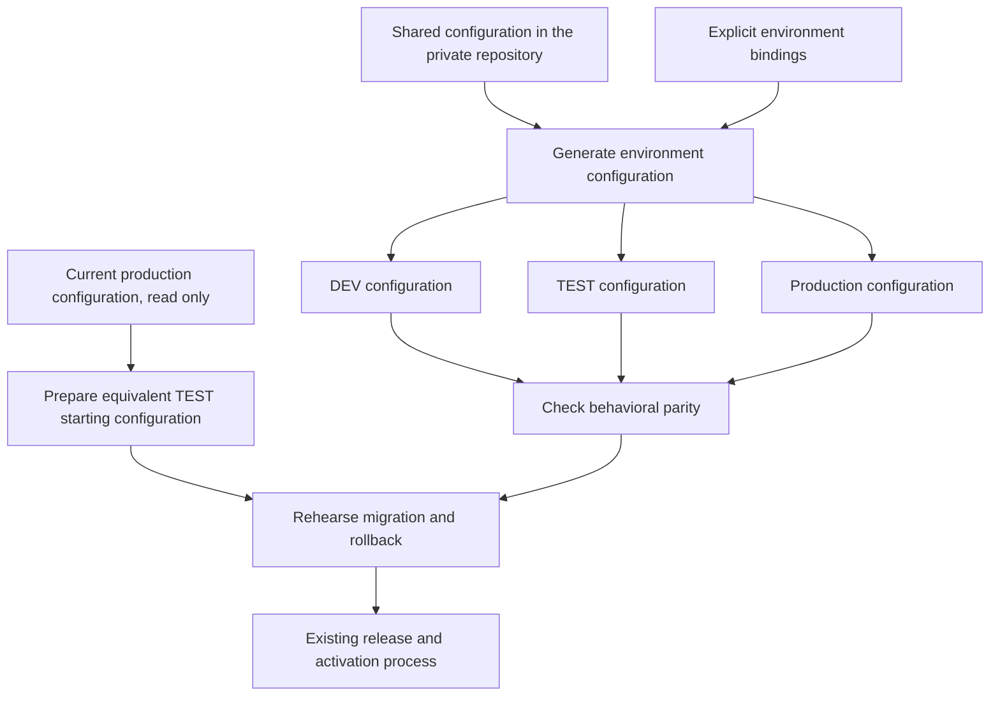

# Keep DEV, TEST and production configuration aligned

**Status:** Implemented; release blocked by separate legacy proposal ownership
**Issue:** [#114](https://github.com/coletaylor788/puddles/issues/114)
**Last updated:** 2026-09-28

## Human section

### Design

Separately authored environment configurations can omit application behavior
and legacy settings while still passing focused checks. A migration rehearsal
needs both the intended result and the configuration shape it upgrades.

Use one reviewed configuration for application behavior. Generate each
environment's configuration from it with small, explicit overrides. Keep state
and services isolated. Reject undeclared configuration differences before a
release can advance.

#### 1. Share application settings

The companion repository holds the shared non-secret configuration and the
environment bindings. Agent definitions, models, plugin configuration, memory
policy, tool permissions, skills, routing and message behavior come from the
same base. Public code contains reusable generation and validation contracts
with synthetic examples.

Credentials remain outside both repositories. The shared configuration uses
references to local credentials. Preparing the initial base requires a reviewed
inventory of the current authored settings and credential locations; copying a
raw live configuration into Git is not the import process.

The candidate's configuration changes travel with its source. A configuration
change is reviewed and validated like any other behavior change. This proposal
does not change the selected models, tools or permissions.

#### 2. Declare the environment differences

Each environment still owns its generated file, state, processes and rollback.
An override names the exact setting it changes and why. Generation fails for an
unknown override or a missing required binding.

| Setting | Treatment |
| --- | --- |
| Ports, filesystem roots, service names, deployment slots and browser identities | Explicit environment bindings |
| Credential locations and authentication identities | Local references, with isolated test credentials or fixtures |
| External reads, writes and message delivery | Explicit synthetic data, account/recipient bindings and recording adapters in DEV and TEST; no live fallback |
| Agent behavior, model choices, plugins, permissions and feature settings | Shared configuration |
| Sessions, indexes, histories, recordings and runtime bookkeeping | Separate environment state; not shared configuration |

Fixture adapters replace external effects at the boundary. Disabling a plugin
or feature merely to make a test environment start does not prove its production
behavior. If a required adapter is unavailable, report that coverage gap and
block the affected release check.

DEV may have temporary edits for an experiment. Keep them visible as a local
diff. They cannot qualify as release validation until they are part of the
reviewed candidate or removed deliberately. Artifact refresh must not silently
discard them. Existing snapshot and rollback behavior remains.

#### 3. Check parity before using an environment

The maintained generator produces all three configurations from the same
versioned base. The validator removes only the declared environment bindings
and requires the remaining authored configuration to match. It rejects missing
settings as well as different values. Do not use broad exclusions for whole
plugin, model, agent or tool sections.

Each release check uses the expectation for that stage:

| Stage | Required configuration |
| --- | --- |
| Production before mutation | The sealed predecessor expectation |
| TEST before migration | The predecessor's authored shape with declared TEST bindings |
| DEV release validation and TEST/production after migration | The reviewed candidate expectation |
| Rollback | The original environment snapshot |

An approved behavior change may intentionally differ between predecessor and
candidate. Compare each state with its own expectation. Use the same OpenClaw
core and plugin normalization for candidate comparisons and ignore only declared
runtime metadata. Configuration drift blocks advancement and produces a
value-free report of affected settings.

Record the shared base, override and generated configuration identities with
the existing build and target evidence. A different configuration invalidates
the affected proof. Use the current migration-binding and receipt machinery;
do not create a parallel release pipeline.

#### 4. Rehearse the actual upgrade starting shape

The target configuration alone is insufficient for testing a migration. TEST
must start with the same authored configuration shape as the current production
generation, including deprecated fields and absent-versus-explicit settings.

Extend the bounded read-only capture already used by release preparation to
cover the authored behavior needed for parity. Export configuration and
unresolved credential references only; never export credential values, message
content or conversation history. Apply the declared TEST bindings and fixture
adapters, and require parity before sealing the release inputs. Use synthetic
history and scheduled-job data with the relevant schema and authored behavior.

Keep the original authored shape in this starting capture. Do not normalize
deprecated fields away before building or comparing the TEST seed. The SDK
preview derives the expected migration output; it does not replace the input
that TEST must exercise.

Run the actual OpenClaw core and plugin migration against that starting state.
Verify the result against the generated candidate configuration and verify the
complete rollback. Bind both predecessor and candidate configuration identities
through the existing target-specific manifests. Fresh production drift checks
still apply before mutation.

### Status

The design is approved. Shared configuration generation and full predecessor and
candidate comparisons are implemented. Retained review, accumulated composed CI and exact-artifact DEV and TEST passed. Production activation is blocked by separate legacy proposal ownership described in Plan 041. [Plan 041](041-openclaw-2026-9-6-upgrade.md) records the selected release.

## Agent section

### State

- Composed CI `36388360634` and exact-artifact DEV and TEST passed with build `95ecfc7531da895b85439f51c667efea20794eaf3956db7465ba869a9bb5463a`. Production activation reached Doctor and failed on legacy proposal ownership; production is restored to healthy 2026.7.1. Full predecessor and candidate comparisons remained enabled throughout.
- Extend the target bindings from [Plan 043](043-target-bound-state-migrations.md).
  Preserve its generator, sealed manifests and evidence transport.
- Public rendering and validation live in
  `packages/e2e/src/environment-configuration.mjs`. State migration uses those
  comparisons before mutation and after the complete migration.
- The companion repository owns the non-secret base, exact environment bindings,
  environment preparation and DEV reconciliation. Owner settings and operational
  evidence remain outside this public plan.
- Keep [Plan 041](041-openclaw-2026-9-6-upgrade.md) limited to upgrade requirements.

### Scope and acceptance criteria

- Commit only non-secret shared configuration and explicit environment bindings
  in the companion repository. Credentials remain local. Public implementation,
  tests, docs and CI remain provider-neutral and independently runnable.
- Generate DEV, TEST and production configurations from one reviewed base. Exact
  override paths are validated. Undeclared differences and missing settings fail.
- Inventory existing credential-bearing fields before importing live settings.
  Diagnostics contain paths or section names, not values. No raw live config,
  resolved credentials or personal content enters public output or Git.
- Preserve authored/default distinctions and the raw legacy configuration shape
  for migration rehearsal. Use the candidate SDK's complete core and plugin
  repair to derive the expected output, not to erase legacy fields from the seed.
- Compare pre-migration state with the sealed predecessor, migrated state with
  the reviewed candidate and rollback with the original snapshot. Accept the
  reviewed transition while rejecting unrelated drift at either end.
- Keep candidate and predecessor configuration identities in the existing
  release inputs and proofs. Regenerate and revalidate affected artifacts when
  those inputs change. Never attach a new manifest to a certified build.
- Preserve DEV edits during ordinary refresh. Require a clean, reviewed
  configuration for release validation, with explicit handling of local drift.
- Keep test writes and delivery behind deny-by-default recording fixtures.
  Missing adapters or unsupported production behavior are visible failures.
- Update the lifecycle skill, repository instructions, runner guide and private
  preparation scripts so future releases use the same checks.

### Architecture and decisions

The base describes the candidate. The sealed predecessor capture describes the
input to migration. Exact leaf bindings adapt each to its environment. Read the
SDK's parsed authored object to retain credential references and deprecated
fields; resolved configuration is not an export format. Reject included config
files until capture can preserve and bind their ownership explicitly.

The migration manifest binds base, full binding specification, predecessor and
candidate digests. The binding identity includes values for every environment. Compare authored
configuration while ignoring only named runtime timestamps. SDK normalization
includes plugin repair before applying the reviewed upgrade operations.

### Implementation

1. Inventory the actual normalized configurations and credential references.
   Classify each difference as shared behavior, an explicit environment binding,
   fixture adaptation, runtime metadata or unintended drift. Preserve the
   existing DEV configuration before reconciling it.
2. Add the shared private base and environment bindings. Extend existing
   generation helpers with deterministic rendering and exact override checks.
3. Replace the separately authored release TEST config with a transformed
   predecessor capture. Retain smaller synthetic configs for focused tests,
   without treating them as proof of release configuration parity.
4. Add parity checks to preparation, release DEV validation, TEST and production
   preflight. Connect configuration identities to the existing evidence chain.
5. Update process documentation and run the current lifecycle from main. Any
   changed configuration or packaging inputs require fresh affected evidence.

### Validation

Add committed regressions for a missing plugin, changed model or permission,
undeclared override, an allowed path/port change, legacy setting preservation,
complete plugin normalization, absent-versus-explicit defaults, credential
substitution, configuration drift and DEV rollback. Include a negative case
where a feature is disabled in TEST but enabled in production. Prove that an
approved base behavior change passes the predecessor-to-candidate transition
while an unrelated change to either expectation fails.

Use the real installed SDK for migration and normalization checks. Prove that
fixtures record attempted external writes without reaching real services. Run
focused checks during development, retain independent review, then run
`node packages/e2e/bin/openclaw-test-env.mjs ci` for the final candidate and
validate its exact CI artifact in DEV. Follow the maintained merged TEST and
production process afterward.

Focused public regressions cover exact overrides, missing features, changed
permissions, credential references and both ends of the configuration transition.
Private regressions cover environment generation, legacy input preservation,
recording fixtures, plugin copy modes and real process identity reads. The local
DEV draft passed its installed checks, full configuration comparison and health.
Retained review is clear. Prior release evidence does not certify changed inputs.

### Rollout and rollback

Use the [safe-feature-development skill](../../.github/skills/safe-feature-development/SKILL.md)
and [runner guide](../../packages/e2e/README.md). Introduce the validator before
reconciling environment configuration. Resolve any unsupported fixture adapters
before selecting the new release candidate. Do not weaken the check to accept
current drift.

Configuration changes use the existing stopped-state snapshot and restore with
the matching runtime. Preserve the old DEV settings, production recovery and
candidate diagnostics. Do not promote the repaired upgrade until the
approved configuration contract and its release checks pass.

### Review log

The retained reviewer identified an overly broad fixture override, resolved
credential references in SDK snapshots, and a missing final check when no cron
operation exists. Later review tightened service argument bindings, sealed the
full environment values, and checked plugin-copy modes and rollback. All findings
are corrected. The retained reviewer cleared the paired implementation and test
worker cache reuse. The replacement subsequently passed final CI and exact-artifact DEV and TEST; production activation failed on separate legacy proposal ownership.

### Checklist

- [x] Confirm whether the current configurations share a behavioral baseline.
- [x] Record the gap and a concrete correction.
- [x] Obtain approval for the shared-configuration design.
- [x] Implement configuration generation, parity checks and committed regressions.
- [x] Update the reusable process, scripts and skill.
- [ ] Complete review and the maintained release lifecycle.
