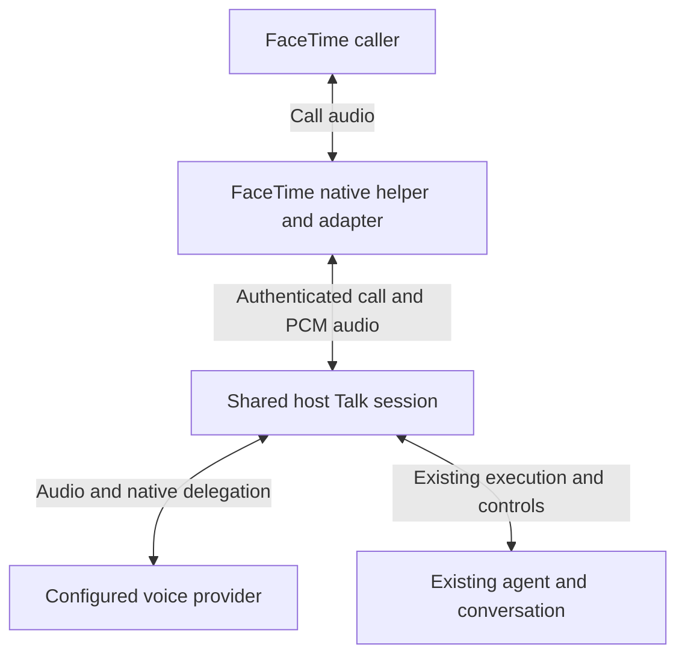

# FaceTime as a shared Talk client

Status: Implemented and DEV validated; physical acceptance pending
Issue: https://github.com/coletaylor788/puddles/issues/206
Last updated: 2026-10-02

## Human section

### Design

FaceTime should offer the same conversation and agent behavior as native Talk. The carrier supplies authenticated owner admission and audio; the Gateway owns configuration, conversation history, agent execution, task controls, and accepted-work lifetime.

#### Shared behavior

| Responsibility | Owner |
| --- | --- |
| Call admission and physical hangup | FaceTime carrier |
| Voice configuration and canonical history | Talk host |
| Reasoning, tools, authorization, steering, and completion | Existing agent and native Talk runners |
| Audio resources and stale playback prevention | Shared bridge and carrier |

A normal hangup ends audio and prevents new work, while accepted work follows native Talk completion semantics. Explicit task cancellation remains separate. The adapter preserves steering and completion ownership across the bridge wrapper.

#### Configuration

Select `realtime.mode: "talk"` to inherit Talk settings. The published standalone carrier mode remains available for existing installations. Shared mode rejects independent voice/provider/instruction and tool-policy overrides so it cannot silently become a different agent experience.

#### Startup and recovery

The enabled plugin starts with the Gateway in the existing macOS login service. Its supervisor opens FaceTime and Phone, attaches the helpers, and retries lost connections. A separate FaceTime login item is unnecessary. After a reboot, the host must reach the signed-in Gateway user session; this feature does not alter automatic login or FileVault.

Acceptance includes startup with the call apps closed, recovery after an app exits, and an isolated Gateway restart. Full reboot recovery requires a physical check before claiming it verified.

#### Locally built call helper

A deployment may select a call-control helper built from the separate pinned
native patch set. Package its source receipt, checksum, build ID, signature, and
license notices inside the immutable runtime. Verify the image before selection
and again after the injector copies it. This path uses local ad-hoc signing;
operator approval and the normal artifact gates apply. It leaves the vendor-signed
capture helper and its microphone permission identity unchanged. Device-specific
acceptance and release evidence belong in private deployment records.

### Status

The shared Talk adapter and automatic call-app startup are implemented. The maintained patch set adds capture-permission stability, streaming playback, and independent media/provider cleanup. Native call-helper source preparation and receipt verification are part of the deployment tooling.

Target-specific device acceptance, operator signing selection, deployment state, and release evidence are tracked outside this public design. The normal cumulative and immutable-artifact deployment gates apply before activation.

## Agent section

### State

- Feature branch `codex/facetime-live`, initial public base `ba0e39e`; inherited native Talk fix `39c91dc` before validation.
- Pinned upstream OpenClaw 2026.9.6. Provider-specific bindings stay outside this repository.
- Existing voice work remains owned by its current task; new changes are developed in an isolated source tree.

### Scope and acceptance criteria

- One owner and one inbound audio call; same canonical Talk conversation.
- Preserve native configuration, reasoning, tools, authority, history, steering, cancellation, and accepted-work completion.
- No guest/group/video/outbound expansion. Mock external writes and provider traffic in automated tests.
- Incorporate parallel native Talk fixes before each relevant validation gate.

### Architecture and decisions

- Add a narrow, scoped host runtime session factory, deriving configuration and session targets from native Talk.
- Keep plugin imports on supported SDK/runtime boundaries.
- Preserve runner lifecycle methods when the bridge wraps consultation.
- Reuse existing FaceTime media and carrier lifecycle; published standalone configuration remains compatible.
- Preserve provider initial history through the bridge path.

### Implementation

1. Share native session creation and scoped runtime authority.
2. Connect FaceTime Talk mode and current caller admission.
3. Add lifecycle, configuration, history, and entrypoint regressions.
4. Register maintained patches and cumulative targets; validate installed behavior and obtain independent review.

### Validation

- Focused session-runtime regression reproduces dropped steering/completion methods and passes after the fix.
- Native session/control, scoped runtime, configuration, history, and existing FaceTime tests ran with synthetic providers. The broader run passed 509 cases; three fixture failures were repaired and their affected checks passed (52 driver cases and the native signature case).
- Public patch registration passes (10 tests). Shared source composes with the companion overlay without losing the history change.
- Full runtime build, declarations, all 158 public SDK exports, and UI sidecars pass. Core and extension type checks pass. All four standard installed DEV scenarios and the installed FaceTime host-loader assertion pass. No physical acceptance or release evidence is claimed.
- Required cumulative release command: `node packages/e2e/bin/openclaw-test-env.mjs ci`.
- Physical audio, signed helper/driver, account routing, and device acceptance remain required.

#### Installed DEV evidence

| Field | Result |
| --- | --- |
| Reviewed public source | `3505f199417552e33ae3bd129b59b4a231996b91` |
| Standard scenarios | Four passed |
| FaceTime assertion | Actual bundled plugin loads through the installed host SDK; Talk configuration, tool and Gateway registration pass |
| Isolation | Synthetic owner, native service disabled, no calls or provider traffic |
| Evidence | Exact installed identity and proof retained in the private implementation record |
| Ownership | Controller finished and DEV lease released. Active runtime, pre-test state snapshot and fixture retained |

This is local draft proof for source landing, not an immutable release receipt. The current source inherits subsequent merged voice fixes. Injector, supervisor, and shared Talk checks pass (18 cases), together with patch registration (10 cases) and focused type-aware lint. The original injector fails both new pipe-release regressions. Independent review cleared the correction after a timeout-diagnostic race was fixed.

An isolated installed runtime automatically launched both closed call apps and connected their helpers in about 51 seconds, including Gateway startup. Each app recovered after exit in about eight seconds. Both helpers also reconnected after Gateway restart. Physical audio, receiving-account routing, and full reboot acceptance remain outstanding. Exact runtime identity and host evidence stay in the private implementation record.

### Rollout and rollback

Start disabled and owner-only. Use normal artifact DEV, TEST, and production gates. Retain native app access and restore only native setup changes introduced by this integration; preserve existing host settings and recovery artifacts.

### Review log

- Shared Talk rejects outbound dialing and restored standalone dials; its tool menu omits outbound actions. Repeated normalization preserves Talk-owned settings. All 106 affected cases pass.
- Removed the plugin manifest default that the host injected before registration. All 17 configuration cases pass, including the real schema-default path; retained review cleared the correction.

- Requester approved the design and implementation.
- Retained independent review of the complete runtime, patch, package, and delivery diff found no actionable findings. The provider-terminal callback test proves automatic cleanup; authority closures retain their original assertions.

### Checklist

- [x] Approve behavior parity and parallel voice-fix dependency.
- [x] Create isolated paired worktrees and composed source.
- [x] Implement adapter and host session contract.
- [x] Incorporate current native Talk fixes and pass independent implementation review.
- [x] Pass focused and installed checks and independent review.
- [x] Register regressions for cumulative validation.
- [x] Land the reviewed implementation source.
- [ ] Complete release gates.
- [ ] Complete physical acceptance and task-owned cleanup.
