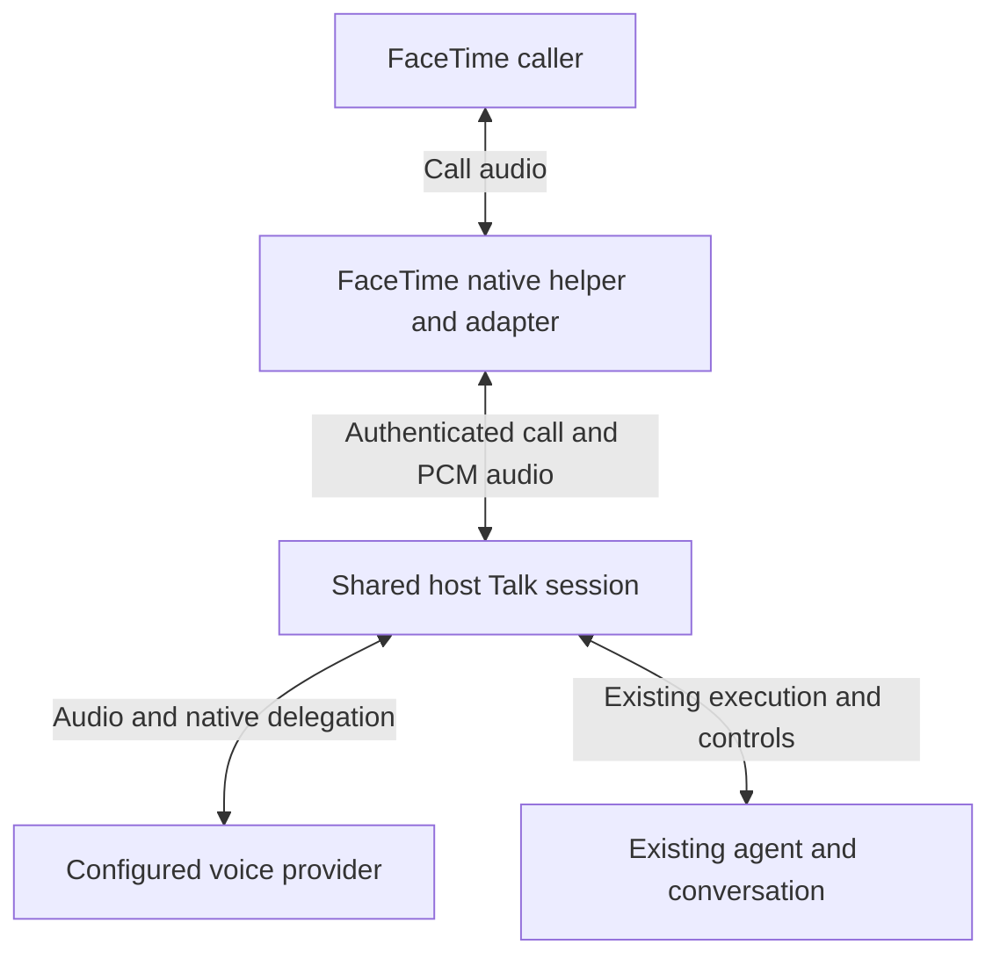

# FaceTime as a shared Talk client

Status: Implemented; installed validation in progress
Issue: https://github.com/coletaylor788/puddles/issues/206
Last updated: 2026-10-02

## Human section

### Design

FaceTime should offer the same conversation and agent behavior as native Talk. The carrier supplies authenticated owner admission and audio; the Gateway owns configuration, conversation history, agent execution, task controls, and accepted-work lifetime.

#### Shared behavior

| Responsibility | Owner |
| --- | --- |
| Call admission and physical hangup | FaceTime carrier |
| Voice configuration and canonical history | Talk host |
| Reasoning, tools, authorization, steering, and completion | Existing agent and native Talk runners |
| Audio resources and stale playback prevention | Shared bridge and carrier |

A normal hangup ends audio and prevents new work, while accepted work follows native Talk completion semantics. Explicit task cancellation remains separate. The adapter preserves steering and completion ownership across the bridge wrapper.

#### Configuration

Select `realtime.mode: "talk"` to inherit Talk settings. The published standalone carrier mode remains available for existing installations. Shared mode rejects independent voice/provider/instruction and tool-policy overrides so it cannot silently become a different agent experience.

### Status

The shared host session and FaceTime adapter are implemented and independently reviewed. Native voice approval and consultation-lifetime fixes are included. Focused behavior, package, and migration checks pass. Installed validation is in progress; physical FaceTime acceptance and deployment remain outstanding.

## Agent section

### State

- Feature branch `codex/facetime-live`, initial public base `ba0e39e`; inherited native Talk fix `39c91dc` before validation.
- Pinned upstream OpenClaw 2026.9.6. Provider-specific bindings stay outside this repository.
- Existing voice work remains owned by its current task; new changes are developed in an isolated source tree.

### Scope and acceptance criteria

- One owner and one inbound audio call; same canonical Talk conversation.
- Preserve native configuration, reasoning, tools, authority, history, steering, cancellation, and accepted-work completion.
- No guest/group/video/outbound expansion. Mock external writes and provider traffic in automated tests.
- Incorporate parallel native Talk fixes before each relevant validation gate.

### Architecture and decisions

- Add a narrow, scoped host runtime session factory, deriving configuration and session targets from native Talk.
- Keep plugin imports on supported SDK/runtime boundaries.
- Preserve runner lifecycle methods when the bridge wraps consultation.
- Reuse existing FaceTime media and carrier lifecycle; published standalone configuration remains compatible.
- Preserve provider initial history through the bridge path.

### Implementation

1. Share native session creation and scoped runtime authority.
2. Connect FaceTime Talk mode and current caller admission.
3. Add lifecycle, configuration, history, and entrypoint regressions.
4. Register maintained patches and cumulative targets; validate installed behavior and obtain independent review.

### Validation

- Focused session-runtime regression reproduces dropped steering/completion methods and passes after the fix.
- Native session/control, scoped runtime, configuration, history, and existing FaceTime tests ran with synthetic providers. The broader run passed 509 cases; three fixture failures were repaired and their affected checks passed (52 driver cases and the native signature case).
- Public patch registration passes (10 tests). Shared source composes with the companion overlay without losing the history change.
- Full runtime build, declarations, all 158 public SDK exports, and UI sidecars pass. Core and extension type checks pass. Installed DEV checks are in progress. No physical acceptance or release evidence is claimed.
- Required cumulative release command: `node packages/e2e/bin/openclaw-test-env.mjs ci`.
- Physical audio, signed helper/driver, account routing, and device acceptance remain required.

### Rollout and rollback

Start disabled and owner-only. Use normal artifact DEV, TEST, and production gates. Retain native app access and restore only native setup changes introduced by this integration; preserve existing host settings and recovery artifacts.

### Review log

- Requester approved the design and implementation.
- Retained independent review of the complete runtime, patch, package, and delivery diff found no actionable findings. The provider-terminal callback test proves automatic cleanup; authority closures retain their original assertions.

### Checklist

- [x] Approve behavior parity and parallel voice-fix dependency.
- [x] Create isolated paired worktrees and composed source.
- [x] Implement adapter and host session contract.
- [x] Incorporate current native Talk fixes and pass independent implementation review.
- [ ] Pass focused and installed checks and independent review.
- [ ] Register regressions, land source, and complete release gates.
- [ ] Complete physical acceptance and task-owned cleanup.

Latest review remediation: shared Talk rejects outbound dialing and does not adopt restored standalone dials. Its tool menu omits outbound actions. Repeated configuration normalization preserves Talk-owned settings without injecting standalone defaults. All 106 affected runtime, tool, configuration, registration, and driver cases pass; retained review cleared both corrections.
