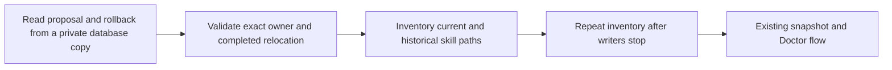

# Capture already migrated Workshop records

## Human section

### Problem

A later release cannot capture an already migrated Workshop create. OpenClaw
Doctor moves its skill into the owning agent's directory and updates the
proposal. The completed rollback row retains the original workspace path.
Our preflight incorrectly requires both paths to remain identical.

### Design

Recognize only a completed SQLite create with an explicit configured owner,
the Workshop source marker, and the exact destination for that owner's skill
key. Its rollback must identify the same proposal and create action, with the
same skill key under that owner's declared workspace skill root. Canonical
paths still enforce containment. Other mismatches continue to fail.

Keep the original path in the snapshot inventory, including an absent-path
marker. A file appearing between preflight and the stopped snapshot changes
the inventory and blocks the transaction. Preserve stored proposal and
rollback data. Ownership and runtime behavior do not change.

### Validation and rollout

Add negative boundary tests and extend the existing actual-Doctor fixture to
inspect migrated state and run Doctor again. The shared cumulative suite runs
both regressions. Carry the repair in the next pinned release through DEV,
TEST, rollback and production verification using the normal lifecycle.

## Agent section

### State and scope

- Release input capture exposed the mismatch before build or activation.
- This compatibility repair is within the approved production maintenance.
- Change the reusable inspector and its committed regressions. Do not edit
  live records, infer missing owners or relax pending-write checks.

### Implementation

- Accept the exact completed-create shape produced by Doctor relocation.
- Inventory its original path and preserve existing canonical path checks.
- Keep the existing private-copy SQLite inspection and snapshot transaction.

### Validation

- Focused boundary tests include wrong owner, proposal identity, action, skill
  key, status, kind, original path, traversal and symlink escape.
- The actual-Doctor fixture covers relocation, subsequent capture and a
  repeated migration, followed by restoration of the original state.
- All 26 focused boundary tests and the component type check pass. The actual
  Doctor fixture passes relocation, repeated capture and state restoration.
- The retained independent reviewer found no remaining issues.
- Cumulative release and installed checks are pending.

### Rollback

Use the existing matching runtime, state and external-directory recovery.
The inspector itself does not write source state.
