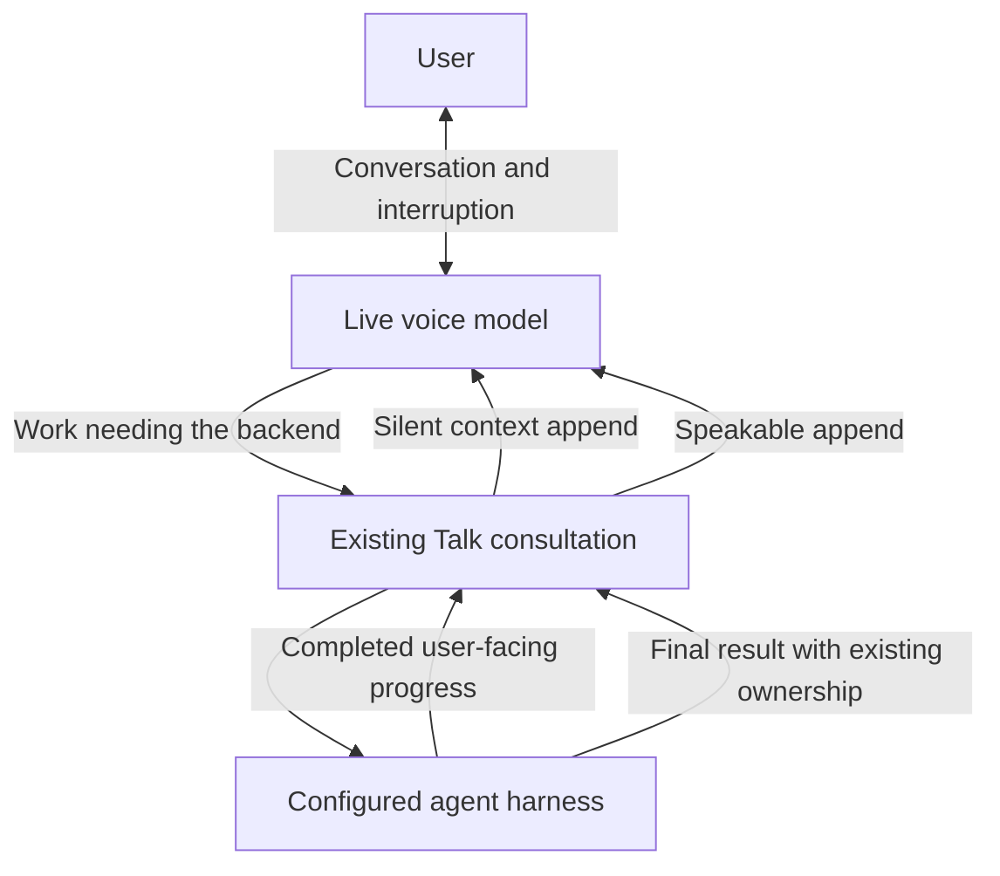

# Talk conversation during delegated work

## Human section

### Design

The Live voice prompt currently delegates ordinary reasoning and tells the model to
wait. This makes brainstorming stall while an unrelated search runs. Let Live
answer from available conversation and returned context. Keep tools, unavailable
facts, actions, and careful reasoning with the existing backend agent.

#### Conversation and progress

The voice prompt permits clarification, examples, lightweight brainstorming, and
discussion while work runs. Progress and results are context, not instructions to
start the same task again. Live must distinguish tentative ideas from verified
results and avoid empty repeated acknowledgements.

The built-in harness already emits completed user-facing commentary as progress
events. Project the Copilot harness's completed `commentary` messages into that
same event. Forward just that text through the existing consultation callback and native
silent-context channel. Do not forward reasoning, partial answers, tool inputs,
or tool output. Bound updates to 1,200 characters and omit consecutive duplicates.
No extra model, summarizer, polling loop, or task scheduler is needed.

#### Ownership and failure

Progress belongs to the active presentation target and physical connection.
Accepted steering moves the target; refused steering preserves it. Updates during
unsettled steering are omitted. It stops at
consult settlement, cancellation, call detachment, or connection replacement.
Final speech retains the existing completion claim and delayed requester-result
path. A silent progress update never claims final delivery.

### Scope and approval

The requester approved the prompt and context fixes on 2026-10-05. Changes to
`sessions_yield` remain research only. This plan changes no tool permissions,
provider selection, stored state, or automatic external delivery.

## Agent section

### Implementation

- Add optional progress callback at the existing Talk consultation seam.
- Select only completed `item/preamble` events in the consultation runtime.
- Project only durable root Copilot `assistant.message` commentary content.
- Preserve callback scope through the Gateway owner and reusable runner paths.
- Append using the existing provider protocol mapping for silent context.
- Update the runtime delegation prompt; preserve operator voice instructions.

### Validation and release

Register provider, consultation, and Gateway regressions in the cumulative patch
manifest. Cover silence during work, ordinary input while pending, typed channel
routing, duplicate/bounded updates, excluded reasoning/tools/final previews, and
late updates after settlement or loss of ownership. Retain existing overlap,
steering, delayed-final, cancellation and close suites. Use recording fixtures;
no paid model call is needed for these checks.

Independent review and focused tests precede source landing. The release owner
runs the accumulated pool on the selected merged candidate and promotes the same
artifact through DEV, TEST and PROD using the managed lifecycle. Restore the prior
runtime/configuration transaction if activation fails. Physical conversation
quality remains for the requester's next voice test.

### Status

Independent review of the complete change, including the Copilot event producer,
is clear. Focused checks pass: 43 Copilot bridge tests, 24 consultation tests,
one composed Copilot-to-Live test, 84 other provider tests, 56 Gateway tests,
18 built-in commentary producer tests, and 10 patch-manifest tests. Core and
extension production type checks passed. Test type checks and the refreshed
managed Copilot package are in progress. Local DEV installed proof and release
validation remain pending. Nothing from this repair is active in production.
