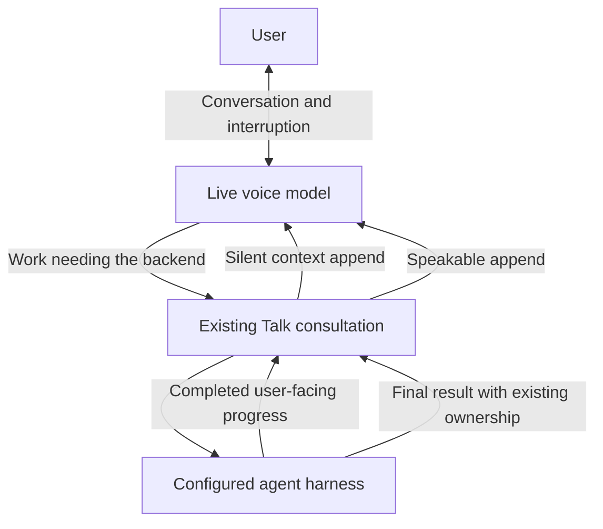

# Talk conversation during delegated work

Status: Deployed and verified in production. Physical voice acceptance remains open.
Issue: [PR #220](https://github.com/coletaylor788/puddles/pull/220)
Last updated: 2026-10-07

## Human section

### Design

The Live voice prompt currently delegates ordinary reasoning and tells the model to
wait. This makes brainstorming stall while an unrelated search runs. Let Live
answer from available conversation and returned context. Keep tools, unavailable
facts, actions, and careful reasoning with the existing backend agent.

#### Conversation and progress

The voice prompt permits clarification, examples, lightweight brainstorming, and
discussion while work runs. Progress and results are context, not instructions to
start the same task again. Live must distinguish tentative ideas from verified
results and avoid empty repeated acknowledgements.

The built-in harness already emits completed user-facing commentary as progress
events. Project the Copilot harness's completed `commentary` messages into that
same event. Forward just that text through the existing consultation callback and native
silent-context channel. Do not forward reasoning, partial answers, tool inputs,
or tool output. Bound updates to 1,200 characters and omit consecutive duplicates.
No extra model, summarizer, polling loop, or task scheduler is needed.

#### Ownership and failure

Progress belongs to the active presentation target and physical connection.
Accepted steering moves the target; refused steering preserves it. Updates during
unsettled steering are omitted. It stops at
consult settlement, cancellation, call detachment, or connection replacement.
Final speech retains the existing completion claim and delayed requester-result
path. A silent progress update never claims final delivery.

### Status

The approved conversation and progress changes are deployed and verified in
production. Live can discuss available context while backend work runs, and
completed backend commentary arrives as silent context. Existing consultation
ownership, yield behavior and operator voice settings are preserved.

The selected merged candidate passed the full cumulative gate, installed DEV
checks, 14 TEST scenarios, activation and rollback rehearsal, and read-only
production verification. The native context repair also preserves the main
agent's session across mixed-harness follow-ups. Physical conversation quality
remains for the requester's next voice test.

## Agent section

### State

The repair uses the existing task worktree. Production activation and verification
completed on October 7 after the exact artifact passed DEV and TEST.
Release reconciliation adds account bindings only for heartbeat `target`, `to`,
and `accountId`, at the defaults or named-agent level. Schedule and model
overrides remain rejected. Focused rendering tests cover both agent shapes.
Release validation exposed an E2E setup rebuild inside Vitest's temporary home.
Pass `OPENCLAW_E2E_USE_PREBUILT_DIST=1` only to mapped test commands after the
build passes. The regression checks build ordering, unchanged output, and every
mapped collection and execution command. The cumulative provider group also
exposed an obsolete direct-transport prompt expectation. Match the exported
policy in the actual session payload and observe the pending startup promise
if an earlier assertion fails. The companion gate exposed the same retired
policy assertions in browser relay, session lifecycle, and provider routing tests.
Match the exported policy or instruction builder at each transport boundary,
preserve history and channel checks, and register all targets in the shared pool.
The communication fixture exposed a native SQLite signal crash with state inside
the checkout. Standalone and Vitest controls outside the checkout pass. Keep
fixture state in a unique host temporary directory and check both exit code and
signal while starting or awaiting replies. The crashing file operation is not
identified, so this does not claim a SQLite runtime fix.
The companion Responses observer must include actual instructions before input
items and translate tool schemas for the shared assertions without changing the
wire request. The private scripted endpoint supports both configured model routes.
The mixed-runtime regression runs the existing heartbeat
scenario through Copilot main and a built-in heartbeat, including quiet checks,
one notification, and subsequent main-chat replies on the same SDK session.
Forward ordinary `currentInboundContext` through the native prompt builder.
The transcript journal checks the exact submitted prompt while preserving the
canonical user message and rejecting mismatched SDK events. Raw and settled
finalization paths keep their existing isolation.

### Scope and acceptance criteria

The requester approved the prompt and context fixes on 2026-10-05. Changes to
`sessions_yield` remain research only. This plan changes no tool permissions,
provider selection, stored state, or automatic external delivery.

Live can discuss available context while a consultation is pending. Completed
public commentary reaches silent context without exposing reasoning or tool data.
Late progress cannot cross a request, cancellation, or connection boundary.

### Architecture and decisions

Reuse the harness event stream and the existing Live delegation controller.
Copilot commentary projects into the same completed preamble event as the built-in
harness. Keep final ownership and delayed result delivery unchanged.

### Implementation

- Add optional progress callback at the existing Talk consultation seam.
- Select only completed `item/preamble` events in the consultation runtime.
- Project only durable root Copilot `assistant.message` commentary content.
- Preserve callback scope through the Gateway owner and reusable runner paths.
- Append using the existing provider protocol mapping for silent context.
- Update the runtime delegation prompt; preserve operator voice instructions.

### Validation

Register provider, consultation, and Gateway regressions in the cumulative patch
manifest. Cover silence during work, ordinary input while pending, typed channel
routing, duplicate/bounded updates, excluded reasoning/tools/final previews, and
late updates after settlement or loss of ownership. Retain existing overlap,
steering, delayed-final, cancellation and close suites. Use recording fixtures;
no paid model call is needed for these checks.

Independent review of the complete change, including the Copilot event producer,
is clear. Focused checks pass: 43 Copilot bridge tests, 24 consultation tests,
one composed Copilot-to-Live test, 84 other provider tests, 56 Gateway tests,
18 built-in commentary producer tests, and 10 patch-manifest tests. Core and
extension production type checks and focused changed-test type checks pass. The
refreshed managed Copilot package matches its expected digest. Broader test typing
still reports unrelated errors. Installed DEV integration and the compiled Talk
concurrency probe pass, with zero model calls and external writes. The selected release also passed the complete cumulative gate, four installed
DEV scenarios and explicit ownership, concurrency, mixed-harness and credential
startup probes. TEST passed 14 scenarios plus activation and rollback. Production
verification confirmed exact runtime and companion digests, approved voice
configuration, recovery linkage and health HTTP 200. No billable voice session or
real message was used; the deployment slots are released.

Signal-exit and nonzero-exit regressions use actual child processes. The full
communication candidate scenario retains its handoff, restart, interruption,
one-report budget, and guarded-tool assertions.

### Rollout and rollback

Independent review and focused tests precede source landing. The release owner
runs the accumulated pool on the selected merged candidate and promotes the same
artifact through DEV, TEST and PROD using the managed lifecycle. Restore the prior
runtime/configuration transaction if activation fails. Physical conversation
quality remains for the requester's next voice test.

### Review log

The retained independent reviewer cleared the complete behavior diff, then checked
the composed regression and compiled runtime probe. No actionable findings remain. The retained reviewer also cleared the temporary
fixture roots and signal-aware exit checks; no runtime SQLite change is included.

### Checklist

- [x] Approved design and registered regression coverage.
- [x] Focused checks and independent review.
- [x] Installed DEV validation.
- [x] Source and release fixture corrections reviewed and merged.
- [x] Selected merged cumulative gate and exact-artifact DEV, TEST and PROD promotion.
- [ ] User voice acceptance.
- [ ] Retire remaining unreferenced development artifacts; preserve recovery dependencies.
