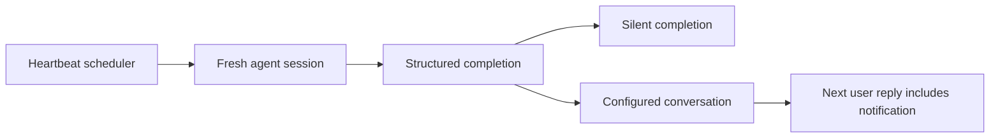

# Native heartbeat completion and reply context

Status: Reviewed implementation; source integration and release validation pending.
Issue: https://github.com/coletaylor788/puddles/issues/223
Last updated: 2026-10-06

## Human section

### Design

A background heartbeat may finish useful tool work without needing to send a chat answer. Treating that silence as an unfinished ordinary conversation can provoke an unnecessary recovery answer. Use OpenClaw's native structured completion so the runtime knows whether the check finished and whether anything should be delivered.

The built-in runtime gains the same default structured response path already available to the Codex harness. Explicit automatic reply policy and CLI-backed completion stay compatible. Agent and sandbox tool policies retain authority; restricted deployments explicitly allow the response tool at both boundaries. Normal chats do not gain the tool.

The native dispatcher sends a notification once and queues its delivered text for the destination's next ordinary reply. Later heartbeat checks leave that context alone. Full workspace bootstrap and fresh-session isolation are independent and remain available together. The delivered context is bounded and memory-resident; persistent task details remain in the task record.

### Status

The prototype passed real local Gateway checks with a scripted provider and recorded iMessage delivery. The maintained scenario and regression targets are being integrated. Independent review identified an additional sandbox grant requirement; the configuration integration and tool assembly regression cover it.

Release validation will run the complete accumulated pool on selected merged source and promote one immutable artifact. Source integration alone does not certify production.

## Agent section

### State

- Approved behavior uses native structured completion, isolation, dispatch, and destination awareness.
- Patch: `docs/openclaw-setup/patches/native-heartbeat-response.patch`.
- Scenario: `packages/e2e/scenarios/heartbeat.mjs`, selected by the existing native scenario pool.
- The upstream strict heartbeat schema has no dedicated response-tool switch.

### Scope and acceptance criteria

- Native built-in heartbeat exposes the response tool when default reply policy is unset and effective tool policies permit it.
- Explicit automatic and CLI fallback behavior remains unchanged.
- Silent completion after tools does not trigger missing-answer recovery.
- Notification is delivered once to its exact configured destination; a later reply receives it even after an intervening heartbeat.
- Full workspace bootstrap remains available; each isolated poll has a new session ID.
- Ordinary turns do not expose the heartbeat tool; no policy bypass or external test delivery.

### Architecture and decisions

- Extend `shouldUseHeartbeatResponseToolPrompt` via the effective runtime/provider selector.
- Reuse existing heartbeat enablement, response capture, terminal evidence, and dispatcher.
- Update messaging and output directives only when the response tool owns heartbeat completion.
- Preserve authoritative explicit agent and sandbox filtering. Test both grants through native tool assembly.
- Extend the existing fixture with opt-in heartbeat wakes and core-tool acceptance. Unknown external mutations still require recording adapters.

### Implementation

- Three runtime files: heartbeat runner configuration, messaging prompt, and system prompt output directives.
- Register all patch regressions in `packages/e2e/openclaw-patch-suite.json` and maintain apply order.
- Keep deployment-specific settings outside the public repository.

### Validation

- Prototype Gateway scenario passed: 10 model requests, three sends including ordinary seed/reply, one heartbeat question, two recorded adapter calls.
- New native fixture prerequisite tests passed with the existing suite.
- Tool assembly regression checks independent agent/sandbox grant combinations and ordinary-turn absence.
- Final cumulative release command: `node packages/e2e/bin/openclaw-test-env.mjs ci`.
- Scripted provider results establish plumbing; they do not establish live model judgment.

### Rollout and rollback

- Merge reviewed source after focused checks and required repository checks.
- Pin merged release source, run cumulative CI, then use the same artifact through DEV, TEST and production.
- Use the existing activation wrapper, state/configuration snapshot, checked migration and rollback.
- Production verification is read-only and sends no test messages.

### Review log

- Retained independent reviewer confirmed the prototype flow.
- Prior test gaps for exact recipient and recovery requests were corrected.
- Sandbox admission finding accepted; narrow configuration grant and tool assembly regression added.

### Checklist

- [x] Approved design and local prototype.
- [x] Maintained patch, native scenario and regression registration.
- [x] Complete retained review and focused checks.
- [ ] Merge source and validate accumulated candidate.
- [ ] Promote exact artifact and verify production.
