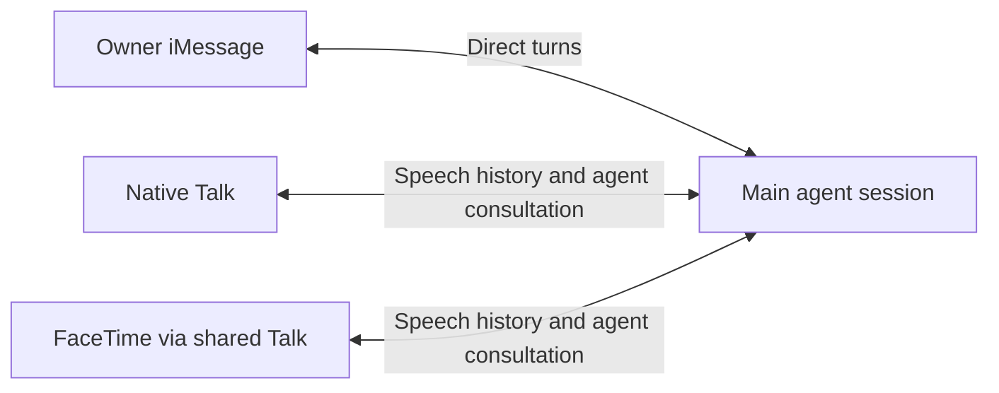

# One main conversation across text and voice

Status: Implementation in progress
Issue: [#239](https://github.com/coletaylor788/puddles/issues/239)
Last updated: 2026-10-08

## Human section

### Design

Use OpenClaw's native main session for the owner's iMessage, Talk, and FaceTime
interactions. Text a request, continue it by voice, and return to text with the
same conversation history.

#### What is already native

OpenClaw describes the [main session](https://docs.openclaw.ai/concepts/main-session)
as one rolling conversation across channels, including iMessage. Native
[Talk](https://docs.openclaw.ai/nodes/talk/realtime-sessions) saves finalized
user and assistant speech live into the active agent session. Its
[session ownership contract](https://docs.openclaw.ai/nodes/talk/session-ownership)
keeps delegated agent replies in that same session and defaults Talk to main.
A separate audio connection does not require a separate conversation.

Stock [FaceTime](https://docs.openclaw.ai/plugins/facetime) is an exception:
it documents separate per-call consultations. Our existing
[shared Talk integration](../openclaw-setup/patches/facetime-talk-client.md)
already connects FaceTime to native Talk history and agent execution.

#### Routing and context

Route the owner's iMessage binding to `agent:main:main` using the documented
[`bindings[].session.dmScope: "main"`](https://docs.openclaw.ai/channels/channel-routing)
override. Keep the global per-sender isolation for everyone else. FaceTime
already targets main in shared Talk mode; native Talk should open main by default.
This makes the ordinary Home conversation the shared destination instead of
requiring voice clients to select an iMessage-specific session.

Reuse native transcript persistence, delegation, and session queueing. Text
enters the harness directly; voice delegates work to it when needed. Ordinary
spoken discussion also stays in history. Replies use their originating channel.

The persistent text harness needs one adapter fix: before each ordinary turn,
read bounded, ordered context from the same native transcript and supply it as
historical context. Keep the current request and native model session intact.
Exclude hidden consultation inputs and never replay history as new actions.

Preserve existing histories during the routing change and carry the current text
discussion into main through a one-time context handoff using the native `chat.inject` API. This
appends an assistant note without starting an agent turn. Preserve the original
text histories. Prepare and verify the handoff at activation; routing alone does
not transfer old context.

#### Validation boundary

Prove text-to-call-to-text continuity, including speech that never needed an
agent consultation. Also test a text sent during an open call. The documentation
establishes shared history, but does not promise immediate updates to every
already-open realtime provider connection. Fix only a demonstrated gap through
the existing Talk path. Do not prebuild a new synchronization layer.

### Status

**Approval:** Production approved. **Approval reference:** The requester said
“approved, ship the change” on 2026-10-08. Scope includes implementation,
validation, landing, production deployment, rollback, and task cleanup.

Implementation is in progress. Live inspection found iMessage using separate
direct sessions while FaceTime uses main. Existing histories will be preserved
and native continuity verified before activation.

## Agent section

### State

- Branch `codex/unified-conversation-proposal`, public base `b71445e`.
- Official documentation checked online and against pinned OpenClaw
  `eb377ac59e6c9fd6c7705028034812becf00271b`.
- Live inspection: global `dmScope: per-channel-peer`; FaceTime enabled with
  `realtime.mode: talk` and `sessionKey: agent:main:main`. Direct iMessage rows
  have different conversation IDs. Native Talk's active selection is unverified.
- Related work: [FaceTime integration](046-facetime-talk-client.md) and
  [Talk conversation progress](050-talk-conversation-progress.md).

### Scope and acceptance criteria

Owner text and voice share main, including delegated results and ordinary speech.
Other senders remain isolated. Preserve current discussion across cutover and
avoid duplicate actions or channel replies.

### Architecture and decisions

Use the native per-binding DM scope and Talk session target. Pinned source
confirms both routes: `src/routing/resolve-route.ts` applies binding overrides;
`src/gateway/talk/client-agent-consult.ts` retains the canonical session target;
`src/talk/client-voice-session.ts` persists speech there. Native Talk supplies
bounded startup history. Persistent harness refresh and mid-call text visibility
are acceptance checks, not assumed reasons to add infrastructure.

### Implementation

1. Verify the exact owner binding, client default, and supported
   history handoff against the installed release.
2. Apply the private routing change in a paired feature worktree. Retain shared
   Talk mode and existing permissions.
3. Test native continuity first. Repair only reproduced failures, with committed
   regressions and the normal review and release lifecycle.

### Validation

Installed synthetic checks pass owner isolation, shared Talk startup history,
speech without consultation, reconnect, and transcript deduplication. A recorded
SDK test reproduced missing speech in the resumed text harness. The fix passes
24 transcript tests, 172 harness tests, and the canonical-session integration
test. Both compiled candidate fixtures and package type checks pass. Private
routing and migration checks pass on pinned Node.

Remaining checks cover sequential
text/voice handoff, voice-only discussion followed by text, simultaneous inputs,
and reconnect or hangup while work is pending. Use recording fixtures, then
owner-initiated physical acceptance. Check that the persistent harness sees the
new spoken history. Release gate: `node packages/e2e/bin/openclaw-test-env.mjs ci`.

### Rollout and rollback

Use the existing DEV and release workflow. Preserve old histories and restore
prior routing with the matching runtime on rollback. No raw database merge.

### Review log

The documentation confirms shared Talk history is native. This revision replaces
the earlier iMessage-specific target and planned synchronization layer with main
routing plus focused verification. Retained independent review found no remaining
material findings in the complete public and private diff. It verified the
context fix, migration, patch composition, and cumulative test mapping.

### Checklist

- [x] Verify live routing and document the native contracts.
- [x] Simplify the proposal.
- [x] Approve implementation through production.
- [ ] Resolve and verify history cutover.
- [ ] Validate, review, release, and complete cleanup.
