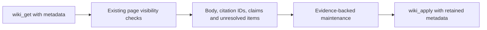

# Preserve wiki metadata during maintenance

**Status:** Implementation
**Issue:** [#242](https://github.com/coletaylor788/puddles/issues/242)
**Last updated:** 2026-10-08

## Human section

### Design

A wiki maintainer must read existing citations and claims before updating a
summary. The current page tool hides those fields, while synthesis updates can
replace them. Expose the existing mutation fields through the authorized page
reader so maintenance can preserve unrelated evidence.

#### Page reader

Successful wiki reads include complete known mutation metadata. Agents opt into
model-visible JSON with `includeMetadata: true`. The JSON includes body pagination;
metadata itself is complete. Ordinary body reads remain unchanged. Memory fallback
has no wiki mutation metadata. This adds no filesystem access or cross-agent read
permission.

#### Maintainer and release

A maintainer reads all body pages and metadata before updating an existing page.
It preserves unrelated citations and evidence, and defers edits if metadata is
unavailable. Runtime support must be installed before a prompt requests it.
Operator schedules and personal configuration remain outside this public change.

### Status

**Approval:** Production approved. **Approval reference:** The requester approved
shipping the two wiki maintenance fixes in this chat on 2026-10-08. This additive
read correction resolves the independent review's citation-preservation finding
within that approved maintainer work. No access boundary or destructive migration
is added. Landing, deployment, rollback and cleanup are authorized.

All 89 focused tests passed and independent source review is clear. Local DEV
packaging is in progress. Production is unchanged.

## Agent section

### State

Assigned public worktree, branch `codex/wiki-maintenance`. Public PR #243 holds
the runtime fix. Its companion prompt changes remain private. One task owns the
pinned OpenClaw source and reusable local build workspace.

### Scope and acceptance criteria

- Complete supported mutation metadata is visible to an agent on request.
- Ordinary body output, page visibility and filesystem access remain unchanged.
- Existing citations and claim evidence survive a summary refresh.
- Install runtime support before a dependent maintenance prompt.

### Architecture and decisions

Return known mutation fields after the existing reader selects an authorized page.
Render them in tool text because model harnesses may omit the separate details
object. Keep body pagination and leave raw filesystem access unchanged.

### Implementation

Patch `wiki-get-mutation-metadata.patch` against OpenClaw 2026.9.6, commit
`eb377ac59e6c9fd6c7705028034812becf00271b`. `query.ts` returns known mutation fields
after visibility filtering. `tool.ts` renders JSON only when requested. The patch
includes the user-facing contract and tool regressions. Register it last in the
cumulative manifest and deployment list.

### Validation

Retained independent reviewer has cleared the source behavior after finding that
body-only reads could lose citations. Focused coverage includes a rich claim and
citation roundtrip, body pagination, unchanged default text, denied bridge reads,
and existing query/read tests. Packaging, DEV, accumulated CI, TEST rehearsal,
production read-only verification and cleanup remain required.

### Rollout and rollback

Land reviewed source. Pin merged source in the normal release workflow and promote
one immutable candidate through DEV, TEST and PROD. Preserve healthy production on
failure. Install the runtime before any operator prompt requests the new flag.
Rollback the dependent prompt before restoring an older runtime. Never force a
production maintenance turn as a deployment test.

### Review log

Retained independent reviewer cleared source and patch packaging. The original
citation-preservation finding is resolved. No new actionable findings remain.

### Checklist

- [x] Diagnose metadata omission and retain independent review.
- [x] Implement additive read contract and committed regression candidates.
- [ ] Finish focused tests and packaging review.
- [ ] Land source and complete the accumulated release workflow.
- [ ] Verify production read-only and clean task-owned development artifacts.
