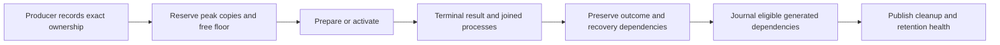

# Close generated storage lifecycles

Status: Implemented and validated; source integration pending.
Issue: https://github.com/coletaylor788/puddles/issues/253
Last updated: 2026-10-09

## Human section

### Design

Completed activation swaps leave their old runtime outside the recovery directory.
Failed synthetic rehearsals can retain large payloads after diagnosis ends.
Preparation and installation need peak-copy admission, and a read-only retention
failure must not leave the deployment slot occupied indefinitely.

#### Installation ownership

The installer records the external directory's filesystem identity immediately
after creation, before extraction. Backup retention considers it alongside its
terminal activation. It checks actual current inventory, recovery references and
host consumers before each move or deletion. Its compact journal resumes partial
removal. The incoming runtime identity file is not a digest of the old runtime
left after an atomic swap. Legacy paths without producer ownership stay retained.

#### Failed diagnostic fixtures

The fixture producer accepts explicit diagnostic closeout after the owner has
proved isolation, joined processes and absence of consumers. It preserves the
failed result, migration input, recovery journal and failure diagnostics outside
the removed payload. A failed rollback remains failed. Generic scratch deletion
still refuses recovery markers, and historical unregistered fixtures need their
own reviewed authority.

#### Capacity admission

Use the existing host reservation registry and free-space floor. Installation
measures expanded archives and counts staging, candidate snapshots, predecessor
snapshots, rollback restoration, prepared files and external workshop copies.
Release preparation reserves its selected runtime, predecessor and plugin inputs.
Concurrent reservations remain charged. Reservations release after joined work;
forced interruption retains evidence for explicit owner recovery.

Existing build admission runs eligible artifact cleanup before reserving space.
This change does not add a background cleaner or authorize additional historical
deletions. Admission records measured demand and retention health. Logical peak
bytes are conservative allocation estimates, not promises of APFS space recovery.

#### Retention health and ownership

A controller writes a joined-process receipt only after its child group stops.
A failed maintenance run releases its lease only when that receipt matches and
there is no plan, tombstone or backup lock, with unchanged retirement journals.
All uncertain or post-mutation failures keep their owner for recovery. The latest
health record and capacity admission expose the blocked reason. Schedule changes
require their own verified configuration.

### Status

**Approval:** Production approved.
**Approval reference:** Approved storage lifecycle design.
**Limits:** This change grants no deletion authority for unknown legacy paths and
does not repair backups, change schedules or activate a runtime.

Implementation, local tooling validation and independent source review are
complete. Source integration and installed tooling verification remain separate
acceptance layers.

## Agent section

### State

The implementation and regression tests are complete in an isolated feature
checkout. Repository checks precede source integration.

### Scope and acceptance criteria

- Persist exact external installation ownership before extraction.
- Retire only eligible terminal generations and their explicitly owned paths.
- Preserve active references, consumers, unknown legacy paths and recovery holds.
- Resume external deletion before removing the generation that explains it.
- Preserve diagnostic failure rather than changing its result to pass.
- Reserve measured peak copies using the shared capacity registry.
- Release failed maintenance only with clean read-only and joined-child proof.
- Publish maintenance health in activation admission evidence.

### Architecture and decisions

Reuse the existing reservation registry, activation journal and retirement controller.
Read archive sizes sequentially so command ownership remains joined on failure.
Accept compressed and plain tar inputs used by supported browser artifacts.

### Implementation

Changes live in native activation, packaging, storage and backup retention helpers,
plus the deployment-slot and maintenance entrypoints. Existing producer manifests
are the only authority for external directory retirement.

### Validation

The complete host and lifecycle pool passed: 654 tests in the full run, then two
packaging tests after building their missing local prerequisites. All 656 tests
passed, including 21 storage regressions. The e2e typecheck passed.
This is host and test tooling; an unchanged OpenClaw runtime is not rebuilt or
activated to install these scripts. Future releases use the newly merged producer
code and still require their normal immutable-artifact gates.

### Rollout and rollback

Land reviewed source with required repository checks. Install a complete hashed
host-tooling closure through the existing maintenance owner. Preserve existing
schedules and recovery records. Release preparation and fixture fixes take
effect when a producer selects these merged source revisions. Revert source or
select the prior tool closure if needed; never discard an outstanding retirement
journal or reservation to make rollback appear complete.

### Review log

The retained independent reviewer found plain-tar compatibility and concurrent
archive-reader lifecycle issues. Both are corrected with committed regressions;
final source clearance is complete with no unresolved findings.

### Checklist

- [x] Approved design and scoped implementation.
- [x] Meaningful failure and lifecycle regressions.
- [x] Complete applicable tooling pool.
- [x] Record final independent review clearance.
- [ ] Land source and hand off the hashed host closure.
- [ ] Verify the installed tooling without changing runtime or schedule state.
