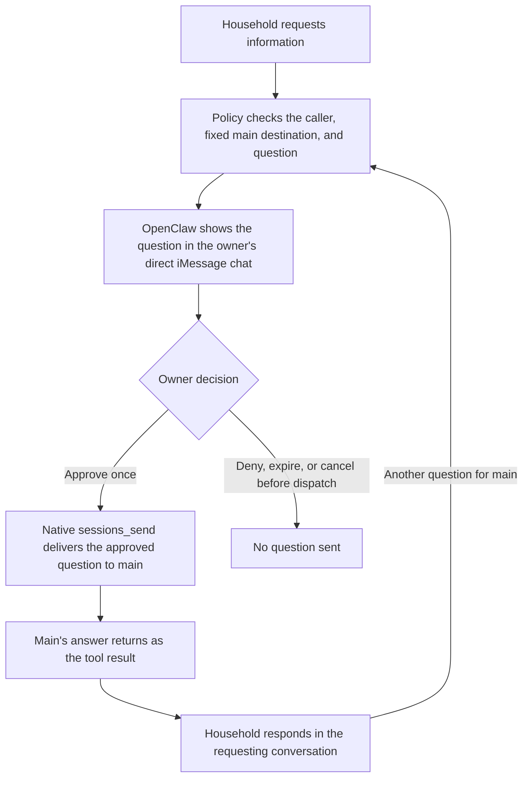

# Native approval for household questions to main

**Status:** Proposed
**Issue:** [#259](https://github.com/coletaylor788/puddles/issues/259)
**Last updated:** 2026-10-09

## Human section

### Design

Household currently sends an escalation to the owner and depends on a quoted
reply carrying the originating session key. Replace that manual relay with an
owner-approved call to OpenClaw's built-in `sessions_send` tool. The owner
approves a specific question and permits main's answer to return to household.
Every later question needs a new approval.

#### Ask through the existing tool

A small policy plugin uses the same `before_tool_call.requireApproval` hook as
Gmail sending. This hook runs after an agent chooses a tool and before the tool
executes. For household's `sessions_send` calls, it accepts only the configured
main session, a bounded question, and a fixed positive reply timeout. Reject
alternate destinations, labels, session IDs, unknown fields, and unsupported
callers. The caller and originating conversation come from the runtime, not
from identities written in the question.

Expose this route only to the interactive household agent. Its reader and
browser workers retain their existing permissions. Household gets no session
listing or history tools and no direct access to main's files, memory, or
service tools. Native session visibility and agent-to-agent policy must permit
the approved route; the plugin restricts each actual call to its fixed target.
Do not loosen unrelated agents' access to establish this route.

The question is an information request. Main retains its existing tool and
action approvals. Household cannot acquire owner identity by receiving an
approval, and this route does not authorize actions such as sending email.

#### Approve the question in the owner's chat

Use the existing fixed owner iMessage destination, native approval message,
and authorized owner reactions. The summary identifies household, the
requesting conversation, the complete question, and that the answer will return
there. For example: “Household asks: What time is dinner? Approve asking main
and sharing its answer with this household conversation.”

Only approve-once and deny are offered. Request a ten-minute approval window.
OpenClaw owns the approval ID, argument snapshot, authenticated decision, and
continuation. If the complete question and necessary routing context cannot
fit the native summary, reject the call and ask household to shorten it.
Do not approve an unseen tail of the question.

Denial, approval expiry, or cancellation before dispatch sends nothing. A new
attempt requires a new approval. Once main has received a question, cancelling
household's wait cannot retract it.

#### Return the answer without an automatic conversation

Set the native `session.agentToAgent.maxPingPongTurns` setting to `0`.
Ping-pong is OpenClaw's automatic exchange of ordinary agent replies after a
session send. Those replies do not require another tool call. Disabling it
means household must make a new approved `sessions_send` call to ask main
anything further, including a clarification.

This setting is shared across the gateway. It also removes automatic
back-and-forth from other session sends. Existing explicit sends and spawned
worker completion are separate mechanisms. Before rollout, verify that the
configured workflows do not depend on automatic ping-pong. A demonstrated
dependency that requires a different design comes back for review.

The answer returns through the native tool result, and household responds in
its original conversation. A new human message cannot rewrite the arguments
OpenClaw already approved. If that message leads household to ask main another
question, that new call requires approval. This is approval of a question and
its answer, not a guarantee about the answer's exact content.

Native session sends also have an announcement step that is separate from
ping-pong. Setting the turn limit to zero does not disable that step. Validate
its destination and behavior with the configured main session. An owner-facing
notification may remain, but no announcement may forward new household text
back to main or disclose the answer to another household conversation.

If main does not answer within the bounded native wait, household reports that
the request was accepted or that its outcome is uncertain, as indicated by the
native result. It must not claim an answer, resend automatically, read main's
history, or build a custom deferred return queue. Verify native late-result
behavior before promising any later delivery to household.

#### Response approval stays outside this version

The inspected native session-send flow has no built-in gate that holds its
returned answer for owner approval. The pre-call hook approves arguments;
`after_tool_call` observes completion and does not gate the result.

An explicit outbound reply tool could use native pre-call approval, but
forcing every answer through it would require custom response handling and
closing the automatic return paths. That is outside this proposal. The owner
accepts automatic return of main's answer to the approved question. Do not add
a response broker, payload store, custom approval UI, or core response patch.

### Status

**Approval:** Proposed. **Approval reference:** In the design discussion on
2026-10-09, the requester accepted disabling ping-pong and requested a proposal.
The requester prefers response approval only if native support exists and does
not want custom response handling. These decisions define the proposal;
implementation and deployment are not yet approved.

The proposal is drafted. Native reply routing, announcement behavior, summary
limits, and permission configuration need verification against the exact
release source and installed recording fixtures during implementation. No
runtime configuration, agent instructions, or deployed behavior has changed.

## Agent section

### State

This is a documentation-only proposal in an assigned isolated worktree, on
`codex/household-native-approval-proposal`, based on public commit `50389e1`.
No overlapping household issue or open pull request was found during drafting.
The existing [household plan](completed/022-household-and-friends-tiers.md)
records the owner-mediated quoted-reply relay and its historical validation.

The repository selects OpenClaw 2026.9.6 at
`eb377ac59e6c9fd6c7705028034812becf00271b`. Local OpenClaw source was inspected for
the hook contracts, session-send reply loop, announcement, and queue behavior.
That local checkout is not established as the exact deployed source. Earlier
attempts to read the relevant files from the pinned Git tree were unsuccessful.
Do not treat the local inspection as installed or exact-candidate validation.

### Scope and acceptance criteria

- One interactive household question reaches the configured main session only
  after an authenticated owner approve-once decision. No owner decision is
  inferred from question text, normal chat replies, or household reactions.
- The complete approved question, caller context, and fixed route match the
  dispatched call. Later human messages or hooks cannot change approved text.
- Only household receives the new route. Other agents, workers, unattended
  jobs, alternate targets, and malformed parameters cannot use it.
- Main's answer can return without response approval. Household cannot read
  main's history or receive unrelated main replies as this request's result.
- Automatic ping-pong is disabled. Every subsequent household-to-main tool
  call, including clarification or a new human question, requests fresh approval.
- Native announcement and timeout behavior are accounted for. Approval timeout
  sends nothing; timeout after dispatch does not imply that nothing happened.
- Existing Gmail approval and unrelated explicit delegation continue working.
- The old quoted-reply escalation is retired only after the approved route
  passes installed validation; ordinary scoped household messaging remains.

### Architecture and decisions

Use a normal registered policy hook around the built-in `sessions_send` tool.
Do not replace its executor or use `onResolution` to dispatch work. Return the
same validated parameters through the hook's `params` field, matching the
[Gmail hook](../../openclaw-plugins/secure-gmail/src/plugin.ts). Block policy and
summary failures explicitly.

Allow only the canonical configured main session key. Resolve the owner target
using the existing main-conversation convention; never use the last active chat
or a household-supplied label. Validate the runtime caller and source session.
Reject `label`, `agentId`, alternate session spellings, timeout zero, and extra
fields rather than introducing additional routing choices. Pin the positive
reply wait in policy using the supported limits of the selected release.

Configure native tool allowlists, sandbox session visibility, agent-to-agent
permissions, plugin forwarding filters, and explicit owner authorization
together. Approval is not a substitute for these permissions. Preserve denials
of `sessions_list`, `sessions_history`, and other routes that expose main data.
Do not copy Gmail's requirement that the original sender be the owner:
household initiates this call, while only the owner may resolve its approval.

Source pointers to inspect in the selected OpenClaw release:

| File | Contract to verify |
|---|---|
| `docs/plugins/plugin-permission-requests.md` | Pre-call approval, summary bounds, allowed decisions, and forwarding filters |
| `src/plugins/hooks.ts` | Approved argument handling, explicit blocking, and observation-only result hook |
| `src/agents/tools/sessions-send-tool.ts` | Tool permissions, positive reply wait, dispatch provenance, and result selection |
| `src/agents/tools/sessions-send-tool.a2a.ts` | Ping-pong loop and separate announcement step |
| `src/agents/tools/sessions-send-helpers.ts` | Shared turn limit and reply/announcement prompts |
| `src/agents/tools/agent-step.ts` and `src/agents/run-wait.ts` | Run completion and selection of the matching answer |
| `docs/concepts/queue.md` | New human input while approval or a reply is pending |

The local source reads a session's latest answer after waiting for a run. Test
concurrent owner traffic and overlapping requests; do not assume a run ID alone
proves that the returned text belongs to this question. If the selected native
route cannot satisfy the acceptance criteria without custom response handling,
record the concrete gap and revisit the design rather than silently adding it.

The [security architecture](../openclaw-setup/security-architecture.md) requires
host-enforced human approval for requests into more restricted context. This
proposal supplies that gate and preserves the originating household identity.
Approval covers the question and permission to receive its answer. It does not
grant owner authority, broad session access, or permission for external actions.

### Implementation

After design approval:

1. Verify selected source and inspect only relevant live configuration and
   relay instructions. Inventory consumers of the shared ping-pong setting.
2. Add a small policy plugin and focused tests following
   [plugin conventions](../../openclaw-plugins/README.md). Reuse native approval
   and session-send behavior.
3. Prepare deployment-specific changes in an isolated companion worktree:
   household tool permissions, fixed owner approval route, zero ping-pong,
   and revised escalation instructions. Preserve identity and scope guards.
4. Add the household regression scenario to the shared integration pool. Verify
   the exact harness and installed runtime with recording adapters.
5. Retire the quoted-reply escalation instructions after the replacement passes.
   Follow the existing release process for source review, landing, and rollout.

Do not edit a primary checkout or publish private routes, identities, account
configuration, or operational inventories. No companion edits are needed to
publish this proposal.

### Validation

For this proposal, review formatting, relative links, privacy, and consistency.
Do not build or deploy unchanged runtime artifacts to validate documentation.

Implementation regressions must cover:

- Approved, denied, expired, cancelled, restarted, and unavailable approval
  routes, with recorded notifications and no real message delivery.
- Full-question display limits, parameter snapshots, post-approval tampering,
  caller identity, destination aliases, and unsupported fields.
- A new human question arriving both during approval and while main answers.
  The approved question stays unchanged and another call prompts again.
- An attempted clarification after the answer. No automatic household reply
  reaches main with the native turn limit set to zero.
- Matching answer selection under concurrent main traffic and overlapping
  household requests, plus correct originating household conversation.
- Announcement destinations, late completion, failures after dispatch, and no
  blind resend or custom history lookup after a timeout.
- Existing scoped household tools, worker restrictions, explicit session sends,
  and Gmail approval remaining intact.

Run focused tests and local DEV checks during iteration. The release owner runs
`node packages/e2e/bin/openclaw-test-env.mjs ci` against the pinned candidate
before promotion, following the [runner guide](../../packages/e2e/README.md).
Register any applicable maintained source regression targets in the cumulative
manifest. Physical iMessage acceptance remains a separate owner check.

### Rollout and rollback

This proposal changes no runtime behavior. After approval, use the normal
source review and release lifecycle, then promote one immutable artifact
through DEV, TEST, and PROD with separate configuration and writable state.
Follow [deployment coordination](../../packages/e2e/DEPLOYMENT_COORDINATION.md)
and the [deployment guide](../openclaw-setup/patches/README.md).

Capture the predecessor's household permissions, approval filters, ping-pong
setting, and relay instructions with its runtime. Rollback restores them as a
unit; never leave household's new tool grant active without the policy plugin.
Production checks remain read-only. Retire task-owned development artifacts
through the [storage workflow](../../packages/e2e/DEVELOPMENT_STORAGE.md).

### Review log

The requester accepted disabling automatic ping-pong. The later response-gate
check found no native gate on automatically returned session-send answers in
the inspected source. An explicit send could be approved, but replacing the
automatic return path would exceed the requested simple integration.

The proposal preserves those decisions and identifies exact-release and
installed behavior checks without claiming they have passed.

### Checklist

- [x] Review existing household relay and Gmail approval contracts.
- [x] Record question approval, no response gate, and zero ping-pong.
- [x] Draft both Human and Agent sections with verification limits.
- [ ] Obtain approval to implement this design.
- [ ] Verify exact release contracts and current configuration.
- [ ] Implement the policy and committed regressions.
- [ ] Complete independent review, source landing, and release validation.
- [ ] Complete owner phone acceptance and task-owned cleanup.
