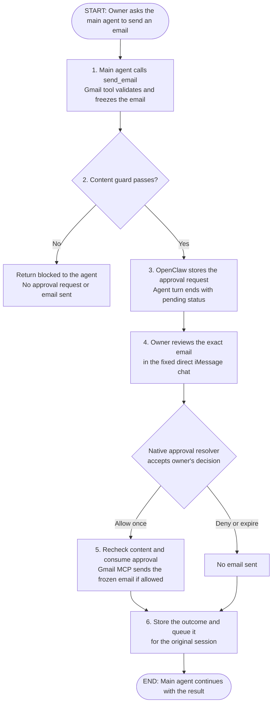

# Native tool approvals and guarded Gmail sending

**Status:** Revised proposal, awaiting design review
**Issue:** [#68](https://github.com/coletaylor788/puddles/issues/68)
**Last updated:** 2026-10-07

## Human section

### Design

Add `send_email` to the existing Gmail integration. The agent prepares an email,
the host checks its content, and the owner reviews the exact recipients and
email in the configured direct iMessage conversation. Only an authenticated
approval releases that email. The agent can finish its current turn while the
request waits, then continue when the send has a terminal result.

Use OpenClaw's plugin approvals as the approval authority. It already supplies
persistent approval records, single-use consumption, authenticated decisions,
iMessage controls, and durable delivery back to sessions. Extend those existing
parts only where the email workflow needs behavior they do not provide today.

Start at the top: the owner asks the main agent to send an email. The flow
moves downward through preparation, review, and the result. While approval is
pending, the current agent turn ends; the stored request waits for the owner.

#### What we reuse and what we build

OpenClaw supplies the approval system, the iMessage decision path, and the queue
that brings results back to the agent. Custom work connects those pieces to
Gmail and adds the ability to review a complete email and approve it later.
This requires code changes, not just configuration.

##### Reuse from OpenClaw

| Existing piece | Its job in this flow |
|---|---|
| Tool permissions and caller identity | Decide which agent may request a send and identify its original session. |
| Plugin approval system | Create the approval ID, store the request and decision, authenticate the reviewer, and allow an approval to be consumed only once. |
| iMessage approval handling | Deliver approval prompts and match a native control or `/approve` command to the correct request and owner. |
| Session delivery queue | Return the outcome to the original session. If the agent is busy, queue the result until it can continue. |

Our existing Gmail bridge, credential handling, and content classifiers are
also reused. Those are Puddles components, not built-in OpenClaw features.

##### Custom work in this proposal

| Change | Where it belongs and why it is needed |
|---|---|
| Guarded `send_email` tool | Extend the existing Puddles Gmail plugin and MCP server. Validate and freeze the email, run the existing secrets/sensitive-content checks without contact lookup, and send only the approved values. Gmail sending is not exposed today. |
| Complete email review | Extend OpenClaw's approval display and iMessage rendering for this email flow. Show every recipient, the subject, and the full body. The existing channel prompt only shows a short summary. |
| Deferred execution and result handling | Extend OpenClaw's approval lifecycle so this operation can wait after the agent's turn ends, survive a restart, and execute once after approval. Add the Gmail-specific execution handler and connect its stored outcome to the existing session queue. Current approvals time out within ten minutes and cancel on restart. |

We do not need to build a second approval service, an iMessage channel, a phone
app, or a new result queue. The custom parts are the Gmail send tool, its full
review display, and the lifecycle that carries an approved email through to a
recorded send outcome. Later sections explain those changes; exact source
references are in the Agent section.

#### Prepare and guard the email

Keep the current split: the reader reads external mail through `InjectionGuard`
and `SecretRedactor`; the authorized main agent can propose a send. Reader,
browser, and lower-trust agents receive no send capability. The Gmail credential
and raw MCP connection remain on the trusted host.

Version one sends a new plain-text email from the configured authenticated
mailbox. Its agent-visible fields are `to`, optional `cc` and `bcc`, `subject`,
and `body_text`. Every recipient is an explicit mailbox address. The host sets
sender identity and defaults. Reject arbitrary headers, raw MIME, attachments,
HTML, alternate accounts, sender aliases, reply/thread options, and unknown
fields. Reply support can follow with explicit thread and header binding.

Keep the existing secrets and sensitive-content checks from `mcp-hooks`, but
separate them from the contact lookup. Scan the complete outgoing subject,
body, and user-controlled envelope text. Classifier failures or thrown guard
errors block the send.

The owner's approval authorizes every displayed To, Cc, and Bcc recipient for
this email. Recipients need not be known contacts or belong to trusted domains;
this tool performs no recipient trust lookup. Validate address syntax and a
nonempty recipient set, and include every destination in the frozen review.
Those checks prevent malformed or hidden destinations, not unfamiliar ones.

Run the content guard before showing an approval, since the review is itself an
outbound message. Repeat it immediately before dispatch using the same frozen
email. Revoked caller access or a degraded content guard produces a blocked
result. Approval never overrides a content block.

This is an explicitly requested, send-email-specific exception to the security
architecture's contact requirement. It replaces recipient trust with the
owner's single-use approval of the exact destinations. Other tools retain their
existing recipient checks.

#### Review exactly what will send

Freeze the normalized email after tool hooks and finalization. Generate the
review from that stored value with host-owned labels: sender, To, Cc, Bcc,
subject, and full plain-text body. Show absent optional fields explicitly. The
executor uses the stored value, not new arguments supplied after approval.
Editing any material field requires a new request and review.

Use the existing native approval ID, owner authentication, and allow-once/deny
choices. Do not infer approval from a conversational yes, from the agent's
claim, or from a contact match. The model cannot select the reviewer or route,
resolve requests, or choose permanent approval.

Add a narrowly scoped email review projection to the native approval view and
iMessage renderer. Do not globally expose existing reviewer-only `detail` on
channels. Version one accepts only an email whose complete escaped review fits
a tested, bounded native prompt. Reject larger input before creating a request;
do not silently truncate, attach a mutable file, or add a hosted preview page.
Any native chunking must complete before approval controls become usable.

The approval destination is a fixed owner-only direct conversation, never the
session's last delivery destination. On that originating owner conversation,
use native iMessage controls. For explicit forwarding, use the existing
`/approve <full-approval-id> allow-once|deny` path unless the selected runtime
proves native controls for that route. Do not promise tapbacks on a generic
forwarded notification. Both paths resolve the same native request. Full email
review and owner authentication are required on either path.

#### Wait without holding an agent turn

Retain the original asynchronous requirement. A send returns a pending ID and
releases the current agent turn. An owner can decide later, and pending work
can recover after gateway restart. This requires a focused extension to native
plugin approvals; current configuration alone cannot deliver it.

Add an opt-in deferred operation owned by a registered host plugin to the
existing approval lifecycle and state database. It stores the frozen email,
original caller/session, owner route, approval ID, deadline, executor version,
and operation outcome. Reuse native transitions and consumption rather than
creating another broker, database, approval tool, or background agent.

The proposed approval lifetime is 24 hours, configured by the operator. This
applies only to this explicit deferred mode. Ordinary native approvals retain
their current two-minute default, ten-minute maximum, and restart cancellation.
Startup can recover a deferred operation only when its registered executor,
owner, session, route, payload, and policy remain valid. It must not revive a
closed agent run or serialize its temporary authority. Invalid records close
without sending. Persisted expiration and cancellation take precedence over a
late decision.

The native decision is authority to perform one frozen operation. A trusted
executor revalidates that authority, reruns the content guard, and atomically
consumes approval before provider dispatch. Cancellation before dispatch prevents a send. Once
Gmail has accepted a request, cancellation cannot promise to recall the email.
The UI distinguishes approval granted from email sent.

#### Send through the existing Gmail integration

Extend `secure-gmail` and its existing Python `gmail-mcp` bridge, using Gmail's
`users.messages.send` endpoint. Do not add a shell-based mail command or a
second Gmail integration. The Python side validates the closed schema again,
constructs MIME with the standard email library, and uses the authenticated
mailbox. No recipient or message content is inferred after review.

The agent-visible tool stages the operation. The effectful MCP send handler is
available only on the trusted approval executor's bridge, enabled explicitly
and disabled by default. It is not exposed as a second agent-callable raw tool.
An `approved: true` argument or an approval ID supplied by the model grants no
authority. Direct MCP consumers do not inherit OpenClaw's approval protection;
they must not receive an enabled raw send connection in this deployment.

The repository already requests `gmail.modify` and `gmail.send`. Gmail accepts
`gmail.modify` for this endpoint as well. Verify the actual grant during future
setup; do not assume the configured scopes prove the live token's permissions
or trigger a new OAuth flow as part of this proposal.

Record dispatch before making the provider call. A successful API response
means Gmail accepted the email, not that the recipient read or received it.
Return its message ID and thread ID with that status. Gmail's send API offers
no documented idempotency-key contract. A timeout, lost response, or crash after
dispatch is therefore **unknown**, not safely retryable. Neither the model,
queue recovery, HTTP retry logic, nor restart recovery automatically resends.
An operator can reconcile uncertainty through read-only provider evidence.
A generated Message-ID can aid that lookup; it is not a deduplication promise.

#### Return the result and continue

Store the send outcome before notifying the agent. Reuse OpenClaw's durable
session delivery queue with a stable operation key and the original session
identity. A duplicate notification cannot invoke Gmail again. A replaced,
deleted, or unauthorized session receives no continuation in another session.

The result distinguishes `sent`, `denied`, `expired`, `cancelled`, `blocked`,
`failed_before_send`, and `unknown`. Only `sent` means Gmail returned success.
Return minimal validated receipt fields. Any external error text that must
reach an agent passes ingress guards; never return raw MIME, body echoes, or
unchecked originals in result metadata. Log IDs, categorical outcomes, and
lengths rather than the email payload or classifier evidence containing it.

#### Alternatives and scope

| Approach | Decision |
|---|---|
| Native approvals unchanged | Good short-lived baseline and first validation step. Does not meet complete phone review, detached waiting, or restart recovery. |
| Native approvals with an email adapter and scoped deferred operation | Recommended. Preserves one approval authority, the existing Gmail integration, and native return delivery. |
| Lobster workflow checkpoint | Official resumable workflow support is real. Its agent-accessible resume token and `approve: true` are not an authenticated owner gate. Wrapping it would still require the same protected executor and native approval authority, so it adds a runtime without closing the main gap. |
| TaskFlow-based controller | Available in the repository pin, but removed from current upstream main. Do not make a new approval feature depend on it. |
| Shell exec approval, MCP annotations, or a prompt asking permission | None binds an authenticated human decision to the final Gmail payload at the send boundary. |
| Separate approval service or phone app | Unnecessary. |

This scope adds one protected send tool. It does not change archive or label
approval policy, workshop approval policy, other tools' recipient trust rules,
or the reader's permissions. It introduces no public listener or hosted UI.

### Status

The proposal is refreshed against current source and includes Gmail sending,
mandatory content checks, owner-approved recipients, complete review,
asynchronous execution, and uncertainty
handling. The existing approval proposal and iMessage plan are reconciled.

Implementation awaits review of this design. Full native routing on the actual
phone, the bounded review size, and the deferred lifecycle are acceptance work,
not claimed production behavior. No runtime or account changes are made.

## Agent section

### State

Design-only refresh of PR #71 and issue #68, dated 2026-10-07. Public repository
base: `fcd0b1a40fa553c25f2019876eace23aadd3f9b5`. Original proposal head:
`b69f0448caf1c2e3bf898f336e041fc1450e154a`.

Source comparison uses three distinct revisions:

| Source | Exact revision | Meaning |
|---|---|---|
| Repository OpenClaw pin | `eb377ac59e6c9fd6c7705028034812becf00271b` | 2026.9.6, from `packages/e2e/openclaw-patch-suite.json`; source read from a clean prepared checkout |
| Latest published stable | `fc23bc864e4553c2d215e479eeec47b67a0bf943` | Tag `v2026.9.8`, release metadata and selected source checked through GitHub |
| Upstream main snapshot | `3b4ba3abb5e33a59ab79e2002f1c7e79c932e8ac` | Selected approval, iMessage, SDK, workflow, and queue files checked through GitHub; not a deployment recommendation |

No installed-runtime or configuration audit is claimed for this refresh. Old
Mini configuration observations in Plan 027 are historical and are not reused
as current facts. No upstream upgrade is included in this proposal.

### Scope and acceptance criteria

- Only an authorized Personal/main caller may stage `send_email`. Reader,
  browser, lower-tier, and unattended calls fail closed in version one. Any
  later scheduled-send support needs explicit originating-task authority.
- The closed schema covers `to`, `cc`, `bcc`, `subject`, and `body_text`.
  Mailbox identity comes from trusted configuration. Nonempty recipients,
  bounded fields, valid addresses, and no header injection are required.
- Outgoing content passes the secrets and sensitive-content guard before review
  and again before send. Classifier outages block. Owner approval authorizes all
  displayed To/Cc/Bcc recipients; no contact or domain lookup is required.
- Approved input equals dispatched input. Unknown fields, oversized review,
  hidden recipients, changed payloads, and unsupported features never send.
- The authenticated owner alone chooses allow-once or deny. Permanent grants,
  model-selected routes, broad resolver tools, and raw send access are absent.
- The original tool returns pending. Waiting occupies no live agent turn.
  Recovery retains only explicit deferred operation authority; ordinary native
  approvals still cancel on restart.
- Concurrent decisions consume once. Deadline, cancellation, policy revocation,
  session replacement, executor-version change, and disabled plugin prevent
  dispatch when detected before it starts.
- At most one attempted Gmail dispatch per operation. Crashes and transport
  uncertainty after dispatch are terminal `unknown`, never an automatic retry.
- Result publication is durable and deduplicated, binds the original session,
  and requests one continuation without repeating the effect.
- Tests record every outbound approval notification and Gmail write through
  explicit doubles. Production checks are read-only.

### Architecture and decisions

#### Source evidence

Links below identify inspected upstream files at fixed revisions. These are
source findings, not end-to-end runtime proofs.

| Finding | Evidence |
|---|---|
| Persistent approval registration already precedes notification; allow-once consumption exists | [Native approval manager](https://github.com/openclaw/openclaw/blob/eb377ac59e6c9fd6c7705028034812becf00271b/src/gateway/exec-approval-manager.ts) and [current manager](https://github.com/openclaw/openclaw/blob/3b4ba3abb5e33a59ab79e2002f1c7e79c932e8ac/src/gateway/exec-approval-manager.ts) |
| Restart closes old pending authority rather than restoring runnable work | [Operator approval transitions](https://github.com/openclaw/openclaw/blob/3b4ba3abb5e33a59ab79e2002f1c7e79c932e8ac/src/gateway/operator-approval-store.transitions.ts), `closeOrphanedOperatorApprovals` |
| Plugin request IDs, allowed decisions, runtime authority, wait, and resolve are native | [Plugin approval handlers](https://github.com/openclaw/openclaw/blob/3b4ba3abb5e33a59ab79e2002f1c7e79c932e8ac/src/gateway/server-methods/plugin-approval.ts) |
| 120-second default, 600-second maximum, 80-character title, 512-character description, bounded reviewer detail | [Plugin approval payload](https://github.com/openclaw/openclaw/blob/3b4ba3abb5e33a59ab79e2002f1c7e79c932e8ac/src/infra/plugin-approvals.ts) |
| Approval helper waits and native defer is a live-call descriptor; finalization follows policy | [Approval helper](https://github.com/openclaw/openclaw/blob/3b4ba3abb5e33a59ab79e2002f1c7e79c932e8ac/src/agents/agent-tools.before-tool-call.approval.ts), [execution wrapper](https://github.com/openclaw/openclaw/blob/3b4ba3abb5e33a59ab79e2002f1c7e79c932e8ac/src/agents/agent-tools.before-tool-call.wrapper.ts) |
| Native iMessage approval and generic forwarding are different surfaces | [Native adapter](https://github.com/openclaw/openclaw/blob/3b4ba3abb5e33a59ab79e2002f1c7e79c932e8ac/extensions/imessage/src/approval-native.ts), [delivery and controls](https://github.com/openclaw/openclaw/blob/3b4ba3abb5e33a59ab79e2002f1c7e79c932e8ac/extensions/imessage/src/approval-handler.runtime.ts) |
| Queue publication preserves original requester/session admission | [Session queue](https://github.com/openclaw/openclaw/blob/3b4ba3abb5e33a59ab79e2002f1c7e79c932e8ac/src/infra/session-delivery-queue-storage.ts) |
| Lobster is optional, resumable, and token-driven | [Official Lobster documentation](https://github.com/openclaw/openclaw/blob/3b4ba3abb5e33a59ab79e2002f1c7e79c932e8ac/docs/tools/lobster.md) |
| TaskFlow existed at the pin; current SDK says Tasks runtime was removed | [Pinned TaskFlow](https://github.com/openclaw/openclaw/blob/eb377ac59e6c9fd6c7705028034812becf00271b/docs/automation/taskflow.md), [current SDK](https://github.com/openclaw/openclaw/blob/3b4ba3abb5e33a59ab79e2002f1c7e79c932e8ac/docs/plugins/sdk-runtime.md) |
| Gmail sends to To/Cc/Bcc and accepts modify or send scope | [Google messages.send reference](https://developers.google.com/workspace/gmail/api/reference/rest/v1/users.messages/send) |

Current repository contracts:

- [Gmail registration](../../openclaw-plugins/secure-gmail/src/plugin.ts) uses a
  static manifest and per-agent factories. No `send_email` is registered.
  Do not rely on the README's older dynamic-discovery description.
- [Gmail wrapper](../../openclaw-plugins/secure-gmail/src/wrap-tool.ts) performs
  ingress after the MCP call. That cannot protect a send. Its modified-result
  `details.original` retains raw content; remove that escape when touching this
  boundary and add a focused regression.
- [ContactsEgressGuard](../../packages/mcp-hooks/src/egress/contacts-egress-guard.ts)
  currently combines secrets/sensitive-content checks and destination trust.
  Factor its content checks into a shared content-only guard in `mcp-hooks`;
  let ContactsEgressGuard keep composing that guard with its existing recipient
  checks. Gmail uses only the content guard. Preserve classifier prompts,
  fail-closed outcomes, and other callers' behavior. Do not pass an empty
  destination extractor or a fake trust resolver to bypass the combined guard.
- [LeakGuard](../../packages/mcp-hooks/src/egress/leak-guard.ts) additionally
  blocks PII. Substituting it would change the retained content policy. Keep the
  existing secrets/sensitive checks without adding that extra category.
- [Gmail server](../../servers/gmail-mcp/src/gmail_mcp/server.py),
  [authentication](../../servers/gmail-mcp/src/gmail_mcp/auth.py), and
  [async adapter](../../servers/gmail-mcp/src/gmail_mcp/_async.py) own provider
  access. Cancelling an async wait does not prove the underlying send stopped.
- [Logging](../../servers/gmail-mcp/src/gmail_mcp/logging_setup.py) currently
  logs some recipient/subject fields. Send handling needs metadata-only logs,
  including redaction of raw MIME and provider exception echoes.
- The [security architecture](../openclaw-setup/security-architecture.md)
  records the owner-approved exception for this exact email flow. Impact:
  unfamiliar recipients can receive a reviewed email after owner approval.
  Content policy remains non-overridable, and other tools retain recipient
  trust checks. This explicit design correction needs no second approval;
  implementation of the whole proposal still awaits design review.

#### Minimal extension boundary

Implement final email preparation inside the dedicated tool's `execute()` after
normal OpenClaw hooks have finalized input. That staging call performs no Gmail
send. Reuse native plugin approvals through a host-owned deferred-operation
entrypoint. Do not move approval ordering for every unrelated OpenClaw tool.

Extend the native store/manager with an explicit deferred-operation binding and
host executor registration. Reuse existing database transactions, decision
validation, expiration, audience rules, and allow-once consumption. The operation
record is not an RPC-supplied executable, closure, path, or arbitrary tool name.
Only a reviewed registered executor/version may consume its typed payload.

A serialized operation must not inherit old run credentials. Define the new
native owner as the registered plugin operation, scoped to the admitted caller,
original session instance, fixed reviewer, and exact payload. Recovery validates
those bindings under current configuration before permitting a decision or
execution. Exempt only this explicit kind from ordinary restart cancellation.
Changing the generic runtime-epoch check is not an acceptable shortcut.

Store a terminal result and pending publication marker together. Recover missing
queue publication using the native queue's idempotency key. Use its existing
session lifecycle and acknowledgement behavior before proposing any extra
consumer deduplication. Prove the crash windows instead of assuming an
idempotency key guarantees exactly-once model execution.

Protected payloads remain in gateway-owned state inaccessible to agent tools.
Expose only status and minimal correlation in agent results. Apply existing
state retention to terminal payloads and keep metadata sufficient to prevent
replay. No credentials enter approval records. Account identities, host paths,
and real routes belong in local configuration, not this public plan.

### Implementation

No runtime implementation is included. After design approval:

1. Prove native plugin request, owner resolution, direct iMessage controls,
   explicit forwarding, and terminal session delivery using synthetic fixtures
   on the repository pin. Recheck exact SDK seams before writing a patch.
2. Add the closed `send_email` schema, host caller checks, preparation, complete
   recipient validation, the shared content-only guard, and safe result handling
   to `secure-gmail`. Preserve ContactsEgressGuard behavior for its other callers
   when extracting the shared content checks. Add Python MIME/send handling to `gmail-mcp` behind explicit
   trusted-host enablement. Keep schemas in contract tests.
3. Add the bounded email review projection and the opt-in deferred operation to
   the existing native approval lifecycle. Preserve ordinary approval behavior,
   owner authorization, and run-lifetime checks. Add only the host SDK seam
   needed by this plugin, not an agent-visible approval resolver.
4. Wire native resolution to guarded execution, persisted dispatch/outcome,
   recovery, and existing session return delivery. Disable provider/transport
   retries for an ambiguous send, including automatic retries hidden below the
   Python API call.
5. Update component docs and explicitly grant main the send tool. Preserve read
   permissions, archive/label policy, and workshop settings. Register every
   OpenClaw patch regression in the cumulative suite.

The review size and exact SDK entrypoint names are implementation details to
settle from fixtures. The lifetime, caller restrictions, non-overridable content checks,
restart authority, and unknown-outcome behavior are design decisions. Any need
to weaken them returns to design review.

### Validation

This revision uses source/API inspection, document review, relative-link checks,
and `git diff --check`. It does not run runtime CI, install dependencies, start
DEV/TEST, request a live approval, or send mail.

Future executable regressions must cover:

| Area | Required proof |
|---|---|
| Gmail contract | Schema parity, MIME/header injection rejection, Unicode, all To/Cc/Bcc recipients, fixed mailbox, rejection of unsupported fields and direct bypass |
| Guards and recipients | Secrets/sensitive data still block even with approval; classifier failure blocks; unfamiliar To/Cc/Bcc addresses pass with owner approval; no contact lookup occurs; malformed, empty, hidden, or changed recipients fail; other tools retain their existing checks; no raw content in result metadata or logs |
| Review | Exact final values after hooks, no hidden defaults, escaping and display spoofing, full bounded body, no truncation, partial delivery failure, controls bound to the complete review |
| Authority | Wrong actor/account/chat/GUID, forged approval arguments, allow-always refusal, original caller/session mismatch, disabled executor, no reader or unattended escalation |
| Lifetime | Pending returns without holding the run, expiry, restart recovery for deferred operations only, ordinary restart cancellation, no restoration of closed run authority |
| Effects | Concurrent and duplicate decisions, cancellation races, crash before and after dispatch, timeout with a still-running Python worker, lost success response, no transport or model resend |
| Continuation | Persist-before-publish crash, duplicate queue delivery, busy/deleted/reset sessions, one terminal event and continuation, no Gmail call from notification recovery |
| Harnesses | Exercise each configured harness through the actual OpenClaw tool boundary. A unit test of the approval helper alone is insufficient. |

Use documented focused checks in [secure-gmail](../../openclaw-plugins/secure-gmail/README.md)
and [gmail-mcp](../../servers/gmail-mcp/README.md). After implementation, add
cross-component cases under [e2e](../../packages/e2e/README.md) and patch targets
in `packages/e2e/openclaw-patch-suite.json`. The release owner runs the accumulated
`node packages/e2e/bin/openclaw-test-env.mjs ci` gate for the pinned candidate.
All external writes use deny-by-default recording adapters.

### Rollout and rollback

This PR remains a proposal for review. Publishing it authorizes no runtime,
credential, account, send, or deployment change.

Future implementation follows the repository's approved-design lifecycle,
including focused DEV checks, retained review, source landing, the accumulated
release gate, TEST rehearsal, and the same artifact's production promotion.
Start the send tool disabled and validate against recordings first. Verify the
actual mailbox grant and configured approval route without sending mail.

Rollback disables new send admission and deferred dispatch before retiring the
executor. Close unconsumed operations without sending and publish their terminal
outcomes. Preserve consumed/unknown records for reconciliation; rollback cannot
unsend an email. Schema compatibility and the disable/close migration must be
part of TEST rehearsal. Ordinary native approvals continue unchanged.

### Review log

- The refreshed proposal replaces the older memory-only approval assumption
  with the current persistent native store and explicit restart semantics.
- It retains complete review, detached waiting, guarded one-time execution, and
  original-session continuation from the earlier proposal.
- It removes a dependency on obsolete TaskFlow APIs and does not treat Lobster
  tokens or live-call defer descriptors as owner approval authority.
- The owner explicitly removed recipient trust checks for this email flow.
  Single-use approval now authorizes the displayed destinations. The same
  secrets/sensitive-content policy remains mandatory, and the security
  architecture records this scoped exception.
- Raw metadata exposure, logging, and ambiguous send outcomes remain explicit
  implementation work.
- This is a local design/source consistency review, not independent runtime
  review or production acceptance.

### Checklist

- [x] Recover the existing proposal and tracking issue.
- [x] Compare repository pin, latest stable, and current upstream source.
- [x] Separate native reuse from required extensions.
- [x] Include Gmail schema, guards, approval, send, and return flow.
- [x] Reconcile Human and Agent sections and the older iMessage plan.
- [ ] Obtain review of this revised design before implementation.
- [ ] Implement and validate with recording transports and providers.
- [ ] Complete the approved release lifecycle and owner validation.
