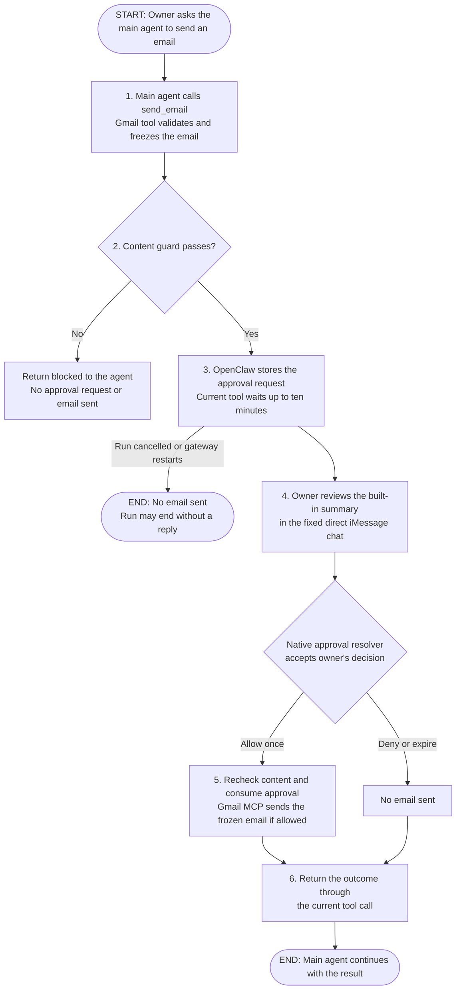

# Native tool approvals and guarded Gmail sending

**Status:** Revised proposal, awaiting design review
**Issue:** [#68](https://github.com/coletaylor788/puddles/issues/68)
**Last updated:** 2026-10-07

## Human section

### Design

Add `send_email` to the existing Gmail integration. The agent prepares an email,
the host checks its content, and the owner reviews OpenClaw's built-in approval
summary in the configured direct iMessage conversation. Only an authenticated
approval releases that email. The current tool waits for the decision for up
to ten minutes, then returns its result through the normal agent turn.

Use OpenClaw's plugin approvals as the approval authority. It already supplies
persistent approval records, single-use consumption, authenticated decisions,
iMessage controls, and waiting within a live tool call. Keep that lifecycle
unchanged. Custom code adds Gmail sending and the retained content checks.

Start at the top: the owner asks the main agent to send an email. The flow
moves downward through preparation, review, and the result. While approval is
pending, the current tool stays open and waits for the owner.

#### What we reuse and what we build

OpenClaw supplies the approval system, the iMessage decision path, and the
live tool wait. Puddles adds the Gmail send tool and connects its existing
content checks to that flow. This needs Gmail integration code and approval
configuration, but no new OpenClaw approval lifecycle or channel adapter.

##### Reuse from OpenClaw

| Existing piece | Its job in this flow |
|---|---|
| Tool permissions and caller identity | Decide which agent may request a send and bind it to its current run. |
| Plugin approval system | Create and store the approval, authenticate the reviewer, supply the built-in summary, and consume an allow-once decision only once. |
| iMessage approval handling | Forward the structured prompt to the fixed owner chat and match a reaction or `/approve` command to its exact request. |
| Live approval wait | Keep the tool waiting for a decision, then resume the normal tool pipeline. Timeout, run cancellation, or gateway restart prevents a pending send. |

Our existing Gmail bridge, credential handling, and content classifiers are
also reused. Those are Puddles components, not built-in OpenClaw features.

##### Custom work in this proposal

| Change | Where it belongs and why it is needed |
|---|---|
| Guarded `send_email` tool | Extend the existing Puddles Gmail plugin and MCP server. Validate and freeze the email, request native approval, and send only the approved values. Gmail sending is not exposed today. |
| Shared content-only guard | Factor the existing secrets/sensitive-content checks out of the combined contact guard. Gmail keeps those checks without requiring recipients to be known contacts; other tools keep their current policy. |

Configure native plugin approval forwarding to the owner and a ten-minute
request timeout. There is no custom email review, detached executor, recovery
queue, approval database, phone app, or core patch in version one.

#### Prepare and guard the email

Keep the current split: the reader reads external mail through `InjectionGuard`
and `SecretRedactor`; the authorized main agent can propose a send. Reader,
browser, and lower-trust agents receive no send capability. The Gmail credential
and raw MCP connection remain on the trusted host.

Version one sends a new plain-text email from the configured authenticated
mailbox. Its agent-visible fields are `to`, optional `cc` and `bcc`, `subject`,
and `body_text`. Every recipient is an explicit mailbox address. The host sets
sender identity and defaults. Reject arbitrary headers, raw MIME, attachments,
HTML, alternate accounts, sender aliases, reply/thread options, and unknown
fields. Reply support can follow with explicit thread and header binding.

Keep the existing secrets and sensitive-content checks from `mcp-hooks`, but
separate them from the contact lookup. Scan the complete outgoing subject,
body, and user-controlled envelope text. Classifier failures or thrown guard
errors block the send.

The owner's approval authorizes every displayed To, Cc, and Bcc recipient for
this email. Recipients need not be known contacts or belong to trusted domains;
this tool performs no recipient trust lookup. Validate address syntax and a
nonempty recipient set, and list every destination in the approval summary.
Those checks prevent malformed or hidden destinations, not unfamiliar ones.

Run the content guard before showing an approval, since the review is itself an
outbound message. Repeat it immediately before dispatch using the same frozen
email. Revoked caller access or a degraded content guard produces a blocked
result. Approval never overrides a content block.

This is an explicitly requested, send-email-specific exception to the security
architecture's contact requirement. It replaces recipient trust with the
owner's single-use approval of the exact destinations. Other tools retain their
existing recipient checks.

#### Use the built-in approval summary

Normalize and freeze the email before requesting approval. Populate the
existing approval title and description from those values. Show the sender,
To/Cc/Bcc recipients, subject, and a short body preview where space allows.
The body preview is explicitly a summary, not the complete email. The owner
accepts this built-in review surface for version one. There is no custom email
renderer, expanded approval payload, or hosted preview page.

Keep all recipient addresses visible within the existing summary bounds. If
the envelope cannot fit, reject the request before approval rather than hiding
a destination. A long body can have a shortened preview; its full content still
passes the content guard. The tool uses the frozen email, not replacement
arguments supplied after approval. Finalization rejects any material hook
rewrite after review; a material edit requires a new request.

#### Approve with an iMessage reaction

Use OpenClaw's existing plugin approval forwarder with an explicit target for
the owner's fixed direct iMessage conversation. Configure
`approvals.plugin.enabled: true`, `mode: "targets"`, and one exact account and
destination. The channel's `allowFrom` contains the owner's explicit identity,
without a wildcard. Each request permits only `allow-once` and `deny`.

The owner presses and holds the approval message, then selects **👍 to approve
once** or **👎 to deny**. OpenClaw adds these instructions to the prompt, records
its actual message GUID, and checks both that GUID and the reacting sender
before resolving the native request. No ID needs to be typed. An unrelated
message or a bare yes does not resolve an approval.

This is built-in behavior for structured forwarded approval prompts as well as
native origin prompts. Preserve OpenClaw's typed approval metadata through its
normal delivery path; sending an ordinary text imitation would lose that
binding. `/approve <full-approval-id> allow-once|deny` remains the built-in
fallback. Native origin prompts can also use polls when the bridge supports
them, but the proposed fixed-target flow uses the built-in tapback path and
does not need polls or new channel code.

#### Use the built-in approval wait

Version one uses OpenClaw's existing wait inside the current tool call. Its
native default is two minutes and its maximum is ten minutes; request ten
minutes for this tool. Run cancellation or gateway restart cancels pending
work. An expired or cancelled request needs a fresh send request and approval.
There is no send waiting for hours, detached worker, or restart recovery.

An unrelated message does not approve or deny the email. OpenClaw's default
`steer` queue mode lets an already-running tool finish before applying new
instructions at the next boundary. A follow-up question may therefore wait
until approval, denial, or timeout. Version one does not promise a conversation
about the draft while approval remains pending. To ask questions or change the
email first, deny with 👎 and then send the follow-up. A normal message such as
“change the subject” must not be treated as cancellation or as a safe way to
edit the pending email.

Existing queue settings still apply: `followup` and `collect` also wait;
`interrupt` aborts the active run. This proposal does not change those settings.
An explicit `/stop` cancels the active run. Any abort before dispatch prevents
sending, but cancellation after dispatch cannot promise to recall an email.
Honor OpenClaw's execution checkpoints if steering skips a call before it starts.

Only an authenticated allow-once decision permits the live tool pipeline to
continue. Recheck content and frozen inputs before dispatch. Approval granted
and email sent remain separate outcomes.

#### Send through the existing Gmail integration

Extend `secure-gmail` and its existing Python `gmail-mcp` bridge, using Gmail's
`users.messages.send` endpoint. Do not add a shell-based mail command or a
second Gmail integration. The Python side validates the closed schema again,
constructs MIME with the standard email library, and uses the authenticated
mailbox. No recipient or message content is inferred after review.

The agent-visible tool executes only after native approval. The effectful MCP
send handler is available only on the trusted Gmail plugin's bridge, enabled explicitly
and disabled by default. It is not exposed as a second agent-callable raw tool.
An `approved: true` argument or an approval ID supplied by the model grants no
authority. Direct MCP consumers do not inherit OpenClaw's approval protection;
they must not receive an enabled raw send connection in this deployment.

The repository already requests `gmail.modify` and `gmail.send`. Gmail accepts
`gmail.modify` for this endpoint as well. Verify the actual grant during future
setup; do not assume the configured scopes prove the live token's permissions
or trigger a new OAuth flow as part of this proposal.

Record dispatch before making the provider call. A successful API response
means Gmail accepted the email, not that the recipient read or received it.
Return its message ID and thread ID with that status. Gmail's send API offers
no documented idempotency-key contract. A timeout, lost response, or crash after
dispatch is therefore **unknown**, not safely retryable. Neither the model,
HTTP retry logic, nor a later agent run automatically resends.
An operator can reconcile uncertainty through read-only provider evidence.
A generated Message-ID can aid that lookup; it is not a deduplication promise.

#### Return the result and continue

Return through the current tool call and let OpenClaw continue the normal
agent turn. No background result publisher or separate session continuation
is needed. Record only the dispatch and receipt metadata needed to diagnose
uncertainty; this is not a resumable operation store.

Distinguish Gmail success (`sent`) from native denial, expiry, cancellation,
a content block, failure before dispatch, or `unknown` after dispatch. Native
cancellation may end the run without a final agent reply. Only `sent` means
Gmail returned success. Return minimal validated receipt fields. Any external
error text that must reach an agent passes ingress guards; never return raw
MIME, body echoes, or unchecked originals in result metadata. Log IDs,
categorical outcomes, and lengths rather than the email payload or classifier
evidence containing it.

#### Alternatives and scope

| Approach | Decision |
|---|---|
| Native approval wait plus guarded Gmail tool | Selected for version one. Built-in summary and iMessage controls, up to ten minutes in the live tool call, cancelled on restart. |
| Custom deferred execution | Out of scope. Waiting after the turn ends or recovering runnable work after restart would require additional lifecycle code. |
| Lobster workflow checkpoint | Official resumable workflow support is real. Its agent-accessible resume token and `approve: true` are not an authenticated owner gate. Wrapping it would still require the same guarded Gmail tool and native approval authority, so it adds a runtime without closing the main gap. |
| TaskFlow-based controller | Available in the repository pin, but removed from current upstream main. Do not make a new approval feature depend on it. |
| Shell exec approval, MCP annotations, or a prompt asking permission | None binds an authenticated human decision to the final Gmail payload at the send boundary. |
| Separate approval service or phone app | Unnecessary. |

This scope adds one protected send tool. It does not change archive or label
approval policy, workshop approval policy, other tools' recipient trust rules,
or the reader's permissions. It introduces no public listener or hosted UI.

### Status

The proposal is refreshed against current source and includes Gmail sending,
mandatory content checks, owner-approved recipients, the built-in approval
summary and iMessage reactions, the native live wait, and uncertainty handling.
The owner selected the built-in wait for version one.

Implementation awaits review of this design. Full native routing on the actual
phone and guarded Gmail execution are acceptance work, not claimed production
behavior. No runtime or account changes are made.

## Agent section

### State

Design-only refresh of PR #71 and issue #68, dated 2026-10-07. Public repository
base: `fcd0b1a40fa553c25f2019876eace23aadd3f9b5`. Original proposal head:
`b69f0448caf1c2e3bf898f336e041fc1450e154a`.

Source comparison uses three distinct revisions:

| Source | Exact revision | Meaning |
|---|---|---|
| Repository OpenClaw pin | `eb377ac59e6c9fd6c7705028034812becf00271b` | 2026.9.6, from `packages/e2e/openclaw-patch-suite.json`; source read from a clean prepared checkout |
| Latest published stable | `fc23bc864e4553c2d215e479eeec47b67a0bf943` | Tag `v2026.9.8`, release metadata and selected source checked through GitHub |
| Upstream main snapshot | `3b4ba3abb5e33a59ab79e2002f1c7e79c932e8ac` | Selected approval, iMessage, SDK, workflow, and queue files checked through GitHub; not a deployment recommendation |

Public evidence below covers source contracts. Selected read-only deployment
checks are not published as machine-specific configuration or inventory. No
physical iPhone round trip or end-to-end send is claimed, and no upstream
upgrade is included in this proposal.

### Scope and acceptance criteria

- Only an authorized Personal/main caller may invoke `send_email`. Reader,
  browser, lower-tier, and unattended calls fail closed in version one. Any
  later scheduled-send support needs explicit originating-task authority.
- The closed schema covers `to`, `cc`, `bcc`, `subject`, and `body_text`.
  Mailbox identity comes from trusted configuration. Nonempty recipients,
  bounded fields, valid addresses, and no header injection are required.
- Outgoing content passes the secrets and sensitive-content guard before review
  and again before send. Classifier outages block. Owner approval authorizes all
  displayed To/Cc/Bcc recipients; no contact or domain lookup is required.
- Approved input equals dispatched input. The built-in summary shows every
  recipient and may shorten the body preview. Unknown fields, a recipient list
  too large for the summary, changed payloads, and unsupported features fail.
- The authenticated owner alone chooses allow-once or deny. Permanent grants,
  model-selected routes, broad resolver tools, and raw send access are absent.
- The current tool waits using native approval handling, with a requested
  ten-minute timeout. Run abort or gateway restart cancels pending work. No
  detached execution or restart recovery is added. Unrelated chat is not a
  decision and may wait behind the tool under normal queue handling.
- Concurrent decisions consume once. Deadline, cancellation, policy revocation,
  run cancellation and disabled plugin prevent
  dispatch when detected before it starts.
- At most one attempted Gmail dispatch per operation. Crashes and transport
  uncertainty after dispatch are terminal `unknown`, never an automatic retry.
- The outcome uses the original tool result path. Cancellation can end the run
  without a final reply. A later request never automatically retries an unknown
  send.
- Tests record every outbound approval notification and Gmail write through
  explicit doubles. Production checks are read-only.

### Architecture and decisions

#### Source evidence

Links below identify inspected upstream files at fixed revisions. These are
source findings, not end-to-end runtime proofs.

| Finding | Evidence |
|---|---|
| Persistent approval registration already precedes notification; allow-once consumption exists | [Native approval manager](https://github.com/openclaw/openclaw/blob/eb377ac59e6c9fd6c7705028034812becf00271b/src/gateway/exec-approval-manager.ts) and [current manager](https://github.com/openclaw/openclaw/blob/3b4ba3abb5e33a59ab79e2002f1c7e79c932e8ac/src/gateway/exec-approval-manager.ts) |
| Restart closes old pending authority rather than restoring runnable work | [Operator approval transitions](https://github.com/openclaw/openclaw/blob/3b4ba3abb5e33a59ab79e2002f1c7e79c932e8ac/src/gateway/operator-approval-store.transitions.ts), `closeOrphanedOperatorApprovals` |
| Plugin request IDs, allowed decisions, runtime authority, wait, and resolve are native | [Plugin approval handlers](https://github.com/openclaw/openclaw/blob/3b4ba3abb5e33a59ab79e2002f1c7e79c932e8ac/src/gateway/server-methods/plugin-approval.ts) |
| 120-second default, 600-second maximum, 80-character title, 512-character description, bounded reviewer detail | [Plugin approval payload](https://github.com/openclaw/openclaw/blob/3b4ba3abb5e33a59ab79e2002f1c7e79c932e8ac/src/infra/plugin-approvals.ts) |
| Approval helper waits and native defer is a live-call descriptor; finalization follows policy | [Approval helper](https://github.com/openclaw/openclaw/blob/3b4ba3abb5e33a59ab79e2002f1c7e79c932e8ac/src/agents/agent-tools.before-tool-call.approval.ts), [execution wrapper](https://github.com/openclaw/openclaw/blob/3b4ba3abb5e33a59ab79e2002f1c7e79c932e8ac/src/agents/agent-tools.before-tool-call.wrapper.ts) |
| Native iMessage approval and explicit forwarding use existing channel handling | [Native adapter](https://github.com/openclaw/openclaw/blob/3b4ba3abb5e33a59ab79e2002f1c7e79c932e8ac/extensions/imessage/src/approval-native.ts), [delivery and controls](https://github.com/openclaw/openclaw/blob/3b4ba3abb5e33a59ab79e2002f1c7e79c932e8ac/extensions/imessage/src/approval-handler.runtime.ts) |
| Default steering lets an already-running tool finish; interrupt aborts the run | [Queue behavior](https://github.com/openclaw/openclaw/blob/eb377ac59e6c9fd6c7705028034812becf00271b/docs/concepts/queue.md), [steering boundaries](https://github.com/openclaw/openclaw/blob/eb377ac59e6c9fd6c7705028034812becf00271b/docs/concepts/queue-steering.md) |
| Lobster is optional, resumable, and token-driven | [Official Lobster documentation](https://github.com/openclaw/openclaw/blob/3b4ba3abb5e33a59ab79e2002f1c7e79c932e8ac/docs/tools/lobster.md) |
| TaskFlow existed at the pin; current SDK says Tasks runtime was removed | [Pinned TaskFlow](https://github.com/openclaw/openclaw/blob/eb377ac59e6c9fd6c7705028034812becf00271b/docs/automation/taskflow.md), [current SDK](https://github.com/openclaw/openclaw/blob/3b4ba3abb5e33a59ab79e2002f1c7e79c932e8ac/docs/plugins/sdk-runtime.md) |
| Gmail sends to To/Cc/Bcc and accepts modify or send scope | [Google messages.send reference](https://developers.google.com/workspace/gmail/api/reference/rest/v1/users.messages/send) |

#### Built-in iMessage verification

At the repository pin, inspected source and its committed regression tests
confirm the fixed-target flow. The following four files were also fetched from
upstream at the exact pin and matched the inspected local bytes:

- [Channel delivery](https://github.com/openclaw/openclaw/blob/eb377ac59e6c9fd6c7705028034812becf00271b/extensions/imessage/src/channel.ts)
  adds reaction instructions before a forwarded approval is delivered and
  registers the delivered GUID afterward.
- [Reaction resolution](https://github.com/openclaw/openclaw/blob/eb377ac59e6c9fd6c7705028034812becf00271b/extensions/imessage/src/approval-reactions.ts)
  matches the account, conversation, and message GUID, then authenticates the
  actor and invokes the native resolver. Successful resolution retires the
  reaction binding.
- [Reaction tests](https://github.com/openclaw/openclaw/blob/eb377ac59e6c9fd6c7705028034812becf00271b/extensions/imessage/src/approval-reactions.test.ts)
  cover typed forwarded prompts, GUID binding, chunking, authorized senders,
  stale targets, and a subsequent reaction not executing again.
- [Native approval tests](https://github.com/openclaw/openclaw/blob/eb377ac59e6c9fd6c7705028034812becf00271b/extensions/imessage/src/approval-native.test.ts)
  include target-mode plugin prompts with explicit thumbs-up/thumbs-down hints.

These are inspected tests, not newly executed test results. The prepared source
checkout has no installed test dependencies. No dependencies or runtime were
built for this proposal, and no real approval message was sent. The future
recording-based acceptance test must exercise actual forwarding and inbound
reaction handling together, including another ordinary message between request
and reaction. A physical iPhone check remains part of user validation.

Current repository contracts:

- [Gmail registration](../../openclaw-plugins/secure-gmail/src/plugin.ts) uses a
  static manifest and per-agent factories. No `send_email` is registered.
  Do not rely on the README's older dynamic-discovery description.
- [Gmail wrapper](../../openclaw-plugins/secure-gmail/src/wrap-tool.ts) performs
  ingress after the MCP call. That cannot protect a send. Its modified-result
  `details.original` retains raw content; remove that escape when touching this
  boundary and add a focused regression.
- [ContactsEgressGuard](../../packages/mcp-hooks/src/egress/contacts-egress-guard.ts)
  currently combines secrets/sensitive-content checks and destination trust.
  Factor its content checks into a shared content-only guard in `mcp-hooks`;
  let ContactsEgressGuard keep composing that guard with its existing recipient
  checks. Gmail uses only the content guard. Preserve classifier prompts,
  fail-closed outcomes, and other callers' behavior. Do not pass an empty
  destination extractor or a fake trust resolver to bypass the combined guard.
- [LeakGuard](../../packages/mcp-hooks/src/egress/leak-guard.ts) additionally
  blocks PII. Substituting it would change the retained content policy. Keep the
  existing secrets/sensitive checks without adding that extra category.
- [Gmail server](../../servers/gmail-mcp/src/gmail_mcp/server.py),
  [authentication](../../servers/gmail-mcp/src/gmail_mcp/auth.py), and
  [async adapter](../../servers/gmail-mcp/src/gmail_mcp/_async.py) own provider
  access. Cancelling an async wait does not prove the underlying send stopped.
- [Logging](../../servers/gmail-mcp/src/gmail_mcp/logging_setup.py) currently
  logs some recipient/subject fields. Send handling needs metadata-only logs,
  including redaction of raw MIME and provider exception echoes.
- The [security architecture](../openclaw-setup/security-architecture.md)
  records the owner-approved exception for this exact email flow. Impact:
  unfamiliar recipients can receive a reviewed email after owner approval.
  Content policy remains non-overridable, and other tools retain recipient
  trust checks. This explicit design correction needs no second approval;
  implementation of the whole proposal still awaits design review.

#### Minimal extension boundary

Use the dedicated tool's preparation hook to normalize and privately retain
the exact email. A trusted `before_tool_call` hook checks caller access and
content, then returns native `requireApproval` with the built-in summary,
`timeoutMs: 600000`, and only `allow-once` and `deny`. OpenClaw owns the request,
wait, owner resolution, cancellation, and single-use approval consumption.

Native parameter finalization follows approval. The Gmail finalizer and
execution boundary must verify the approved values still match every field
about to be sent, rejecting rewrites instead of silently sending them. Recheck
content before one provider dispatch. Preserve normal OpenClaw hook ordering
and execution checkpoints for every tool. Do not send from the optional
`onResolution` callback: that callback is not the guarded execution pipeline.

Keep the frozen payload and its approval binding in trusted host state for the
live call, inaccessible to model arguments. An approval ID or `approved: true`
from the model is not authority. Do not add a new persistent operation type,
registered background executor, or exception to restart cancellation. Account
identities, host paths, and real routes belong in local configuration, not this
public plan.

### Implementation

No runtime implementation is included. After design approval:

1. Prove native plugin request, owner resolution, fixed-target iMessage reactions,
   live wait, cancellation, and ordinary tool continuation with synthetic
   fixtures at the repository pin. Verify the preparation, trusted approval,
   and finalization seams together before integrating Gmail. If the exposed
   seams cannot preserve the approved payload, return that specific gap for
   design review instead of introducing a deferred executor.
2. Add the closed `send_email` schema, host caller checks, preparation, complete
   recipient validation, shared content-only guard, and safe results to
   `secure-gmail`. Preserve ContactsEgressGuard behavior for other callers.
   Add Python MIME/send handling behind explicit trusted-host enablement and
   keep the two schemas in contract tests.
3. Connect the trusted native approval hook using the existing title/description
   and structured iMessage forwarding. Set a ten-minute timeout. Add no custom
   email renderer, resolver, detached wait, or restart-recovery behavior.
4. Verify frozen inputs and content again before dispatch. Record minimal
   dispatch/receipt metadata and return the normal tool result. Disable
   automatic retries for an ambiguous send, including retries hidden below
   the Python API call. Remove raw modified-result metadata at this boundary.
5. Update component docs and explicitly grant main the send tool. Preserve read
   permissions, archive/label policy, and workshop settings. Add cross-component
   regressions to the existing e2e pool.

Exact SDK entrypoint compatibility must be proven in fixtures. The native
lifetime, caller restrictions, frozen inputs, mandatory content checks, and
unknown-outcome behavior are design decisions. Any need to weaken them returns
to design review.

### Validation

This revision uses source/API inspection, document review, relative-link checks,
and `git diff --check`. It does not run runtime CI, install dependencies, start
DEV/TEST, request a live approval, or send mail.

Future executable regressions must cover:

| Area | Required proof |
|---|---|
| Gmail contract | Schema parity, MIME/header injection rejection, Unicode, all To/Cc/Bcc recipients, fixed mailbox, rejection of unsupported fields and direct bypass |
| Guards and recipients | Secrets/sensitive data still block even with approval; classifier failure blocks; unfamiliar To/Cc/Bcc addresses pass with owner approval; no contact lookup occurs; malformed, empty, hidden, or changed recipients fail; other tools retain their existing checks; no raw content in result metadata or logs |
| Review and iMessage | Existing summary fields, every recipient visible, clearly shortened body preview, frozen input after hooks, typed forwarding metadata, concrete GUID, authorized 👍/👎 resolution after intervening chat, missing GUID failure, no duplicate effect |
| Authority | Wrong actor/account/chat/GUID, forged approval arguments, allow-always refusal, original caller/session mismatch, disabled plugin, no reader or unattended escalation |
| Lifetime | Live wait, ten-minute bound, expiry, run abort, restart cancellation, stale reactions cannot revive work, no detached send |
| Effects | Concurrent and duplicate decisions, cancellation races, crash before and after dispatch, timeout with a still-running Python worker, lost success response, no transport or model resend |
| Follow-up and result | An unrelated question cannot approve or modify the frozen email; steer/followup/collect can wait; interrupt and stop cancel before dispatch; execution checkpoints prevent skipped calls; normal tool results continue the original run |
| Harnesses | Exercise each configured harness through the actual OpenClaw tool boundary. A unit test of the approval helper alone is insufficient. |

Use documented focused checks in [secure-gmail](../../openclaw-plugins/secure-gmail/README.md)
and [gmail-mcp](../../servers/gmail-mcp/README.md). After implementation, add
cross-component cases under [e2e](../../packages/e2e/README.md) using recording fixtures. No OpenClaw source patch is planned; any later approved
patch must also register its targets in `packages/e2e/openclaw-patch-suite.json`. The release owner runs the accumulated
`node packages/e2e/bin/openclaw-test-env.mjs ci` gate for the pinned candidate.
All external writes use deny-by-default recording adapters.

### Rollout and rollback

This PR remains a proposal for review. Publishing it authorizes no runtime,
credential, account, send, or deployment change.

Future implementation follows the repository's approved-design lifecycle,
including focused DEV checks, retained review, source landing, the accumulated
release gate, TEST rehearsal, and the same artifact's production promotion.
Start the send tool disabled and validate against recordings first. Verify the
actual mailbox grant and configured approval route without sending mail.

Rollback disables new send admission and cancels pending live runs before
retiring the integration. Preserve dispatch/unknown receipts for read-only
reconciliation; rollback cannot unsend an email. Do not restore pending sends
on restart or retry uncertain sends. Validate disabling and cancellation in
TEST rehearsal. Native approval storage and lifecycle remain unchanged.

### Review log

- The refreshed proposal replaces the older memory-only approval assumption
  with the current persistent native store and explicit restart semantics.
- The owner accepts the built-in approval summary. Full-email rendering is
  removed. Exact execution binding and mandatory content checks remain.
- The owner selected the built-in wait for version one. Deferred execution,
  restart recovery, and custom result publication are removed. Unrelated chat
  may wait behind approval; denying first allows discussion before a new send.
- Native fixed-target iMessage reactions are confirmed in pinned source and
  its committed tests. No custom reaction adapter is needed.
- It removes a dependency on obsolete TaskFlow APIs and does not treat Lobster
  tokens or live-call defer descriptors as owner approval authority.
- The owner explicitly removed recipient trust checks for this email flow.
  Single-use approval now authorizes the displayed destinations. The same
  secrets/sensitive-content policy remains mandatory, and the security
  architecture records this scoped exception.
- Raw metadata exposure, logging, and ambiguous send outcomes remain explicit
  implementation work.
- This is a local design/source consistency review, not independent runtime
  review or production acceptance.

### Checklist

- [x] Recover the existing proposal and tracking issue.
- [x] Compare repository pin, latest stable, and current upstream source.
- [x] Separate native reuse from required extensions.
- [x] Include Gmail schema, guards, approval, send, and return flow.
- [x] Reconcile Human and Agent sections and the older iMessage plan.
- [ ] Obtain review of this revised design before implementation.
- [ ] Implement and validate with recording transports and providers.
- [ ] Complete the approved release lifecycle and owner validation.
