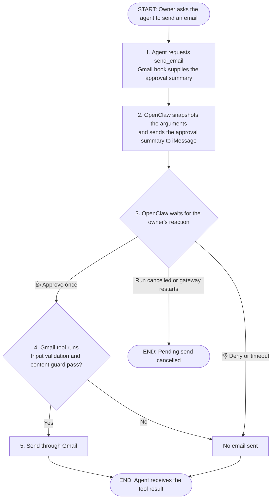

# Native tool approvals and guarded Gmail sending

**Status:** Revised proposal, awaiting design review
**Issue:** [#68](https://github.com/coletaylor788/puddles/issues/68)
**Last updated:** 2026-10-07

## Human section

### Design

Add `send_email` to the existing Gmail integration. A small pre-call hook asks
for approval through OpenClaw. OpenClaw holds the proposed arguments, shows its
built-in summary in the owner's direct iMessage chat, and waits for a decision.
Only then does the Gmail tool execute: validate the input, check its content,
and send through the existing Gmail MCP bridge.

#### What OpenClaw handles

Use the documented `before_tool_call.requireApproval` API. This is a hook that
runs after the model requests a tool and before its execution method runs.
OpenClaw already:

- Snapshots the call arguments and any overrides supplied by the hook. Later
  hooks may block the call but cannot rewrite the approved parameters.
- Creates the approval, delivers the summary, authenticates the decision, and
  consumes an allow-once decision once.
- Binds iMessage reactions to the actual approval message and authorized owner.
- Waits within the current call, handles timeout and cancellation, and resumes
  the normal tool pipeline after approval.

There is no custom payload store, freezing layer, approval service, executor,
result queue, or OpenClaw core patch in this design.

#### What we add to Gmail

| Component | Responsibility |
|---|---|
| Pre-call approval hook | Check caller access and supply OpenClaw's approval title and summary. |
| `send_email` tool | After approval, validate the input, run the content guard, call Gmail through the existing MCP bridge, and return a safe result. |
| Shared content guard | Reuse the existing secrets/sensitive-content checks without the contact lookup. Other tools keep their existing recipient checks. |

Version one sends a new plain-text email from the configured mailbox. Inputs
are `to`, optional `cc` and `bcc`, `subject`, and `body_text`. Validate addresses,
require at least one recipient, bound input sizes, and reject header injection
and unknown fields. Attachments, HTML, aliases, arbitrary headers, raw MIME,
and replies are outside this version. Python constructs MIME with its standard
email library without changing the approved recipients or message content.

Only the authorized main agent gets the send tool. The reader retains its
existing guarded read access. Credentials and the raw MCP connection stay on
the trusted host; a model-supplied approval ID grants no authority.

#### Content checks and the review summary

Content checks run inside the Gmail tool after approval and before dispatch.
Approval permits the tool to run; it does not override the content guard.
Secrets, disallowed sensitive content, and classifier failures block sending.
An approved request can therefore return a content-blocked result without
sending an email. The approval preview appears before this content check;
there is no separate Gmail content check before approval.

Use OpenClaw's existing summary to show the configured sender, every To/Cc/Bcc
recipient, subject, and a short body preview. Reject an envelope that cannot fit
in the summary; the body preview can be shortened. The full email still passes
the content guard. No custom full-email review is needed.

The owner's approval authorizes the displayed recipients. This email tool does
not require known contacts or trusted domains. That requested exception is
recorded in the [security architecture](../openclaw-setup/security-architecture.md).
Other tools retain their recipient checks.

#### Approving and sending follow-ups in iMessage

Forward native plugin approvals to the owner's fixed direct iMessage chat,
with an explicit authorized owner and only `allow-once` and `deny` decisions.
Press and hold the approval message, then choose **👍 to approve** or **👎 to
deny**. OpenClaw uses the message GUID and sender to resolve the correct request.
`/approve <approval-id> allow-once|deny` is the fallback, not the normal phone flow.

Use the native live wait with a requested ten-minute timeout. Timeout, run
cancellation, or gateway restart prevents the pending send. Sending later needs
a fresh request and approval.

An unrelated message does not approve, cancel, or edit the email. With default
`steer` queue handling, it may wait until the current tool finishes. To discuss
or change the email first, deny with 👎 and then ask the follow-up. Existing
queue settings still apply; `interrupt` or `/stop` can abort the active run.
Cancellation after Gmail dispatch cannot recall an email.

#### Results and uncertain sends

Return through the normal tool result path. Gmail success means the provider
accepted the email, not that the recipient received or read it. Denial, expiry,
a content block, or failure before dispatch means no email was sent. Run
cancellation may end the turn without a final reply.

A lost response or crash after dispatch is **unknown**. Gmail offers no
documented idempotency-key contract, so never automatically retry an uncertain
send. Keep minimal dispatch/receipt metadata for read-only reconciliation.
Results and logs must not expose raw email content or provider error echoes.

### Status

Design only. The owner selected the built-in summary and native wait, with
content guards and owner-approved recipients. Implementation and deployment
have not started. Source supports the native flow; an actual phone round trip
and guarded Gmail execution remain implementation acceptance work.

## Agent section

### State

This proposal updates PR #71 and issue #68. The repository OpenClaw pin is
`eb377ac59e6c9fd6c7705028034812becf00271b` (2026.9.6). The earlier comparison also
inspected stable 2026.9.8 at `fc23bc864e4553c2d215e479eeec47b67a0bf943` and upstream
main at `3b4ba3abb5e33a59ab79e2002f1c7e79c932e8ac`. No upstream upgrade is required
by this design. The evidence below is pinned source inspection, not live proof.

### Scope and acceptance criteria

- Expose sending only to the authorized main caller; reader, lower-trust, and
  unattended calls fail closed in version one.
- Use the closed schema and fixed mailbox described above. Every destination
  must appear in the summary. No contact lookup is required for this tool.
- Preserve the native approved arguments through dispatch. No custom preparation,
  finalization, fingerprint, or approval-binding state is needed.
- Content checks run only inside the tool after approval and fail closed before
  dispatch. Approval cannot bypass them; a blocked email is not sent.
- Only an authenticated allow-once decision permits execution. Timeout, restart,
  and run abort do not leave detached work to execute later.
- Attempt Gmail dispatch once per approved call. Never automatically replay an
  uncertain send. Use recording doubles for every test write and notification.

### Architecture and decisions

#### Native contracts

All links below refer to the repository pin.

| Contract | Source |
|---|---|
| Normal pre-call approval API, argument snapshots, two-minute default and ten-minute maximum, summary bounds | [Plugin permission requests](https://github.com/openclaw/openclaw/blob/eb377ac59e6c9fd6c7705028034812becf00271b/docs/plugins/plugin-permission-requests.md) |
| Snapshot arguments and overrides before waiting | [Approval helper](https://github.com/openclaw/openclaw/blob/eb377ac59e6c9fd6c7705028034812becf00271b/src/agents/agent-tools.before-tool-call.approval.ts) |
| Later hooks can block but cannot rewrite approved arguments | [Hook merger](https://github.com/openclaw/openclaw/blob/eb377ac59e6c9fd6c7705028034812becf00271b/src/plugins/hooks.ts), [regression tests](https://github.com/openclaw/openclaw/blob/eb377ac59e6c9fd6c7705028034812becf00271b/src/plugins/hooks.before-tool-call.test.ts) |
| Structured forwarded iMessage prompts get reaction hints and delivered-GUID binding | [Channel delivery](https://github.com/openclaw/openclaw/blob/eb377ac59e6c9fd6c7705028034812becf00271b/extensions/imessage/src/channel.ts), [native approval tests](https://github.com/openclaw/openclaw/blob/eb377ac59e6c9fd6c7705028034812becf00271b/extensions/imessage/src/approval-native.test.ts) |
| Reactions authenticate the actor and target the correct pending request | [Reaction handling](https://github.com/openclaw/openclaw/blob/eb377ac59e6c9fd6c7705028034812becf00271b/extensions/imessage/src/approval-reactions.ts), [regression tests](https://github.com/openclaw/openclaw/blob/eb377ac59e6c9fd6c7705028034812becf00271b/extensions/imessage/src/approval-reactions.test.ts) |
| Follow-up messages respect existing queue and steering boundaries | [Queue behavior](https://github.com/openclaw/openclaw/blob/eb377ac59e6c9fd6c7705028034812becf00271b/docs/concepts/queue.md) |

Use a normal registered `before_tool_call` hook scoped to `send_email`. Supply
the summary from the proposed arguments; leave email validation and content
checks to the tool after approval. Request `timeoutMs: 600000` and allow only
`allow-once` and `deny`. Do not send from `onResolution`.

Configure `approvals.plugin.enabled: true`, `mode: "targets"`, and an exact owner
account/destination with explicit channel `allowFrom`. Preserve native typed
approval metadata through delivery; an ordinary text imitation does not get the
same reaction binding. Real routes and identities belong in local configuration.

#### Existing Gmail work

- [secure-gmail registration](../../openclaw-plugins/secure-gmail/src/plugin.ts)
  is static and currently has no send tool. Add the hook and tool there.
- [ContactsEgressGuard](../../packages/mcp-hooks/src/egress/contacts-egress-guard.ts)
  combines content and contact checks. Extract reusable content checks while
  preserving all other callers' behavior. Do not substitute LeakGuard's broader
  PII policy or bypass contact checks using a fake resolver.
- [gmail-mcp](../../servers/gmail-mcp/src/gmail_mcp/server.py) owns MIME and provider
  access. Enable its send handler only for the trusted bridge. Existing auth
  requests Gmail scopes accepted by [messages.send](https://developers.google.com/workspace/gmail/api/reference/rest/v1/users.messages/send);
  verify the actual grant during implementation setup.
- [The result wrapper](../../openclaw-plugins/secure-gmail/src/wrap-tool.ts)
  retains raw `details.original` after modification. Remove that escape at this
  boundary. Keep send logs and external errors free of message content.
- Cancellation of the Python async wait does not prove its underlying send
  stopped. Disable transport retries and preserve unknown outcomes.

### Implementation

After design approval:

1. Add the schema and content-only guard, preserving existing contact-guard use.
2. Add the pre-call approval hook using the documented native API.
3. Add the tool and Python send handler: validate, guard, send once, return a safe
   receipt. No post-approval recipient or content rewrites.
4. Configure tool access and native approval forwarding. Update component docs
   and add the focused and cross-component regressions below.

### Validation

Documentation checks: review source contracts, links, and `git diff --check`.
Upstream tests were inspected, not executed. No runtime build, DEV/TEST start,
live approval notification, or email send is part of this proposal update.

Implementation tests must cover:

- Schema parity, header injection, Unicode, all recipients visible, fixed sender,
  and unsupported fields rejected.
- Approval completes before the Gmail content guard runs; content blocks and
  classifier failure then prevent dispatch. Unfamiliar recipients are allowed
  with approval; other tools' contact policy stays unchanged.
- Native argument snapshots, later hook rewrites rejected, and no execution
  before approval or after denial, timeout, restart, or pre-dispatch abort.
- Actual structured forwarding and authenticated 👍/👎 resolution using recorded
  delivery and inbound events; wrong actor/chat/GUID and duplicate reactions.
- Unrelated follow-up and interrupt behavior, plus normal tool-result continuation.
- Lost responses, cancellation races, one dispatch, no automatic retries, and
  safe result/log output.

Use [secure-gmail](../../openclaw-plugins/secure-gmail/README.md),
[gmail-mcp](../../servers/gmail-mcp/README.md), and [e2e](../../packages/e2e/README.md)
checks. Future release validation follows the repository's accumulated pool and
DEV/TEST/PROD lifecycle. Physical iPhone acceptance remains owner validation.

### Rollout and rollback

Keep the send tool disabled until implementation validation. Publishing this
proposal changes no runtime, account, credentials, or deployment. Future rollback
disables sending and cancels pending calls; retain unknown-send receipts for
reconciliation. An accepted email cannot be recalled by rollback.

### Review log

- Owner selected native summary, iMessage reactions, and the built-in live wait.
- Owner removed recipient trust checks while retaining content guards.
- Owner selected approval first, then validation and content checks inside the
  Gmail tool. The approval preview is not gated by a separate Gmail content scan.
- Native argument snapshots replace the earlier custom freeze/finalizer design.
- Detached execution, restart recovery, and custom result delivery are removed.

### Checklist

- [x] Verify native approval and iMessage contracts in pinned source.
- [x] Keep Human and Agent sections and Plan 027 consistent.
- [ ] Review the revised design before implementation.
- [ ] Implement and validate with recording transports and providers.
- [ ] Complete the approved release lifecycle and owner validation.
