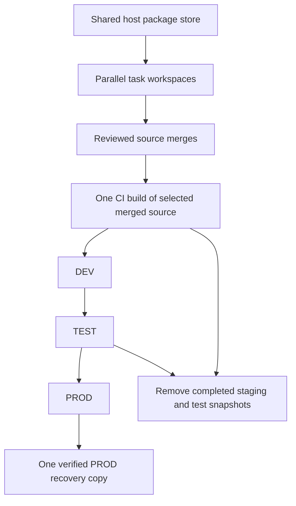

# Development storage

Use one mutable OpenClaw build workspace per task. A shared package store saves
downloads and can share package allocation, but generated output, portable
packages, installed runtimes, and extracted bundles still consume space.
Completed attempts must retire those copies.



The storage target is active task workspaces, the release candidate in promotion,
current PROD, and one verified PROD recovery copy. Store each immutable artifact
once where practical; installations may need a separate extraction while active.
DEV and TEST have separate writable state, configuration, ports, and processes.
TEST has no retained backup. Rollback-test snapshots exist only during the check.
Keep compact logs and stage results after removing generated copies. A failed
workspace stays only while an active investigation needs it.

Some merged helpers still have older retention defaults, described below. Their
owner must align those defaults and terminal hooks; do not claim automatic
cleanup from this policy alone. Preserve live consumers and real production
recovery while retiring completed runs through supported commands.

## 1. Reuse and configure

Keep the task's public and optional private worktrees, one prepared OpenClaw
source, and compatible build outputs. Reuse `E2E_RUN_DIR` for compatible local
retries. Register a purpose and retirement condition for each temporary clean
comparison. Preserve unique source before retiring its Git worktree. Use the
app archive tool for managed worktrees, and Git tooling for runner worktrees.
The scratch cleaner deliberately refuses any tree containing `.git`.

Maintain `$HOME/.puddles/development.json` on each host:

```json
{"pnpmStore":"/absolute/host/package-store"}
```

`PUDDLES_DEVELOPMENT_CONFIG` can select another maintained file. Export its
`pnpmStore` as `PNPM_CONFIG_STORE_DIR` for shell installs and companion commands.
The public verifier reads this configuration and rejects a conflicting explicit
store. Without a host file, an explicit absolute `PNPM_CONFIG_STORE_DIR` remains
supported for CI and migration. Verify all install contexts resolve the same
versioned store. Migrate an active task at an owned dependency refresh. Do not
move or prune the store under a running install.

Keep one ready DEV payload per task plus an in-flight replacement. Hold the old
payload until transfer, installation, and installed checks acknowledge it,
or the controller explicitly supersedes it while it is idle.
Reuse output compatibility checks; never share writable build output across tasks.
The companion prepare/draft controller serializes these operations. A completed
preparation can explicitly supersede an idle ready payload. A successful draft
installation retires its local payload and transfer lists. It preserves manifests
and results. Raw draft logs use compressed retention in the configured artifact
pool or the task’s `draft-controller/log-pool`. It retains failed output under the failed-attempt policy, and refuses
unknown legacy payloads until their owner migrates them. An interrupted operation
keeps its hold and pending record for owner recovery.

## 2. Reserve capacity before a build

The native builder reserves `E2E_BUILD_RESERVATION_BYTES` (default 8 GiB) in
`E2E_CAPACITY_ROOT` (default `$HOME/.puddles/development-capacity`). Every builder
on the same filesystem must use the same capacity root. It subtracts other
reservations and keeps `E2E_REQUIRED_FREE_BYTES` (default 8 GiB) free. Tune the
incremental estimate using the runner's resource measurements. This is a
conservative admission check, not a filesystem quota.

The builder releases its reservation after awaited commands finish. An
interrupted process leaves its reservation and lock for owner investigation.
`capacity.json` records the reservation token. After confirming that the owner
and its children have stopped, release that exact reservation:

```sh
node packages/e2e/bin/openclaw-storage.mjs unreserve "$E2E_CAPACITY_ROOT" "$reservation_token"
```

Other large controller stages can use `reserve HOST_ROOT OWNER BYTES` and
`unreserve HOST_ROOT TOKEN`. Never steal another task's reservation because it
is old. An existing lock fails closed and needs explicit owner recovery.

## 3. Retain the artifact and evidence

Public and companion CI finalize builder scratch after a successful immutable
handoff upload. `finalize-build ROOT OWNER BUNDLE SHA256` reimports the retained
bundle, verifies its build and source-gate identity, preserves compact receipts,
and removes only the fixed generated build directories. Source, stage records,
the portable bundle, and logs without a configured retention pool remain.
With a pool, logs are archived and referenced before their raw copies retire. The command is an explicit acknowledgment
that all consumers of the original paths have finished. Do not invoke it while
certification, physical rehearsal, or a debugger still depends on those paths.

Successful native builds in `E2E_ARTIFACT_POOL` retain a named `run-…` paused
reference, including their source gate and logs. Retries add protection without
removing older queued artifacts. The global `current` reference
is insufficient for concurrent queued tasks. Keep each task's reference until
it finishes. Transfer protection to a batch, deployed, or recovery reference
before completing the prior owner:

```sh
node packages/e2e/bin/openclaw-artifact-retention.mjs complete-run "$E2E_ARTIFACT_POOL" "$run_reference" "$task_owner"
node packages/e2e/bin/openclaw-artifact-retention.mjs dry-run "$E2E_ARTIFACT_POOL"
node packages/e2e/bin/openclaw-artifact-retention.mjs apply "$E2E_ARTIFACT_POOL"
```

The current pool implementation keeps two recent successful bundles plus
referenced dependencies. This is a compatibility default to replace with the
active candidate, deployed artifact, and one PROD recovery dependency set.
Complete obsolete run references so finished attempts do not remain protected.
Do not delete pool objects behind its registry to work around the default.

New diagnostic logs are compressed. The current limit is 30 days and 1 GiB per
completed owner; compact stage results survive separately. Prefer small useful
logs to retaining a workspace. Retire older PROD recovery only with the existing
activation and backup tools after its replacement is verified. Synthetic TEST
recovery is disposable test data, not an additional production backup.

## 4. Finalize task-owned scratch

An approved build or release includes authority to clean all of its generated
artifacts after their consumers finish. The owner performs cleanup without a
separate permission request, including after failure, timeout or interruption.
This covers generated source copies, dependencies, build output, archives,
transfers, imports, test state and fixtures. Keep the active candidate,
installations, required recovery, unique source and compact evidence described
above. Uncertain ownership requires investigation, not automatic deletion.

Controllers can call `finalizeScratch(root, owner, paths, evidence)` after their
last awaited child and consumer finish. The private DEV bundle consumer does
this after installed checks, preserving build and deployment proofs while
removing its imported bundle and upload. Failed DEV activation retains its
diagnostics and follows the existing rollback path.

For other producers and migration, explicitly adopt exact generated children:

```sh
node packages/e2e/bin/openclaw-storage.mjs init "$task_root" "$task_owner"
node packages/e2e/bin/openclaw-storage.mjs register "$task_root" "$task_owner" scratch.json
node packages/e2e/bin/openclaw-storage.mjs hold "$task_root" "$task_owner" dev-transfer
# Await the producer and every consumer, then acknowledge completion.
node packages/e2e/bin/openclaw-storage.mjs release "$task_root" "$task_owner" dev-transfer
node packages/e2e/bin/openclaw-storage.mjs seal "$task_root" "$task_owner" old-payload
node packages/e2e/bin/openclaw-storage.mjs plan "$task_root"
node packages/e2e/bin/openclaw-storage.mjs apply "$task_root" "$task_owner"
```

Example `scratch.json`:

```json
{"id":"old-payload","path":"payloads/attempt-1","purpose":"Acknowledged DEV transfer","evidence":["proofs/attempt-1.json"]}
```

The current `kind: "failed"` mode retains the newest sealed failure for seven
days. That default still needs alignment: preserve the failed command, useful
logs, and inputs, then remove generated output once no active debugging consumer
needs it. Use the producer's terminal cleanup for completed fixtures; do not
mislabel state to evade a guard. Active debug holds remain protected. Keep one
ownership root per task instead of a new root for every attempt.

Registration is the owner's assertion that a path is generated scratch.
Sealing asserts that all writers and consumers have finished. The cleaner
cannot discover arbitrary tools writing an unregistered directory. Every
participating producer must use the root's native `lock` or register a consumer
hold. Native status and live-PID checks are additional refusal checks, never
proof that missing processes make unknown files disposable.

Sealing copies and hashes evidence into `storage-evidence`. Apply takes the
producer lock, rechecks identities and evidence, journals each move to
`storage-trash`, then deletes. Repeating apply resumes an interrupted deletion.
Changed paths, symlink ancestors, nested run locks, nonterminal native runs,
Git trees, and recovery markers block deletion. Nested dependency symlinks are
removed as links and are never followed. Evidence-copy failure preserves scratch.

`plan` and artifact `dry-run` are read-only. An outstanding artifact deletion
journal blocks preview until its owner runs `apply`; preview never repairs it.
Reports distinguish logical file bytes from actual filesystem free space.

The companion local release runner requires one canonical `PUDDLES_STORAGE_ROOT`
and `PUDDLES_STORAGE_OWNER`. New attempt directories live below that task root.
The native producer joins its task lock. Once a portable import acknowledges
the builder handoff, the controller finalizes builder output before proceeding
to physical rehearsal. A joined source-gate failure registers generated output
as one failed attempt group. Imports and recovery remain with their consumers.

Before reusing a failed builder, the producer holds both task and builder locks.
It verifies the previous sealed files and evidence, then withdraws that
generation's deletion authority while keeping its evidence. The next terminal
failure registers the current files as a fresh generation. An unfinished evidence
export, pending deletion, changed sealed files, or consumer hold blocks reuse
until the owner resolves it.

## 5. Migrate old directories

The task owner inventories its own paths and establishes active processes,
queued consumers, unique source, portable artifacts, and recovery dependencies.
Then it adopts only reviewed generated children using the commands above.
Do not adopt an entire development root or infer ownership from a name or date.
Do not edit another worker's source or remove active work. An authorized
coordinator may clean abandoned generated output after notifying the owner and
checking process identity, slots, consumers, source preservation, and production
recovery. A failed worker's missing reply does not block verified safe cleanup.
A merged PR, idle chat, or missing PID alone is insufficient. Keep genuinely
uncertain paths and report the exact missing fact.

After a merged tooling update, each affected worker applies it to its own
completed attempts and reports exact paths and retained evidence. Report actual
filesystem space before and after cleanup separately from logical directory
sizes. No background job automatically deletes legacy directories. Do not wait for an unrelated release to finish before cleaning
already completed attempts.

Completed TEST runs must stop their own processes and remove generated runtimes,
state, imports, and temporary rollback snapshots. Preserve small results outside
those paths first. Recovery markers in synthetic fixtures need the producer's
cleanup path, not generic deletion of journals or a new backup-retirement system.
Controllers must perform this on success and failure after children exit, and
reconcile interrupted cleanup on restart. Until those hooks are aligned, the
assigned owner performs this terminal cleanup explicitly.
